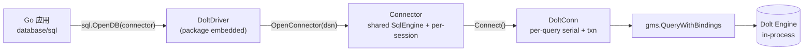

# Dolt Driver v2——Go 标准 SQL 驱动的 Dolt 内嵌实现

> **官方仓库**：[dolthub/driver](https://github.com/dolthub/driver) [F-001]
> **分析版本**：tag `v2.2.0-18`，commit `61ccedb7035925b3e4a5f91be6bd68b100e3b1e7`
> **服务名/版本**：`dolt`（注册到 `database/sql`）/ v2.2.0-18 [F-002]
> **Go 版本**：1.26.5 [F-001]
> **事实基数**：22 条（F-001~F-022）
> **事实来源**：官方源码逐文件精读，信源距离 ①

`github.com/dolthub/driver/v2`（package `embedded`）是 DoltHub 官方实现的 Go `database/sql/driver` 驱动，将完整的 Dolt 引擎内嵌进调用方进程，**无需启动独立数据库服务器**即可通过标准 SQL 接口操作版本化数据库。驱动注册名为 `"dolt"`，DSN 以 `file://` 前缀指向本地 Dolt repo 目录。

## 核心价值



`driver` 解决的核心命题：**在 Go 应用进程中直接内嵌一个完整的版本化 SQL 数据库**。它让 `database/sql` 生态（Go-sql-driver/mysql、GORM、sqlx 等）无需任何改动即可接入 Dolt 的行级版本控制能力。

## 导航

### 核心概念（concepts/，5 篇）

* [Dolt Driver v2 概述](concepts/00-overview.md) — 产品定位、解决的核心问题、与独立 Dolt 服务器对比
* [架构分层](concepts/01-architecture.md) — Driver→Connector→Conn→Stmt→Rows 五层接口实现
* [DSN 解析与 Config](concepts/02-dsn-config.md) — `file://` 前缀、参数体系、LoadMultiEnvFromDir 多库模式
* [连接生命周期与 BackOff 重试](concepts/03-lifecycle-and-retry.md) — Connector 共享 SqlEngine、backoff 重试模型、IsValid=false 策略
* [查询执行与多语句支持](concepts/04-query-and-transaction.md) — 串行查询、Transaction、QuerySplitter 嵌套感知

### 实战示例（examples/，1 篇）

* [基本用法：从 DSN 到事务提交](examples/00-basic-usage.md) — 完整可运行代码路径，含 BackOff 配置

### 信源登记（references/）

* [源码事实登记](references/source.md) — F-001~F-022 编号事实底账

## 学习路径建议

1. **入门**：[概述](concepts/00-overview.md) → [基本用法示例](examples/00-basic-usage.md)
2. **深入架构**：[架构分层](concepts/01-architecture.md) → [DSN 解析](concepts/02-dsn-config.md)
3. **关键机制**：[连接生命周期与重试](concepts/03-lifecycle-and-retry.md) → [查询与事务](concepts/04-query-and-transaction.md)
4. **源码深读**：[references/source.md](references/source.md) 核对全部 F 编号

## 信任与生命周期

| 项目 | 状态 |
|------|------|
| **status** | stable |
| **stale_after** | 2027-03-31（driver/v2 迭代节奏较慢，半年重评） |
| **事实来源** | 官方源码逐文件精读（信源距离 ①），无第三方转述 |
| **generated/verified** | 2026-09-10 |

## 骨架判定说明

- **一问**（有读者可照做的安装/配置/代码/调用流程？）：是——`example/main.go` 提供完整可运行范式
- **二问**（经实测、有版本/输入输出/步骤顺序？）：README 提供 DSN 格式说明，源码有完整类型实现
- **结论**：设 examples/，内容严格取材 `example/main.go` 与源码事实

## 边界说明

- 本束聚焦 driver 包（`github.com/dolthub/driver/v2`），不涉及 Dolt CLI 或 DoltgreSQL
- 嵌入式模式天然限制并发写：单个 SqlEngine 同一时刻只能有一个 writer；高并发写场景请考虑独立 Dolt 服务器
- 多语句支持需要显式开启 `multistatements=true`，默认关闭

```{toctree}
:hidden:
:maxdepth: 7

concepts/index
examples/index
references/index
log
```
