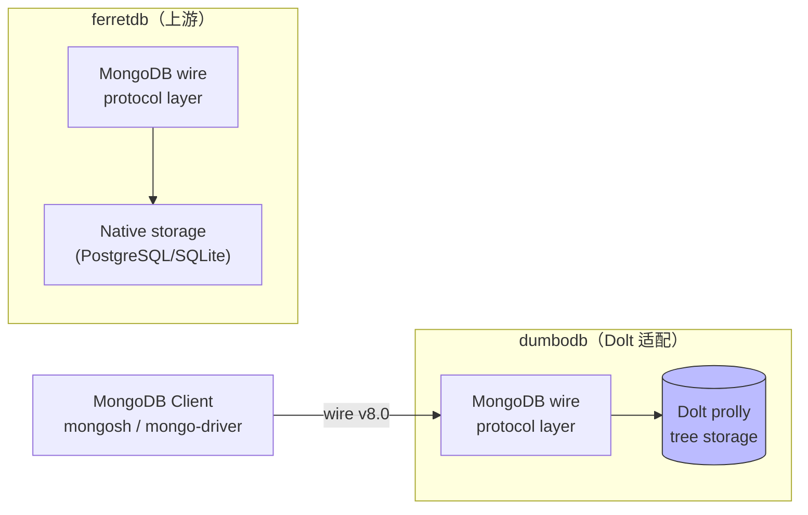

# DumboDB 概述

> **对应 F 编号**：F-001 ~ F-005

## 产品定位

`github.com/dolthub/dumbodb` 是 DoltHub 官方实现的 MongoDB wire 协议兼容数据库服务器，slogan 为 **"MongoDB and Git had a baby"**。它以 FerretDB v1.24.2 为基础，将数据存储后端从 FerretDB 的原生实现替换为 Dolt 的 prolly tree，使 MongoDB 客户端获得 Git 式版本控制能力。



协议目标为 **MongoDB 8.0.28** wire 协议兼容性，License 为 Apache 2.0（FerretDB 基础）+ 自定义 Dolt 集成层。

## 与 driver 的两条路径对比

DoltHub 在 Go 生态提供两种版本化数据库接入路径：

| 维度 | driver（嵌入式） | dumbodb（协议兼容） |
|------|----------------|-------------------|
| 包路径 | `github.com/dolthub/driver/v2` | `github.com/dolthub/dumbodb` |
| 协议 | MySQL line protocol（`database/sql/driver`） | MongoDB 8.0 wire protocol |
| 进程模型 | 同进程内嵌（in-process） | 独立服务器进程 |
| 部署方式 | `go get` 后 import | `docker run` 或二进制启动 |
| 数据模型 | 行式（SQL tables） | 文档式（BSON documents） |
| 版本控制 | 通过 `@rootish` 分支查询 | 通过 `dbname@rootish` 分支查询 |
| 适用场景 | Go 应用内嵌版本化 SQL 数据库 | MongoDB 存量应用获得 Git 版本控制 |

## 核心设计原则（F-006）

`internal/backends` 包遵循 6 条设计原则：

1. **接口设计**：Backend/Database/Collection 三层抽象，状态性与无状态分离
2. **状态性**：Backend 是有状态长生命周期对象（thread-safe）；Database/Collection 是无状态临时对象
3. **不频繁查 information_schema**：后端自己维护数据库/集合列表，避免每次操作查元数据
4. **per-op context**：每个操作传递独立 context，不在 backend 层面缓存
5. **error codes**：结构化错误码（ErrorCode enum），便于客户端判断
6. **testing**：所有操作可被测试，contract wrapper 支持 mock

## 架构总览

dumbodb 整体分为四层：

```
MongoDB Wire Protocol Layer（FerretDB v1.24.2 适配）
    ↓
Backend Interface Layer（internal/backends）
    ├── Backend（有状态，长生命周期）
    │   ├── Database（无状态，临时）
    │   │   └── Collection（无状态，临时）
    │   └── VersioningBackend（可选，40+ 方法）
    ↓
Dolt Backend（internal/backends/dolt/，~100+ Go 文件）
    └── DoltDB（prolly tree 存储，版本控制内核）
```

## 关键依赖（F-022）

```
github.com/dolthub/dolt/go           v0.40.5-0.20260901102237-645f6accd917
go.mongodb.org/mongo-driver          v1.17.3+v2.6.0
github.com/FerretDB/wire             v0.0.8
github.com/FerretDB/ferretdb         v1.24.2（base）
```

## 学习路径

继续阅读本 bundle 其他概念文档以深入：

* [架构分层](01-architecture.md) — Backend→Database→Collection 三层接口与 contract wrapper
* [Rootish 编码系统](02-rootish-system.md) — `dbname@rootish` 格式与分支查询机制
* [BSON 存储与 prolly tree 适配](03-bson-storage.md) — BSON 编解码与文档映射
* [版本化操作与冲突模型](04-versioning-ops.md) — VersioningBackend 接口与冲突类型
