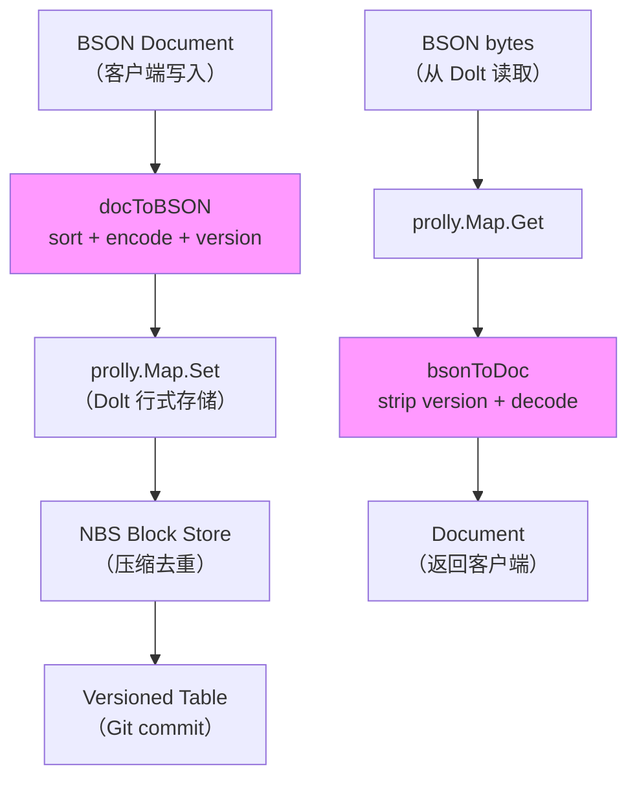

# BSON 存储与 prolly tree 适配

> **对应 F 编号**：F-017 ~ F-021

## 整体映射关系

dumbodb 将 MongoDB 文档模型透明映射到 Dolt 的版本化行式存储：

```
MongoDB Collection
    ↓  docToBSON()
BSON bytes（带 version prefix）
    ↓  prolly.Map.Set(key, value)
Dolt Table Row（每行 = 一个 BSON 文档）
    ↓  NBS/STRT/RTVL/ADRM
Versioned Block Store（Git 式版本控制）
```

每集合对应 Dolt 的一个 `prolly.Map`，即一张 Dolt 表。

## BSON 编解码流程（F-019~F-021）

### docToBSON（写入路径）

```go
func docToBSON(doc types.Document) ([]byte, error) {
    // 1. sortDocumentKeys(doc) — 排序键（_id 保持原序）
    sorted := sortDocumentKeys(doc)
    // 2. wirebson.Encode(sorted) — MongoDB wire 协议 BSON 编码
    encoded, _ := wirebson.Encode(sorted)
    // 3. prepend bsonFormatVersion (0x01)
    result := append([]byte{bsonFormatVersion}, encoded...)
    return result, nil
}
```

### bsonToDoc（读取路径）

```go
func bsonToDoc(data []byte) (types.Document, error) {
    // 1. strip version byte（data[0] 应为 0x01）
    // 2. decodeDocument(data[1:]) — MongoDB wire 协议 BSON 解码
    doc, _ := decodeDocument(data[1:])
    return doc, nil
}
```

## bsonFormatVersion（F-019）

```go
const bsonFormatVersion byte = 0x01
```

每个存储的 BSON 文档前 prepend 一个 version byte。这是为了格式演进预留——未来如果 BSON 编码格式变更，可以通过 version 字段向后兼容。

## sortDocumentKeys 规则（F-020）

```
sortDocumentKeys(doc):
    1. deep copy doc（不修改原文档）
    2. 对所有键（除 _id 外）按字典序排序
    3. _id 保持原始位置（不移动）
    4. 返回 sorted copy
```

**关键约束**：`_id` 必须保持原字节序。原因：
- `_id` 的 `hashID` 依赖于文档字节的原始顺序
- 如果 `_id` 被移动到其他位置，hashID 计算结果会不同
- 这会导致同一文档在不同排序下产生不同 hash，破坏 prolly tree 的一致性

## MinMaxKey 特殊处理（F-021）

MinMaxKey 是 MongoDB 的特殊类型（`MaxKey`/`MinKey`），在排序中始终最大/最小。dumbodb 通过 `FromDocumentRaw` 处理，不走常规 `sortDocumentKeys` 路径，以避免破坏其特殊语义。

## Collection Query 策略（F-018）

`collection.Query()` 的索引选择策略：

```
Query(filter)
    ├── 1. 检查 naturalHint？
    │       └─ 是 → 强制全表扫描（{$natural: 1}）
    ├── 2. filter 非 natural 且无 collation？
    │       └─ 是 → 尝试 index lookup
    │               ├── 有匹配 index → 使用 index scan
    │               └─ 否 → 全表扫描
    └── 3. 其他情况
            └─ 全表扫描
```

## 默认索引与保留索引（F-018）

| 索引名 | 说明 |
|-------|------|
| `_id_` | 默认主键索引，自动创建 |
| `__dumbo_metadata__` | 保留元数据索引，用户不可操作 |

## 存储适配层总结



## 学习路径

继续阅读：
* [版本化操作](04-versioning-ops.md) — 如何在文档层之上执行 commit/branch/merge 操作
