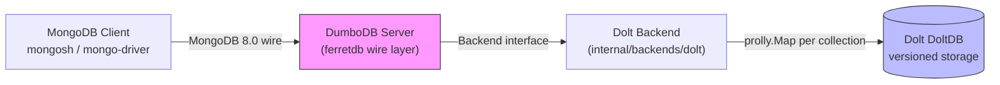

# DumboDB——MongoDB Wire 协议兼容的 Dolt 后端数据库

> **官方仓库**：[dolthub/dumbodb](https://github.com/dolthub/dumbodb) [F-001]
> **分析版本**：tag `v0.6.3`，commit `7b226dac4ef1fe10ca90818a446a7cec6b458cd3`
> **服务名/版本**：`dumbodb` / v0.6.3 [F-001]
> **Go 版本**：1.26.7 [F-001]
> **事实基数**：24 条（F-001~F-024）
> **事实来源**：官方源码逐文件精读，信源距离 ①

`github.com/dolthub/dumbodb` 是一个实现 MongoDB 8.0 wire 协议的数据库服务器， slogan 为 **"MongoDB and Git had a baby"**。它以 FerretDB v1.24.2 为基础，将数据存储后端从 FerretDB 的原生实现替换为 Dolt 的 prolly tree，使 MongoDB 客户端获得 Git 式版本控制能力。

## 核心价值



dumbodb 解决的核心命题：**在 MongoDB 生态中获得 Git 式版本控制**——同一份数据支持分支查询、历史 diff、合并冲突检测，无需改变现有应用代码。

## 导航

### 核心概念（concepts/，5 篇）

* [DumboDB 概述](concepts/00-overview.md) — 产品定位、MongoDB 兼容性、与 driver 路径对比
* [架构分层](concepts/01-architecture.md) — Backend→Database→Collection 三层接口、BackendContract wrapper
* [Rootish 编码系统](concepts/02-rootish-system.md) — `dbname@rootish` 格式、AccessMethod 解析、percent-decoding
* [BSON 存储与 prolly tree 适配](concepts/03-bson-storage.md) — BSON 编解码、prolly.Map 映射、key 排序
* [版本化操作与冲突模型](concepts/04-versioning-ops.md) — VersioningBackend 40+ 方法、documentEdit/uniqueKeyCollision 冲突类型

### 实战示例（examples/，1 篇）

* [基本用法：Docker 启动与 mongosh 连接](examples/00-basic-usage.md) — 容器部署、自定义命令、分支查询

### 信源登记（references/）

* [源码事实登记](references/source.md) — F-001~F-024 编号事实底账

## 学习路径建议

1. **入门**：[概述](concepts/00-overview.md) → [基本用法示例](examples/00-basic-usage.md)
2. **深入架构**：[架构分层](concepts/01-architecture.md) → [Rootish 编码](concepts/02-rootish-system.md)
3. **存储与版本化**：[BSON 存储适配](concepts/03-bson-storage.md) → [版本化操作与冲突](concepts/04-versioning-ops.md)
4. **源码深读**：[references/source.md](references/source.md) 核对全部 F 编号

## 信任与生命周期

| 项目 | 状态 |
|------|------|
| **status** | stable |
| **stale_after** | 2027-03-31（dumbodb 迭代节奏中等，半年重评） |
| **事实来源** | 官方源码逐文件精读（信源距离 ①），无第三方转述 |
| **generated/verified** | 2026-09-10 |

## 骨架判定说明

- **一问**（有读者可照做的安装/配置/代码/调用流程？）：是——README 提供 Docker 部署命令，`mongosh` 可直接连接
- **二问**（经实测、有版本/输入输出/步骤顺序？）：源码有完整 Backend→Database→Collection 三层接口，custom command 体系可验证
- **结论**：设 examples/，内容严格取材 README 与源码事实

## 边界说明

- 本束聚焦 dumbodb 包（`github.com/dolthub/dumbodb`），不涉及 FerretDB 上游实现细节
- 单节点部署，不支持 replica set 或 sharding；capped collections、TTL indexes 均不支持
- `config` 和 `local` 系统数据库被硬拒绝（MongoDB 内部保留名）
- admin 数据库未达完整 MongoDB 功能 parity

```{toctree}
:hidden:
:maxdepth: 7

concepts/index
examples/index
references/index
log
```
