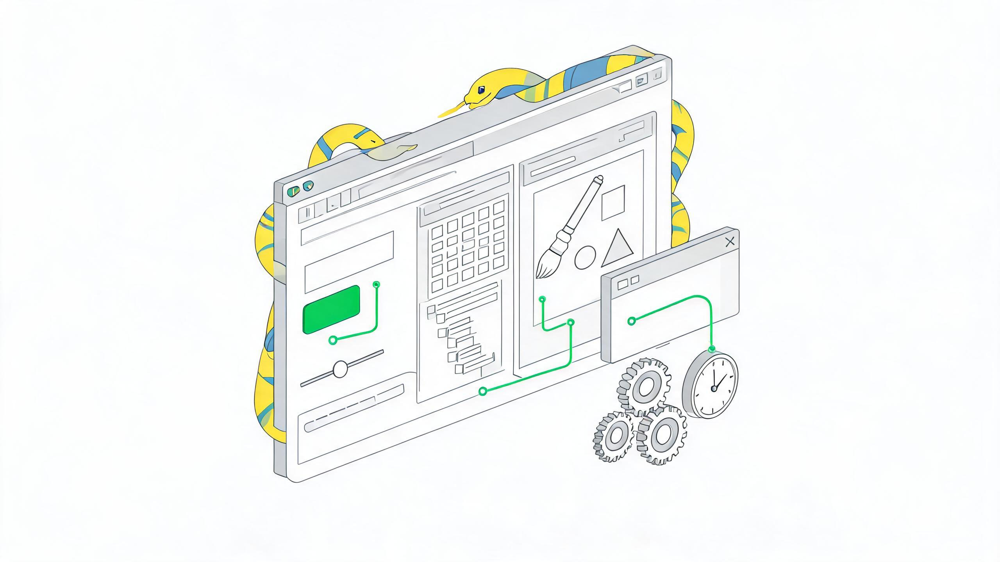
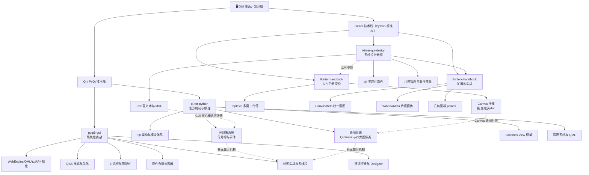

# 🖥️ GUI 桌面开发

> 本分组收录 Python 桌面 GUI 开发两大技术栈知识包，来源为简书作者 **水之心**（xinetzone）五套公开学习文集（共 129 篇，2019-2021 年），经 blog-article-to-okf-wiki 七阶段流程整理：Qt 两束事实登记 F-001 \~ F-234（P0 事实经 Qt/Riverbank 官方文档交叉核验）、tkinter 三束事实登记 F-TGD-01 \~ F-TGD-34 / F-THB-01 \~ F-THB-21 / F-TXH-01 \~ F-TXH-05（tkinterx 关键事实经 PyPI/GitHub 外部核验），468 张原文截图完整本地化，另含 5 张 Seedream 生成装饰性封面。



## 技术栈导航

- **Qt/PyQt 技术栈**（第三方绑定，功能强大、控件丰富，适合大型桌面应用）：[qt-for-python](qt-for-python/index.md)（官方机制与原理）+ [pyqt5-gui](pyqt5-gui/index.md)（系统化实战）

- **tkinter 技术栈**（Python 标准库内置，零安装、轻量稳定，适合工具与教学场景）：[tkinter-gui-design](tkinter-gui-design/index.md)（系统设计教程）+ [tkinter-handbook](tkinter-handbook/index.md)（API 手册深挖）+ [tkinterx-handbook](tkinterx-handbook/index.md)（扩展库实战）

## 知识包清单

| 知识包                                               | 技术栈          | 定位                                 | 内容                                                                                                                                                            |
| ------------------------------------------------- | ------------ | ---------------------------------- | ------------------------------------------------------------------------------------------------------------------------------------------------------------- |
| [qt-for-python](qt-for-python/index.md)           | Qt（PySide2）  | **官方机制与原理**（Qt 官方文档译注）             | 33 篇：Qt 架构、元对象/信号槽/事件、绘图系统、四大图像类、Graphics View、资源系统、QML；8 篇概念 + 103 张截图                                                                                       |
| [pyqt5-gui](pyqt5-gui/index.md)                   | Qt（PyQt5）    | **系统化实战**（《PyQt5快速开发与实战》笔记）        | 36 篇：环境/Designer/打包、控件与布局、容器与 Model/View、对话框与国际化、QSS、绘图实战、多线程、WebEngine/QML/动画、数据可视化；10 篇概念 + 178 张截图                                                         |
| [tkinter-gui-design](tkinter-gui-design/index.md) | tkinter（标准库） | **系统设计教程**（文集《tkinter GUI 设计》34 篇） | 三大概念、ttk 主题化部件、grid/pack/place、菜单/多窗口/对话框、ToolTip、事件绑定与变量联动、Text 富文本、Canvas 2D 绘图、ttk.Style 与 MVC；10 篇概念 + 12 篇实战（登录窗口/画图工具/计算器/文本编辑器/Matplotlib 嵌入）+ 142 张截图 |
| [tkinter-handbook](tkinter-handbook/index.md)     | tkinter（标准库） | **API 手册深挖**（文集《tkinter 手册》21 篇）   | Tcl/Tk 关系与微件体系、样式、三种布局管理器、事件四级绑定、变量追踪与对话框调度、Canvas 全集（选项/画图函数/图片坑/拖曳缩放）、Toplevel 多窗口传值、ttk 主题部件；12 篇概念 + 3 篇实战 + 30 张截图                                       |
| [tkinterx-handbook](tkinterx-handbook/index.md)   | tkinter 扩展库  | **扩展库实战**（文集《tkinterx 手册》5 篇）      | 作者自研 tkinterx 库：统一画图接口 CanvasMeta、可传值对话框 WindowMeta、图形设计工具 canvas\_design、交互式几何画板 painter、颜色工具与电子限速示例；6 篇概念 + 3 篇实战 + 15 张截图（PyPI 0.0.9 / Pre-Alpha 已外部核验）    |

## 五束关系

- **Qt 技术栈内**：qt-for-python 回答"Qt 机制是什么、为什么"（官方文档视角，偏原理）；pyqt5-gui 回答"桌面应用怎么一步步做出来"（控件手册 + 实战视角，偏工程）；两束共享同一套 Qt 底层机制（信号槽、事件、绘图），概念文档互相交叉引用。

- **tkinter 技术栈内**：tkinter-gui-design 是从零到项目的学习主线（概念递进 + 12 组实战）；tkinter-handbook 是同一作者对 tkinter API 的深挖手册（Canvas/Toplevel/ttk 全集速查），两束内容互补、互为参照；tkinterx-handbook 介绍作者在 tkinter 之上自研的扩展库，阅读前建议先掌握 tkinter-gui-design 的 Canvas 与事件基础。

- **跨技术栈**：tkinter 与 Qt 是 Python 桌面开发的轻量/重量两条路线——tkinter 零安装、API 稳定、适合教学与小工具；Qt 控件丰富、性能强、适合工程化产品。同作者的 GUI 学习路径建议为：tkinter-gui-design 建立 GUI 核心概念（主循环/事件/布局）→ tkinter-handbook 深挖 → qt-for-python / pyqt5-gui 迁移到 Qt 生态。

## 知识地图



```{toctree}
:maxdepth: 1

qt-for-python/index
pyqt5-gui/index
tkinter-gui-design/index
tkinter-handbook/index
tkinterx-handbook/index
```

