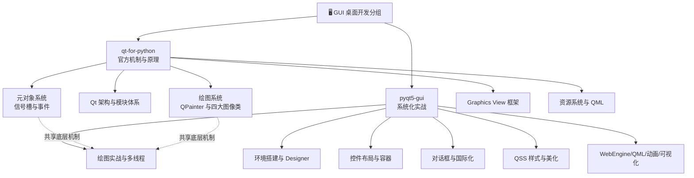

# 🖥️ GUI 桌面开发

> 本分组收录 Qt 技术栈 Python 桌面 GUI 开发知识包，来源为简书作者 **水之心**（xinetzone）两套公开学习文集（共 69 篇，2020 年），经 blog-article-to-okf-wiki 七阶段流程整理：事实登记 F-001 ~ F-234，P0 事实经 Qt/Riverbank 官方文档交叉核验，281 张原文截图完整本地化。


## 知识包清单

| 知识包 | 定位 | 内容 |
|--------|------|------|
| [qt-for-python](qt-for-python/index.md) | **官方机制与原理**（PySide2 官方文档译注） | 33 篇：Qt 架构、元对象/信号槽/事件、绘图系统、四大图像类、Graphics View、资源系统、QML；8 篇概念 + 103 张截图 |
| [pyqt5-gui](pyqt5-gui/index.md) | **系统化实战**（《PyQt5快速开发与实战》笔记） | 36 篇：环境/Designer/打包、控件与布局、容器与 Model/View、对话框与国际化、QSS、绘图实战、多线程、WebEngine/QML/动画、数据可视化；10 篇概念 + 178 张截图 |

## 两束关系

- **qt-for-python** 回答"Qt 机制是什么、为什么"——官方文档视角，偏原理；
- **pyqt5-gui** 回答"桌面应用怎么一步步做出来"——控件手册 + 实战视角，偏工程；
- 两束共享同一套 Qt 底层机制（信号槽、事件、绘图），概念文档互相交叉引用，可对照阅读。

## 知识地图



```{toctree}
:maxdepth: 1

qt-for-python/index
pyqt5-gui/index
```
