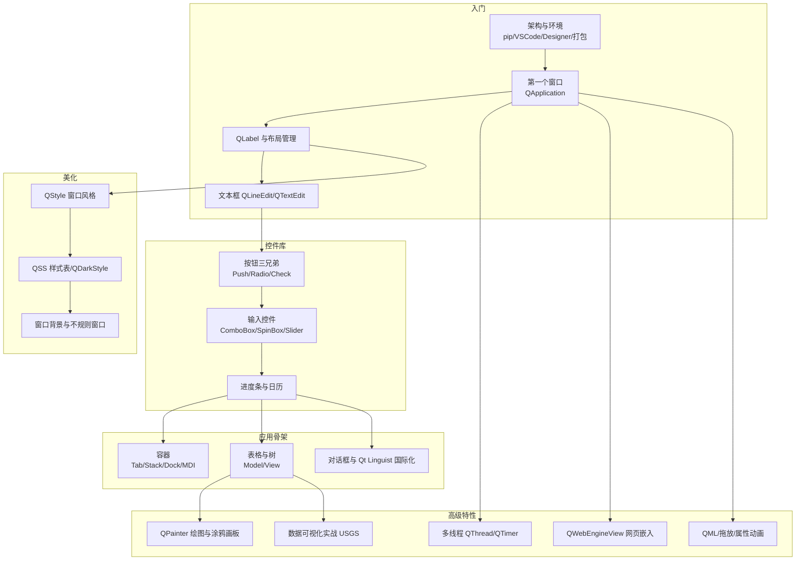

# PyQt5 系统化 GUI 开发知识包

本知识包整理自简书作者 **[水之心](https://www.jianshu.com/u/xinetzone)**（GitHub：[xinetzone](https://github.com/xinetzone)）的公开文集 **[《Qt Python GUI 学习》](https://www.jianshu.com/nb/46416111)**（36 篇，2020 年），主体为《PyQt5快速开发与实战》系统化学习笔记并重组 zetcode 公开教程，覆盖从环境搭建、基础控件、布局、容器、对话框、样式美化到绘图、多线程、网页嵌入、数据可视化的完整桌面开发链路。

- **事实登记**：F-001 ~ F-123（108 条篇内事实 + 15 条跨篇 P0 事实），全部可溯源
- **P0 核验**：8 项官方文档交叉核验全部通过；3 篇片段/未完稿已如实标注
- **视觉资产**：178 张原文截图完整本地化，Markdown 引用零缺失
- **时效性**：成文于 PyQt5/Qt5 时代；PyQt6/Qt6 下机制基本不变，迁移注意见 [核验报告](references/verification.md)

## 知识地图



## 目录

- **concepts/**：10 篇概念文档，按"入门 → 控件 → 骨架 → 美化 → 高级特性"递进，见 [概念体系](concepts/index.md)
- **examples/**：36 篇原文完整转换（含《PyQt5快速开发与实战》26 章笔记、实战与代码片段），按文集原序编号，见 [实战示例](examples/index.md)
- **references/**：[信源与事实登记](references/article-source.md)（F-001 ~ F-123）与 [核验报告](references/verification.md)
- **[log.md](log.md)**：变更日志

## 推荐学习路径

1. 零基础上手：概念 1 → 2 → 3（能写出表单窗口），配合示例 36/33/32/29；
2. 完整应用：概念 4 → 5 → 6（容器数据、对话框、美化），配合示例 20/23/15；
3. 进阶方向：概念 7（绘图/图形编辑）→ 8（多线程）→ 9（网页/QML/动画）→ 10（数据可视化）；
4. 实战收官：示例 35 计算器（Designer + 逻辑 + PyInstaller 打包全流程）。

```{toctree}
:maxdepth: 1

concepts/index
examples/index
references/index
log
```
