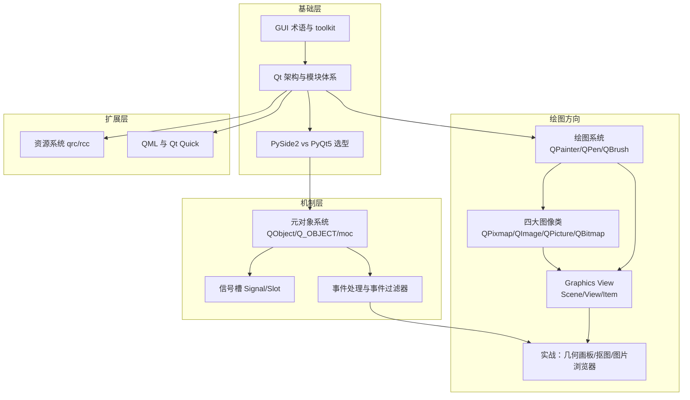

# Qt for Python（PySide2）学习笔记知识包

本知识包整理自简书作者 **[水之心](https://www.jianshu.com/u/xinetzone)**（GitHub：[xinetzone](https://github.com/xinetzone)）的公开文集 **[《Qt for Python》](https://www.jianshu.com/nb/46707335)**（33 篇，2020 年），内容为 Qt for Python（PySide2）官方文档的中文译注与实战笔记，覆盖 Qt 架构、元对象系统、信号槽、事件、绘图系统、四大图像类、Graphics View 框架、资源系统与 QML。

- **事实登记**：F-001 ~ F-111（99 条篇内事实 + 12 条跨篇 P0 事实），全部可溯源
- **P0 核验**：10 项官方文档交叉核验，9 ✅ + 1 勘误（WebKit 弃用版本 Qt 5.5）
- **视觉资产**：103 张原文截图完整本地化，Markdown 引用零缺失
- **时效性**：成文于 PySide2/Qt5 时代；核心机制在 PySide6/Qt6 保持稳定，迁移注意见 [核验报告](references/verification.md)

## 知识地图



## 目录

- **concepts/**：8 篇概念文档，按"术语 → 架构 → 机制 → 绘图专项 → 扩展"递进，见 [概念体系](concepts/index.md)
- **examples/**：33 篇原文完整转换（代码块、截图、链接保留），按文集原序编号，见 [实战示例](examples/index.md)
- **references/**：[信源与事实登记](references/article-source.md)（F-001 ~ F-111）与 [核验报告](references/verification.md)
- **[log.md](log.md)**：变更日志

## 推荐学习路径

1. 零基础：概念 1 → 2 → 4（建立机制认知），配合示例 31/27/30；
2. 绘图方向：概念 5 → 6 → 7，配合示例 01~03、14~19、21~25；
3. 选型决策：直接读概念 3（许可证与 API 差异）；
4. 现代界面：概念 8（资源系统与 QML），配合示例 06、07、26。

```{toctree}
:maxdepth: 1

concepts/index
examples/index
references/index
log
```
