# 第一个窗口与基础主题化 Widgets

> 对应信源：F-TGD-02《3.1 tkinter 之主题化的基础 widgets 详解》、F-TGD-22《8 系统化学习 tkinter 之基础篇》（参考 *Python GUI Programming Cookbook*）。`ttk` 中存放了主题化（themed）部件，其 look and feel 更符合本机操作系统风格；本束除特别说明外均使用 `ttk` 部件。

## 1 最简窗口

tkinter 最精简的可运行程序只需创建 `Tk` 实例并启动主循环：

```python
import tkinter as tk

win = tk.Tk()          # 创建窗口实例
win.title("Python GUI")  # 窗口标题
win.mainloop()         # 启动 GUI 事件循环
```

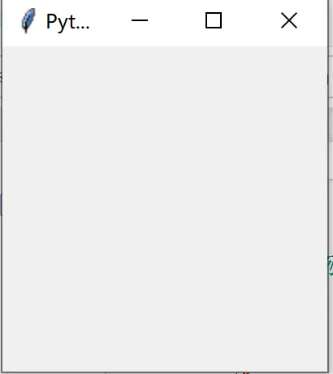

图1 最简单的 GUI 窗口（可最小化/最大化/关闭/拉伸）

`resizable(width, height)` 可限制窗口尺寸是否允许改变：

```python
win.resizable(False, False)   # 水平、竖直方向均禁止拉伸（最大化按钮被禁用）
win.resizable(True, False)    # 仅允许水平拉伸
```

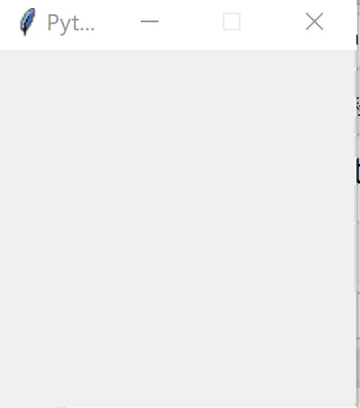

图2 被限制改变尺寸的窗口

## 2 标签：ttk.Label

标签用于显示文本或图像，用户通常只能查看而不能交互，常用于标识控件、提供文本反馈。

```python
label = ttk.Label(parent, text='')
```

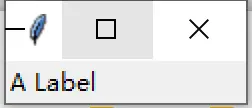

图3 为窗口添加 Label

### 2.1 文本的读取与修改

`text` 选项设定显示文本，对用户只读、对开发者可改。读取/修改各有两种等价方式：

```python
label['text']                  # 索引读取：'您好'
label.configure('text')        # configure 读取：('text','text','Text','','您好')
label['text'] = '早上好'       # 索引赋值
label.configure(text='早上好') # configure 赋值
```

### 2.2 textvariable：用变量监视标签

`textvariable` 选项把标签绑定到 `StringVar` 变量，变量改变时标签自动刷新：

```python
res = StringVar()
label['textvariable'] = res
res.set('再见')     # 标签同步显示"再见"
res.get()           # '再见'；此时 label['text'] 也是 '再见'
```

### 2.3 显示图片与图文混搭

先用 `PhotoImage` 载入图片，再赋给 `image` 选项；`compound` 控制图文布局，取值 `'text'`（仅文本）、`'image'`（仅图片）、`'center'`（文本在图片中央）、`'top'`/`'bottom'`/`'left'`/`'right'`：

```python
from tkinter import PhotoImage
img = PhotoImage(file='images/image.gif')
label['image'] = img
label['compound'] = 'top'
```

### 2.4 anchor / justify / 字体与颜色

- `anchor`：当分配给标签的框大于内容时，标签贴附的边或角，取指南针方向 `"n"/"ne"/"e"/"se"/"s"/"sw"/"w"/"nw"/"center"`；
- `justify`：多行文本对齐方式 `"left"/"center"/"right"`；
- `font`、`foreground`（前景/文本色）、`background`（背景色）控制外观；ttk 部件推荐用 `style` 统一管理外观（见 [界面样式、MVC 架构与参考资源](10-styles-mvc-resources.md)）。

```python
label['font'] = 'Arial 20'
label['foreground'] = 'red'
label['background'] = 'lightblue'
```

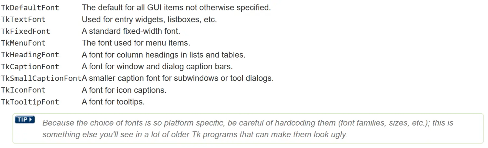

图4 字体选项

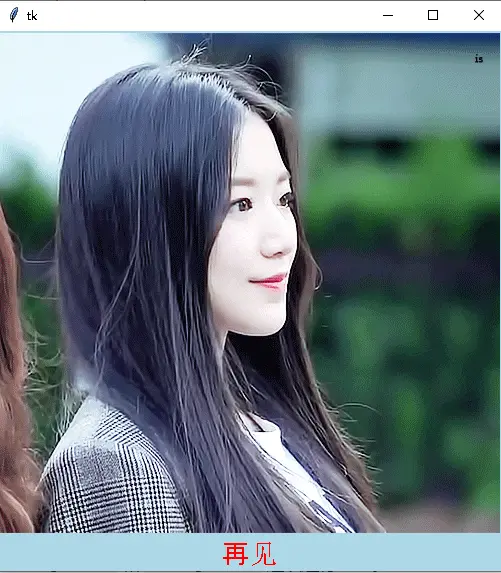

图5 ttk.Label 示例（字体/前景/背景）

## 3 文本输入框：ttk.Entry

Entry 提供**单行**文本输入（名字、密码、编号等）。`width` 指定以字符数计的宽度；值通过 `textvariable` 链接变量访问，也可用方法直接读写：

```python
name.get()                 # 读取当前值
name.delete(0, 'end')      # 删除 0 到末尾之间的文本（索引从 0 开始）
name.insert(0, 'your name')  # 在指定索引插入文本
```

索引位置除数字外还可用：`'insert'`（插入光标当前位置）、`'end'`（已有文本之后）、`'anchor'`（选中区的起始字符）。Entry **没有 `command` 选项**，要监视内容变化应监视链接变量（见 [事件绑定与变量联动](07-events-and-variables.md)）。

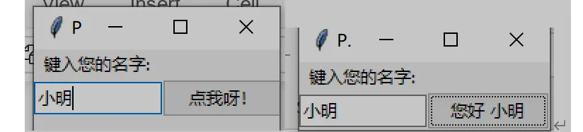

图6 提供用户输入一行文本的 Entry

### 3.1 密码框与部件状态

`show` 选项把实际内容显示为指定字符（如 `'*'`）。与按钮一样，Entry 可用 `state`/`instate` 管理状态，并有 `readonly`（用户不可改但可选可复制）、`invalid`（验证失败）状态标志：

```python
hide = ttk.Entry(root, textvariable=user_name, show='*')
name_entered.focus()          # 让 Entry 启动即获得输入焦点
action['state'] = 'disabled'  # 禁用按钮（灰显不可点）
```

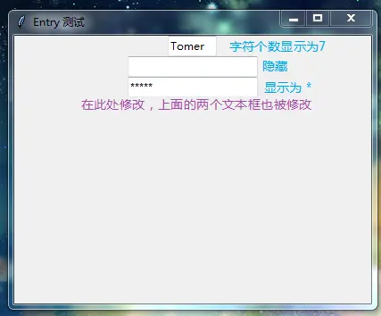

图7 Entry 示例：明文/空格隐藏/星号密码框共享同一变量

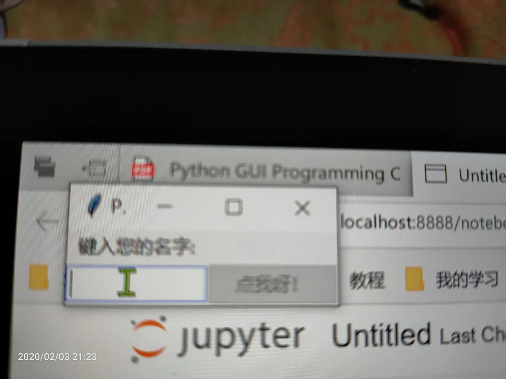

图8 禁用按钮并让 Entry 显示输入光标

### 3.2 输入验证：validate / validatecommand

验证输入合法性的三步法：

1. 定义验证回调，合法返回 `True`，否则返回 `False`；
2. 用 widget 的 `register()` 方法把回调封装为 Tcl 可调用字符串；
3. 设置 `validate` 声明验证时机，`validatecommand` 指定验证回调。

`validate` 常用时机：`'focus'`（获得/失去焦点时）、`'focusin'`、`'focusout'`、`'key'`（内容改变时）、`'all'`、`'none'`（关闭，默认）。

```python
class Window(Tk):
    def __init__(self):
        super().__init__()
        self.in_var = StringVar()
        self.out_var = StringVar()
        self.input_entry = ttk.Entry(textvariable=self.in_var)
        self.input_entry['validate'] = "focusout"
        self.test_cmd = self.register(self.test)  # 注册为 Tcl 回调
        self.input_entry['validatecommand'] = (self.test_cmd, '%P', '%v', '%W')
        self.show_label = ttk.Label(textvariable=self.out_var)
        self.input_entry.grid()
        self.show_label.grid()

    def test(self, content, reason, name):
        if content == 'Python':
            self.out_var.set(f'输入正确\n{content}, {reason}, {name}')
            return True
        else:
            self.out_var.set(f'输入错误\n{content}, {reason}, {name}')
            return False
```

`validatecommand=(register_func, s1, s2, ...)` 中的替换码会作为参数依次传给验证函数：

| 替换码 | 含义 |
| --- | --- |
| `'%d'` | 操作代码：0=删除，1=插入，2=获得/失去焦点或 textvariable 被改 |
| `'%i'` | 插入/删除的索引位置；焦点/变量触发时为 -1 |
| `'%P'` | 输入框值**允许改变后**的最新文本 |
| `'%s'` | 调用验证前的文本 |
| `'%S'` | 本次被插入/删除的文本内容 |
| `'%v'` | 当前 `validate` 选项的值 |
| `'%V'` | 调用原因：`'focusin'`/`'focusout'`/`'key'`/`'forced'` |
| `'%W'` | 该组件的名字 |

`invalidcommand` 指定验证函数返回 `False` 时调用的回调：

```python
self.input_entry['invalidcommand'] = self.test2
def test2(self):
    self.show_entry.insert('end', " 我被调用了......")
    return True
```

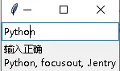

图9 注册机制验证输入内容（content/reason/name 回显）

## 4 按钮：ttk.Button

按钮适合"点击执行操作"类交互，内容与命令回调通常同时设置：

```python
button = ttk.Button(parent, text='Okay', command=submitForm)
```

### 4.1 显示选项与默认按钮

按钮与标签共享 `text`/`textvariable`/`image`/`compound` 选项。`default` 选项声明默认按钮（按 Enter/Return 触发，可用 Tab 在按钮间跳转）：`'active'` 为激活的默认按钮，常规为 `'normal'`。注意设置该选项本身不创建事件绑定。

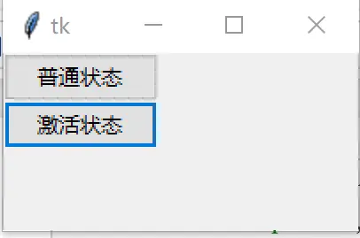

图10 ttk.Button 的普通状态与激活（default=active）状态

### 4.2 部件状态标志

所有主题化部件内部维护一组二进制状态标志，用 `state` 设置/清除、`instate` 查询。完整标志列表：`"active"`、`"disabled"`、`"focus"`、`"pressed"`、`"selected"`、`"background"`、`"readonly"`、`"alternate"`、`"invalid"`。按钮用 `disabled` 控制是否可点。

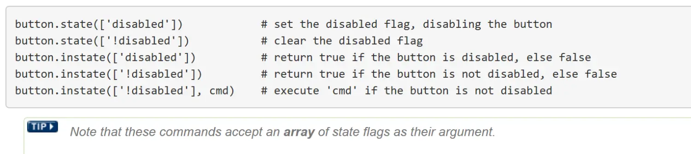

图11 按钮的正常/按下/禁用状态

### 4.3 命令回调与 invoke

`command` 指定点击时执行的脚本；`invoke()` 方法可在程序中直接触发同一回调，无需重复代码：

```python
def hit_me():
    global on_hit
    if on_hit:
        on_hit = False
        var.set('')
    else:
        on_hit = True
        var.set('你打了我')

b = ttk.Button(root, text='打我', command=hit_me)
```

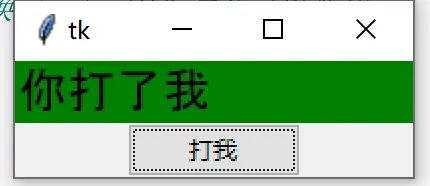

图12 命令回调示例：点击切换标签文字

回调中修改部件属性有两种等价写法——`configure()` 方法与字典式赋值：

```python
def click_me():
    action.configure(text="**已经点击了按钮**")
    a_label.configure(foreground='red')
    a_label['text'] = 'A Red Label'  # 字典式赋值，等价于 configure(text=...)
```

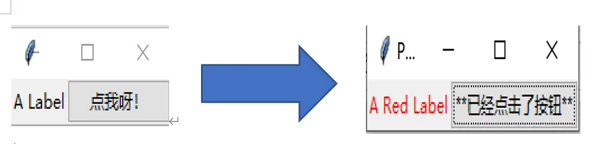

图12-1 点击按钮后 Label 文字变红、内容改变（configure 与 `[]` 赋值两种写法）

```python
def click3(self):
    self.b1.invoke()  # 程序化触发 Button 1 的回调
    self.lb_var2.set('Button 3 clicked.')
```

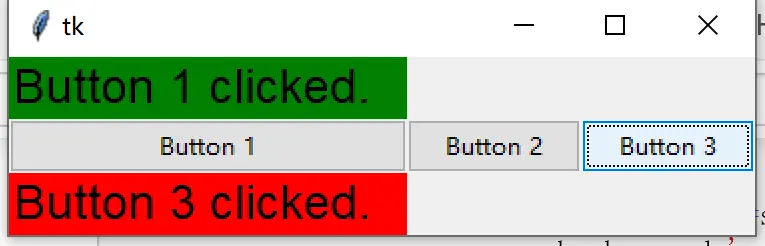

图13 invoke 使用：Button 3 同时回调 Button 1

## 5 复选按钮：ttk.Checkbutton

Checkbutton 在按下触发回调之外还携带一个二进制值（toggle），用于二选一场景：

```python
measureSystem = StringVar()
check = ttk.Checkbutton(parent, text='Use Metric',
                        command=metricChanged,
                        variable=measureSystem,
                        onvalue='metric', offvalue='imperial')
```

`variable` 选项链接变量以读写当前值；默认选中为 `"1"`、未选中为 `"0"`，可用 `onvalue`/`offvalue` 改为任意值。当链接变量既不等于 onvalue 也不等于 offvalue（或变量不存在）时，进入 **tristate（不确定）模式**（框内显示破折号），此时 `alternate` 状态标志被置位，可用 `check.instate(['alternate'])` 查询。注意 Checkbutton **不会自动创建或初始化链接变量**，程序需自行设置起始值。

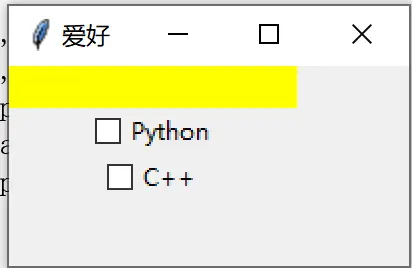

图14 ttk.Checkbutton 示例：两个复选框联动显示爱好

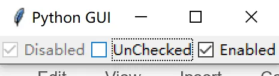

图15 禁用勾选/未勾选/可用勾选三种复选框

用变量追踪（`trace_add`）可实现复选框互斥：

```python
def checkCallback(*ignoredArgs):
    if chVarUn.get():
        check3.configure(state='disabled')
    else:
        check3.configure(state='normal')
    if chVarEn.get():
        check2.configure(state='disabled')
    else:
        check2.configure(state='normal')

chVarUn.trace_add('write', lambda a, b, c: checkCallback())
chVarEn.trace_add('write', lambda a, b, c: checkCallback())
```

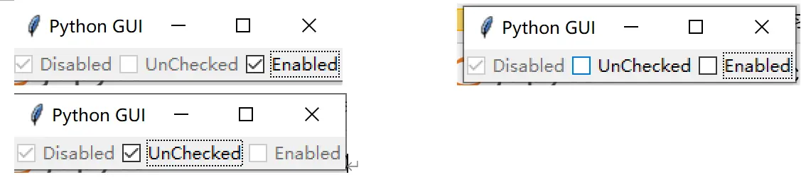

图16 trace_add 跟踪变量实现"仅保留一个可选"

## 6 单选按钮：ttk.Radiobutton

Radiobutton 用于在多个**互斥**选项中择一，适合 3-5 个少量选项，总是成组使用：同组共享同一 `variable`、各自有不同的 `value`（替代 Checkbutton 的 onvalue/offvalue）：

```python
phone = StringVar()
home = ttk.Radiobutton(parent, text='Home', variable=phone, value='home')
office = ttk.Radiobutton(parent, text='Office', variable=phone, value='office')
cell = ttk.Radiobutton(parent, text='Mobile', variable=phone, value='cell')
```

变量不存在时同样显示 tristate 不确定状态（`alternate` 标志）。

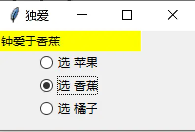

图17 ttk.Radiobutton 示例：水果三选一

回调中可根据取值联动界面，例如改变窗口背景色：

```python
def radCall():
    radSel = radVar.get()
    if radSel == 1:
        win.configure(background="Blue")
    elif radSel == 2:
        win.configure(background="Gold")
    elif radSel == 3:
        win.configure(background="Red")
```

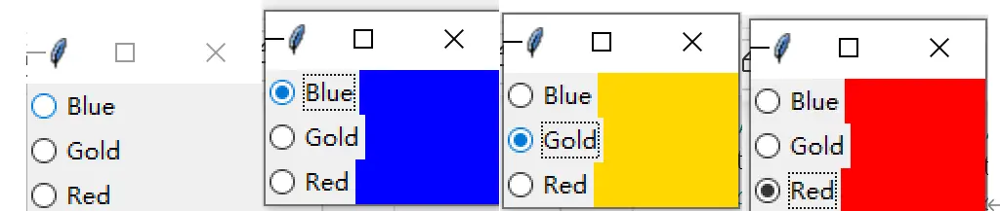

图18 单选按钮改变窗口背景色（颜色名参见 Tk colors 手册）

## 7 框架：ttk.Frame

Frame 显示为矩形框，主要用作其他部件的**容器**，是组织复杂界面的基本手段（嵌套布局见 [几何管理器：grid、pack 与 place](03-geometry-managers.md)）：

```python
frame = ttk.Frame(parent)
```

- **尺寸**：空 Frame 需用 `width`/`height` 显式请求尺寸，否则会缩成很小；尺寸单位默认像素，后缀 `c`（厘米）、`i`（英寸）、`p`（打印机点，1/72 英寸）；
- **padding**：部件内部留白。单值=四边相同，两值=`(水平, 垂直)`，四值=`(左, 上, 右, 下)`：`frame['padding'] = (5, 10)`；
- **边框**：`borderwidth`（默认 0）配 `relief`，外观取值 `"flat"`（默认）、`"raised"`、`"sunken"`、`"solid"`、`"ridge"`、`"groove"`：

```python
frame['borderwidth'] = 2
frame['relief'] = 'sunken'
```

- **style**：所有主题部件通用的外观配置入口：

```python
style = ttk.Style()
style.configure("BW.TLabel", foreground="black", background="white")
l1 = ttk.Label(text="Test", style="BW.TLabel")
```

## 8 多行文本：scrolledtext.ScrolledText

`ScrolledText` 是自带垂直滚动条的多行文本部件（类似记事本），文本超出高度时滚动条自动启用：

```python
from tkinter import scrolledtext
scr = scrolledtext.ScrolledText(win, width=30, height=3, wrap='word')
scr.grid(column=0, columnspan=3)
```

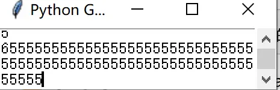

图19 可滚动的多行文本框 ScrolledText

完整的 Text 部件能力（标签、标记、内嵌组件等）见 [Text 多行文本部件](08-text-widget.md)。

## 9 综合实例：英尺转米工具

综合 Entry/Label/Button/Frame/grid 的经典入门实例：

```python
from tkinter import ttk, Tk, StringVar
from tkinter import N, W, E, S

class App(ttk.Frame):
    def __init__(self, master=None):
        super().__init__(master)
        self.master = master
        self.feet = StringVar()
        self.meters = StringVar()
        self._layout()
        # 为所有子部件统一设置间距
        for child in self.winfo_children():
            child.grid_configure(padx=5, pady=5)

    @property
    def widgets(self):
        return [
            [ttk.Entry(self, width=14, textvariable=self.feet),
             ttk.Label(self, text="feet")],
            [ttk.Label(self, text="is equivalent to"),
             ttk.Label(self, textvariable=self.meters),
             ttk.Label(self, text="meters")],
            [ttk.Button(self, text="Calculate", command=self.calculate)]
        ]

    def grid_layout(self):
        for n_row, row in enumerate(self.widgets):
            for n_col, widget in enumerate(row):
                widget.grid(column=n_col, row=n_row, sticky=(E, W))

    def _layout(self):
        self.master.columnconfigure(0, weight=1)
        self.master.rowconfigure(0, weight=1)
        self['padding'] = 3, 3, 12, 12
        self.grid(column=0, row=0, sticky=(N, W, E, S))
        self.grid_layout()

    def calculate(self, *args):
        try:
            value = float(self.feet.get())
            self.meters.set((0.3048 * value * 10000.0 + 0.5) / 10000.0)
        except ValueError:
            pass

root = Tk()
root.title('Feet to Meters')
app = App(master=root)
app.mainloop()
```

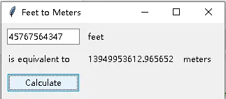

图20 英尺转换为米工具

支持键盘回车触发与初始焦点：

```python
class App1(App):
    def __init__(self, master=None):
        super().__init__(master)
        self.widgets[0][0].focus()
        self.master.bind('<Return>', self.calculate)  # 回车即计算
```

## 延伸阅读

- [几何管理器：grid、pack 与 place](03-geometry-managers.md)：部件如何摆放、sticky/weight/padding
- [高级主题化 Widgets](04-advanced-widgets.md)：Combobox/Listbox/Spinbox/Scale/Progressbar/Treeview/Notebook
- [事件绑定与变量联动](07-events-and-variables.md)：command 回调之外的 bind、lambda 传参、trace
- [Text 多行文本部件](08-text-widget.md)

## 事实溯源

F-TGD-02（[信源登记](../references/sources.md)）：ttk.Label 全部配置选项（text/textvariable/image/compound/anchor/justify/font/foreground/background/style）、Entry 读写方法与索引、show 密码框、validate 三步法与 8 个替换码表、invalidcommand、Button 的 default/state 标志表/command/invoke、Checkbutton 的 variable/onvalue/offvalue/tristate/alternate、Radiobutton 成组 value、Frame 的尺寸单位/padding/borderwidth/relief、英尺转米完整实例。
F-TGD-22（[信源登记](../references/sources.md)）：最简窗口与 resizable、focus/disabled 用法、ScrolledText、trace_add 互斥复选框、Radiobutton 改背景色（参考 *Python GUI Programming Cookbook, 2nd Ed.*）。