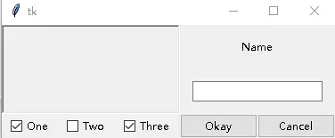
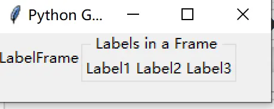
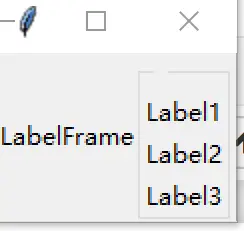
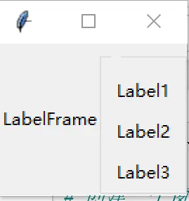
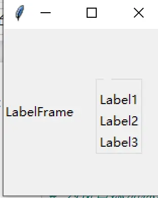
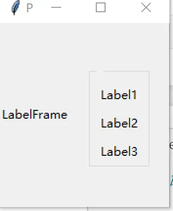
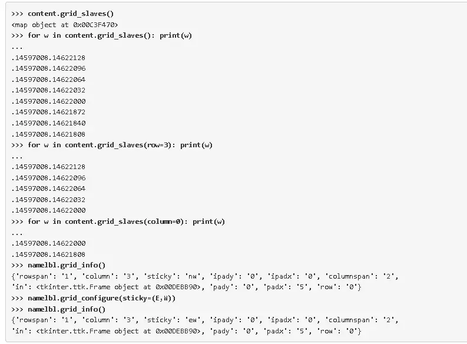

# 几何管理器：grid、pack、place 与嵌套布局

> 对应信源：F-TGD-03《3.2 Grid 几何管理器》、F-TGD-23《8.1 系统化学习 tkinter 之布局篇》（布局部分）。**创建 widget 不会让它上屏**——必须经过几何管理器布局；同一容器内不要混用 grid 与 pack。

Tk 提供三种几何管理器：

| 管理器 | 特点 | 典型用途 |
| --- | --- | --- |
| `grid` | 按行/列网格摆放，兼顾灵活性与易用性，与"控件对齐"的自然布局契合 | **通用首选** |
| `pack` | 沿边依次堆叠（如 `pack(side='top')`），强大但较难理解 | 工具栏、Notebook 占满等简单条状布局 |
| `place` | 完全手工控制位置（如 `place(x=10, y=100, anchor='nw')`） | 精确定位、自定义布局 |

此外，PanedWindow、Notebook、Canvas、Text 等部件本身也可充当容器承载其他部件（见 [高级主题化 Widgets](04-advanced-widgets.md)、[Canvas 绘图](09-canvas.md)）。

## 1 列与行

grid 为每个部件分配 `column`（列号）与 `row`（行号）：同列部件上下相叠，同行部件左右相邻。行列号均为整数、**从 0 开始**，且允许留空隙（如列 0、1、2、10、11、12），方便日后在界面中间插入部件。列宽/行高由该列/行中最高最宽的部件决定，不必担心各列等宽。

## 2 跨越多单元格：columnspan / rowspan

`columnspan` 与 `rowspan` 让部件占据多个网格单元：

```python
from tkinter import ttk, Tk
from tkinter import BooleanVar

root = Tk()
content = ttk.Frame(root)
frame = ttk.Frame(content, borderwidth=5, relief="sunken", width=200, height=100)
namelbl = ttk.Label(content, text="Name")
name = ttk.Entry(content)

onevar, twovar, threevar = BooleanVar(), BooleanVar(), BooleanVar()
onevar.set(True); twovar.set(False); threevar.set(True)

one = ttk.Checkbutton(content, text="One", variable=onevar)
two = ttk.Checkbutton(content, text="Two", variable=twovar)
three = ttk.Checkbutton(content, text="Three", variable=threevar)
ok = ttk.Button(content, text="Okay")
cancel = ttk.Button(content, text="Cancel")

content.grid(column=0, row=0)
frame.grid(column=0, row=0, columnspan=3, rowspan=2)
namelbl.grid(column=3, row=0, columnspan=2)
name.grid(column=3, row=1, columnspan=2)
one.grid(column=0, row=3)
two.grid(column=1, row=3)
three.grid(column=2, row=3)
ok.grid(column=3, row=3)
cancel.grid(column=4, row=3)
root.mainloop()
```



图1 一个 Grid 布局例子（左侧占位框跨 3 列 2 行）

## 3 单元格内布局：sticky

默认情况下，单元格大于部件时部件在其中水平、垂直双向居中，空白处露出父部件背景。`sticky` 选项改变这一行为，取值为指南针方向字符串 `"nsew"` 的子集（也可传列表 `[N, S, E, W]`）：

- `"n"`：贴顶部，水平仍居中；`"nw"`：贴左上角；
- `"we"`（西+东）：水平拉伸填满；`"ns"`：垂直拉伸；
- `"nsew"`：四边都贴住，填满整个单元格。

```python
content.grid(column=0, row=0, sticky=(N, S, E, W))
frame.grid(column=0, row=0, columnspan=3, rowspan=2, sticky=(N, S, E, W))
namelbl.grid(column=3, row=0, columnspan=2, sticky=(N, W), padx=5)
```

## 4 处理窗口缩放：weight

每列/每行有一个 `weight` 网格选项，决定父容器有多余空间时该列/行按什么比例增长。**默认 weight=0（不增长）**。用 `columnconfigure`/`rowconfigure` 设置：

```python
root.columnconfigure(0, weight=1)
root.rowconfigure(0, weight=1)
content.columnconfigure(0, weight=3)
content.columnconfigure(1, weight=3)
content.columnconfigure(2, weight=3)
content.columnconfigure(3, weight=1)
content.columnconfigure(4, weight=1)
content.rowconfigure(1, weight=1)
```

权重比即增长比：权重 3 的列相对权重 1 的列，每多 1 像素空间就多拿 3 像素。两方法还接受 `minsize` 选项指定列/行不可再缩的最小尺寸，以及 `pad` 选项为整列/整行加填充。

## 5 填充（Padding）的三种加法

部件默认彼此紧邻。添加留白有三种方式：

1. **部件自身 padding**：Frame 的 `padding` 选项（单值/双值/四值，见 [基础主题化 Widgets](02-basic-widgets.md)）；
2. **grid 的 `padx`/`pady`**：在部件所在单元**内**的左右/上下加空白；单值两侧相同，双值两侧不同：

```python
name.grid(column=3, row=1, columnspan=2, sticky=(N, E, W), pady=5, padx=5)
```

3. **整行/整列填充**：`columnconfigure(..., pad=...)` / `rowconfigure(..., pad=...)`。

另有较少用的**内部填充** `ipadx`/`ipady`：几何管理器在计算部件自然尺寸时就为其加上额外填充——部件居中/贴边时表现为周围留白，部件被 sticky 拉伸时则填充被吃掉、部件本体变大。

## 6 LabelFrame：带标题的分组容器

`ttk.LabelFrame` 在 Frame 基础上带一个标题边框，适合把相关控件成组组织：

```python
buttons_frame = ttk.LabelFrame(win, text=' Labels in a Frame ')
buttons_frame.grid(column=1, row=0)
ttk.Label(buttons_frame, text="Label1").grid(column=0, row=0, sticky='w')
ttk.Label(buttons_frame, text="Label2").grid(column=1, row=0, sticky='w')
ttk.Label(buttons_frame, text="Label3").grid(column=2, row=0, sticky='w')
```



图2 在 LabelFrame 中横排多个标签

标题文本传空串即无边框标题；标签也可竖直排列：

```python
buttons_frame = ttk.LabelFrame(win, text='')
ttk.Label(buttons_frame, text="Label1").grid(column=0, row=0)
ttk.Label(buttons_frame, text="Label2").grid(column=0, row=1)
ttk.Label(buttons_frame, text="Label3").grid(column=0, row=2)
```



图3 LabelFrame 中竖直排列标签

### 6.1 用 winfo_children 批量加留白

遍历容器子部件统一配置间距，是 tkinter 布局的常用套路：

```python
# 容器内部留白：作用于每个子部件
for child in buttons_frame.winfo_children():
    child.grid_configure(padx=8, pady=4)

# 容器外部留白：作用于容器自身
buttons_frame.grid(column=0, row=1, padx=20, pady=40)
```



图4 容器内部添加空白（grid_configure padx/pady）



图5 容器外部添加空白（grid padx/pady）



图6 内外填充综合效果

## 7 查询、更改与移除网格

grid 选项随时可内省和更改：

- `grid_slaves()`（从属）：列出容器内已布局的所有部件，或指定列/行内的部件；
- `grid_info()`：返回部件的全部网格选项及取值；
- `grid_configure(...)`：更改一个或多个网格选项；
- `grid_forget()`：把部件从网格中移除（不上屏但未销毁），**原有网格选项全部丢失**，之后可重新 grid；
- `grid_remove()`：同样移除，但**记住网格选项**，重新 grid 时自动恢复。



图7 交互式查询和更改网格选项（slaves/info/configure）

## 8 嵌套布局（Nested Layouts）

界面复杂后，单个网格会变得过细、难以维护。正确做法是**按区域拆分 Frame**：每个相对独立的区域（调色板、工具栏、表单区）放入自己的 Frame，在 Frame 内部独立 grid，Frame 之间再由外层网格布局。

- 每个 Frame 拥有自己的网格，理论上可任意深度嵌套（实践中通常不超过几层）；
- 模块化收益巨大：一个绘图工具调色板可在独立函数/类中完成全部子部件创建、布局与事件绑定，主程序只面对一个"装好了一切"的 Frame 部件。

本束的实例统一采用这一模式：`App(ttk.Frame)` 承载全部内容，自身 grid 到 root，内部再网格化子部件（参见 [基础主题化 Widgets](02-basic-widgets.md) 的英尺转米实例与 [登录窗口实战](../examples/01-login-window.md)）。

## 延伸阅读

- [基础主题化 Widgets](02-basic-widgets.md)：Frame 的 padding/borderwidth/relief 选项
- [高级主题化 Widgets](04-advanced-widgets.md)：Notebook 选项卡、PanedWindow 等"自己也是几何管理器"的容器
- [菜单、窗口与对话框](05-menus-windows-dialogs.md)：窗口级布局与 Toplevel

## 事实溯源

F-TGD-03（[信源登记](../references/sources.md)）：grid 行列编号规则与空隙技巧、columnspan/rowspan 完整示例、sticky 指南针语义、weight 增长比与 minsize、三种 padding 与 ipadx/ipady 内部填充、slaves/info/configure/forget/remove 方法、嵌套布局原则。
F-TGD-23（[信源登记](../references/sources.md)）：LabelFrame 分组容器（横排/竖排/空标题）、winfo_children + grid_configure 批量留白、容器内外 padx/pady 对比（参考 *Python GUI Programming Cookbook, 2nd Ed.*）。