# 高级主题化 Widgets

> 对应信源：F-TGD-04《3.3 tkinter 之主题化的高级 widgets 详解》、F-TGD-12《3.11 tkinter 之 ttk.Treeview》（译自 TKDocs Tree）、F-TGD-22（Combobox 入门）、F-TGD-23（Notebook 选项卡）。

## 1 组合框：ttk.Combobox

Combobox 把 Entry 与选项列表组合在一起（`ttk.Combobox` 是 `ttk.Entry` 的子类）：用户既可从预定义值中选择，也可键入自己的值。

```python
countryvar = StringVar()
country = ttk.Combobox(parent, textvariable=countryvar)
country['values'] = ('USA', 'Canada', 'Australia')  # 预定义选项
country.current(0)   # 设定默认选中第 0 项；current() 无参时返回当前选中索引
```

设为 `state='readonly'` 后用户只能选择、不能键入；删除该选项则可自由输入。`get()` 取当前值、`set()` 设值；选择改变时产生 **`<<ComboboxSelected>>`** 虚拟事件：

```python
def callback_func(event):
    index = combo.current()   # 当前索引
    value = combo.get()       # 当前值
    out_var.set(f"索引是 {index}, 选择的值是 {value}")

combo.bind("<<ComboboxSelected>>", callback_func)
```

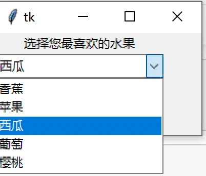

图1 ttk.Combobox 预定义 values 与默认选项

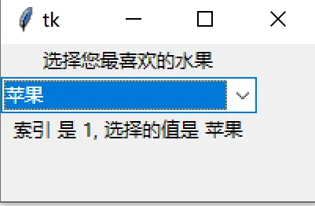

图2 绑定 <<ComboboxSelected>> 回显索引与值

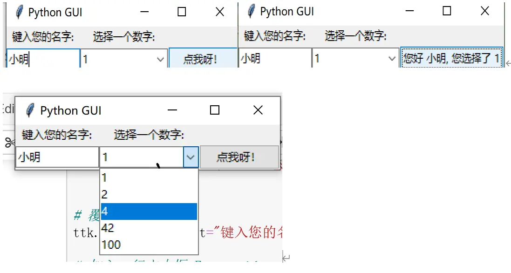

图3 系统化基础篇中的 Combobox（readonly 状态、current(0) 初始值）

## 2 列表框：Listbox

Listbox 显示单行文本项的列表，允许浏览并选择一项或多项：

```python
L = Listbox(parent, height=10)
```

### 2.1 填充与选择

`listvariable` 选项把列表框链接到一个**包含列表的变量**——之后对列表的增删重排只需操作该变量再 `set` 回去，比逐条 insert/delete 更灵活：

```python
self.var2.set(self.init_list)                       # 链接列表变量
self.list_box = Listbox(listvariable=self.var2, selectmode="extended")
window.init_list.extend([1, 2, 3, 4])               # 像普通 list 一样操作
window.init_list.insert(1, 'first')
window.init_list.pop(2)
window.var2.set(window.init_list)                   # 刷新到列表框
```

也可用传统方法逐条操作：`insert('end', item)` / `insert(index, item)` / `delete(index)`。

`selectmode` 控制选择模式：`"browse"`（默认，单选）或 `"extended"`（多选）。查询选择用 `curselection()`（返回选中项索引列表，可能为空）与 `selection_includes(index)`；程序化改选用 `selection_clear(first, last=None)` 与 `selection_set(first, last=None)`。

```python
curs = self.list_box.curselection()
if curs:
    if len(curs) > 1:
        value = ','.join(str(self.list_box.get(cur)) for cur in curs)
    else:
        value = self.list_box.get(curs)
```

选择改变时产生 **`<<ListboxSelect>>`** 虚拟事件；常另绑定 `<Double-1>` 双击对当前项执行操作。

### 2.2 风格化

经典 Tk 部件外观可高度定制：可改字体、正常/选中/禁用状态的前景背景色；`itemconfigure(i, background='#f0f0ff')` 可单独设置某一项的颜色。

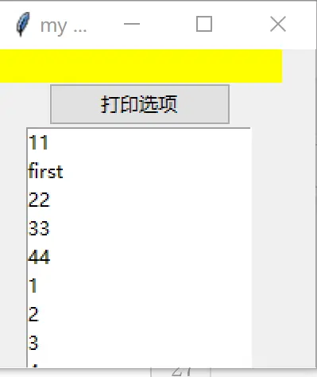

图4 Listbox 多选示例（extended 模式 + 打印所选）

## 3 滚动条：ttk.Scrollbar

Scrollbar 帮助用户查看内容超出可视区域的部件。它**不是**被滚动部件的一部分，而是完全独立的部件，双方通过方法调用双向通信：

```python
s = ttk.Scrollbar(parent, orient="horizontal", command=listbox.yview)
listbox.configure(yscrollcommand=s.set)
```

- `orient`：`"horizontal"` / `"vertical"`；
- 滚动条的 `command` 指向可滚动部件的 `yview`（垂直）/`xview`（水平）方法；
- 可滚动部件的 `yscrollcommand`/`xscrollcommand` 指向滚动条的 `set` 方法——拖动滚动条时部件滚动，部件内容滚动时滚动条位置同步更新。

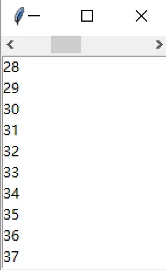

图5 ttk.Scrollbar 与 Listbox 联动（100 项）

## 4 尺寸手柄：ttk.Sizegrip

窗口右下角的小方框，供用户拖拽调整窗口大小，通常贴右下角放置：

```python
ttk.Sizegrip(parent).grid(column=999, row=999, sticky=(S, E))
```

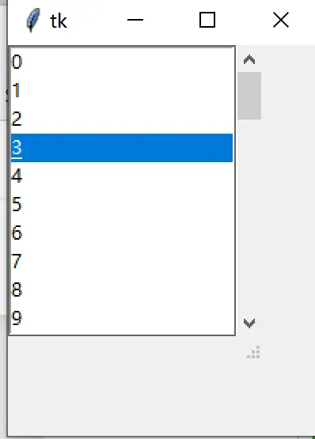

图6 ttk.SizeGrip 示例

## 5 进度条：ttk.Progressbar

Progressbar 为冗长操作提供进度反馈：

```python
p = ttk.Progressbar(parent, orient="horizontal", length=200, mode='determinate')
```

- `orient`：水平/垂直；`length`：长条轴长（像素）；
- `mode='determinate'`：**确定型**，能估算完成百分比。用 `maximum`（浮点数，默认 100）给出总步数，不断更新 `value`（0 → maximum）。循环中必须调用 `update()` 强制刷新界面：

```python
def increment(self):
    for i in range(100):
        self.p["value"] = i + 1
        self.update()        # 循环中必须刷新，否则界面卡死到结束才更新
        time.sleep(0.1)
```

- `mode='indeterminate'`：**不确定型**，无法估计进度（如查询大量数据库结果），刻度往复运动表示"仍在运行"。开始/结束用 `start(interval=None)`（默认 50ms 定时器）/`stop()`，步长用 `step(amount=None)`（默认 1.0）：

```python
self.p = ttk.Progressbar(orient="horizontal", length=200, mode='indeterminate')
start_btn = ttk.Button(text="开始", command=self.p.start)
end_btn = ttk.Button(text="结束", command=self.p.stop)
```

也可用 `after(ms, callback)` 延迟启动自动进度：`self.after(int(1e4), self.progress_bar.start)`。

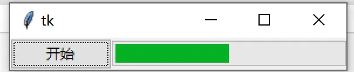

图7 确定型进度条

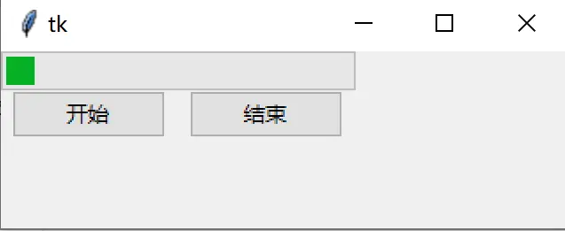

图8 不确定型进度条（start/stop）

## 6 滑块：ttk.Scale

Scale 让用户通过拖动直接选择一个数值：

```python
s = ttk.Scale(parent, orient='horizontal', length=200, from_=1.0, to=100.0)
```

`from_`/`to`（注意 `from` 是 Python 关键字，tkinter 中为 `from_`）定义数值范围，当前值为其间的浮点数。读写当前值三种方式：`value` 配置选项、`variable` 链接变量、`set()`/`get()` 方法。`command` 指定值改变时调用的脚本，**Tk 会自动把当前值作为参数附加**给回调。`state disabled` / `state !disabled` / `instate disabled` 可禁用用户修改。

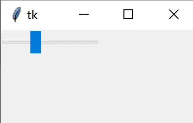

图9 ttk.Scale 示例

## 7 旋钮：ttk.Spinbox

Spinbox（ttk.Entry 的子类）把显示当前值的输入条与一对上下箭头组合，供用户在数字范围或任意值列表中逐步选择：

```python
spinval = StringVar()
s = ttk.Spinbox(parent, from_=1.0, to=100.0, textvariable=spinval)
```

- 数字范围用 `from_`/`to`，`increment` 控制每次点按的增减幅度；
- 任意字符串列表用 `values` 指定（与 Combobox 同理，**会覆盖 from_/to**）；
- `wrap`（布尔）决定值越过端点时是否环绕；`width` 指定输入条宽度；
- 值变化调用 `command`；按 `<Up>`/`<Down>` 分别产生 **`<<Increment>>`** / **`<<Decrement>>`** 虚拟事件。

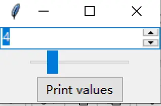

图10 Spinbox 与 Scale 联动取值示例

## 8 树视图：ttk.Treeview

Treeview 显示可浏览的**层次结构 Item**，并可把每个 Item 的一个或多个属性显示为树右侧的列——类似文件管理器（macOS Finder / Windows 资源管理器）的界面。可按常规方式挂水平/垂直滚动条。

```python
tree = ttk.Treeview(parent)
```

### 8.1 添加 Item

每个 Item 代表树中一个节点（叶或内部节点），由唯一 ID 引用：可由程序员在创建时通过 `iid` 指定，也可由部件自动分配。Treeview 自动创建一个**不显示的根节点**，ID 为空字符串 `''`，作为第一级 Item 的父节点。

```python
tree.insert(parent, index, iid=None, **kw)
```

`index` 指定在父项子列表中的位置（0 起，`'end'` 表示追加到最后）；指定 `iid` 时 insert 返回该 iid，否则返回自动分配的 ID。Item 可带文本名称、图像、open/closed 状态等。

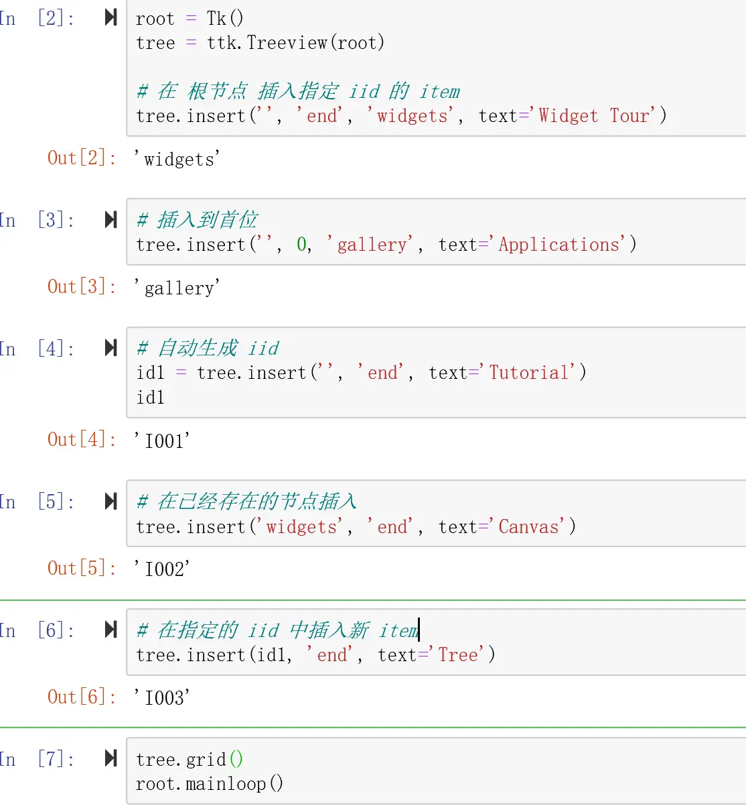

图11 insert 函数使用范例（iid 与返回值）

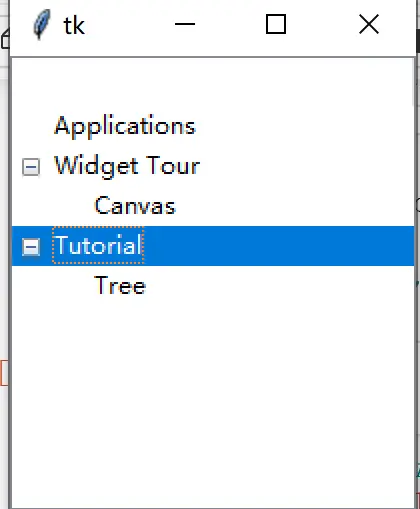

图12 树视图运行效果

### 8.2 重排、分离与删除

```python
tree.move('widgets', 'gallery', 'end')   # 移动节点（不可移到自己的子孙之下）
tree.detach('widgets')                   # 分离：从层次移除但不销毁，可用 move 重新插回
tree.delete('widgets')                   # 彻底删除
tree.parent('widgets')                   # 查父项
tree.next('widgets') / tree.prev('widgets')   # 同级下一个/上一个
tree.get_children('widgets')             # 子项列表
tree.item('widgets', open=True)          # 控制展开/折叠
isopen = tree.item('widgets', 'open')
```

### 8.3 列：显示每项的附加信息

用 `columns` 配置选项声明符号列名，`column()` 设列宽/对齐，`heading()` 设标题文本/图像/对齐/点击回调（如排序）；每行列值用 `values` 列表（顺序与 columns 一致）或 `tree.set()` 逐格设置：

```python
tree = ttk.Treeview(root, columns=('size', 'modified', 'owner'))
tree.column('size', width=100, anchor='center')
tree.heading('size', text='Size')
tree.set('widgets', 'size', '12KB')
size = tree.set('widgets', 'size')
tree.insert('', 'end', text='Listbox', values=('15KB', 'Yesterday', 'mark'))
```

### 8.4 tags 外观与事件

与 Text/Canvas 类似，Treeview 用**标记（tags）**批量控制 Item 外观，可用 tag 选项：`foreground`、`background`、`font`、`image`；并可在标记上绑定事件：

```python
tree.insert('', 'end', text='button', tags=('ttk', 'simple'))
tree.tag_configure('ttk', background='yellow')
tree.tag_bind('ttk', '<1>', itemClicked)   # 被点击项可用 tree.focus() 取得
```

Treeview 产生 **`<<TreeviewSelect>>`**、**`<<TreeviewOpen>>`**、**`<<TreeviewClose>>`** 虚拟事件；当前选择用 `selection` 系列方法查询/修改。

### 8.5 自定义显示

- `height`：显示行数；
- 列的 `width`/`minwidth` 控制列宽；持有树的列用符号名 `#0` 访问；部件总宽为各列宽之和；
- `displaycolumns`：选择显示哪些列及顺序；
- `show`：默认 `"tree headings"`（树+列标题都显示），可隐藏树或标题；
- `selectmode`：`"browse"`（单选）、`"extended"`（多选，默认）、`"none"`。

## 9 选项卡容器：ttk.Notebook

Notebook 用选项卡（tab）充分利用窗口空间，每个 tab 是一个独立 Frame，适合把多组控件分页收纳：

```python
tabControl = ttk.Notebook(win)
tab1 = ttk.Frame(tabControl)
tabControl.add(tab1, text='Tab 1')
tab2 = ttk.Frame(tabControl)
tabControl.add(tab2, text='Tab 2')
tabControl.pack(expand=1, fill="both")
```

每个 tab 内部照常使用 Frame/LabelFrame 组织控件（`pack(expand=1, fill="both")` 让 Notebook 占满窗口）：

```python
mighty = ttk.LabelFrame(tab1, text=' Mighty Python ')
mighty.grid(column=0, row=0, padx=8, pady=4)
ttk.Label(mighty, text="键入名称:").grid(column=0, row=0, sticky='W')
```

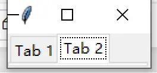

图13 带两个选项卡的 ttk.Notebook

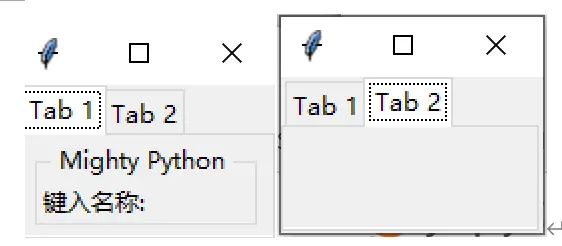

图14 在 Tab 1 中放置 LabelFrame 与控件

> 同类"自身即几何管理器"的容器还有 **PanedWindow**（可拖拽分隔条的多窗格），F-TGD-01 提及 paned windows/notebooks/canvas/text 均可充当几何管理器。

## 延伸阅读

- [基础主题化 Widgets](02-basic-widgets.md)：Label/Entry/Button/Checkbutton/Radiobutton/Frame
- [几何管理器：grid、pack、place](03-geometry-managers.md)：Notebook/PanedWindow 容器内部如何布局
- [Canvas 绘图](09-canvas.md)：tags 与绑定机制的另一个使用大户
- [菜单、窗口与对话框](05-menus-windows-dialogs.md)

## 事实溯源

F-TGD-04（[信源登记](../references/sources.md)）：Combobox values/current/readonly/<<ComboboxSelected>>、Listbox listvariable/selectmode/curselection/selection_set/itemconfigure、Scrollbar 双向联动协议、Sizegrip、Progressbar determinate/indeterminate 与 start/stop/step/update 刷新、Scale from_/to/value/variable/command 自动附加参数、Spinbox increment/values/wrap/<<Increment>>/<<Decrement>>。
F-TGD-12（[信源登记](../references/sources.md)）：Treeview 根节点 `''`、insert/move/detach/delete/parent/next/prev/children、columns/column/heading/values/set、tags tag_configure/tag_bind、<<TreeviewSelect/Open/Close>>、height/width/minwidth/#0/displaycolumns/show/selectmode（译自 TKDocs Tree）。
F-TGD-22/F-TGD-23（[信源登记](../references/sources.md)）：Combobox 入门用法、Notebook 选项卡创建与 tab 内 LabelFrame 布局（参考 *Python GUI Programming Cookbook, 2nd Ed.*）。