# 菜单、多窗口与标准对话框

> 对应信源：F-TGD-05《3.4 tkinter 下的 Menus》、F-TGD-06《3.5 tkinter 之窗口和对话框》、F-TGD-27《tkinter 之窗口设计》、F-TGD-23（菜单栏与消息盒子实战）。菜单设计建议：菜单过长/过深应重新组织界面；菜单是新用户探索程序功能的入口，应覆盖主要功能；各平台菜单约定不同，需查阅平台人机界面指南。

## 1 菜单栏（Menubar）

### 1.1 菜单部件与层次结构

菜单在 Tk 中也是部件。每个菜单部件包含若干菜单项：命令项（如"打开…"）、分隔符、以及打开子菜单的级联项（cascading menus）。菜单按层次组织：**菜单栏本身是一个菜单部件**，其子级是"文件""编辑"等菜单（级联），每个菜单再包含菜单项，子菜单必须创建为父菜单的子级。

创建菜单前先关闭"撕下"（tear-off）特性，否则 Windows/X11 上每个菜单顶部会出现一条虚线、可把菜单撕成独立窗口：

```python
root.option_add('*tearOff', False)   # 必须在创建菜单前执行
```

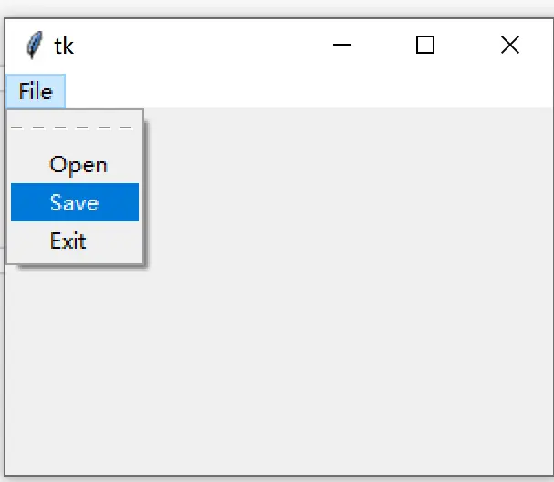

图1 未设置 tearOff=False 时菜单顶部的虚线（可撕下）

### 1.2 创建菜单栏与菜单

每个顶层窗口最多一个菜单栏，通过窗口的 `menu` 配置选项挂载：

```python
from tkinter import Menu
menubar = Menu(root)
root['menu'] = menubar                # 或 root.config(menu=menubar)

file_menu = Menu(menubar)             # 每个菜单是菜单栏的子级
edit_menu = Menu(menubar)
menubar.add_cascade(label="文件", menu=file_menu)
menubar.add_cascade(label="编辑", menu=edit_menu)
```

也可在构造单个菜单时传 `tearoff=0` 单独禁用撕下：

```python
file_menu = Menu(menu_bar, tearoff=0)
```

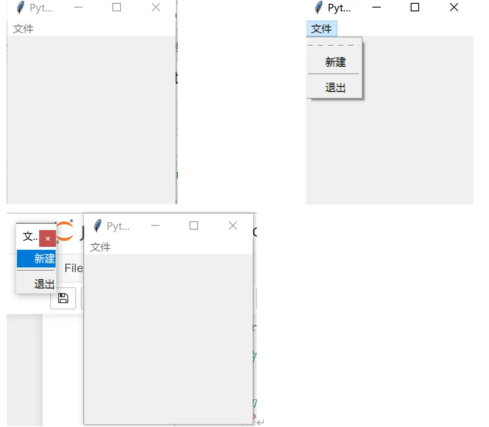

图2 默认可分离（tearoff）的菜单栏

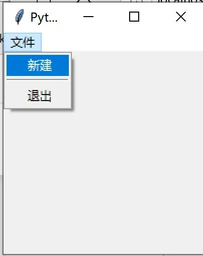

图3 tearoff=0 禁用分离

### 1.3 菜单项类型

```python
# 命令项
file_menu.add_command(label="新建")
file_menu.add_command(label="退出", command=_quit)
# 分隔线
file_menu.add_separator()
# 复选/单选菜单项（行为同 Checkbutton/Radiobutton 部件）
check = StringVar()
file_menu.add_checkbutton(label='检查', variable=check, onvalue=1, offvalue=0)
radio = StringVar()
file_menu.add_radiobutton(label='One', variable=radio, value=1)
file_menu.add_radiobutton(label='Two', variable=radio, value=2)
```

- **command**：选中时调用命令；**cascade**：挂载子菜单（`menu` 选项）；**separator**：分隔线；
- checkbutton/radiobutton 项关联变量，变量值决定标签旁是否显示选中标记；回调执行前变量与菜单项状态已更新；
- `insert(index, type, ...)` 可把项插入菜单中间（index 为 0..n-1）。

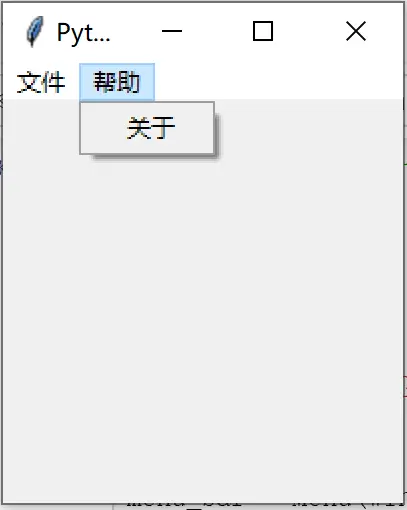

图4 添加"帮助"菜单

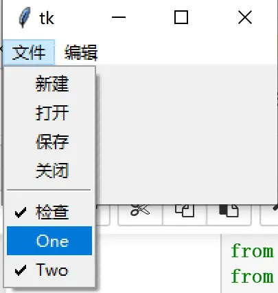

图5 含命令/分隔线/复选/单选项的完整菜单示例

### 1.4 常用菜单项选项

- `accelerator`：在菜单项旁显示加速键提示（如 "Ctrl+S"），**但不会真的创建绑定**，需自行 `bind`；
- `underline`：标签中加下划线的字符索引（0 起），供 Windows/X11 键盘跳转菜单；
- `image` + `compound`（`bottom/center/left/right/top/none`）：在标签旁显示图像或完全替换文本；
- `state`：`'disabled'` 禁用菜单项，`'normal'` 恢复。

查询/更改项选项用索引（数字或标签文本，支持 glob 模式）：

```python
print(file_menu.entrycget(0, 'label'))      # '新建'
file_menu.entryconfigure('关闭', state='disabled')
print(file_menu.entryconfigure(0))
```

### 1.5 平台菜单与退出命令

Windows 窗口左上角有系统菜单（Close/Minimize 等），Tk 中可向其追加项：

```python
sys_menu = Menu(menubar, name='系统')
menubar.add_cascade(menu=sys_menu)
```

菜单"退出"项的标准实现：

```python
def _quit():
    win.quit()       # 退出主循环
    win.destroy()    # 销毁窗口
file_menu.add_command(label="退出", command=_quit)
```

## 2 上下文菜单（Popup/右键菜单）

上下文菜单在鼠标位置弹出，用与菜单栏相同的命令创建。激活方式因平台而异：Windows/X11 是鼠标右键（`<3>`），macOS（aqua）是中键 `<2>` 或 Control+左键 `<Control-1>`。弹出位置需要**屏幕全局坐标**（事件对象的 `x_root`/`y_root`，或绑定替换符 `%X`/`%Y`），而非窗口内坐标：

```python
root = Tk()
menu = Menu(root)
for i in ('One', 'Two', 'Three'):
    menu.add_command(label=i)
if root.tk.call('tk', 'windowingsystem') == 'aqua':
    root.bind('<2>', lambda e: menu.post(e.x_root, e.y_root))
    root.bind('<Control-1>', lambda e: menu.post(e.x_root, e.y_root))
else:
    root.bind('<3>', lambda e: menu.post(e.x_root, e.y_root))
```

另一种方式是 Tcl 层的 `tk_popup`（可指定让某条菜单项居中于弹出点），弹出后释放 grab：

```python
def do_popup(self, event):
    try:
        self.popup.tk_popup(event.x_root, event.y_root, entry=0)
    finally:
        self.popup.grab_release()
```

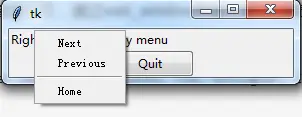

图6 tk_popup 弹出右键菜单（entry=0）

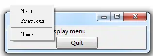

图7 entry=10 时菜单项居中于鼠标点

## 3 多窗口：Toplevel

所有 Tk 程序从根窗口 `Tk()` 开始；新顶层窗口用 `Toplevel(parent)` 创建——**无需 grid 即自动上屏**，行为与根窗口几乎一致：

```python
def create_toplevel():
    top = Toplevel()
    top.title('一个 toplevel')
    ttk.Label(top, text='这是一个顶级窗口').grid()
```

`Tk` 是全部窗口的"根"：根被销毁则所有 Toplevel 一同销毁，反之不然。销毁窗口（或任何部件）用 `destroy()`，被销毁窗口的所有子部件一同销毁。

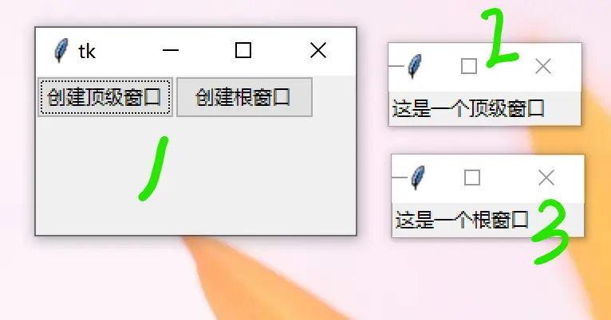

图8 Toplevel 与 Tk：关闭根窗口则子窗口同灭

两种特殊 Toplevel：

```python
transient_toplevel.transient(root)      # 临时窗口：总在父窗口之上，父最小化时隐藏
no_window_decoration.overrideredirect(1) # 去掉窗口管理器装饰：无标题栏/按钮，不可移动缩放
```

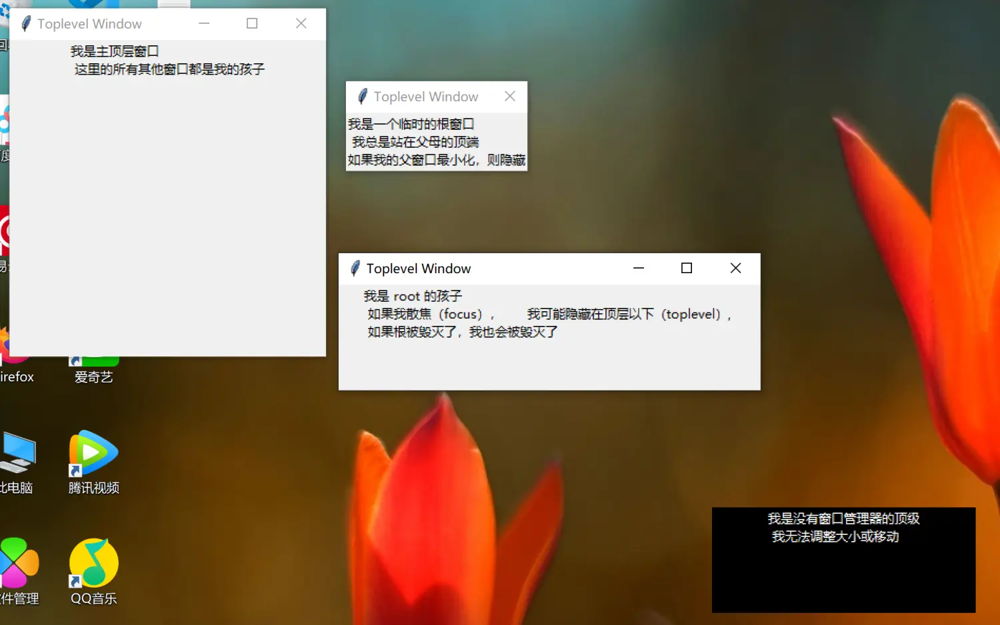

图9 普通子窗口 / transient 窗口 / overrideredirect 无装饰窗口

## 4 窗口行为、样式与属性

### 4.1 标题、几何形状与图标

```python
window.title('New title')          # 无参调用返回当前标题
window.geometry('300x200-5+40')    # 宽x高±x±y
window.iconbitmap("app.ico")       # 设置窗口图标
win["background"] = "blue"         # 背景色
```

几何字符串完整形式为 `width x height ±x±y`：`+25` 表示左边缘距屏幕左缘 25 像素，`-50` 表示右边缘距屏幕右缘 50 像素；垂直方向 `+10` 为上边缘距屏幕顶部 10 像素，`-100` 为下边缘距屏幕底部 100 像素。即 `"300x300+150+150"` 表示 300×300 大小、左上角距屏幕左上角 (150, 150)。

### 4.2 堆叠顺序（Stacking Order）

窗口重叠时，堆叠顺序靠上的遮盖靠下的。`lift()`/`lower()` 可把窗口（或同父的同级部件）升到最顶/降到最底，或相对指定窗口升降：

```python
window.lift()
window.lift(otherwin)
window.lower(otherwin)
root.tk.eval('wm stackorder ' + str(window))                      # 从低到高的堆叠列表
root.tk.eval(f'wm stackorder {window} isabove {otherwindow}')     # '1' 表示在上
```

`after(ms, callback)` 把脚本安排在未来若干毫秒执行，期间事件循环正常运转：

```python
root.after(2000, lambda: little.lift())   # 2 秒后把 little 标签提上来
```

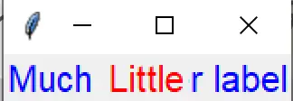

图10 同格堆叠的两个 Label，2 秒后 lift 切换前后关系

### 4.3 缩放行为与窗口状态

```python
window.resizable(False, False)   # 两个参数分别控制 宽/高 是否可拉伸
window.minsize(200, 100)         # 最小尺寸
window.maxsize(500, 500)         # 最大尺寸
```

窗口状态（`window.state()` 查询/设置）：`"normal"`、`"iconic"`（最小化）、`"withdrawn"`（隐藏）、`"zoomed"`（缩放/最大化）：

```python
window.iconify()      # 最小化（= state('iconic')）
window.deiconify()    # 从最小化/隐藏恢复（= state('normal')）
window.withdraw()     # 隐藏
```

### 4.4 attributes：透明度/工具窗/全屏/置顶

`win.attributes(option, value)` 设置窗口级属性：

| 属性 | 说明 |
| --- | --- |
| `"-alpha", value` | 透明度，取值范围 [0, 1]：0 完全透明，1 完全不透明（如 0.6） |
| `"-toolwindow", True/False` | 工具条样式：True 时只有退出按钮、无图标；False 正常窗体 |
| `"-fullscreen", True/False` | True 全屏；False 正常显示 |
| `"-topmost", 1/0` | 1 窗体置顶覆盖其他窗口；0 允许被覆盖 |

```python
win.attributes("-alpha", 0.6)
win.attributes("-toolwindow", True)
win.attributes("-fullscreen", False)
win.attributes("-topmost", True)
win.overrideredirect(False)   # True 脱离窗口管理器（无工具栏按钮）
```

### 4.5 获取窗口与屏幕信息（winfo 系列）

```python
# 屏幕大小
screen_height = win.winfo_screenheight()
screen_width = win.winfo_screenwidth()
# 窗体大小——必须先 update() 刷新才能取到更新后的值
win.update()
win_height = win.winfo_height()
win_width = win.winfo_width()
# 窗体位置：配合 <Configure> 事件，拖动窗口时持续输出
def change(event):
    win.update()
    print(win.winfo_x(), win.winfo_y())
win.bind("<Configure>", change)
```

## 5 标准对话框

Tk 内置一组模态对话框（调用后程序阻塞，直到用户提交；取消时返回空字符串/None），在 Windows/Mac 上直接调用系统原生对话框。

### 5.1 文件与目录选择（filedialog）

```python
from tkinter import filedialog
filename = filedialog.askopenfilename()    # 打开文件（File|Open...）
filename = filedialog.asksaveasfilename()  # 保存文件（File|Save As...）
dirname = filedialog.askdirectory()        # 选择目录
```

可传选项限定文件类型、默认文件名等；返回完整路径，取消返回空字符串。

### 5.2 颜色选择（colorchooser）

```python
from tkinter import colorchooser
colorchooser.askcolor(initialcolor='#ff0000')   # 返回如 '#ff62b8' 的颜色值
```

### 5.3 消息框（messagebox）

```python
from tkinter import messagebox as msg
msg.showinfo(title='信息', message='操作完成')      # 提示信息
msg.showwarning('警告', '此代码中可能存在 bug。')     # 警告
msg.showerror('错误', '我们确实有一个严重的问题！')   # 错误
msg.askquestion('询问', '是否继续？')               # 询问
msg.askyesno('安装', '确定要安装吗？', icon='question')
msg.askyesnocancel("多选框", "你确定你真的想这么做吗？")  # 返回 True/False/None
```

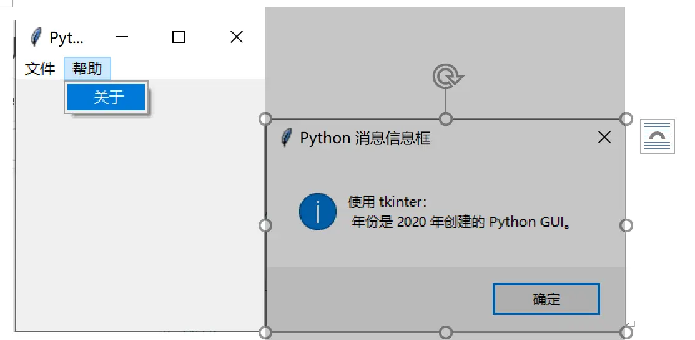

图11 showinfo 信息框

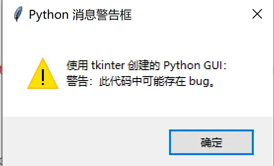

图12 showwarning 警告框

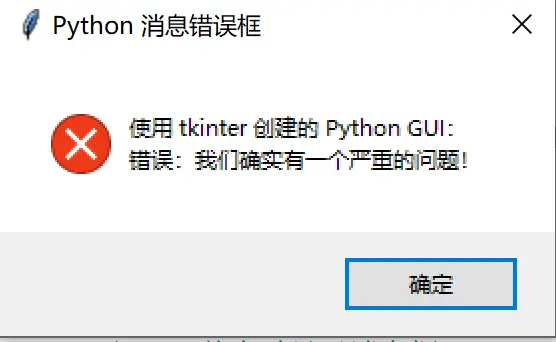

图13 showerror 错误框

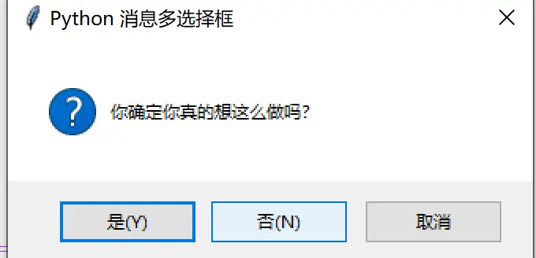

图14 askyesnocancel 多选框（是=True / 否=False / 取消=None）

tkinter 为每种对话框提供独立方法：`askokcancel`、`askquestion`、`askretrycancel`、`askyesno`、`askyesnocancel`、`showerror`、`showinfo`、`showwarning`。常用选项：`message`（主消息）、`detail`（次级消息）、`title`（标题，macOS 不用）、`icon`（`info`/`error`/`question`/`warning`）、`default`（默认按钮）、`parent`（所属窗口）。

## 延伸阅读

- [高级主题化 Widgets](04-advanced-widgets.md)：Notebook 选项卡等容器
- [事件绑定与变量联动](07-events-and-variables.md)：bind 事件与键盘加速键绑定
- [友好界面设计与 ToolTip](06-friendly-ui-tooltips.md)
- 实战：[登录窗口](../examples/01-login-window.md)、[文本编辑器](../examples/07-text-editor.md)

## 事实溯源

F-TGD-05（[信源登记](../references/sources.md)）：菜单层次结构、`*tearOff`、add_cascade/add_command/add_separator/add_checkbutton/add_radiobutton/insert、accelerator/underline/image/compound/state、entrycget/entryconfigure、Windows 系统菜单、跨平台右键绑定（aqua `<2>`/`<Control-1>` vs 其他 `<3>`）与 post(x_root, y_root)。
F-TGD-06（[信源登记](../references/sources.md)）：Toplevel 与 Tk 的区别及销毁连带关系、transient/overrideredirect、geometry 语法、wm stackorder/lift/lower、after、resizable/minsize/maxsize、state/iconify/deiconify/withdraw、filedialog/colorchooser/messagebox 全部方法与返回值。
F-TGD-27（[信源登记](../references/sources.md)）：attributes 四属性（-alpha 取值 [0,1]、-toolwindow、-fullscreen、-topmost）、iconbitmap、winfo_screenwidth/height、winfo_width/height 需先 update()、winfo_x/y 配合 `<Configure>`、tk_popup 右键菜单（参考 jb51.net 弹窗资料）。
F-TGD-23（[信源登记](../references/sources.md)）：Menu 实战创建流程、tearoff=0、quit/destroy 退出、messagebox 四种弹框实测（参考 *Python GUI Programming Cookbook, 2nd Ed.*）。