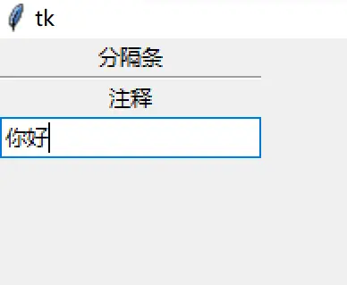
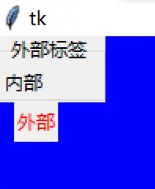
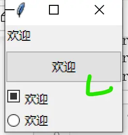
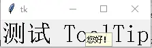
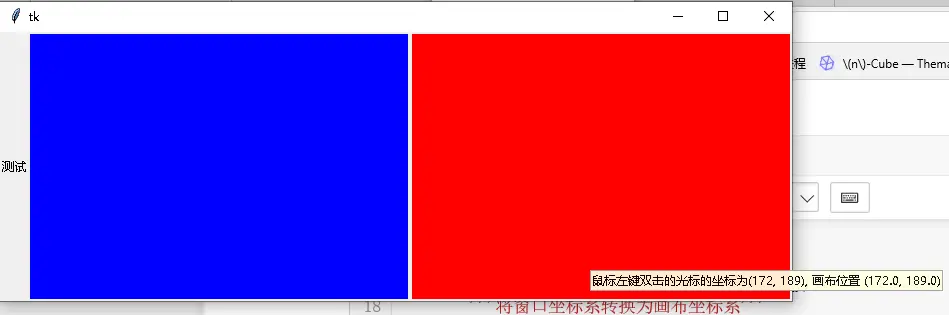
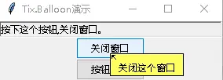

# 友好界面设计与 ToolTip 提示

> 对应信源：F-TGD-07《3.6 tkinter 之设计友好的界面》、F-TGD-15《5 tkinter 之 ToolTip 与 tix.Balloon》、F-TGD-16《5.1 tkinter 之 ToolTip 实例》。

## 1 友好界面的组织原则

大型用户界面的关键不是减少部件，而是**不让用户被复杂布局淹没**：界面可以由多个 canvas、深层嵌套 frame 组合而成，但用户感知不应复杂。设计要从用户角度出发。

- **多个窗口**：多窗口的好处是让用户一次只关注一个窗口的内容（但强制切换多个窗口也可能适得其反）；只 grid 当前任务相关的部件也能简化界面。
- **空白（White space）**：grid 让部件对齐之外，把相关部件就近放置（紧邻解释性标签），用空白与不相关部件隔开，帮助用户自行组织视觉层次。
- **分隔与分组部件**：比空白更省空间的方式是分隔线（Separator）、标签框架（Labelframe）；可调整大小的区域用窗格视窗（PanedWindow）；多页面用笔记本（Notebook）。

## 2 ttk.Separator：分隔条

在部件组之间放置水平/垂直细分隔线：

```python
s = ttk.Separator(parent, orient="vertical")   # orient: "horizontal" | "vertical"
```

```python
root = Tk()
ttk.Label(root, text="分隔条").grid()
sep = ttk.Separator(root, orient="horizontal")
sep.grid(sticky='we')          # 水平分隔条需 sticky='we' 拉满整行
ttk.Label(root, text="注释").grid()
ttk.Entry(root).grid()
```



图1 水平分隔条（sticky='we' 拉宽）

## 3 ttk.Labelframe：标签框架

标签框架（也称组框 group box）行为同普通 `ttk.Frame` 容器，但带可见边框与边框上的文本标签，直观地把一组相关部件与界面其余部分分开：

```python
lf = ttk.Labelframe(parent, text='Label')
# 内部部件以 lf 为父容器
lb = ttk.Label(lf, text='内部')
lb.grid()
lf.grid(sticky='ns', columnspan=2)
```



图2 ttk.Labelframe：框内为子部件，"外部标签"显示在边框上

## 4 ttk.PanedWindow：窗格视窗

窗格视窗把两个或多个可调整大小的部件上下/左右堆叠，用户拖动窗框（sash）即可调整各窗格相对尺寸。加入窗格视窗的通常是包含许多子部件的 Frame。

```python
p = ttk.Panedwindow(parent, orient="vertical")   # vertical：上下堆叠；horizontal：左右
f1 = ttk.Labelframe(p, text='Pane1', width=100, height=100)
f2 = ttk.Labelframe(p, text='Pane2', width=100, height=100)
p.add(f1)       # 所有窗格必须是 PanedWindow 的直接子级
p.add(f2)
```

窗格管理方法：

- `add(subwindow)`：末尾追加窗格；
- `insert(position, subwindow)`：插入到 0..n-1 位置；若窗格已受管理则移动其位置；
- `forget(subwindow)`（或 `remove`）：移除窗格，也可传位置索引；
- 可为每个窗格设置相对权重（weight），整个窗格视窗缩放时按权重分配空间。

```python
root = Tk()
panes = ttk.PanedWindow(orient='vertical')
panes.pack(fill='both', expand=1)
ws = []
for name in ['Label', 'Button', 'Checkbutton', 'Radiobutton']:
    ws.append(eval('ttk.' + name)(panes, text='欢迎'))
for widget in ws:
    panes.add(widget)
panes.forget(ws[-1])                       # 删除最后一个 pane
panes.insert(0, ttk.Label(panes, text='世界'))  # 在首位插入新 pane
```



图3 垂直 PanedWindow：窗格间的窗框可拖动调整大小

## 5 ttk.Notebook：选项卡容器（要点回顾）

Notebook 用选项卡比喻让用户在多个页面间切换：每个页面通常是一个 Frame，且必须是 Notebook 的直接子级。

```python
n = ttk.Notebook(parent)
f1 = ttk.Frame(n)
f2 = ttk.Frame(n)
n.add(f1, text='One')
n.add(f2, text='Two')
```

要点：`add` 末尾追加页面；`insert`/`forget` 插入与移除；`tabs()` 返回全部子窗口；`select()` 查询/切换当前页（传位置索引或子窗口）；`tab(tabid, option=value)` 更改选项卡文本/状态（`normal`/`disabled`/`hidden`）；**切换页面会触发 `<<NotebookTabChanged>>` 虚拟事件**。完整部件用法见 [高级主题化 Widgets](04-advanced-widgets.md)。

## 6 自定义 ToolTip 类

ToolTip（提示框）：光标悬停在部件上时弹出一个带描述性消息的小型无边框窗口。核心机制：

1. 绑定 `<Enter>`（进入）/`<Leave>`（离开）/`<ButtonPress>`（按下鼠标即取消）三个事件；
2. 进入后用 `after(timeout, showtip)` 安排计时器，悬停满 `timeout` 毫秒才显示；离开时 `after_cancel` 取消计时；
3. 提示窗口用 `Toplevel` + `overrideredirect(True)` 去掉标题栏/状态栏，`-toolwindow`/`-topmost` 保持置顶，`-alpha` 设半透明；
4. 定位：`widget.winfo_rootx()/winfo_rooty()` 取部件在屏幕上的原点，加上鼠标相对坐标与偏移量，`wm_geometry("+x+y")` 放置。

```python
class ToolTip:
    '''针对指定的 widget 创建一个 tooltip（参考 stackoverflow.com/a/36221216）'''
    def __init__(self, widget, text, timeout=500, offset=(0, -20), **kw):
        self.widget = widget
        self.text = text
        self.timeout = timeout      # 悬停 timeout 毫秒后才显示
        self.offset = offset
        self.id_after = None
        self.tipwindow = None
        self.background = 'lightyellow'
        self.widget.bind("<Enter>", self.enter)
        self.widget.bind("<Leave>", self.leave)
        self.widget.bind("<ButtonPress>", self.leave)

    def tip_window(self):
        window = Toplevel(self.widget)
        window.overrideredirect(True)              # 隐藏标题栏、状态栏
        window.attributes("-toolwindow", 1)        # 保持在主窗口上面（也可用 -topmost）
        window.attributes("-alpha", 0.92857142857) # 透明度 13/14
        x = self.widget.winfo_rootx() + self.x + self.offset[0]
        y = self.widget.winfo_rooty() + self.y + self.offset[1]
        window.wm_geometry("+%d+%d" % (x, y))
        return window

    def showtip(self):
        self.tipwindow = self.tip_window()
        label = ttk.Label(self.tipwindow, text=self.text, justify='left',
                          background=self.background, relief='solid', borderwidth=1)
        label.grid(sticky='nsew')

    def schedule(self):
        self.id_after = self.widget.after(self.timeout, self.showtip)

    def unschedule(self):
        if self.id_after:
            self.widget.after_cancel(self.id_after)
            self.id_after = None

    def hidetip(self):
        if self.tipwindow:
            self.tipwindow.destroy()
            self.tipwindow = None

    def enter(self, event):
        self.x, self.y = event.x, event.y
        self.schedule()

    def leave(self, event):
        self.unschedule()
        self.hidetip()
```

使用：`ToolTip(widget, "提示文本")` 即可。



图4 Label 悬停 500ms 后弹出浅黄底 ToolTip

## 7 ToolTip 实例：Canvas 双击显示坐标

在 Canvas 上双击左键弹出 ToolTip，显示鼠标窗口坐标与画布坐标。关键是 Canvas 带滚动时窗口坐标需经 `canvasx()`/`canvasy()` 转换为画布坐标系：

```python
class Graph(Canvas):
    def __init__(self, master, **kw):
        super().__init__(master, **kw)
        self.bind("<Double-Button-1>", self.double_button1)

    def _to_canvas_xy(self, cursor_x, cursor_y):
        '''将窗口坐标系转换为画布坐标系'''
        return self.canvasx(cursor_x), self.canvasy(cursor_y)

    def double_button1(self, event):
        new_x, new_y = self._to_canvas_xy(event.x, event.y)
        text = f"鼠标左键双击的光标的坐标为{(event.x, event.y)}, 画布位置 {(new_x, new_y)}"
        ToolTip(self, text=text)
```



图5 双击 Canvas 弹出坐标 ToolTip（蓝/红两个画布区域）

## 8 tix.Balloon：标准库气球提示

`tix` 模块提供 `Balloon` 气球部件：光标进入绑定部件时弹出描述消息，还可同时向状态条部件输出状态文本。

```python
balloon = tix.Balloon(master, statusbar=None)   # statusbar：绑定的状态条部件
balloon.bind_widget(button1,
                    balloonmsg='关闭这个窗口',      # 气球弹出消息
                    statusmsg='按下这个按钮,关闭窗口。')  # 状态条消息
```

注意：使用 tix 部件时根窗口必须用 `tix.Tk()` 而非 `tkinter.Tk()`：

```python
root = tix.Tk()
status = ttk.Label(root, width=40, relief='sunken')
b = tix.Balloon(root, statusbar=status)
b.bind_widget(button1, balloonmsg='...', statusmsg='...')
```



图6 tix.Balloon：按钮旁气球提示 + 底部 sunken 状态条消息

## 延伸阅读

- [高级主题化 Widgets](04-advanced-widgets.md)：Notebook/Treeview 等容器与列表部件
- [菜单、多窗口与标准对话框](05-menus-windows-dialogs.md)：Toplevel 无边框窗口（overrideredirect）与 after 计时
- [事件绑定与变量联动](07-events-and-variables.md)：Enter/Leave/Configure 等事件机制
- 实战：[登录窗口](../examples/01-login-window.md)

## 事实溯源

F-TGD-07（[信源登记](../references/sources.md)）：多窗口/空白设计原则、ttk.Separator（orient/sticky='we'）、ttk.Labelframe（text 标签、容器用法）、ttk.PanedWindow（add/insert/forget、窗格须为直接子级、weight）、Notebook 方法与 `<<NotebookTabChanged>>` 虚拟事件。
F-TGD-15（[信源登记](../references/sources.md)）：自定义 ToolTip 类完整实现（参考 stackoverflow.com/a/36221216，通用版见作者 GitHub tkinter_action）、tix.Balloon 构造与 bind_widget/balloonmsg/statusmsg 用法、tix.Tk() 根窗口要求（参考《用Tkinter打造GUI开发工具（17）tix.Balloon气球窗口小部件》）。
F-TGD-16（[信源登记](../references/sources.md)）：Canvas 双击 ToolTip 实例、`<Double-Button-1>` 绑定、canvasx/canvasy 窗口坐标到画布坐标转换。