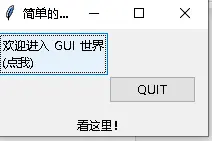
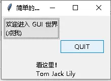
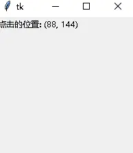
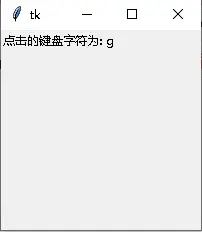
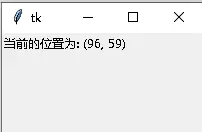

# 事件绑定与变量联动

> 对应信源：F-TGD-09《3.8 tkinter 事件绑定的参数传递》、F-TGD-10《3.9 tkinter 之事件驱动范例（更新中）》、F-TGD-31《tkinter 的不同 StringVar 之间传递值》。事件处理三概念（widgets/几何管理/事件处理）的总览见 [tkinter 基础概念](01-introduction.md)。

## 1 事件驱动机制

tkinter 提供强大的事件驱动机制：

```python
widget.bind(event, handler)   # handler 是可调用的回调函数
```

两种绑定入口：

- **`command` 配置选项**：按钮等部件专用，点击时调用，回调**不接收 event 对象**；
- **`bind(事件序列, 回调)`**：通用事件绑定，可绑在单个部件、某类全部部件、Toplevel 窗口或整个应用上；回调**接收一个 event 参数**。

## 2 command 回调与参数传递

### 2.1 绑定无参函数

直接把方法对象赋给 `command`（注意不带括号，传函数本身而非调用结果）：

```python
class App(ttk.Frame):
    def create_widgets(self):
        self.var = StringVar()
        self.hi_there = ttk.Button(self)
        self.hi_there["text"] = "欢迎进入 GUI 世界\n(点我)"
        self.hi_there["command"] = self.say_hi     # 无参回调
        self.print_label = ttk.Label(textvariable=self.var)
        self.quit = ttk.Button(self, text="QUIT")
        self.quit["command"] = self.master.destroy

    def say_hi(self):
        self.var.set("看这里！")
```

Label 通过 `textvariable=self.var` 绑定变量，回调中 `var.set(...)` 即自动刷新显示。



图1 command 绑定无参 say_hi，点击后 Label 显示"看这里！"

### 2.2 用 lambda 传递参数

`command` 不直接支持传参，借助 `lambda` 匿名函数包装：

```python
def say_hi(self, *args):
    init_str = "看这里！\n"
    out = init_str + ' '.join(args)
    self.var.set(out)

# command 方式
self.hi_there["command"] = lambda: self.say_hi('Tom', 'Jack', 'Lily')
# bind 方式（鼠标左键触发，lambda 需接收 event）
self.bind('<1>', lambda event: self.say_hi('Tom', 'Jack', 'Lily'))
```



图2 lambda 传参后 Label 显示拼接的人名

## 3 常用事件序列与事件对象

bind 回调收到的 `event` 对象携带触发信息，常用属性：`event.x`/`event.y`（鼠标相对部件的坐标）、`event.x_root`/`event.y_root`（屏幕全局坐标，右键菜单弹出用）、`event.char`（键盘字符）。

| 事件序列 | 含义 | event 常用属性 |
| --- | --- | --- |
| `<1>` / `<Button-1>` | 鼠标左键点击 | x, y, x_root, y_root |
| `<3>` / `<Button-3>` | 鼠标右键点击（上下文菜单） | x_root, y_root |
| `<Double-Button-1>` | 鼠标左键双击 | x, y |
| `<Key>` | 任意键盘按键 | char（实际字符）、keysym |
| `<Motion>` | 鼠标移动 | x, y |
| `<Enter>` / `<Leave>` | 鼠标进入/离开部件 | x, y |
| `<ButtonPress>` | 按下鼠标任意键 | — |
| `<Configure>` | 窗口/部件尺寸位置改变 | width, height, x, y |

### 3.1 鼠标按键：获取点击坐标

```python
class App(Tk):
    def __init__(self):
        super().__init__()
        self.out_var = StringVar()
        self.geometry('200x200')
        ttk.Label(textvariable=self.out_var).grid()
        self.bind('<1>', self.get_location)      # 绑定鼠标左键

    def get_location(self, event):
        self.out_var.set(f'点击的位置: {(event.x, event.y)}')
```



图3 左键点击窗口，Label 实时显示点击坐标

### 3.2 键盘按键：获取输入字符

```python
self.bind('<Key>', self.get_char)

def get_char(self, event):
    self.out_var.set(f'点击的键盘字符为: {(event.char)}')
```



图4 按键后显示 event.char（如按下 a 显示 'a'）

### 3.3 鼠标移动：追踪光标位置

```python
self.bind('<Motion>', self.stroke)

def stroke(self, event):
    self.out_var.set(f'当前的位置为: {(event.x, event.y)}')
```



图5 鼠标在窗口内移动，坐标持续刷新

## 4 变量联动：textvariable 与 trace

### 4.1 变量部件

`StringVar`/`IntVar`/`BooleanVar`/`DoubleVar` 是 Tk 变量对象：

- `var.set(value)` 写值，所有以 `textvariable=var`（或 `variable=var`）绑定的部件自动刷新；
- `var.get()` 读值；
- Checkbutton/Radiobutton 用 `variable` + `onvalue/offvalue`/`value` 联动（见 [基础 Widgets](02-basic-widgets.md)）。

### 4.2 trace：变量写追踪

`var.trace("w", callback)` 在变量被写入（write）时触发回调，可用于多个变量间同步联动。下例中 Entry 写入 `write_var`，trace 回调立即把值复制到 `read_var`，Label 随之实时更新：

```python
class App(Tk):
    def __init__(self):
        super().__init__()
        self.read_var = StringVar()
        self.write_var = StringVar()
        entry = ttk.Entry(self, textvariable=self.write_var)
        entry.pack(pady=5, padx=10)
        self.write_var.trace("w", self.callbackW)   # 写入时追踪

        lab = ttk.Label(self, textvariable=self.read_var)
        self.read_var.set("输入显示")
        lab.pack(pady=5, padx=10)

        ttk.Button(self, text="读取", command=self.hit).pack(pady=5)

    def callbackW(self, *args):
        self.read_var.set(self.write_var.get())      # write -> read 同步

    def hit(self):
        print("读取数据:", self.read_var.get())
```

`trace` 回调签名为 `callback(*args)`（Tk 传入变量名等参数，通常不使用）。模式除 `"w"`（写）外还有 `"r"`（读）、`"u"`（删除追踪/undefine）。

## 延伸阅读

- [tkinter 基础概念](01-introduction.md)：事件处理总览与 bind 层级
- [友好界面设计与 ToolTip](06-friendly-ui-tooltips.md)：Enter/Leave/after 计时实战
- [菜单、多窗口与标准对话框](05-menus-windows-dialogs.md)：右键菜单绑定与 `<Configure>` 窗口事件
- 实战：[计算器](../examples/09-calculator.md)、[Canvas 绘图工具](../examples/02-drawing-tool.md)

## 事实溯源

F-TGD-09（[信源登记](../references/sources.md)）：command 绑定无参方法、textvariable 标签联动、lambda 包装传参（command 与 bind 两种形式）、`*args` 回调签名。
F-TGD-10（[信源登记](../references/sources.md)）：`widget.bind(event, handler)` 机制、`<1>` 鼠标坐标（event.x/y）、`<Key>` 键盘字符（event.char）、`<Motion>` 鼠标移动追踪三个范例（作者标注"更新中"）。
F-TGD-31（[信源登记](../references/sources.md)）：`StringVar.trace("w", callback)` 写追踪实现 write_var 到 read_var 的实时联动、Entry textvariable 绑定。