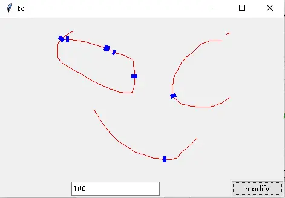
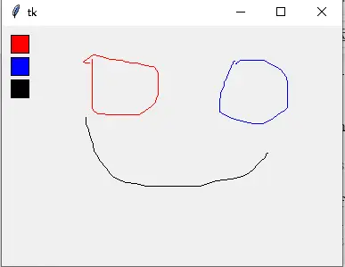
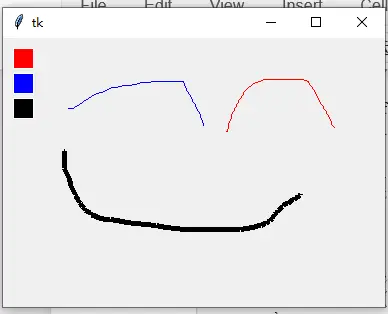
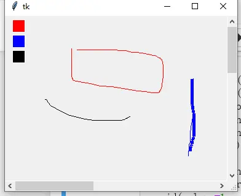
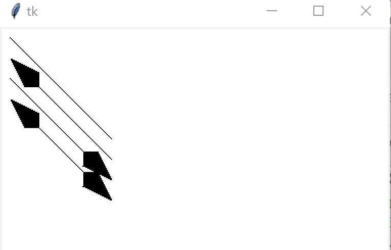
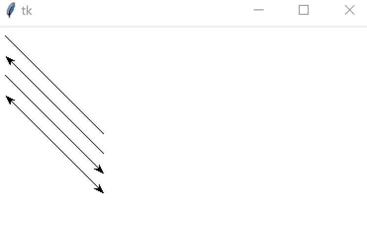
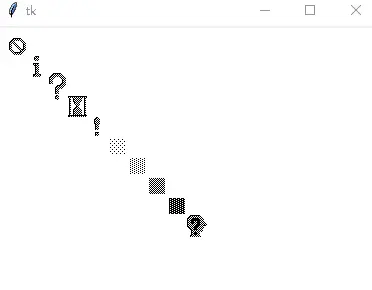
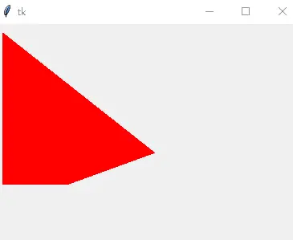
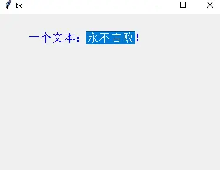
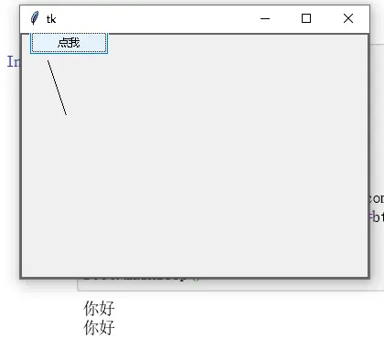

# Canvas 画布与 2D 绘图

> 对应信源：F-TGD-11《3.10 tkinter 之 Canvas》。Canvas 是经典 Tk 部件（非 ttk），管理 lines、circles、images 乃至嵌入部件等 2D 图形对象的集合。绘图实战见 [自定义画图工具](../examples/02-drawing-tool.md)、[Canvas 绘图例子集](../examples/06-canvas-examples.md)、[图形透明度](../examples/12-canvas-transparency.md)。

## 1 坐标系与创建

```python
from tkinter import Canvas
canvas = Canvas(parent)
```

Canvas 坐标系以**左上角为原点 (0, 0)**，水平向右为 x 轴正方向，垂直向下为 y 轴正方向。

## 2 线段与 item_id

`create_line` 以 `(x0, y0, x1, y1)` 形式传入起终点坐标，返回整数 `item_id` 作为该图形对象的唯一标识：

```python
item_id = canvas.create_line(10, 10, 200, 50)   # (x0,y0) 起点、(x1,y1) 终点
```

`fill` 指定画笔颜色，`width` 指定线宽。拖动鼠标左键自由画线的经典写法（`<Button-1>` 落起点，`<B1-Motion>` 拖动画段）：

```python
class Segment(Canvas):
    def __init__(self, master=None, **kw):
        super().__init__(master=master, **kw)
        self.lastx, self.lasty = 0, 0
        self.bind("<Button-1>", self.xy)        # 按下左键记录起点
        self.bind("<B1-Motion>", self.add_line) # 按住拖动连续画线

    def xy(self, event):
        self.lastx, self.lasty = event.x, event.y

    def add_line(self, event):
        self.create_line(self.lastx, self.lasty, event.x, event.y, fill='red', width=3)
        self.xy(event)
```

`itemconfigure(item_id, ...)` 可事后修改任意图形项的配置（如在输入框填入 item_id 后改色改宽）：

```python
self.segment.itemconfigure(item_id, fill='blue', width=10)
```



图1 拖动画线 + item_id 修改配置

## 3 tag_bind：给图形项绑定事件

除了 `bind` 绑定整个画布，还可用 `tag_bind` 给单个 item_id 绑定事件。下例画三个颜色块，点击即切换画笔颜色：

```python
red_id = self.create_rectangle((10, 10, 30, 30), fill="red")
blue_id = self.create_rectangle((10, 35, 30, 55), fill="blue")
black_id = self.create_rectangle((10, 60, 30, 80), fill="black")
self.tag_bind(red_id, "<Button-1>", lambda x: self.set_color("red"))
self.tag_bind(blue_id, "<Button-1>", lambda x: self.set_color("blue"))
self.tag_bind(black_id, "<Button-1>", lambda x: self.set_color("black"))
```



图2 点击调色块切换画笔颜色

## 4 Tags：图形项标记系统

用 `tags` 配置选项可为任意 item_id 打一个或多个标记，便于批量管理——例如把所有线条标记为 `"line"`，即可统一修改画笔颜色。

- 创建时打标：`create_line(..., tags='当前的线段')` 或 `tags=('调色板', f'{color}调色板')`；
- 创建后加标：`addtag(tag, 'withtag', target)`；
- 移除标记：`dtag(item, tag)`；
- 查询：`gettags(item_id)` 返回项的全部标记；`find_withtag(tag)` 返回带该标记的全部 item_id。

标记名可直接当作 item 标识用于 `itemconfigure`：

```python
self.itemconfigure('调色板', width=5)
self.dtag('all', '被选中的调色板')
self.itemconfigure('调色板', outline='white')
self.addtag('被选中的调色板', 'withtag', f"{self.color}调色板")
self.itemconfigure('被选中的调色板', outline='#999999')
```

配合 `<B1-ButtonRelease>`（释放鼠标）事件，可实现"拖动时线粗、释放后线细"的效果：

```python
self.bind('<B1-ButtonRelease>', self.done_stroke)
def done_stroke(self, event):
    self.itemconfigure('当前的线段', width=1)
```



图3 tags 批量管理：调色板选中态与线条粗细切换

## 5 图形项操作

| 方法 | 作用 |
| --- | --- |
| `delete(item)` | 删除图形项（可传 item_id 或 tag，如 `cv.delete('s1')`） |
| `coords(item, ...)` | 改变项的尺寸与位置（可变换坐标系） |
| `move(item, dx, dy)` | 平移项 |
| `scale(item, x0, y0, sx, sy)` | 以 (x0,y0) 为原点缩放，如 `scale(rt1, 0, 0, 1, 2)` 纵向放大 2 倍 |
| `tag_raise(item)` / `tag_lower(item)` | 提升/降低项的叠放层次 |
| `find_above(item)` / `find_below(item)` | 查询相邻层次的项 |

```python
rt1 = cv.create_rectangle(10, 10, 110, 110, tags=('r1', 'r2', 'r3'))
cv.tag_lower(rt3)
cv.tag_raise(rt1)
cv.itemconfig(cv.find_above(rt2), outline='red')
cv.itemconfig(cv.find_below(rt2), outline='green')
```

## 6 滚动画布

画布可以大于可视区域。`width`/`height` 决定向几何管理器请求的可视尺寸；`scrollregion`（如 `"0 0 1000 1000"`）告诉 Tk 整个画布表面有多大。滚动条通过 `xview`/`yview` 联动：

```python
self['scrollregion'] = (0, 0, 1000, 1000)
self.configure(yscrollcommand=self._v.set, xscrollcommand=self._h.set)
self._h['command'] = self.xview
self._v['command'] = self.yview
ttk.Sizegrip(root).grid(column=1, row=1, sticky=(S, E))
```

滚动后，绑定事件报告的是**屏幕坐标**，需用 `canvasx()`/`canvasy()` 转换为画布实际坐标：

```python
def xy(self, event):
    self.lastx, self.lasty = self.canvasx(event.x), self.canvasy(event.y)

def add_line(self, event):
    x, y = self.canvasx(event.x), self.canvasy(event.y)
    self.create_line((self.lastx, self.lasty, x, y), fill=color, width=5, tags='当前的线段')
```



图4 带水平/垂直滚动条与 Sizegrip 的可滚动画布

## 7 线段样式：arrow 与 joinstyle

`arrow` 控制线段端点箭头：`none`（无）、`first`（起点）、`last`（终点）、`both`（两端）；`arrowshape` 用三元组（如 `'40 30 10'`）控制箭头形状；`joinstyle` 控制折线连接处样式（`bevel`/`miter`/`round`）：

```python
for i, arrow in enumerate(['none', 'first', 'last', 'both']):
    cv.create_line((10, 10+i*20, 110, 110+i*20), arrow=arrow, arrowshape='40 30 10')

for i, (arrow, join) in enumerate([('none', 'bevel'), ('first', 'miter'),
                                   ('last', 'round'), ('both', 'round')]):
    cv.create_line((10, 10+i*20, 110, 110+i*20),
                   arrow=arrow, arrowshape='8 10 3', joinstyle=join)
```



图5 四种 arrow 箭头样式



图6 arrowshape 与 joinstyle（bevel/miter/round）对比

## 8 其他图形对象

Canvas 除 line/rectangle 外，还支持 oval（椭圆）、arc（弧形）、polygon（多边形）、bitmap（位图）、image（图片）、text（文本），以及用 `create_window` 嵌入任意部件。

**位图**（内置 bitmap 名）：

```python
for k, name in enumerate(('error', 'info', 'question', 'hourglass',
                          'warning', 'gray12', 'gray25', 'gray50', 'gray75', 'questhead')):
    self.create_bitmap([20*(k+1)]*2, bitmap=name)
```



图7 内置位图绘制

**多边形**（顶点坐标序列）：

```python
points = (10, 10), (10, 200), (90, 200), (200, 160)
self.create_polygon(points, fill='red')
```



图8 create_polygon 填充多边形

**文本**（anchor 锚点、font、fill；select_from/select_to 选中区间）：

```python
text = self.create_text((50, 50), text='一个文本：永不言败！',
                        anchor='sw', fill='blue', font='italic 15')
self.select_from(text, 5)
self.select_to(text, 8)
```



图9 create_text 画布文本

**嵌入部件**（`create_window` 把真实 widget 放进画布）：

```python
bt = ttk.Button(self, text='点我', command=lambda: print("你好"))
self.create_window((10, 10), window=bt, anchor='w')
self.create_line(30, 30, 50, 90)
```



图10 create_window 在画布中嵌入 Button 部件

## 延伸阅读

- [高级主题化 Widgets](04-advanced-widgets.md)：Treeview/Notebook 等复杂部件
- [事件绑定与变量联动](07-events-and-variables.md)：Button-1/B1-Motion 事件序列
- [友好界面设计与 ToolTip](06-friendly-ui-tooltips.md)：canvasx/canvasy 坐标转换的 ToolTip 实例
- 实战：[画图工具](../examples/02-drawing-tool.md)、[图形操作案例](../examples/03-graphics-ops.md)、[鼠标选色与形状](../examples/08-color-shape-selector.md)、[Matplotlib 嵌入](../examples/11-embed-matplotlib.md)

## 事实溯源

F-TGD-11（[信源登记](../references/sources.md)）：Canvas 坐标系（左上角 (0,0)、x 右 y 下）、create_line 参数 (x0,y0,x1,y1) 与 item_id 返回值、itemconfigure、tag_bind 图形项事件、tags/addtag/dtag/gettags/find_withtag 标记系统、delete/coords/move/scale/tag_raise/tag_lower/find_above/find_below、scrollregion 与 xview/yview、canvasx/canvasy 坐标转换、arrow/arrowshape/joinstyle、create_bitmap/create_polygon/create_text/select_from/select_to/create_window 全部绘图方法。