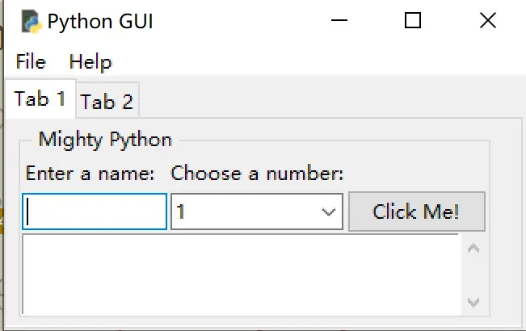
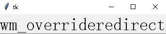

# 界面样式、MVC 架构与参考资源

> 对应信源：F-TGD-14《4 tkinter 常用函数与工具（更新中）》、F-TGD-24《8.2 系统化学习 tkinter 之界面外观（待更）》、F-TGD-26《10 tkinter 实用小技巧》、F-TGD-29《GUI 参考资料》，并结合 F-TGD-25 文本编辑器中的样式实践。

## 1 MVC 架构模式

大型 GUI 程序建议按 Model-View-Controller 模式划分：

- **Model（模型）**：保存应用程序数据；
- **View（视图）**：显示数据的界面；
- **Controller（控制器）**：处理用户事件，把视图与模型连接起来。

tkinter 中典型落地方式：用 `StringVar`/`IntVar` 等变量对象承载 Model 状态（变量即模型），ttk/tk 部件构成 View，`command` 回调与 `bind`/`trace` 处理器构成 Controller。本知识包实战篇中的编辑器、计算器均采用类继承组织（`class App(Tk)` / `class WindowMeta(Tk)`），把部件创建（`create_widgets`）、布局（`layout`）、事件回调分方法管理。

## 2 窗口图标

### 2.1 iconbitmap：加载 .ico

```python
win.iconbitmap('pyc.ico')
```



图1 iconbitmap 更改主根窗口图标

### 2.2 iconphoto + PIL：支持 JPG/PNG

`tkinter.PhotoImage` 原生只支持 GIF/PNG（不支持 JPG），需要借助 PIL 的 `ImageTk.PhotoImage`：

```python
from tkinter import Tk
from PIL import ImageTk, Image

root = Tk()
root.geometry('327x272')
im = Image.open('images/test.jpg')
root.iconphoto(False, ImageTk.PhotoImage(im))
root.mainloop()
```

`iconphoto` 第一个参数：`False` 表示图标仅用于当前窗口；`True` 表示该图标同时应用于以后创建的所有 Toplevel 窗口。

## 3 overrideredirect 的平台差异

`wm_overrideredirect`（别名 `overrideredirect`）参数为 1/True 时让窗口管理器忽略该窗体：视觉上整个边框消失（无最小化/最大化/关闭按钮、不可拖动），Windows 任务栏上也不显示该程序；但 **Alt+F4 关闭仍然有效**。传 `None` 可查询当前状态。

平台差异：**仅 Windows 平台有效；Ubuntu 桌面下函数可正常运行但无实际效果**。

```python
root.wm_overrideredirect(0)   # 默认状态：普通窗体
root.wm_overrideredirect(1)   # 无边框、无任务栏图标
```



图2 默认状态窗体（带标题栏与任务栏按钮）


图3 overrideredirect(1)：标题栏与任务栏图标全部消失

## 4 ttk.Style 与界面外观（Look and Feel）

ttk 部件的外观通过 `ttk.Style` 集中配置，而非逐部件设颜色：

```python
style = ttk.Style()
style.configure('TFrame', background='light sea green')   # 配置 Frame 类样式
```

文本编辑器实战中还演示了**配色方案切换**：用字典维护多套 `前景色.背景色`，菜单选择后拆分并应用到 Text 部件：

```python
color_schemes = {
    'Default': '#000000.#FFFFFF',
    'Night Mode': '#FFFFFF.#000000',
    'Cobalt Blue': '#ffffBB.#3333aa',
    # ...
}
foreground_color, background_color = fg_bg_colors.split('.')
content_text.config(background=background_color, fg=foreground_color)
```

经典部件（Text/Canvas/Menu 等）直接用 `background`/`fg`/`foreground` 等配置选项改色；主题部件（ttk.*）用 Style。源稿 F-TGD-24 为作者标注"待更"的界面外观专题，本知识包据实登记现状。

## 5 参考资源

作者登记的 GUI 参考资料（F-TGD-29）：

- **Tkinter 8.5 reference: a GUI for Python**——Tkinter 8.5 参考手册（含鼠标指针等章节）；
- **Python GTK+ 3 Tutorial**——GTK+ 3 Python 教程；
- **PyGObject**——Python 访问 GObject/GTK 的绑定库；
- **TKDocs**——本知识包概念篇多处对照的跨语言 Tk 官方教程（入口见[参考资料索引](../references/index.md)）。

## 延伸阅读

- [菜单、多窗口与标准对话框](05-menus-windows-dialogs.md)：窗口 attributes 与 overrideredirect 基础
- [Text 多行文本部件](08-text-widget.md)：编辑器配色方案的 Text 侧实现
- [tkinter 基础概念](01-introduction.md)：ttk 主题部件与经典部件的区别
- 实战：[文本编辑器](../examples/07-text-editor.md)、[Matplotlib 嵌入](../examples/11-embed-matplotlib.md)

## 事实溯源

F-TGD-26（[信源登记](../references/sources.md)）：MVC 三组件划分、tkinter.PhotoImage 不支持 JPG 需 PIL.ImageTk.PhotoImage、iconphoto(False/True) 的图标传播语义。
F-TGD-14（[信源登记](../references/sources.md)）：wm_overrideredirect 参数语义、Windows 视觉效果（边框消失/任务栏隐藏/Alt+F4 仍有效）、Ubuntu 桌面无效的平台差异、wm_overrideredirect 别名（作者标注"更新中"）。
F-TGD-24（[信源登记](../references/sources.md)）：iconbitmap 更改主窗口图标（作者标注"待更"）。
F-TGD-29（[信源登记](../references/sources.md)）：Tkinter 8.5 reference、Python GTK+ 3 Tutorial、PyGObject 参考资料清单。
F-TGD-25（[信源登记](../references/sources.md)）：ttk.Style().configure 部件样式配置、配色方案字典与 Text 换肤实践。