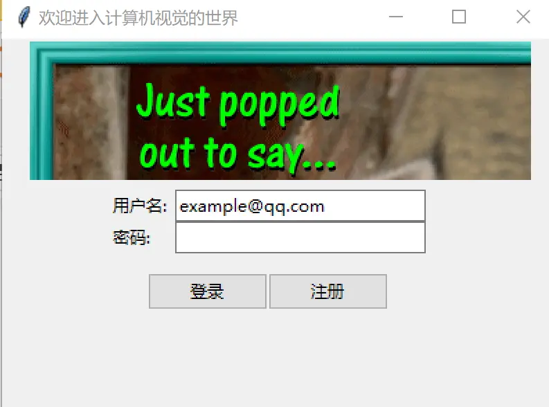
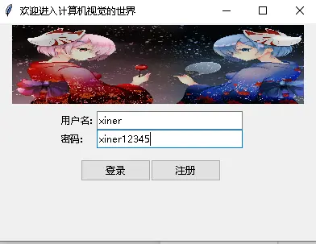

# 实战：登录/注册窗口

> 对应信源：F-TGD-13《3.12 创建登录窗口》。实现一个带顶部欢迎图、用户名/密码输入、注册与登录反馈的窗口。相关部件用法见 [基础 Widgets](../concepts/02-basic-widgets.md)，变量机制见 [事件绑定与变量联动](../concepts/07-events-and-variables.md)。

## 1 界面效果



图1 登录界面初设（顶部欢迎图 + 用户名/密码输入 + 登录/注册按钮）

## 2 窗口布局与部件构建

整体继承 `Tk`，顶部用 Canvas + PIL 加载欢迎图（`create_image` 锚定 nw），中部两个 Frame 分组用户信息与操作按钮：

```python
from tkinter import ttk, Tk, StringVar, Canvas, messagebox
from PIL import ImageTk, Image

class HelloWindow(Tk):
    def __init__(self, hello_image='images/leimu.jpg'):
        super().__init__()
        self.title('欢迎进入计算机视觉的世界')
        self.geometry('400x270')   # 默认窗口大小
        self.maxsize(400, 300)     # 限制窗口大小
        self._hello_image(hello_image)
        self._set_variable()
        self.create_widgets()
        self._layout()
        # 鼠标进入密码框显示明文，离开恢复 '*'
        self.entry_usr_pwd.bind(
            '<Enter>', lambda e: self.entry_usr_pwd.config(show=''))
        self.entry_usr_pwd.bind(
            '<Leave>', lambda e: self.entry_usr_pwd.config(show='*'))

    def _hello_image(self, hello_image):
        self.I = Image.open(hello_image).resize((380, 100))
        self.canvas = Canvas(height=100, width=380)
        self.image_file = ImageTk.PhotoImage(self.I)
        self.canvas.create_image(20, 0, anchor='nw', image=self.image_file)

    def _set_variable(self):
        self.var_usr_name = StringVar()   # 用户名变量
        self.var_usr_pwd = StringVar()    # 密码变量

    def create_widgets(self):
        self.frame_usr = ttk.Frame()      # 用户信息框架
        self.frame_act = ttk.Frame()      # 用户行为框架
        self.label_usr_name = ttk.Label(self.frame_usr, text='用户名: ')
        self.entry_usr_name = ttk.Entry(
            self.frame_usr, textvariable=self.var_usr_name, width=25)
        self.label_usr_pwd = ttk.Label(self.frame_usr, text='密码: ')
        self.entry_usr_pwd = ttk.Entry(
            self.frame_usr, textvariable=self.var_usr_pwd, show='*', width=25)
        self.button_login = ttk.Button(
            self.frame_act, text='登录', command=self.usr_login)
        self.button_sign_up = ttk.Button(
            self.frame_act, text='注册', command=self.usr_sign_up)

    def _layout(self):
        self.canvas.grid(row=0, column=0, sticky='we')
        self.frame_usr.grid(row=1, column=0, sticky='ns', padx=5, pady=5, ipady=2)
        self.frame_act.grid(row=2, column=0, sticky='ns', padx=5, pady=5)
        self.label_usr_name.grid(row=0, column=0, sticky='we')
        self.entry_usr_name.grid(row=0, column=1, sticky='we')
        self.label_usr_pwd.grid(row=1, column=0, sticky='we')
        self.entry_usr_pwd.grid(row=1, column=1, sticky='we')
        self.button_login.grid(row=0, column=0, sticky='we')
        self.button_sign_up.grid(row=0, column=1, sticky='we')
```

要点：

- 密码框 `show='*'` 密文显示；绑定 `<Enter>`/`<Leave>` 事件，光标进入时 `show=''` 显示明文、离开恢复 `'*'`；
- 欢迎图经 PIL resize 后用 `ImageTk.PhotoImage` 载入（tkinter 原生 PhotoImage 不支持 JPG，见 [样式与架构技巧](../concepts/10-styles-mvc-resources.md)）；
- 图片对象必须保持引用（`self.image_file`），否则会被垃圾回收导致画布空白。

## 3 注册行为与校验

简单注册机制：用户名/密码首字符必须为字母；用户名长度 > 2；密码长度 > 6；用户名不重复。通过后写入 `users_info.json`：

```python
import json

def test_user_name(self, user_name):
    if user_name and user_name[0].isalpha() and len(user_name) > 2:
        return True

def test_user_pwd(self, user_pwd):
    if user_pwd and user_pwd[0].isalpha() and len(user_pwd) > 6:
        return True

def write_user_info(self, new_user_info, users_info):
    users_info.update(new_user_info)
    with open('users_info.json', 'w', encoding='utf-8') as fp:
        json.dump(users_info, fp)

def load_users_info(self):
    try:
        with open('users_info.json', 'r', encoding='utf-8') as fp:
            users_info = json.load(fp)
    except FileNotFoundError:
        users_info = {}
    return users_info

def usr_sign_up(self):
    user_name = self.entry_usr_name.get()
    user_pwd = self.entry_usr_pwd.get()
    users_info = self.load_users_info()
    cond = user_name not in users_info
    cond1 = self.test_user_name(user_name) and self.test_user_pwd(user_pwd)
    if cond and cond1:
        self.write_user_info(users_info, {user_name: user_pwd})
        messagebox.showinfo('', "注册成功！")
    else:
        messagebox.showerror('注册失败！', "请检查您的输入")
```

## 4 登录行为

从 Entry 取值，与 JSON 中已登记账号比对（集合包含判断），成功/失败分别弹消息框：

```python
def usr_login(self):
    user_name = self.entry_usr_name.get()
    user_pwd = self.entry_usr_pwd.get()
    users_info = self.load_users_info()
    user_info = {user_name: user_pwd}
    cond = set(user_info.items()) < set(users_info.items())
    if cond:
        messagebox.showinfo('', "登录成功！")
    else:
        messagebox.showerror('登录失败！', "请检查您的输入")
```



图2 完成后的登录界面（注册/登录结果通过 messagebox 反馈）

## 知识点回顾

- Canvas `create_image` + PIL 载入 JPG 欢迎横幅；
- Entry `show='*'` 密码框与 `<Enter>`/`<Leave>` 明文切换；
- StringVar 与 textvariable 取值；
- `json.load/dump` 实现用户信息文件持久化，FileNotFoundError 兜底；
- messagebox showinfo/showerror 反馈操作结果。

## 事实溯源

F-TGD-13（[信源登记](../references/sources.md)）：登录窗口全部代码与截图，含 Canvas+PIL 欢迎图、show='*' 与 Enter/Leave 切换、注册校验规则（首字符字母/长度限制）、users_info.json 读写、登录集合比对。