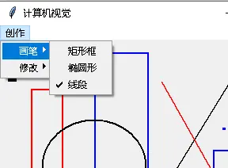
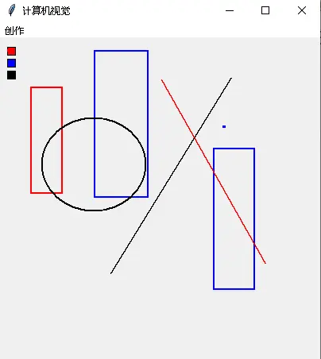
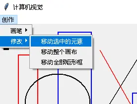
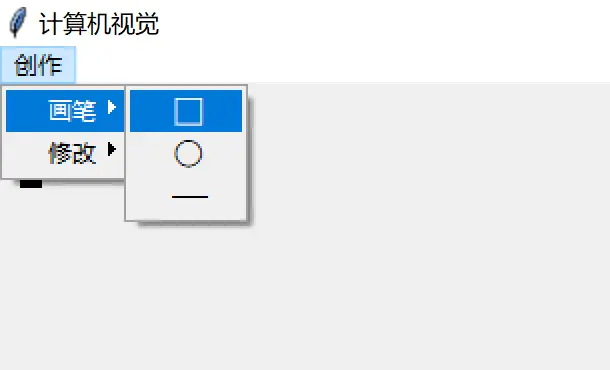
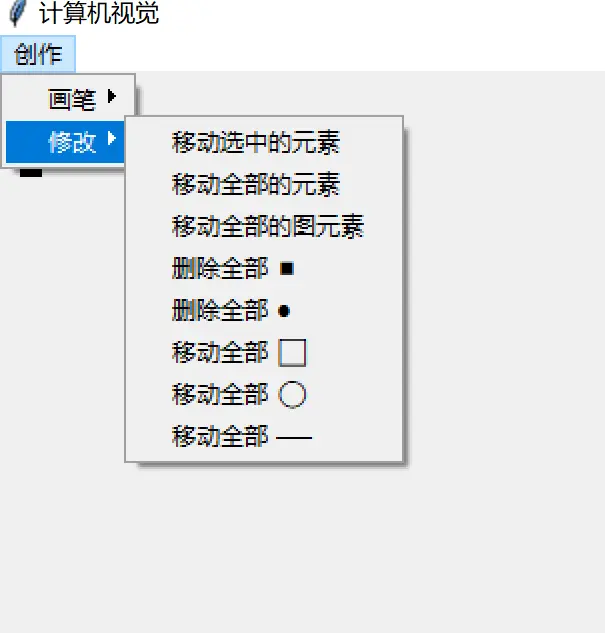
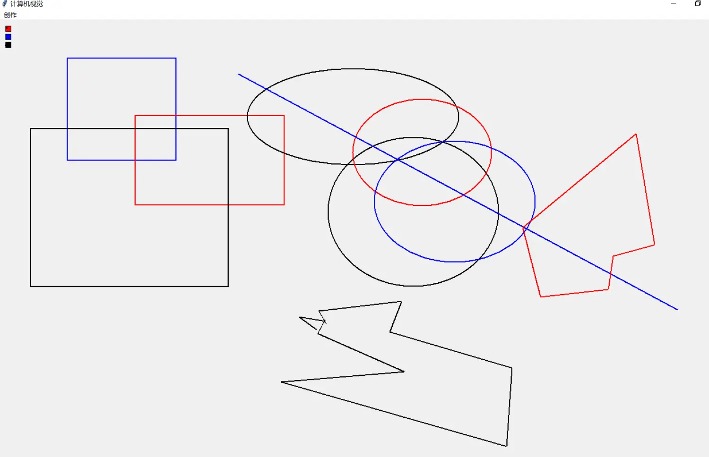

# 实战：自定义画图工具

> 对应信源：F-TGD-17《6 tkinter 自定义画图工具》。在 [Canvas 画布](../concepts/09-canvas.md) 概念基础上，构建一个支持矩形框/椭圆形/线段绘制、调色板选色、元素移动的完整画图工具。增强版见 [图形操作案例](03-graphics-ops.md)。


图0 画图工具目标效果

## 1 整体架构

`Graph(Canvas)` 类封装全部能力：菜单栏（"创作 > 画笔/修改"）用 `add_radiobutton` 挂在同一个 `graph_var`（StringVar）上，选择菜单即触发 `bind_graph` 切换画布的事件绑定模式；画布左上角用三个色块做调色板。

```python
class Graph(Canvas):
    '''创建图形元素：矩形框、椭圆形、线段；点用矩形/椭圆的最小外接框表示'''
    def __init__(self, master=None, cnf={}, **kw):
        super().__init__(master, cnf, **kw)
        self.master = master
        self.master.title('计算机视觉')
        self._init_params()
        self.create_menu()
        self.change()        # 调色板

    def _init_params(self):
        self.configure(width=400, height=400)
        self.current_id = None
        self.x = self.y = 0
        self.color = 'blue'   # graph 对象颜色
        self.width = 2        # graph 线宽
        self.graph_var = StringVar()
```

## 2 菜单与模式切换

```python
def create_menu(self):
    self.master.option_add('*tearOff', False)
    menu_bar = Menu(self.master)
    self.master['menu'] = menu_bar
    painter_bar = Menu(menu_bar)
    pencil_menu = Menu(painter_bar)
    modify_menu = Menu(painter_bar)
    menu_bar.add_cascade(label='创作', menu=painter_bar)
    painter_bar.add_cascade(label='画笔', menu=pencil_menu)
    painter_bar.add_cascade(label='修改', menu=modify_menu)
    kw_menu = {'variable': self.graph_var, 'command': self.bind_graph}
    for pencil in ('矩形框', '椭圆形', '线段'):
        pencil_menu.add_radiobutton(label=pencil, **kw_menu)
    for modify in ('移动选中的元素', '移动整个画布', '移动全部矩形框'):
        modify_menu.add_radiobutton(label=modify, **kw_menu)
```

核心设计——**工具切换即重绑事件**：每次切换先 `unbind` 旧回调，再按当前工具 `bind` 新回调。绘制模式绑 `<1>`（记录起点）+ `<ButtonRelease-1>`（按 bbox 成图）；移动模式绑 `<1>`（选中）+ 释放（位移）：

```python
def bind_graph(self, event=None):
    graph = self.graph_var.get()
    self.unbind('<ButtonRelease-1>')
    self.unbind('<1>')
    if '移动' in graph:
        self.bind('<1>', self.select_graph)
        self.bind('<ButtonRelease-1>', self.move_graph)
    else:
        self.bind('<1>', self.update_xy)
        self.bind("<ButtonRelease-1>", self.draw_graph)
```



图1 "画笔"菜单：矩形框/椭圆形/线段三选一

## 3 绘制：bbox 与 tags 分类

按下左键记录起点，拖动到释放时取 bbox（起点 + 当前点），按所选画笔成图，并打上分类 tag（rect/oval/line）：

```python
def update_xy(self, event):
    self.x, self.y = event.x, event.y

def get_bbox(self, event):
    return self.x, self.y, event.x, event.y     # x0,y0,x1,y1

def draw_graph(self, event):
    self.configure(cursor="arrow")
    self.create_graph(self.get_bbox(event))

def create_graph(self, bbox):
    kw = {'width': self.width, 'tags': 'graph'}
    graph = self.graph_var.get()
    if graph == '矩形框':
        self.create_rectangle(bbox, outline=self.color, **kw)
        self.addtag_withtag('rect', 'graph')
    elif graph == '椭圆形':      # bbox 为外接矩形四角坐标
        self.create_oval(bbox, outline=self.color, **kw)
        self.addtag_withtag('oval', 'graph')
    elif graph == '线段':
        self.create_line(bbox, fill=self.color, **kw)
        self.addtag_withtag('line', 'graph')
```



图2 拖动画出的多种图形（bbox 即鼠标拖动的方向向量）

## 4 调色板：tag_bind 选色

三个色块矩形各自 `tag_bind` 左键点击切换颜色：

```python
def palette(self, loc, color):
    return self.create_rectangle(loc, fill=color,
                                 tags=('调色板', f'{color}调色板'))

def change(self):
    red_id = self.palette((10, 10, 20, 20), "red")
    blue_id = self.palette((10, 25, 20, 35), "blue")
    black_id = self.palette((10, 40, 20, 50), "black")
    self.addtag('被选中的调色板', 'withtag', black_id)
    self.tag_bind(red_id, "<Button-1>", lambda x: self.set_color("red"))
    self.tag_bind(blue_id, "<Button-1>", lambda x: self.set_color("blue"))
    self.tag_bind(black_id, "<Button-1>", lambda x: self.set_color("black"))

def set_color(self, new_color):
    self.color = new_color
```

## 5 选中与移动

选中靠特殊 tag `'current'`（鼠标当前指向的图形项），位移量 = 释放点 − 起点，`move(tag/id, dx, dy)` 支持按 tag 批量移动：

```python
def select_graph(self, event):
    self.configure(cursor="target")
    self.update_xy(event)
    self.current_id = self.find_withtag('current')   # 当前指向的对象 id

def move_graph(self, event):
    x_move = event.x - self.x
    y_move = event.y - self.y
    self.move(self.current_id, x_move, y_move)
```



图3 "修改"菜单：移动选中元素（cursor 变为 target）

## 6 优化：UTF-8 符号画笔与"点"分离

Tcl 支持 `⬜ ⚪ ⸺ ⯀ ●` 等 UTF-8 几何符号（参考维基百科 *Geometric Shapes* 与 FileFormat.Info 的 *Symbol, Other* 字符表），可用作菜单标签让画笔选择更直观：

```python
pencil_options = ('⬜', '⚪', '⸺', '⯀', '●')   # 矩形/椭圆/线段/方点/圆点
```

"点"的判定：起点终点重合（`start == end`）时打 `rect_point`/`oval_point` 标签与普通形状分离，从而支持按 tag 单独移动全部点：

```python
def create_graph(self, bbox):
    start, end = bbox[:2], bbox[2:]
    tags = {'graph'}
    graph = self.graph_var.get()
    if start == end:
        if graph == '⯀':
            tags.add('rect_point')
            self.create_rectangle(bbox, outline=self.color, tags=tuple(tags), width=self.width)
        elif graph == '●':
            tags.add('oval_point')
            self.create_oval(bbox, outline=self.color, tags=tuple(tags), width=self.width)
    elif graph == '⬜':
        tags.add('rect')
        self.create_rectangle(bbox, outline=self.color, tags=tuple(tags), width=self.width)
    # ⚪ / ⸺ 同理...
```

移动菜单项相应扩展为按 tag 移动（`'all'` 移动全部、`'rect'` 全部矩形、`'rect_point'` 全部方点……）：

```python
elif graph == '移动全部 ⚪':
    self.bind('<1>', self.select_graph)
    self.bind('<ButtonRelease-1>',
              lambda e: self.move_graph(e, 'oval'))
```



图4 UTF-8 符号"画笔"菜单



图5 扩展后的"修改"菜单（按类型/点批量移动）



图6 用"线段"画笔连画可拼出多边形轮廓

## 知识点回顾

- 菜单 radiobutton + StringVar 实现工具选择，`command` 回调中 unbind/bind 切换交互模式；
- 拖拽成图三段式：`<1>` 记起点 → 拖动 → `<ButtonRelease-1>` 按 bbox 成图；
- `find_withtag('current')` 获取鼠标指向项；`move(tag, dx, dy)` 按 id 或 tag 位移；
- 多级 tag 分类（graph > rect/oval/line > rect_point/oval_point）支撑批量操作；
- Tcl/Tk 原生支持 UTF-8 符号，可直接用作菜单标签。

## 事实溯源

F-TGD-17（[信源登记](../references/sources.md)）：画图工具三版迭代代码与全部截图——菜单结构与 tearOff、调色板 tag_bind、bbox 拖拽成图、find_withtag('current') 选中、move 位移、UTF-8 符号画笔（参考 Wikipedia Geometric Shapes / FileFormat.Info）、点与形状的 tag 分离；作者注明更健壮版本见图形操作案例。