# 实战：图形操作案例（graph-tensor 像素建模）

> 对应信源：F-TGD-18《6.1 基于 tkinter 开发图形操作案例》。本案例是作者开源的 TensorAtom/Graph 项目（`pip install graph-tensor`，`import graph_tensor`）的设计手册，在 [Canvas 画布](../concepts/09-canvas.md) 概念之上，用"点动成线、线动成面"的像素建模思想统一矩形、椭圆、扇形、线段与点，并完成鼠标交互作画。代码中 `Meta`（`graph_tensor.graph.atom.Meta`）是作者对 `Canvas` 的封装子类，`draw_graph(direction, graph_type, color, ...)` 是其统一绘图入口。

## 1 设计基础：点、有向线段与像素

数学中用向量 `x = (x_0, x_1, …, x_{n-1}) ∈ ℝ^n` 描述空间中的一个**点**（●）；用向量减法 `c = a − b` 表示一条**有向线段**，即 `c` 是由点 `b` 指向点 `a` 的有向线段。考虑计算机的离散特性，连续的"点"无法获取，于是转向用小方块 ■ 表示"点"——即图像的像素点。■ 以不同方式组合排列，便得到线段、矩形框、椭圆、圆锥等图案。

tkinter Canvas 的坐标系可看作左手系的二维版本：**水平向右为 x 轴正方向，竖直向下为 y 轴正方向**。为定制统一化的图形元素，指定有向线段 `direction = (x_0, y_0, x_1, y_1)` 为全部图形元素的基本属性，其中 `(x_0, y_0)` 为起点、`(x_1, y_1)` 为终点。

## 2 统一绘图入口 Meta.draw_graph

`Meta` 在同一 `direction` 下绘制矩形、椭圆、扇形、线段，可以观察到四类图形共享同一中心——`direction` 本质上是它们共同的方向向量：

```python
from graph_tensor.graph.atom import Meta

def test_meta(direction=(20, 20, 220, 300)):
    from tkinter import Tk
    root = Tk()
    self = Meta(root, width=250, height=400, background='white')
    self.draw_graph(direction, 'Rectangle', 'blue', line_width=10)
    self.draw_graph(direction, 'Oval', 'red', line_width=10)
    self.draw_graph(direction, 'Arc', 'green', line_width=10, arc_style='pieslice')
    self.draw_graph(direction, 'Line', 'black', line_width=10)
    self.layout()
    root.mainloop()

test_meta()
```

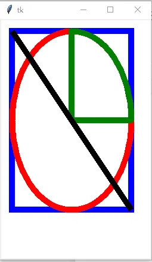

图1 常见的图形元素（红椭圆、绿扇形、蓝矩形、黑线段同中心）

`Meta` 没有直接提供画多边形的方法，但多边形可由线段组合得到。`point2polygon` 将点列转换为首尾相接的线段序列（最后一条边由末点连回首点），`draw_polygon` 逐条绘制；需要内部填充时直接用原生 `create_polygon`：

```python
def point2polygon(points):
    '''将点列转换为首尾相接的线段'''
    directions = []
    for start, end in zip(points, points[1:]):
        directions.append((*start, *end))
    directions.append((*points[-1], *points[0]))
    return directions

def draw_polygon(meta, *directions):
    '''画出多边形'''
    for direct in directions:
        meta.draw_graph(direct, 'Line', 'black', fill='red', line_width=5)

root = Tk()
self = Meta(root, width=250, height=400, background='white')
points = [(20, 20), (30, 50), (100, 250), (250, 340), (220, 230)]
directions = point2polygon(points)
draw_polygon(self, *directions)
self.layout()
root.mainloop()
# 填充多边形：self.create_polygon(points, fill='red')
```

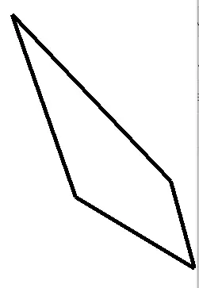

图2 点列首尾相接画出多边形

虚线图形通过 `dash` 参数指定（虚线模式）：

```python
def test_meta_dash(direction=(20, 20, 220, 300)):
    from tkinter import Tk
    root = Tk()
    self = Meta(root, width=250, height=400, background='white')
    self.draw_graph(direction, 'Rectangle', 'blue', line_width=10, dash=5)
    self.layout()
    root.mainloop()

test_meta_dash()
```

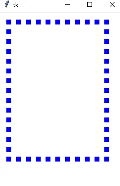

图3 Meta 画虚线示例

## 3 张量视角

Canvas 没有提供直接画点的方法，需要自定义。先回顾数学中"点"（向量/张量）在笛卡尔积中的定义——即多维数组 `x = (x_0, x_1, x_2, …, x_{n-1})`，分量可用下标索引（如 `x_3 = x[3]`）。一般地，张量有模长和方向：模长记作 `||x||`（即范数），方向用方向角 `θ = (θ_0, θ_1, θ_2, …, θ_{n-1})` 表示，其中 `θ_j ∈ (−π, π)`。于是张量也可表示为 `x = θ·||x||`。

Canvas 的 Line（有向线段）可定义为从起点 `a` 到终点 `b` 的张量之差 `b − a`。

## 4 线动成面：line_width 堆叠验证

用 `line_width` 参数验证"线动成面"：把线宽为 `line_width` 的粗线，与同方向堆叠 `line_width` 条线宽为 1 的细线对比，二者应等宽等高。

```python
class Line:
    def __init__(self, start_point, end_point, line_width=5):
        self.start_point = start_point
        self.end_point = end_point
        self.line_width = line_width

    def run(self):
        from tkinter import Tk
        root = Tk()
        direction = (*self.start_point, *self.end_point)
        meta = Meta(root, width=200, height=200, background='blue')
        meta.draw_graph(direction, 'Line', 'white', line_width=1)
        direction1 = list(direction)
        direction1[0] += 20
        direction1[2] += 20
        meta.draw_graph(direction1, 'Line', 'red', line_width=self.line_width)
        [meta.draw_graph((direction[0]+40+k, direction[1], direction[2]+40+k, direction[3]),
                         'Line', 'yellow', line_width=1) for k in range(self.line_width)]
        y_stride = direction1[3] - direction1[1]
        [meta.draw_graph((direction1[0]+k-2, direction1[1]+y_stride,
                          direction1[2]+k-2, direction1[3]+y_stride),
                         'Line', 'yellow', line_width=1) for k in range(self.line_width)]
        meta.layout()
        root.mainloop()

start_point, end_point = (20, 20), (20, 100)   # 竖直线
line = Line(start_point, end_point, line_width=5)
line.run()
```

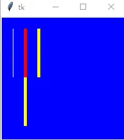

图4 竖直线动生成的矩形：水平堆叠的黄线与红线等宽等高

改变终点即改变线段方向（倾斜线）时，堆叠方向需改为 "ne"（西北方向）才能与粗线重合：

```python
start_point, end_point = (20, 20), (100, 100)  # 倾斜线
line = Line(start_point, end_point, line_width=5)
line.run()
```

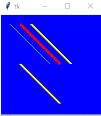

图5 倾斜直线动生成的四边形

## 5 位移：Graph.move

物理学中用"位移"描述物体相对位置的变动。把位移引入 Canvas 对象操纵：`move(graph_id, displacement)` 沿位移向量平移图形（红图沿 (−1, 1) 方向移动 10 像素到白图位置）：

```python
class Graph:
    def __init__(self, meta):
        self.meta = meta

    def move(self, graph_id, displacement):
        '''Move objects along displacement

        :param graph_id: The identifier of graph.
        :param displacement: The concept of representing the displacement in physics.
        '''
        self.meta.move(graph_id, *displacement)

def test_Graph(direction, displacement, line_width=7):
    from tkinter import Tk
    root = Tk()
    meta = Meta(root, width=200, height=200, background='blue')
    graph = Graph(meta)
    graph_id = graph.meta.draw_graph(direction, 'Line', 'white', line_width=line_width)
    graph.move(graph_id, displacement)
    graph.meta.draw_graph(direction, 'Line', 'red', line_width=line_width)
    meta.layout()
    root.mainloop()

direction = (20, 20, 100, 100)
displacement = (-10, 10)
test_Graph(direction, displacement)
```

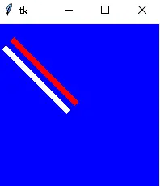

图6 按照位移移动 graph

## 6 画点

数学中点没有大小（实数充满数轴、连续），而数字图像是离散的——像素点是一个 `1×1` 的小方块。最朴素的画点法是用长度 1 的 Line：

```python
from tkinter import Tk
root = Tk()
meta = Meta(root, width=200, height=200, background='blue')
origin_x, origin_y = 0, 0
start_points = [(origin_x+k, origin_y+k) for k in range(10, 200, 5)]
end_points = [(origin_x+k+1, origin_y+k) for k in range(10, 200, 5)]
graphs = [meta.draw_graph(direct, 'Line', 'white', line_width=1)
          for direct in zip(start_points, end_points)]
meta.layout()
root.mainloop()
```

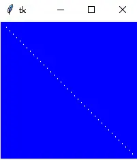

图7 使用 Line 画点（形象说明线由点构成）

该法繁琐且改点大小麻烦，更方便的是用 Rectangle（方点 ■）和 Oval（圆点 ●）画点。

### 6.1 方点 ■

`create_rectangle` 直接构建矩形。观察 `line_width` 的行为：矩形的线宽以线宽为 1 的矩形为基准中心，**向内、向外各扩展 `int(line_width/2)` 个像素**：

```python
root = Tk()
direction = (20, 20, 120, 120)
direction1 = (120, 20, 220, 120)
direction2 = (20, 120, 120, 220)
meta = Meta(root, width=500, height=500, background='green')
meta.draw_graph(direction, 'Rectangle', 'red', line_width=20, fill='black')
meta.draw_graph(direction1, 'Rectangle', 'white', line_width=1, fill='yellow')
meta.draw_graph(direction2, 'Rectangle', 'white', line_width=1, fill='yellow')
meta.layout()
root.mainloop()
```

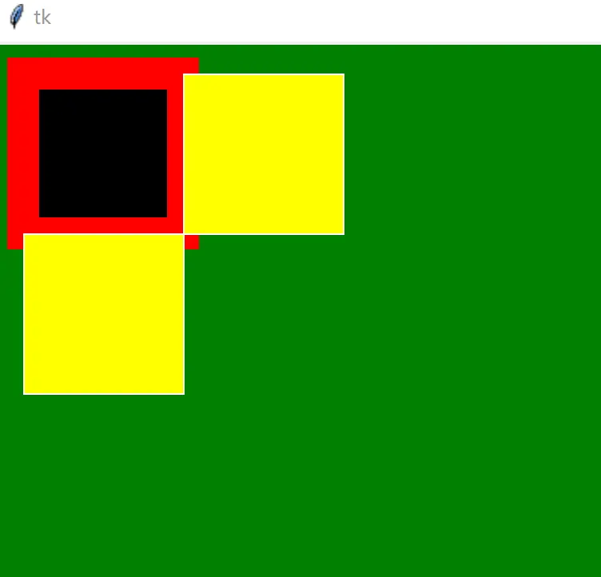

图8 矩形的 line_width（中心内外双向扩展）

为简化图形学研究，默认 `line_width=1`，把矩形看作 `1×1` 像素块 ■ 堆叠而成（而非 Line 堆叠）；进一步可把 `2×1` 或 `2×2` 的"大"矩形视为"超像素"，只研究超像素即可简化问题。

`direction` 也可当作"位移"理解：`h×w` 的矩形可看作 `1×1` 像素块先水平向右移动 `w` 个像素滑出 `1×w` 的"线段"，再竖直向下移动 `h` 个像素滑得。位移记作 `(w, h)`，其中 `|w|`、`|h|` 分别为矩形的宽和高；`w`、`h` 可正可负，故矩形也是**有方向**的——`(w, h)` 同时指定矩形的方向与大小。

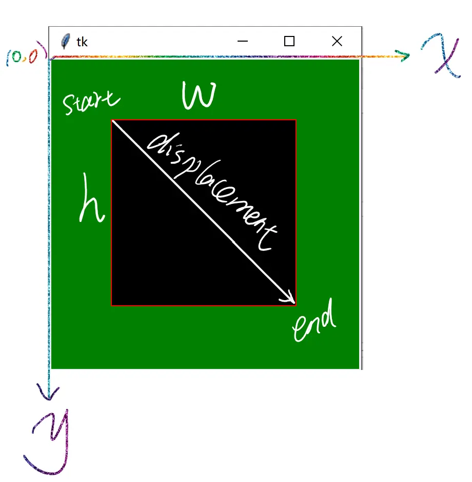

图9 像素视角下的矩形

综上，像素（pixel）是数字图像的最小单元，同时可将像素视作张量：

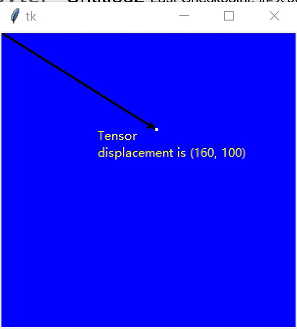

图10 像素可以看作是张量

### 6.2 圆点 ●

Oval 同理：`line_width` 以中心填充方式向内外扩展。用 Oval 画"点"时取退化外接框（起点终点重合），配合 `create_line` 箭头与 `create_text` 标注位移向量：

```python
root = Tk()
direction = (160, 100, 160, 100)
meta = Meta(root, width=300, height=300, background='blue')
meta.create_line((0, 0, 160, 100), arrow='last', width=1)
meta.draw_graph(direction, 'Oval', 'white', line_width=2)
meta.create_text((175, 115),
                 text='Tensor\ndisplacement is (160, 100)',
                 fill='yellow')
meta.layout()
root.mainloop()
```

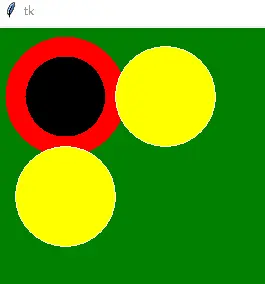

图11 椭圆的 line_width（中心填充）

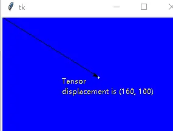

图12 椭圆的"点"（退化 bbox + 位移标注）

## 7 绑定鼠标作画

`Drawing(Meta)` 模拟"画笔"：右侧选择器（`Selector`）选定图形类型与颜色后，鼠标左键点击画布开始作画（`<1>` 记录起点坐标），释放左键（`<ButtonRelease-1>`）时按拖拽 bbox 成图。`create_graph` 含两条退化保护：非 Point 类型 bbox 退化为点（`x0==x1 and y0==y1`）则拒绝；Point 类型 bbox 非退化（拖出了框）则拒绝——点必须是单击落点：

```python
class Drawing(Meta):
    '''创建图形元素（简称 graph），包括矩形框（可以是方形点），椭圆形（圆形点），线段'''

    def __init__(self, master=None, cnf={}, selector=None, **kw):
        super().__init__(master, cnf, **kw)
        self.master = master
        self.selector = selector
        self.master.title('计算机视觉')
        self._init_params()
        self.bind("<1>", self.update_xy)
        self.bind("<ButtonRelease-1>", self.draw)

    def _init_params(self):
        self.current_id = None
        self.x = self.y = 0  # 记录鼠标左键的坐标

    def update_xy(self, event):
        '''按压鼠标左键'''
        self.x = event.x
        self.y = event.y

    def select_graph(self, event):
        '''按压鼠标右键：获取鼠标指示对象的 id'''
        self.configure(cursor="target")
        self.update_xy(event)
        self.current_id = self.find_withtag('current')

    def get_bbox(self, event):
        x0, y0 = self.x, self.y      # 左上角坐标
        x1, y1 = event.x, event.y    # 右下角坐标
        return x0, y0, x1, y1

    def draw(self, event):
        '''释放鼠标左键'''
        self.configure(cursor="arrow")
        bbox = self.get_bbox(event)
        self.create_graph(bbox)

    @property
    def graph_params(self):
        return {
            'line_width': 1,
            'tags': self.selector._graph_type,
            'fill': 'red' if 'Point' in self.selector._graph_type else None
        }

    def create_graph(self, bbox):
        '''创建图形。bbox: x0, y0, x1, y1'''
        x0, y0, x1, y1 = bbox
        cond1 = x0 == x1 and y0 == y1 and 'Point' not in self.selector._graph_type
        cond2 = 'Point' in self.selector._graph_type and (x0 != x1 or y0 != y1)
        if cond1 or cond2:
            return
        self.draw_graph(bbox, graph_type=self.selector.graph_type,
                        color=self.selector.color, **self.graph_params)

    def layout(self, row=0, column=0):
        self.grid(row=row, column=column, sticky='nwes')

if __name__ == '__main__':
    from graph_tensor.graph.atom import Meta
    from graph_tensor.graph.creator import Selector
    root = Tk()
    icon_meta = Meta(root, width=210, height=60)
    selector = Selector(icon_meta)
    meta = Drawing(root, selector=selector, background='white')
    root.columnconfigure(0, weight=1)   # 主窗口随画布尺寸缩放
    root.rowconfigure(0, weight=1)
    meta.layout()
    icon_meta.layout(0, 1)
    root.mainloop()
```

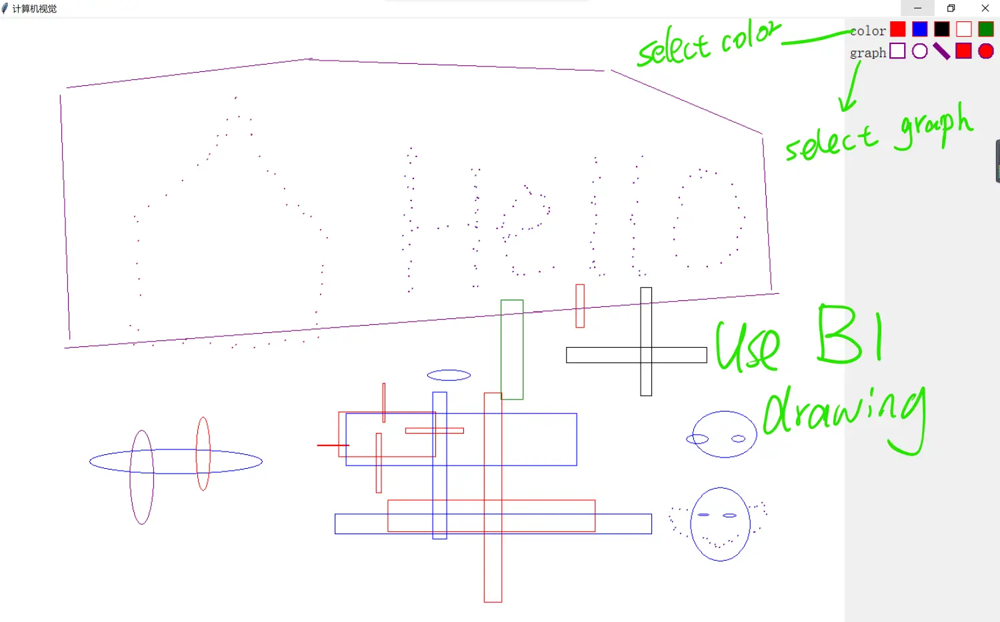

图13 使用鼠标作画（选择器选 graph/color，左键拖拽成图）

若要模拟鼠标运行轨迹作画（自由曲线），只需改绑事件：按下与释放都只重置坐标，拖拽过程 `<Button1-Motion>` 持续触发 `draw`：

```python
class TrajectoryDrawing(Drawing):
    '''轨迹作画：矩形框、椭圆形、线段'''

    def __init__(self, master=None, cnf={}, selector=None, **kw):
        super().__init__(master, cnf, selector, **kw)
        self.bind("<1>", self.update_xy)
        self.bind("<ButtonRelease-1>", self.update_xy)
        self.bind("<Button1-Motion>", self.draw)

if __name__ == '__main__':
    root = Tk()
    icon_meta = Meta(root, width=210, height=60)
    selector = Selector(icon_meta)
    meta = TrajectoryDrawing(root, selector=selector, background='white')
    root.columnconfigure(0, weight=1)
    root.rowconfigure(0, weight=1)
    meta.layout()
    icon_meta.layout(0, 1)
    root.mainloop()
```

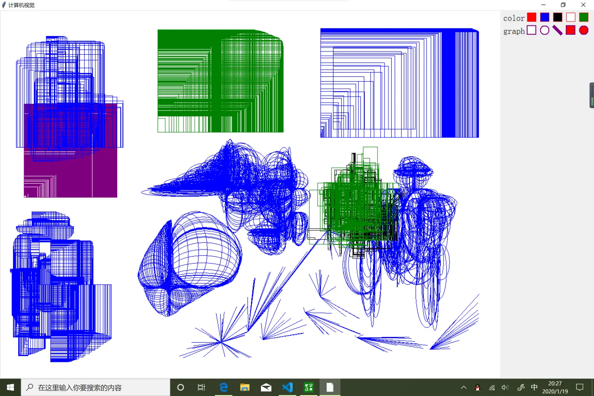

图14 轨迹作画生成的自定义"抽象画"

## 8 要点回顾

- **统一 direction**：`(x0, y0, x1, y1)` 是矩形/椭圆/扇形/线段共同的方向向量，同 direction 即同中心。
- **line_width 语义**：以 1px 线为基准中心，向内、向外各扩 `int(line_width/2)` 像素；图形学建模默认 `line_width=1`，把图形视为 `1×1` 像素块堆叠。
- **位移即向量**：`Canvas.move(id, dx, dy)` 对应物理位移；矩形的 `(w, h)` 位移同时编码大小与方向（w、h 可负）。
- **三种画点**：Line（1px 线段）繁琐；Rectangle 方点 ■；Oval 圆点 ●（退化 bbox）。
- **鼠标作画两模式**：按下记起点 + 释放按 bbox 成图（拖拽画框）；改绑 `<Button1-Motion>` 即轨迹作画（自由曲线）。
- **退化保护**：成图前校验 bbox 与图形类型是否匹配，点必须单击、框必须拖拽。

> 相关概念：[Canvas 画布](../concepts/09-canvas.md)、[事件绑定与变量联动](../concepts/07-events-and-variables.md)、[几何管理器 Grid](../concepts/03-geometry-managers.md)。姊妹实战：[自定义画图工具](02-drawing-tool.md)。