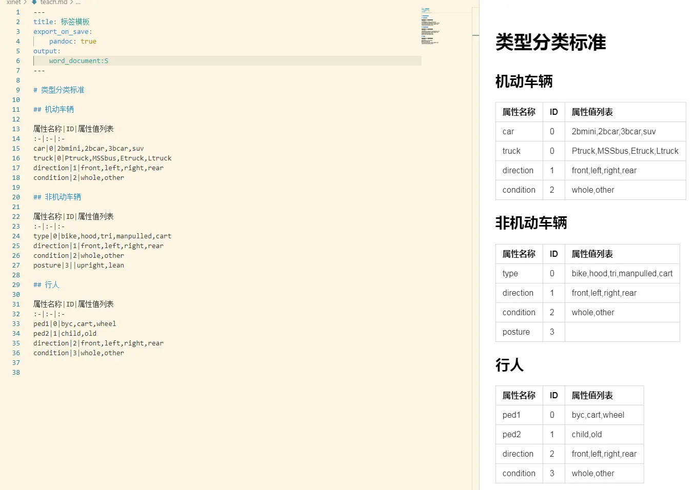

# 实战：标注工具的标签模板（teach.md 解析器）

> 对应信源：F-TGD-19《6.2 tkinter 设定标注工具的标签模板》。为 [图形操作案例](03-graphics-ops.md) 所属 TensorAtom/Graph 项目的标注工具设计统一的标签模板格式，并用 tkinter 程序加载解析，供后续按类别生成 `ttk.Notebook` 标签页。

## 1 标签模板标准格式

模板文件名为 `teach.md`，整体是一份 Markdown 文档：



图1 标签模板设计

结构约定：

- 开头设定 Markdown 的输出格式为 `.docx`，接着描述标签的基本介绍与通用超参数；
- 之后以 Python 语法格式设定超参数；
- 最后以 `##` 分隔各个属性类别（每个类别一节）；
- 每节内用管道符 `|` 记录一条属性：`属性名 | 组ID | 选择类型 | 候选值(逗号分隔)`；
- **相同 ID 的属性相互独立**——组 ID 只控制 GUI 上的分组展示，不表示属性间有依赖。

## 2 TeachLoader 解析器

三级属性递进：`content`（按 `## ` 切节）→ `records`（每节提取类别名与属性表行）→ `tabs`（按 `group_id` 把属性聚合同组，并把候选值字符串拆成列表），恰好对应标签页（Notebook）→ 类别 → 同组属性控件的 GUI 三级结构：

```python
class TeachLoader:
    def __init__(self, teach_path):
        self.teach_path = teach_path

    @property
    def content(self):
        with open(self.teach_path, 'rb') as fp:
            teach = fp.read().decode().strip()
        return teach.split('## ')

    @property
    def records(self):
        _teach = {}
        for _records in self.content[1:]:   # 首节为文件头介绍，跳过
            _records = _records.strip().splitlines()
            name = _records[0]              # 类别名（节标题）
            _teach[name] = _records[4:]     # 前4行为介绍/超参数，其后为属性表
        return _teach

    @property
    def tabs(self):
        _groups = {name: {} for name in self.records}
        for name, table in self.records.items():
            for record in table:
                _property, group_id, choice_type, values = record.split('|')
                _groups[name][group_id] = _groups[name].get(group_id, []) + \
                    [(_property, choice_type, values.split(','))]
        return _groups
```

解析结果形态：`tabs` 是 `{类别名: {组ID: [(属性名, 选择类型, [候选值...]), ...]}}` 的嵌套字典，可直接驱动标签页渲染——每个类别一个 Notebook 页，页内按组 ID 排列单选/多选控件。

## 3 要点回顾

- **配置即文档**：标签模板用 Markdown 承载，业务人员可直接编辑 `teach.md`，程序只负责解析，无需改代码即可调整标注项。
- **分隔符即结构**：`## ` 切类别、`|` 切属性字段、`,` 切候选值，三层分隔符对应三层数据结构。
- **解析与渲染分离**：`TeachLoader` 只产出纯数据字典，GUI 渲染（Notebook/单选按钮组）另行消费 `tabs`。

> 相关概念：[高级 widgets（Notebook/Treeview）](../concepts/04-advanced-widgets.md)、[Text 组件](../concepts/08-text-widget.md)。姊妹实战：[图形操作案例](03-graphics-ops.md)。