# 实战集：tkinter 小例子 18 则

> 对应信源：F-TGD-20《7 tkinter 的几个小例子》。18 个可独立运行的小例子，覆盖 [基础 widgets](../concepts/02-basic-widgets.md)、[高级 widgets](../concepts/04-advanced-widgets.md)、[事件与变量](../concepts/07-events-and-variables.md)、[几何管理](../concepts/03-geometry-managers.md)、[Text](../concepts/08-text-widget.md) 的常见用法。公共导入：`from tkinter import Tk, ttk, PhotoImage, Menu, StringVar, filedialog, Listbox`。

## 1 可绑定"动作"的按钮

`command` 回调在按钮点击时触发：

```python
class App(Tk):
    def __init__(self):
        super().__init__()
        self.btn = ttk.Button(self, text="点我!", command=self.say_hello)
        self.btn.grid(padx=120, pady=30)

    def say_hello(self):
        print("欢迎进入 tkinter 世界!")

app = App(); app.title("tkinter 的应用"); app.mainloop()
```

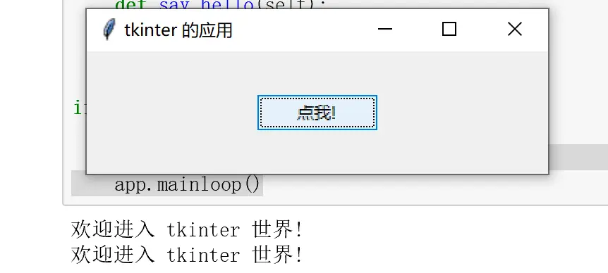

图1 带命令的按钮

## 2 带图片的按钮与 relief

`PhotoImage(file=...)` 提供图片，`compound='left'` 让图片在文字左；点击后 `config(state='disabled')` 失活。第二行用 5 种 `relief`（sunken/raised/groove/ridge/flat）的 Frame 展示立体边框：

```python
RELIEFS = ['sunken', 'raised', 'groove', 'ridge', 'flat']

class ButtonsApp(Tk):
    def __init__(self):
        super().__init__()
        self.img = PhotoImage(file="python.gif")
        self.btn = ttk.Button(self, text="带图片的按钮", image=self.img,
                              compound='left', command=self.disable_btn)
        self.btn.grid(row=0, column=2)
        for i, RELIEF in enumerate(RELIEFS):
            temp = ttk.Frame(self, relief=RELIEF, borderwidth=5, width=50, height=50)
            ttk.Label(temp, text=RELIEF).grid(row=0, column=0)
            temp.grid(row=1, column=i, padx=10, pady=10)

    def disable_btn(self):
        self.btn.config(state='disabled')
```

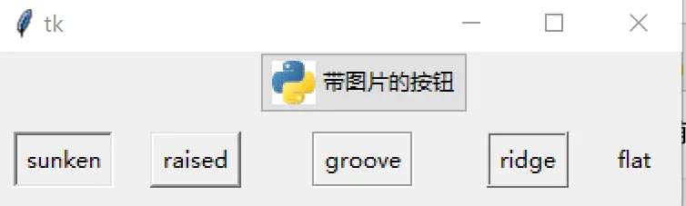

图2 带图片的按钮（下排为 5 种 relief）

## 3 可跟踪 Entry 的"变量"

`StringVar.trace("w", callback)` 在变量被写入时回调，实现输入实时回显；清除按钮用 `var.set("")` 清空：

```python
class App(Tk):
    def __init__(self):
        super().__init__()
        self.var = StringVar()
        self.var.trace("w", self.show_message)
        self.entry = ttk.Entry(textvariable=self.var)
        self.btn = ttk.Button(text="清除", command=lambda: self.var.set(""))
        self.label = ttk.Label()
        self.entry.grid(); self.btn.grid(); self.label.grid()

    def show_message(self, *args):
        value = self.var.get()
        self.label.config(text=f"你好, {value}!" if value else '')
```

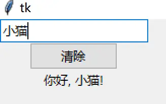

图3 实时跟踪文本框输入

## 4 验证 Entry 输入

`validate="key"` 表示每次按键都验证；`register` 把 Python 方法注册为 Tcl 回调，`%i`（插入位置）、`%P`（变更后全文）为替换参数；正则 `^\w{0,10}$` 限制用户名最多 10 个单词字符：

```python
import re

class App(Tk):
    def __init__(self):
        super().__init__()
        self.pattern = re.compile(r"^\w{0,10}$")
        self.label = ttk.Label(text="输入您的用户名")
        vcmd = (self.register(self.validate_username), "%i", "%P")
        self.entry = ttk.Entry(validate="key", validatecommand=vcmd,
                               invalidcommand=self.print_error)
        self.label.pack(); self.entry.pack(anchor='w', padx=10, pady=10)

    def validate_username(self, index, username):
        print("修改 " + index)
        return self.pattern.match(username) is not None

    def print_error(self):
        print("无效的用户名")
```

## 5 Listbox 的四种 selectmode

`selectmode` 决定可选行数与拖拽行为：`browse`（默认，单选且选择跟随鼠标拖动）、`single`（单选不可拖）、`multiple`（任意多选不可拖）、`extended`（相邻多选，支持 Shift/Ctrl）。`curselection()` 返回选中项索引元组，`get(i)` 取值：

```python
DAYS = ["Monday", "Tuesday", "Wednesday", "Thursday",
        "Friday", "Saturday", "Sunday"]
MODES = ['single', 'browse', 'multiple', 'extended']

class ListApp(Tk):
    def __init__(self):
        super().__init__()
        self.list = Listbox()
        self.list.insert(0, *DAYS)
        self.print_btn = ttk.Button(self, text="Print selection",
                                    command=self.print_selection)
        self.btns = [self.create_btn(m) for m in MODES]
        self.list.pack(); self.print_btn.pack(fill='both')
        for btn in self.btns:
            btn.pack(side='left')

    def create_btn(self, mode):
        def cmd(): return self.list.config(selectmode=mode)
        return ttk.Button(self, command=cmd, text=mode.capitalize())

    def print_selection(self):
        selection = self.list.curselection()
        print([self.list.get(i) for i in selection])
```

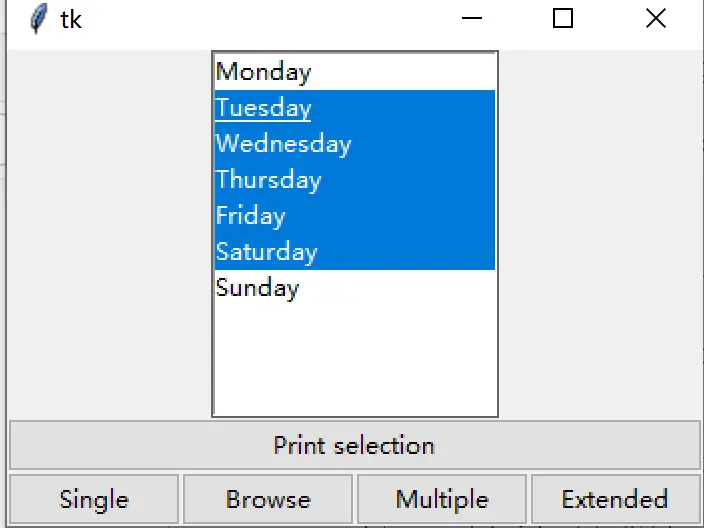

图4 列表框与四种选择模式

## 6 鼠标触发的事件

一次性绑定六个常用鼠标事件，回调里打印事件类型与坐标：

```python
class App(ttk.Frame):
    def __init__(self, master=None, **kw):
        super().__init__(master, **kw)
        style = ttk.Style()
        style.configure("BG.TFrame", foreground="black", background="green")
        self.configure(style="BG.TFrame", height=100, width=100)
        event_names = ("<Button-1>", "<Double-Button-1>", "<ButtonRelease-1>",
                       "<B1-Motion>", "<Enter>", "<Leave>")
        [self.bind(e, self.print_event) for e in event_names]
        self.grid(padx=50, pady=50)

    def print_event(self, event):
        print(event.type, "event", f"(x={event.x}, y={event.y})")
```

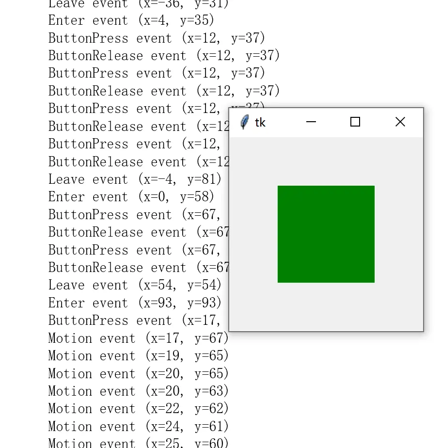

图5 鼠标事件（按下/双击/释放/拖动/进入/离开）

## 7 键盘触发的事件

`<FocusIn>` 监听焦点进入，`<Key>` 监听按键；事件对象上 `keysym`（按键符号）、`keycode`（键码）、`char`（字符）三属性：

```python
class App(Tk):
    def __init__(self):
        super().__init__()
        entry = ttk.Entry(self)
        entry.bind("<FocusIn>", self.print_type)
        entry.bind("<Key>", self.print_key)
        entry.grid(padx=20, pady=20)

    def print_type(self, event):
        print(event.type)

    def print_key(self, event):
        print(f"Symbol: {event.keysym}, Code: {event.keycode}, Char: {event.char}")
```

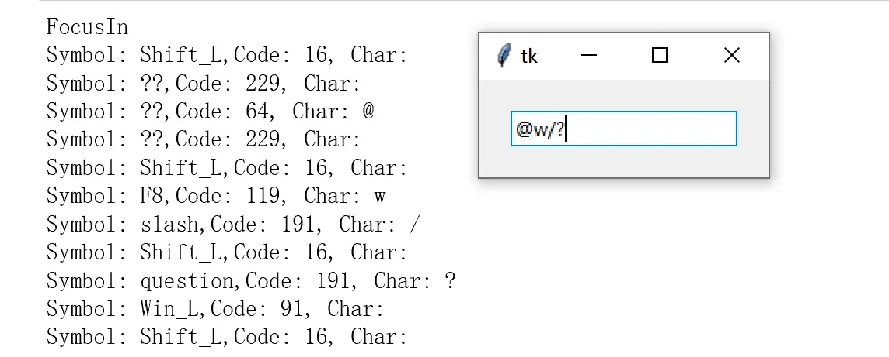

图6 键盘事件

## 8 自定义标题栏图标与窗口定位

`iconbitmap` 设置标题栏图标；`geometry("WxH±x±y")` 一次设定尺寸与屏幕位置：`+25` 表示左边缘距屏幕左缘 25px，`-50` 表示右边缘距屏幕右缘 50px，y 方向同理：

```python
class App(Tk):
    def __init__(self):
        super().__init__()
        self.title("自定义标题栏图标")
        self.iconbitmap("python.ico")
        self.geometry("400x200+50+50")   # width x height ±x ±y
```

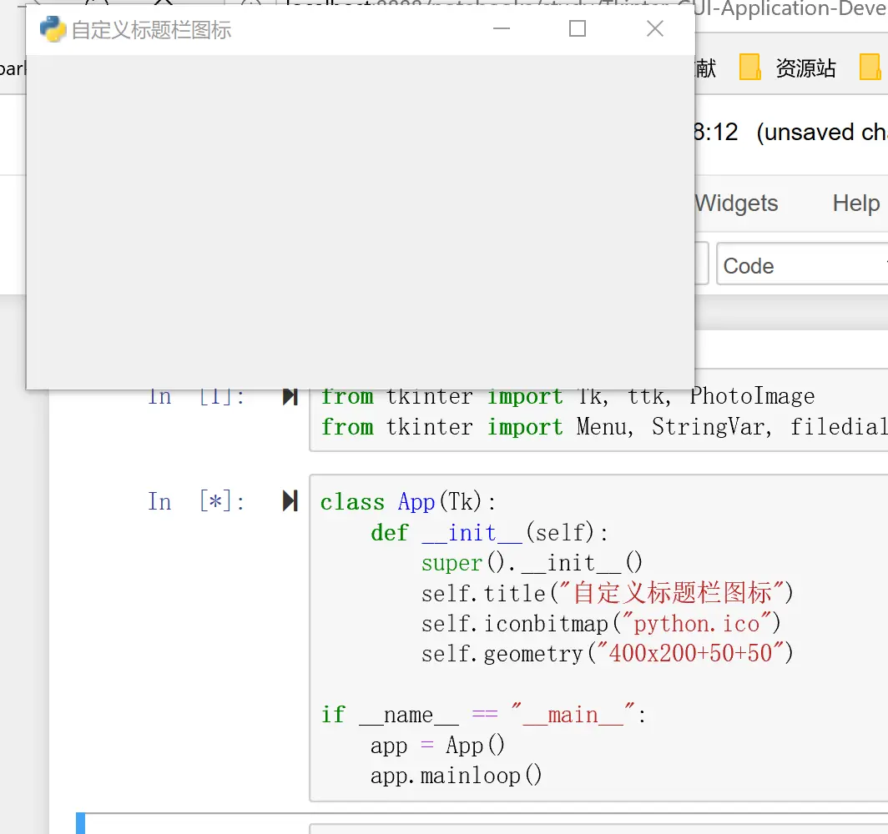

图7 自定义标题栏图标

## 9 可互相转移项的双列表框

`ListFrame` 把 Listbox 与垂直 Scrollbar 捆在一起（`yscrollcommand`/`yview` 双向联动）；`pop_selection` 取出并删除选中项，`insert_item` 尾部追加，两个列表框间用 `>`/`<` 按钮移动：

```python
class ListFrame(ttk.Frame):
    def __init__(self, master, items=[]):
        super().__init__(master)
        self.list = Listbox(self)
        self.scroll = ttk.Scrollbar(self, orient='vertical',
                                    command=self.list.yview)
        self.list.config(yscrollcommand=self.scroll.set)
        self.list.insert(0, *items)
        self.list.pack(side='left')
        self.scroll.pack(side='left', fill='y')

    def pop_selection(self):
        index = self.list.curselection()
        if index:
            value = self.list.get(index)
            self.list.delete(index)
            return value

    def insert_item(self, item):
        self.list.insert('end', item)

class App(Tk):
    def __init__(self):
        super().__init__()
        months = ["January", "February", "March", "April", "May", "June",
                  "July", "August", "September", "October", "November", "December"]
        self.frame_a = ListFrame(self, months)
        self.frame_b = ListFrame(self)
        ttk.Button(self, text=">", command=self.move_right).pack(expand=True, ipadx=5)
        ttk.Button(self, text="<", command=self.move_left).pack(expand=True, ipadx=5)
        self.frame_a.pack(side='left', padx=10, pady=10)
        self.frame_b.pack(side='right', padx=10, pady=10)

    def move_right(self): self.move(self.frame_a, self.frame_b)
    def move_left(self):  self.move(self.frame_b, self.frame_a)

    def move(self, frame_from, frame_to):
        value = frame_from.pop_selection()
        if value:
            frame_to.insert_item(value)
```

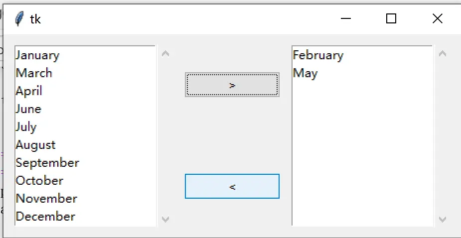

图8 可转移项的双列表框

## 10 三色块布局：pack / grid / place 对比

同一组五色 Label，分别用三种几何管理器排布，直观对比三者特性。pack 版按 `side` 依次贴边：

```python
colors = ("yellow", "orange", "red", "green", "blue")
labels = [ttk.Label(text=f'label_{c}', background=c) for c in colors]
opts = {'ipadx': 20, 'ipady': 10, 'fill': 'both'}
labels[0].pack(side='top', **opts); labels[1].pack(side='top', **opts)
labels[2].pack(side='left', **opts); labels[3].pack(side='left', **opts)
labels[4].pack(side='left', **opts)
```

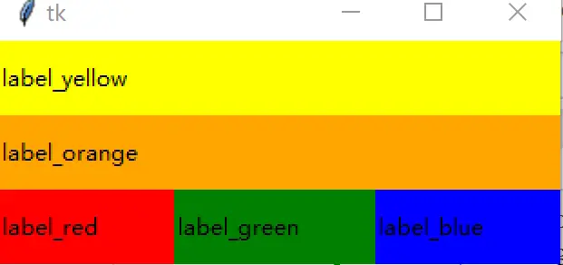

图9 pack 布局

grid 版用 `row/column/rowspan/columnspan/sticky` 做表格拼合：

```python
opts = {'ipadx': 10, 'ipady': 10, 'sticky': 'nswe'}
for k, lb in enumerate(labels):
    lb.grid(row=({1:1, 4:2}.get(k, 0)),
            column=({2:1, 3:2}.get(k, 0)),
            rowspan=2 if k in (2, 3) else None,
            columnspan=3 if k == 4 else None, **opts)
```

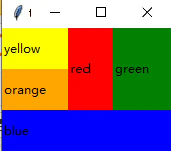

图10 grid 布局

place 版支持绝对坐标（`x/y/width/height`）与相对坐标（`relx/rely/relwidth/relheight`，0~1 比例）、`anchor` 锚点，甚至 `in_=父控件` 相对另一控件放置：

```python
labels[0].place(relwidth=0.25, relheight=0.25)
labels[1].place(x=100, anchor='n', width=100, height=50)
labels[2].place(relx=0.5, rely=0.5, anchor='center', relwidth=0.5, relheight=0.5)
labels[3].place(in_=labels[2], anchor='nw', x=2, y=2, relx=0.5, rely=0.5,
                relwidth=0.5, relheight=0.5)
labels[4].place(x=200, y=200, anchor='se', relwidth=0.25, relheight=0.25)
```

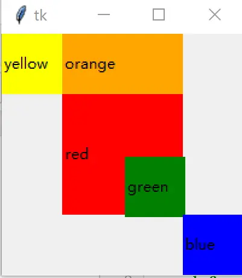

图11 place 布局

## 11 LabelFrame 个人信息表单

`LabelFrame` 给相关字段加带标题的分组框，组内用 grid 排 Label/Entry：

```python
style = ttk.Style(); style.configure("W.TFrame", background="white")
group_1 = ttk.LabelFrame(self, text="个人信息", style="W.TFrame")
group_1.pack(padx=10, pady=5)
ttk.Label(group_1, text="性别").grid(row=0)
ttk.Label(group_1, text="姓名").grid(row=1)
ttk.Entry(group_1).grid(row=0, column=1, sticky='w')
ttk.Entry(group_1).grid(row=1, column=1, sticky='w')
group_2 = ttk.LabelFrame(self, text="地址", style="W.TFrame")
group_2.pack(padx=10, pady=5)
ttk.Label(group_2, text="国籍").grid(row=0)
ttk.Label(group_2, text="省市").grid(row=1)
ttk.Label(group_2, text="邮编").grid(row=2)
ttk.Entry(group_2).grid(row=0, column=1, sticky='w')
ttk.Entry(group_2).grid(row=1, column=1, sticky='w')
ttk.Entry(group_2, width=8).grid(row=2, column=1, sticky='w')
ttk.Button(self, text="提交").pack(padx=10, pady=10, side='right')
```

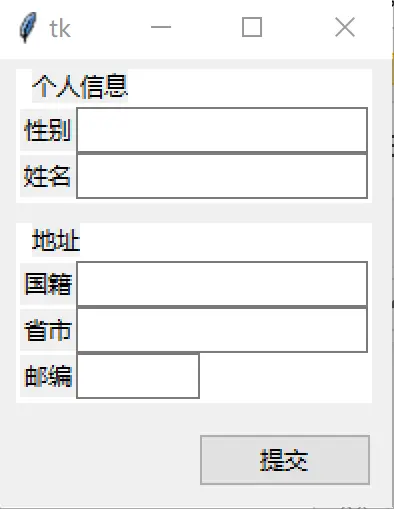

图12 个人信息记录表单

## 12 颜色选择器切换前景/背景

`functools.partial` 给同一回调预置不同参数（fg/bg）；`askcolor()` 返回 `(RGB元组, #rrggbb字符串)`，取 `[1]` 用于配置：

```python
from functools import partial
from tkinter.colorchooser import askcolor

class App(Tk):
    def __init__(self):
        super().__init__()
        self.title("Colors demo")
        self.label = ttk.Label(self, text="The quick brown fox jumps over the lazy dog")
        ttk.Button(self, text="Set foreground color",
                   command=partial(self.set_color, "fg")).pack(side='left', fill='both', expand=True)
        ttk.Button(self, text="Set background color",
                   command=partial(self.set_color, "bg")).pack(side='left', fill='both', expand=True)
        self.label.pack(padx=20, pady=20)

    def set_color(self, option):
        color = askcolor()[1]
        print("Chosen color:", color)
        self.label.config(**{option: color})
```

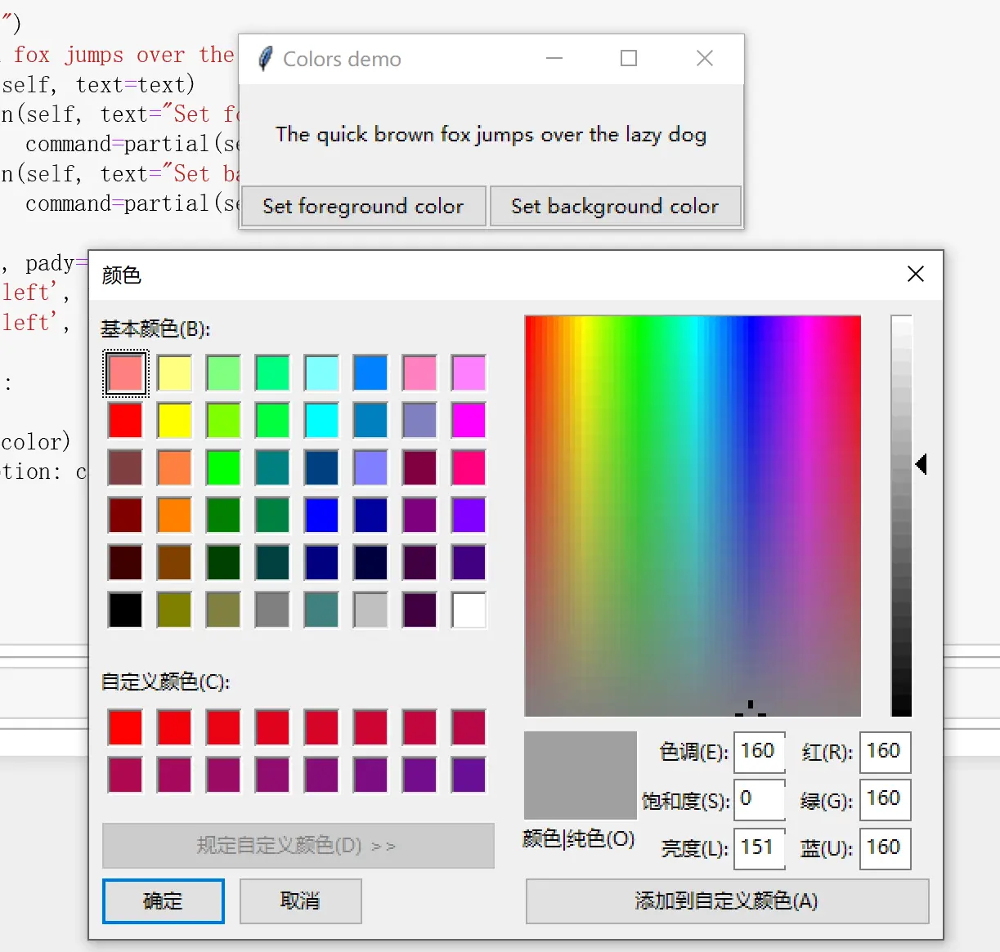

图13 颜色选择器

## 13 变换字体

OptionMenu 选字体族、Spinbox 选字号，两个 StringVar 都 `trace("w", set_font)`，任一变化即 `label.config(font=(family, size))`：

```python
self.family = StringVar()
self.option = ttk.OptionMenu(self, self.family, "Times", "Courier", "Helvetica")
self.size = StringVar(); self.size.set("10")
self.size.trace("w", self.set_font)
self.spinbox = ttk.Spinbox(from_=8, to=18, textvariable=self.size)
self.family.trace("w", self.set_font)

def set_font(self, *args):
    self.label.config(font=(self.family.get(), self.size.get()))
```

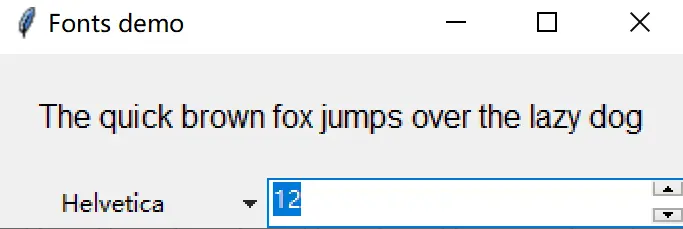

图14 动态改变字体类型与大小

`tkinter.font.Font` 可构造命名字体对象复用；`Style.map` 为按钮状态（pressed/active）映射不同前景背景色：

```python
from tkinter.font import Font
header = Font(family='Helvetica', size=18, weight='bold')
subtitle = Font(family="Helvetica 14 italic")
style = ttk.Style()
style.map("C.TButton",
          foreground=[('pressed', 'red'), ('active', 'blue')],
          background=[('pressed', '!disabled', 'black'), ('active', 'white')])
```

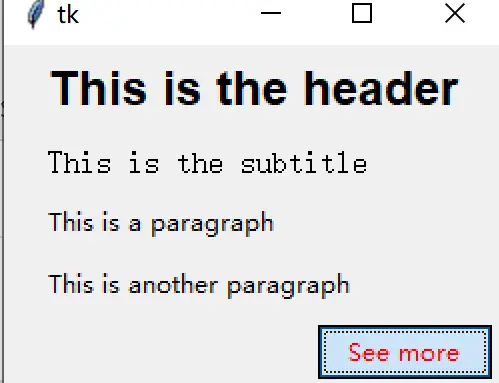

图15 Font 与 Style.map 状态样式

## 14 设置鼠标光标

耗时操作期间把整窗光标切为 `watch`（沙漏），`after(3000, 回调)` 注册 3 秒后的恢复动作；按钮也可单独设 `cursor="question_arrow"`：

```python
def perform_action(self):
    self.btn_launch.config(state='disabled')
    self.btn_help.config(state='disabled')
    self.label.config(text="Working...")
    self.after(3000, self.end_action)
    self.config(cursor="watch")

def end_action(self):
    self.btn_launch.config(state='normal')
    self.btn_help.config(state='normal')
    self.label.config(text="Done!")
    self.config(cursor="arrow")
```

`set_watch_cursor`/`restore_cursor` 示范了递归 `winfo_children()` 遍历整棵控件树统一改光标。

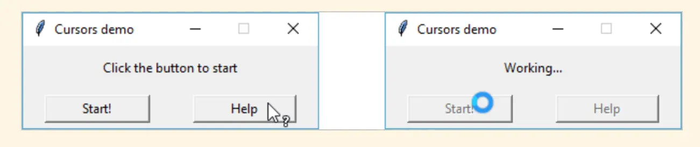

图16 鼠标光标切换

## 15 Text 文本区操作

`delete("1.0", 'end')` 清空、`insert('insert', ...)` 在光标处插入、`tag_ranges('sel')` 取选区范围再 `get` 读出所选内容：

```python
def clear_text(self):
    self.text.delete("1.0", 'end')

def insert_text(self):
    self.text.insert('insert', "Hello, world")

def print_selection(self):
    selection = self.text.tag_ranges('sel')
    if selection:
        print(self.text.get(*selection))
```

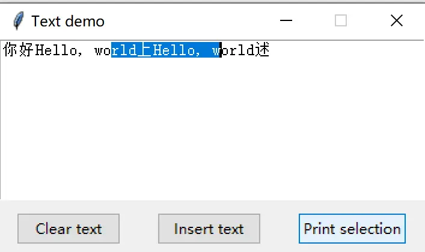

图17 Text 示例

## 16 Text 内超链接

给选中文字加 `link` 标签：`tag_config` 设蓝色下划线样式，`tag_bind` 绑定点击（`webbrowser.open` 打开链接）、进入/离开（切 `hand2` 手型光标）。点击时用 `@x,y` 像素坐标转索引、`tag_prevrange` 反查链接区间取出 URL：

```python
import webbrowser

self.text.tag_config("link", foreground="blue", underline=1)
self.text.tag_bind("link", "<Button-1>", self.open_link)
self.text.tag_bind("link", "<Enter>", lambda _: self.text.config(cursor="hand2"))
self.text.tag_bind("link", "<Leave>", lambda e: self.text.config(cursor=""))

def add_hyperlink(self):
    selection = self.text.tag_ranges('sel')
    if selection:
        self.text.tag_add("link", *selection)

def open_link(self, event):
    index = self.text.index(f"@{event.x},{event.y} + 1c")
    prevrange = self.text.tag_prevrange("link", index)
    url = self.text.get(*prevrange)
    webbrowser.open(url)
```

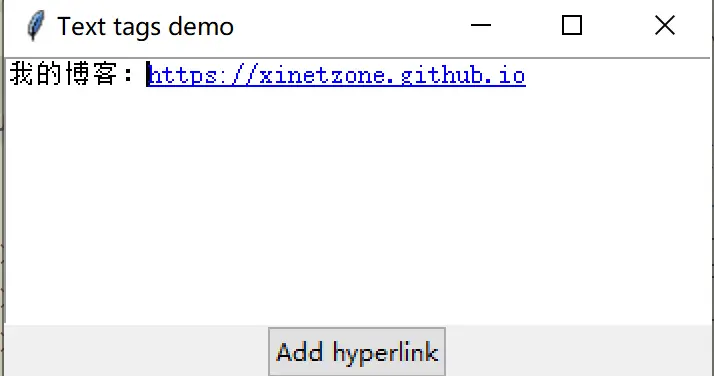

图18 Text 内设定超链接

## 17 要点速查

- **回调传参**：`lambda` 适合一次性表达式，`functools.partial` 适合关键字参数预置。
- **输入验证三件套**：`register` 注册回调 + `validate="key"` + `%P/%i` 替换参数。
- **Listbox**：`selectmode` 控选择语义，`curselection/get/delete/insert` 完成取值与增删，配 Scrollbar 需双向挂 `yview/yscrollcommand`。
- **布局选型**：表单用 grid、贴边工具栏用 pack、自由定位/比例缩放用 place。
- **Text 标签**：`tag_config` 管样式、`tag_bind` 管交互、`tag_ranges/tag_prevrange` 管区间查询，是超链接/语法高亮的基础。

> 相关概念：[事件绑定与变量联动](../concepts/07-events-and-variables.md)、[Text 组件](../concepts/08-text-widget.md)、[菜单/窗口/对话框](../concepts/05-menus-windows-dialogs.md)。更多实战见 [Canvas 例子集](06-canvas-examples.md)。