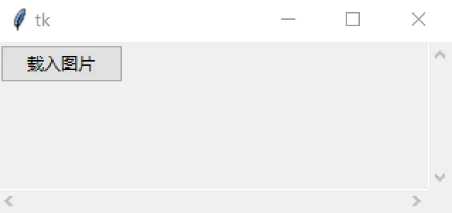
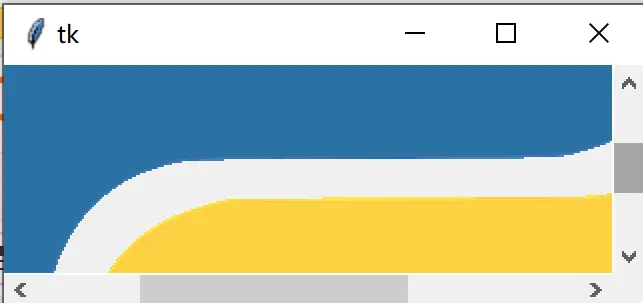
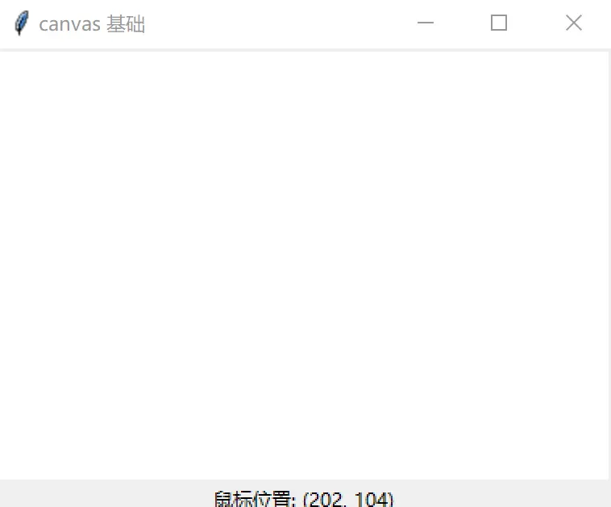
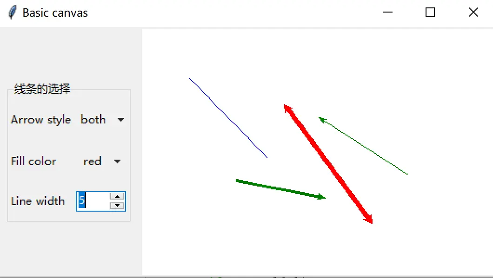
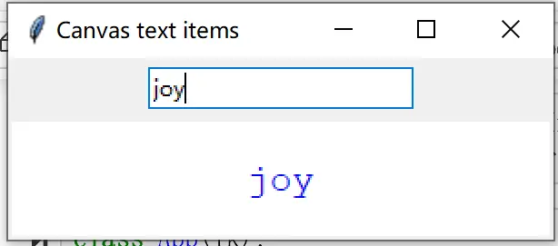
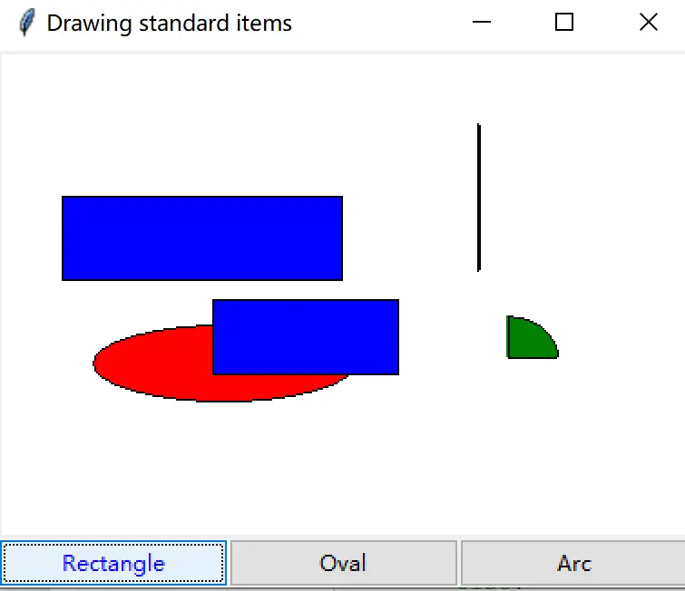

# 实战集：tkinter Canvas 例子 6 则

> 对应信源：F-TGD-21《7.1 tkinter Canvas 的几个例子》。在 [Canvas 画布](../concepts/09-canvas.md) 概念基础上的 6 个进阶交互例子。公共导入：`from tkinter import Tk, ttk, PhotoImage, Canvas` 及 `Menu, StringVar, filedialog, Listbox`。

## 1 可滚动的画布

Canvas 自身只能绘图，要承载普通控件并滚动，需用 `create_window((0,0), window=frame, anchor='nw')` 把一个 Frame 贴到画布左上角（Canvas 坐标从左上角起算，故置于 `(0, 0)` 并以 `nw` 对齐）；两个 Scrollbar 与画布双向挂接。窗口尺寸变化时绑定 `<Configure>`，用 `bbox('all')` 取全部图元的边界框重设 `scrollregion`；`update_idletasks()` 强制 Tk 处理挂起的重绘与几何重算，才能拿到容器真实尺寸：

```python
class App(Tk):
    def __init__(self):
        super().__init__()
        self.scroll_x = ttk.Scrollbar(orient='horizontal')
        self.scroll_y = ttk.Scrollbar(orient='vertical')
        self.canvas = Canvas(width=300, height=100,
                             xscrollcommand=self.scroll_x.set,
                             yscrollcommand=self.scroll_y.set)
        self.scroll_x['command'] = self.canvas.xview
        self.scroll_y['command'] = self.canvas.yview
        self.frame = ttk.Frame(self.canvas)
        self.button = ttk.Button(self.frame, text="载入图片", command=self.load_image)
        self.canvas.create_window((0, 0), window=self.frame, anchor='nw')
        self.button.grid()
        self.canvas.grid(row=0, column=0, sticky="nswe")
        self.scroll_x.grid(row=1, column=0, sticky="we")
        self.scroll_y.grid(row=0, column=1, sticky="ns")
        self.rowconfigure(0, weight=1)
        self.columnconfigure(0, weight=1)
        self.bind("<Configure>", self.resize)
        self.update_idletasks()
        self.minsize(self.winfo_width(), self.winfo_height())

    def resize(self, event):
        self.canvas.configure(scrollregion=self.canvas.bbox('all'))

    def load_image(self):
        self.button.destroy()
        self.image = PhotoImage(file="python.gif")
        ttk.Label(self.frame, image=self.image).grid()
```



图1 提供"载入图片"按钮的可滚动画布

点击按钮后按钮销毁、图片载入 Frame，超出可视区时可用滑块查看：



图2 载入图片后拖动滑块浏览

## 2 实时显示鼠标坐标

`<Motion>` 事件在鼠标于画布上移动时持续触发，事件对象的 `x/y` 即画布坐标：

```python
class App(Tk):
    def __init__(self):
        super().__init__()
        self.title("canvas 基础")
        self.canvas = Canvas(bg="white")
        self.label = ttk.Label()
        self.canvas.bind("<Motion>", self.mouse_motion)
        self.canvas.grid()
        self.label.grid()

    def mouse_motion(self, event):
        self.label['text'] = f"鼠标位置: ({event.x}, {event.y})"
```



图3 显示鼠标的位置

## 3 画线：箭头样式、颜色、线宽可选

`LineForm(LabelFrame)` 用两个 OptionMenu（arrow: none/first/last/both；color: black/red/blue/green）加一个 Spinbox（线宽 1–5）收集参数；画布上第一次点击记下起点、第二次点击连成线段，`create_line` 的 `arrow` 参数控制两端箭头：

```python
class LineForm(ttk.LabelFrame):
    arrows = ('none', 'first', 'last', 'both')
    colors = ("black", "red", "blue", "green")

    def __init__(self, master=None, **kw):
        super().__init__(master, text="线条的选择", **kw)
        self.arrow = StringVar(); self.color = StringVar()
        ttk.Label(self, text="Arrow style").grid(sticky='w', row=0, column=0)
        ttk.OptionMenu(self, self.arrow, *self.arrows).grid(row=0, column=1, pady=10)
        ttk.Label(self, text="Fill color").grid(sticky='w', row=1, column=0)
        ttk.OptionMenu(self, self.color, *self.colors).grid(row=1, column=1, pady=10)
        ttk.Label(self, text="Line width").grid(sticky='w', row=2, column=0)
        self.line_width = ttk.Spinbox(self, from_=1, to=5, width=5)
        self.line_width.grid(row=2, column=1, pady=10)
        self.arrow.set(self.arrows[0]); self.color.set(self.colors[0])
        self.line_width.set(1)

    def get_value(self, var_name):
        return {'arrow': self.arrow.get(),
                'color': self.color.get(),
                'line_width': int(self.line_width.get())}[var_name]

class App(Tk):
    def __init__(self):
        super().__init__()
        self.title("Basic canvas")
        self.line_start = None
        self.form = LineForm()
        self.canvas = Canvas(bg="white")
        self.canvas.bind("<Button-1>", self.draw)
        self.form.grid(row=0, column=0, padx=10, pady=10)
        self.canvas.grid(row=0, column=1)

    def draw(self, event):
        x, y = event.x, event.y
        if not self.line_start:
            self.line_start = (x, y)
        else:
            x0, y0 = self.line_start
            self.line_start = None
            arrow, color, width = [self.form.get_value(n)
                                   for n in ('arrow', 'color', 'line_width')]
            self.canvas.create_line(x0, y0, x, y, arrow=arrow, fill=color, width=width)
```



图4 不同箭头/颜色/线宽的线

## 4 画布文本：输入即绘

`create_text((w/2, h/2))` 在画布中心创建文本图元；Entry 的 StringVar 经 `trace("w", ...)` 回调，用 `itemconfig(text_id, text=...)` 实时改写内容。`winfo_width()/winfo_height()` 取画布实际像素尺寸（需先 `update()` 确保已渲染）：

```python
class App(Tk):
    def __init__(self):
        super().__init__()
        self.title("Canvas text items")
        self.geometry("300x100")
        self.var = StringVar()
        self.entry = ttk.Entry(self, textvariable=self.var)
        self.canvas = Canvas(self, bg="white")
        self.entry.pack(pady=5)
        self.canvas.pack()
        self.update()
        w, h = self.canvas.winfo_width(), self.canvas.winfo_height()
        self.text_id = self.canvas.create_text(
            (w/2, h/2), font="courier", fill="blue", activefill="red")
        self.var.trace("w", self.write_text)

    def write_text(self, *args):
        self.canvas.itemconfig(self.text_id, text=self.var.get())
```



图5 画布上画出文本

## 5 画标准形状：rectangle / oval / arc

三个按钮用 `partial(set_selection, shape)` 预置形状名；画布两次点击定 bbox 后按所选类型调 `create_rectangle/create_oval/create_arc`。`activefill` 指定鼠标悬停在图元上时的填充色：

```python
from functools import partial

class App(Tk):
    shapes = ("rectangle", "oval", "arc")

    def __init__(self):
        super().__init__()
        self.title("Drawing standard items")
        self.start = None
        self.shape = None
        self.canvas = Canvas(self, bg="white")
        frame = ttk.Frame(self)
        for shape in self.shapes:
            btn = ttk.Button(frame, text=shape.capitalize())
            btn.config(command=partial(self.set_selection, shape))
            btn.pack(side='left', expand=True, fill='both')
        self.canvas.bind("<Button-1>", self.draw_item)
        self.canvas.pack()
        frame.pack(fill='both')

    def set_selection(self, shape):
        self.shape = shape

    def draw_item(self, event):
        x, y = event.x, event.y
        if not self.start:
            self.start = (x, y)
        else:
            x0, y0 = self.start
            self.start = None
            bbox = (x0, y0, x, y)
            if self.shape == "rectangle":
                self.canvas.create_rectangle(*bbox, fill="blue", activefill="yellow")
            elif self.shape == "oval":
                self.canvas.create_oval(*bbox, fill="red", activefill="yellow")
            elif self.shape == "arc":
                self.canvas.create_arc(*bbox, fill="green", activefill="yellow")
```



图6 点按钮选形状、两次点击成图

### 附：点击隐藏图形

图元可打 tag（`tags='rect1'`），`tag_bind` 给带该 tag 的图元绑事件，回调里 `itemconfigure(tag, state='hidden')` 即可隐藏（`state='normal'` 恢复）：

```python
root = Tk()
canvas = Canvas(root)
canvas.create_rectangle(10, 10, 200, 200, fill='red', tags='rect')
canvas.create_rectangle(100, 100, 300, 300, fill='blue', tags='rect1')

def set_hidden(event):
    canvas.itemconfigure('rect1', state='hidden')

canvas.tag_bind('rect1', '<1>', set_hidden)
canvas.grid()
root.mainloop()
```

鼠标左键点击蓝色矩形即把它隐藏。

## 6 要点回顾

- **Canvas 承载控件**：`create_window` 是把 ttk 控件放进画布并参与滚动的唯一入口；滚动区域靠 `<Configure>` + `bbox('all')` 动态维护。
- **两次点击成图范式**：第一次点击存起点（`self.start`），第二次点击取终点成图并复位起点——画线、画矩形/椭圆/圆弧共用此范式。
- **图元动态修改**：`itemconfig(id, ...)` 改样式/文本/状态，`tag_bind(tag, ...)` 给图元绑交互，tag 是批量操纵图元的句柄。
- **active 选项**：`activefill/activewidth` 等提供悬停反馈，零代码实现高亮。

> 相关概念：[Canvas 画布](../concepts/09-canvas.md)、[事件绑定与变量联动](../concepts/07-events-and-variables.md)。姊妹实战：[图形操作案例](03-graphics-ops.md)、[自定义画图工具](02-drawing-tool.md)。