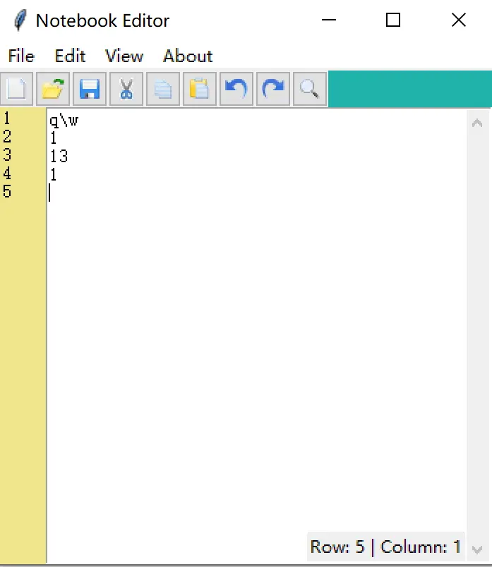

# 实战：多功能文本编辑器（Notebook Editor）

> 对应信源：F-TGD-25《9 tkinter 创建文本编辑器》。综合运用 [Text 组件](../concepts/08-text-widget.md)、[菜单/窗口/对话框](../concepts/05-menus-windows-dialogs.md)、[事件绑定](../concepts/07-events-and-variables.md) 的完整编辑器：行号栏、光标位置、当前行高亮、新建/打开/保存/另存、查找替换、剪切复制粘贴撤销重做、右键菜单、主题切换。



图1 自定义文本编辑器最终效果

## 1 主窗口骨架：行号栏 + 编辑区 + 信息栏

三个长条并排：左侧行号栏是一个 `state='disabled'` 的窄 Text（`takefocus=0` 不抢焦点）；中间主编辑区 `Text(wrap='word', undo=1)` 开启自动换行与撤销栈；右下角光标信息 Label 用 `pack(side='right', anchor='se')` 浮在编辑区上。行号由 `index("end")` 取末行号循环生成，每次内容变化（`<Any-KeyPress>`）刷新：

```python
class WindowMeta(Tk):
    def __init__(self):
        super().__init__()
        self.geometry('350x350')
        self.show_line_number = IntVar(); self.show_line_number.set(1)
        self.create_widgets()
        self.layout()
        self.content_text.bind('<Any-KeyPress>', self.on_content_changed)
        self.content_text.tag_configure('active_line', background='ivory2')
        self.protocol('WM_DELETE_WINDOW', self.exit_editor)

    def get_line_numbers(self):
        output = ''
        if self.show_line_number.get():
            row, _ = self.content_text.index("end").split('.')
            for k in range(1, int(row)):
                output += str(k) + '\n'
        return output

    def update_line_numbers(self, event=None):
        self.line_number_bar.config(state='normal')
        self.line_number_bar.delete('1.0', 'end')
        self.line_number_bar.insert('1.0', self.get_line_numbers())
        self.line_number_bar.config(state='disabled')

    def _create_content_text(self):
        self.content_text = Text(wrap='word', undo=1)
        self.scroll_bar = ttk.Scrollbar(self.content_text)
        self.content_text.configure(yscrollcommand=self.scroll_bar.set)
        self.scroll_bar.config(command=self.content_text.yview)

    def create_widgets(self):
        self.shortcut_bar = ttk.Frame(height=25)
        self.line_number_bar = Text(width=4, padx=3, takefocus=0, border=0,
                                    background='khaki', state='disabled', wrap='none')
        self._create_content_text()
        self.cursor_info_bar = ttk.Label(self.content_text, text='Row: 0 | Column: 0')

    def update_cursor_info_bar(self, event=None):
        row, col = self.content_text.index('insert').split('.')
        self.cursor_info_bar.config(text=f"Row: {row} | Column: {int(col)+1}")

    def on_content_changed(self, event=None):
        self.update_line_numbers()
        self.update_cursor_info_bar()

    def exit_editor(self):
        if messagebox.askokcancel("Quit?", "Really quit?"):
            self.destroy()
```

## 2 文件操作：新建/打开/保存/另存

`filedialog.askopenfilename/asksaveasfilename` 共用同一组参数（`defaultextension` + `filetypes` 过滤器）；标题栏随当前文件名变化——`temp_file_name` 这个 StringVar 用 `trace_add('write', update_title)` 驱动，文件名取路径最后一段：

```python
class Window(WindowMeta):
    file_name_params = {
        'defaultextension': ".txt",
        'filetypes': [("Text Documents", "*.txt"),
                      ("Images", "*.jpg *.gif *.png"),
                      ("All Files", "*.*")]
    }

    def __init__(self, program_name="Notebook Editor"):
        super().__init__()
        self.program_name = program_name
        self.temp_file_name = StringVar()
        self.temp_file_name.trace_add('write', self.update_title)
        self.file_name = StringVar()
        self.update_title()
        self.bind_content_text()

    def update_title(self, *args):
        file_name = self.temp_file_name.get()
        if file_name:
            base_name = Path(file_name).parts[-1]
            self.title(f"{base_name}-{self.program_name}")
        else:
            self.title(self.program_name)

    def new_file(self, event=None):
        self.temp_file_name.set('Untitled')
        self.file_name.set('')
        self.content_text.delete(1.0, 'end')
        self.on_content_changed()

    def open_file(self):
        name = filedialog.askopenfilename(**self.file_name_params)
        self.temp_file_name.set(name)
        if name:
            self.file_name.set(name)
            self.content_text.delete(1.0, 'end')
            with open(name, encoding='utf-8') as _file:
                self.content_text.insert(1.0, _file.read())
            self.on_content_changed()

    def write_to_file(self, file_name):
        try:
            with open(file_name, 'w', encoding='utf-8') as the_file:
                the_file.write(self.content_text.get(1.0, 'end'))
        except IOError:
            messagebox.showwarning("Save", "Could not save the file.")

    def save_as(self, event=None):
        name = filedialog.asksaveasfilename(**self.file_name_params)
        self.temp_file_name.set(name)
        if name:
            self.write_to_file(name)
        return "break"

    def save(self, event=None):
        file_name = self.file_name.get()
        if file_name:
            self.write_to_file(file_name)
        else:
            self.save_as()
        return "break"
```

## 3 查找对话框：Toplevel + search 循环高亮

查找窗口用 `Toplevel` + `transient(self.master)` 挂在主窗上；`Text.search` 从 `start_pos` 循环向后找，每命中一次用 `tag_add('match', start, start+Nc)` 标记，命中数写进查找窗标题；关闭对话框时 `tag_remove` 清除高亮：

```python
    def find_text(self, event=None):
        search_toplevel = Toplevel(self.master)
        search_toplevel.title('Find Text')
        search_toplevel.transient(self.master)
        ttk.Label(search_toplevel, text="Find All:").grid(row=0, column=0, sticky='e')
        search_entry = ttk.Entry(search_toplevel, width=25)
        search_entry.grid(row=0, column=1, padx=2, pady=2, sticky='we')
        search_entry.focus_set()
        ignore_case_value = IntVar()
        ttk.Checkbutton(search_toplevel, text='Ignore Case',
                        variable=ignore_case_value).grid(row=1, column=1, sticky='e')
        ttk.Button(search_toplevel, text="Find All", underline=0,
                   command=lambda: self.search_output(
                       search_entry.get(), ignore_case_value.get(),
                       search_toplevel, search_entry)).grid(row=0, column=2, padx=2, pady=2)

        def close_search_window():
            self.content_text.tag_remove('match', '1.0', 'end')
            search_toplevel.destroy()
        search_toplevel.protocol('WM_DELETE_WINDOW', close_search_window)
        return "break"

    def search_output(self, needle, if_ignore_case, search_toplevel, search_box):
        self.content_text.tag_remove('match', '1.0', 'end')
        matches_found = 0
        if needle:
            start_pos = '1.0'
            while True:
                start_pos = self.content_text.search(
                    needle, start_pos, nocase=if_ignore_case, stopindex='end')
                if not start_pos:
                    break
                end_pos = f'{start_pos}+{len(needle)}c'
                self.content_text.tag_add('match', start_pos, end_pos)
                matches_found += 1
                start_pos = end_pos
            self.content_text.tag_config('match', foreground='red', background='yellow')
        search_box.focus_set()
        search_toplevel.title(f'{matches_found} matches found')
```

## 4 编辑命令：虚拟事件与快捷键

剪切/复制/粘贴/撤销/重做不必自己实现，`event_generate("<<Cut>>")` 等虚拟事件直接复用 Text 内建行为；回调返回 `"break"` 阻止事件继续传播。快捷键在 Text 上绑定（同时绑大写，兼容 CapsLock）：

```python
    def cut(self):  self.content_text.event_generate("<<Cut>>");  self.on_content_changed(); return "break"
    def copy(self): self.content_text.event_generate("<<Copy>>"); return "break"
    def paste(self):self.content_text.event_generate("<<Paste>>"); self.on_content_changed(); return "break"
    def undo(self): self.content_text.event_generate("<<Undo>>"); self.on_content_changed(); return "break"
    def redo(self, event=None):
        self.content_text.event_generate("<<Redo>>"); self.on_content_changed(); return 'break'
    def select_all(self, event=None):
        self.content_text.tag_add('sel', '1.0', 'end'); return "break"

    def bind_content_text(self):
        self.content_text.bind('<Control-n>', self.new_file)
        self.content_text.bind('<Control-N>', self.new_file)
        self.content_text.bind('<Control-o>', self.open_file)
        self.content_text.bind('<Control-s>', self.save)
        self.content_text.bind('<Control-f>', self.find_text)
        self.content_text.bind('<Control-a>', self.select_all)
        self.content_text.bind('<Control-y>', self.redo)
        self.content_text.bind('<KeyPress-F1>', self.display_help_messagebox)
```

## 5 右键上下文菜单

`<Button-3>`（右键）时在鼠标屏幕坐标 `event.x_root/event.y_root` 处 `tk_popup` 弹出菜单：

```python
class Popup:
    def __init__(self, master):
        self.master = master
        self.popup_menu = Menu(self.master.content_text, tearoff=0)
        for m in ('cut', 'copy', 'paste', 'undo', 'redo'):
            cmd = eval(f'self.master.{m}')
            self.popup_menu.add_command(label=m, compound='left', command=cmd)
        self.popup_menu.add_separator()
        self.popup_menu.add_command(label='Select All', underline=7,
                                    command=self.master.select_all)
        self.master.content_text.bind('<Button-3>', self.show_popup_menu)
        self.master.content_text.focus_set()

    def show_popup_menu(self, event):
        self.popup_menu.tk_popup(event.x_root, event.y_root)
```

## 6 菜单栏：File/Edit/View/About 四类拆分

每个菜单是一个 `Menu` 子类，构造时传入 `action`（主窗口）作为命令受体；`add_command` 的 `accelerator` 仅显示快捷键提示，`compound='left' + image` 让菜单项带图标。View 菜单最丰富：三个 `add_checkbutton` 开关（行号栏、光标信息栏、当前行高亮）+ 主题单选子菜单。主题用 `"前景色.#背景色"` 字符串字典存储，切换时 split 出两色配置 Text：

```python
class View(Menu):
    color_schemes = {
        'Default': '#000000.#FFFFFF',
        'Greygarious': '#83406A.#D1D4D1',
        'Aquamarine': '#5B8340.#D1E7E0',
        'Bold Beige': '#4B4620.#FFF0E1',
        'Cobalt Blue': '#ffffBB.#3333aa',
        'Olive Green': '#D1E7E0.#5B8340',
        'Night Mode': '#FFFFFF.#000000',
    }

    def highlight_line(self, interval=100):
        self.action.content_text.tag_remove("active_line", 1.0, "end")
        self.action.content_text.tag_add(
            "active_line", "insert linestart", "insert lineend+1c")
        self.action.content_text.after(interval, self.toggle_highlight)

    def undo_highlight(self):
        self.action.content_text.tag_remove("active_line", 1.0, "end")

    def toggle_highlight(self, event=None):
        if self.to_highlight_line.get():
            self.highlight_line()
        else:
            self.undo_highlight()

    def change_theme(self, event=None):
        fg_bg = self.color_schemes.get(self.theme_choice.get())
        fg, bg = fg_bg.split('.')
        self.action.content_text.config(background=bg, fg=fg)

    def show_cursor_info_bar(self):
        if self.show_cursor_info.get():
            self.action.cursor_info_bar.pack(expand='no', fill=None,
                                              side='right', anchor='se')
        else:
            self.action.cursor_info_bar.pack_forget()

    def generate_menu(self):
        self.add_checkbutton(label='Show Line Number',
                             variable=self.action.show_line_number,
                             command=self.action.update_line_numbers)
        self.show_cursor_info = IntVar(); self.show_cursor_info.set(1)
        self.add_checkbutton(label='Show Cursor Location at Bottom',
                             variable=self.show_cursor_info,
                             command=self.show_cursor_info_bar)
        self.to_highlight_line = BooleanVar()
        self.add_checkbutton(label='Highlight Current Line',
                             variable=self.to_highlight_line,
                             command=self.toggle_highlight)
        self.theme_choice = StringVar(); self.theme_choice.set('Default')
        themes_menu = Menu(self.master, tearoff=0)
        for k in sorted(self.color_schemes):
            themes_menu.add_radiobutton(label=k, variable=self.theme_choice,
                                        command=self.change_theme)
        self.add_cascade(label='Themes', menu=themes_menu)
```

组装入口：菜单栏挂到 `root['menu']`，四个菜单 `add_cascade` 挂接，再实例化 `Popup(root)`：

```python
def test():
    root = Window()
    menu_bar = Menu(root)
    root['menu'] = menu_bar
    menu_bar.add_cascade(label='File',  menu=File(menu_bar, root, tearoff=0))
    menu_bar.add_cascade(label='Edit',  menu=Edit(menu_bar, root, tearoff=0))
    menu_bar.add_cascade(label='View',  menu=View(menu_bar, root, tearoff=0))
    menu_bar.add_cascade(label='About', menu=About(menu_bar, root, tearoff=0))
    Popup(root)
    root.mainloop()
```

## 7 要点回顾

- **行号栏本质**：一个只读窄 Text，内容随主 Text 末行号重生成；两个 Text 并排 pack 即可。
- **索引即数据**：`index('insert')` 返回 `"行.列"`，行列信息、行号、当前行区间（`insert linestart` / `insert lineend+1c`）全部由索引运算得到。
- **虚拟事件复用内建行为**：`<<Cut>>/<<Copy>>/<<Paste>>/<<Undo>>/<<Redo>>` 让编辑命令零实现。
- **查找高亮**：`search` 循环 + tag 标记 + tag_config 配色，命中计数实时反馈；对话框关闭记得清 tag。
- **菜单与窗口解耦**：菜单类只负责结构，命令全部委托给主窗口 `action`；`accelerator` 是显示文本，真快捷键靠 `bind`。
- **轮询高亮**：`after(100, 回调)` 自递归是 tkinter 里做"持续跟随光标"效果的惯用法。

> 相关概念：[Text 组件](../concepts/08-text-widget.md)、[菜单/窗口/对话框](../concepts/05-menus-windows-dialogs.md)、[事件绑定与变量联动](../concepts/07-events-and-variables.md)。