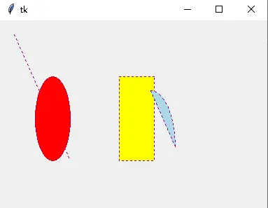
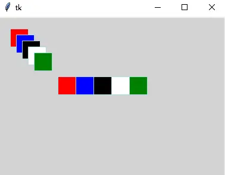
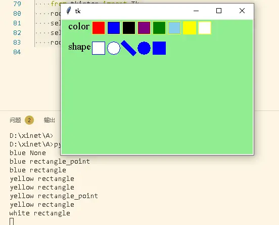
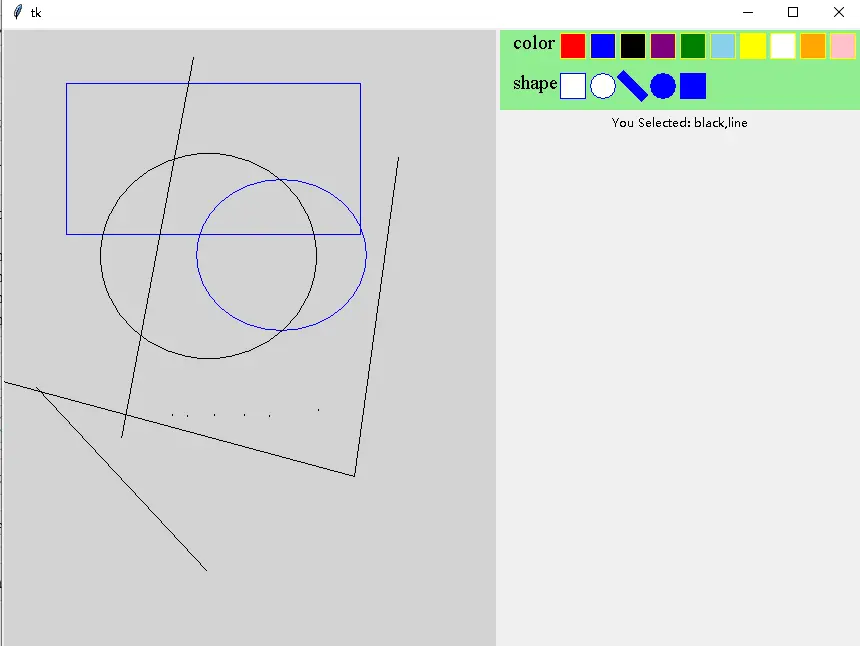

# 实战：鼠标选择图形颜色与形状（Canvas 选择器）

> 对应信源：F-TGD-28《tkinter 使用鼠标选择图形的颜色以及形状》。不使用任何按钮控件，**调色板和形状栏直接画在 Canvas 上**，靠 tag 与 `tag_bind` 实现鼠标点选。是 [自定义画图工具](02-drawing-tool.md) 与 [图形操作案例](03-graphics-ops.md) 中 Selector 的实现原理篇。

## 1 统一绘图接口 Meta.draw_graph

`Meta(Canvas)` 把四类基本图元（line/rectangle/oval/arc）收敛到一个接口：`direction=(x0,y0,x1,y1)` 是鼠标按下到释放的参考笔触；line 的颜色走 `fill`（线无内部），其余走 `outline`；每次成图后自动挂 `graph` 与具体类型两个 tag，方便后续按类批量选取：

```python
from tkinter import Canvas

class Meta(Canvas):
    '''Graphic elements are composed of line(segment), rectangle, ellipse, and arc.'''

    def __init__(self, master=None, cnf={}, **kw):
        super().__init__(master, cnf, **kw)

    def layout(self, row=0, column=0):
        self.grid(row=row, column=column, sticky='nwes')

    def draw_graph(self, graph_type, direction, color='blue', width=1,
                   tags=None, **kwargs):
        '''Draw basic graphic elements.

        graph_type: 'rectangle' | 'oval' | 'line' | 'arc'
        direction: (x0,y0,x1,y1)，鼠标按下点 -> 释放点
        width: 线宽（中心填充）；tags: 图元标签，不能是纯数字
        style: arc 样式 {'arc', 'chord', 'pieslice'}
        '''
        com_kw = {'width': width, 'tags': tags}
        kw = {**com_kw, 'outline': color}
        line_kw = {**com_kw, 'fill': color}
        kwargs.update(line_kw if graph_type == 'line' else kw)
        if graph_type in ('rectangle', 'oval', 'line', 'arc'):
            func = eval(f"self.create_{graph_type}")
            graph_id = func(direction, **kwargs)
            [self.addtag_withtag(tag, graph_id)
             for tag in ('graph', graph_type)]
            return graph_id
        return None
```

测试：同画布画四类图元，`gettags(1)` 查首个图元的 tag，`find_withtag('graph')` 取全部图元 id：

```python
root = Tk()
root.columnconfigure(0, weight=1)
root.rowconfigure(0, weight=1)
self = Meta(root)
kw = {'color': 'purple', 'dash': 2, 'width': 2, 'tags': 'test'}
self.draw_graph('line', [20, 20, 100, 200], **kw)
self.draw_graph('oval', [50, 80, 100, 200], fill='red', **kw)
self.draw_graph('rectangle', [170, 80, 220, 200], fill='yellow', **kw)
self.draw_graph('arc', [180, 100, 250, 260], fill='lightblue', style='chord', **kw)
self.layout(row=0, column=0)
print(self.gettags(1))
print(self.find_withtag('graph'))
```



图1 Meta.draw_graph 统一接口测试

## 2 不同颜色的矩形框

循环偏移 direction 并改 fill 色即可批量成图：

```python
root = Tk()
self = Meta(root, background='lightgray')
start, end = 20, 50
colors = 'red', 'blue', 'black', 'white', 'green'
for k, color in enumerate(colors):
    direction = start+10*k, start+10*k, end+10*k, end+10*k
    self.draw_graph('rectangle', direction, 'lightblue', fill=color)
start += 80; end += 80
for k, color in enumerate(colors):
    direction = start+30*k, start, end+30*k, end
    self.draw_graph('rectangle', direction, 'lightblue', fill=color)
self.grid()
```



图2 两组不同填充色的矩形框

## 3 自绘选择器：色块/形状块即按钮

选择器本身也是一块 Canvas：`create_text` 写 "color"/"shape" 标签，色块用矩形图元、`tags=颜色名`；形状栏画五种形状（rectangle/oval/line/oval_point/rectangle_point），`tags=形状名`。注意画色块时图元会被自动挂上 `rectangle` 类型 tag，选择器不应响应类型 tag，故 `dtag('rectangle')` 把它摘掉：

```python
class Selector(Meta):
    colors = 'red', 'blue', 'black', 'purple', 'green', 'skyblue', 'yellow', 'white'
    shapes = 'rectangle', 'oval', 'line', 'oval_point', 'rectangle_point'

    def __init__(self, master=None, graph_type=None, color=None, cnf={}, **kw):
        super().__init__(master, cnf, **kw)
        self.start, self.end = 15, 50
        self.create_color()
        self.create_shape()
        SelectBind(self)

    def create_color(self):
        '''颜色选择栏'''
        self.create_text((self.start, self.start),
                         text='color', font='Times 15', anchor='w')
        self.start += 10
        for k, color in enumerate(Selector.colors):
            t = 7 + 30*(k+1)
            direction = self.start+t, self.start-20, self.end+t, self.end-20
            self.draw_graph('rectangle', direction, 'yellow',
                            tags=color, fill=color)
        self.dtag('rectangle')

    def create_shape(self):
        '''形状选择栏'''
        self.create_text((self.start-10, self.start+30),
                         text='shape', font='Times 15', anchor='w')
        for k, shape in enumerate(Selector.shapes):
            t = 7 + 30*(k+1)
            direction = self.start+t, self.start+20, self.end+t, self.end+20
            width = 10 if shape == 'line' else 1
            fill = 'blue' if 'point' in shape else 'white'
            self.draw_graph(shape.split('_')[0], direction, 'blue',
                            width=width, tags=shape, fill=fill)
```

## 4 绑定选择：描述符 + tag_bind

`Param` 是一个数据描述符，把状态存进以实例为键的字典，实现"同一描述符、各实例独立"的属性存储。`SelectBind` 遍历每个颜色/形状名，用 `tag_bind(名字, '<1>', 回调)` 给对应图元绑左键点击；lambda 用默认参数捕获当前循环值，点击即把所选颜色/形状写入绑定状态：

```python
class Param:
    def __init__(self):
        self.param = {}

    def __get__(self, obj, objtype):
        return self.param[obj]

    def __set__(self, obj, value):
        self.param[obj] = value

class SelectBind:
    color = Param()
    graph_type = Param()

    def __init__(self, selector, graph_type=None, color=None):
        self.color = color
        self.graph_type = graph_type
        [self.color_bind(selector, c) for c in selector.colors]
        [self.graph_type_bind(selector, s) for s in selector.shapes]
        selector.dtag('all')   # 选择器上的图元不参与作画区的 'all' 选取

    def set_color(self, new_color):
        self.color = new_color
        print(self.color, self.graph_type)

    def set_graph_type(self, new_graph_type):
        self.graph_type = new_graph_type
        print(self.color, self.graph_type)

    def color_bind(self, canvas, color):
        canvas.tag_bind(color, '<1>', lambda e: self.set_color(color))

    def graph_type_bind(self, canvas, graph_type):
        canvas.tag_bind(graph_type, '<1>',
                        lambda e: self.set_graph_type(graph_type))

root = Tk()
selector = Selector(root, background='lightgreen')
selector.grid()
root.mainloop()
```



图3 图形选择器（上排色块、下排形状块，鼠标点选）

与作画画布联动后：右侧选择画笔颜色与形状，左侧鼠标左键拖拽作画（`Drawing` 类，测试入口 `from graph.test import test_Meta, test_Drawing`）：



图4 右侧选颜色形状、左侧左键画图

## 5 要点回顾

- **图元即控件**：Canvas 上的矩形/文字同样可以响应鼠标——`tag_bind(tag, '<1>', cb)` 是给图元绑事件的唯一方式，tag 名就是"按钮 id"。
- **自动 tag 管理**：`addtag_withtag` 追加 tag、`dtag` 删除 tag；成图自动挂 `graph`/类型 tag 后，选择器这类"非作图"图元要及时 `dtag` 避免被批量操作误伤。
- **闭包捕获循环变量**：循环里绑 lambda 必须用默认参数（`lambda e, c=color: ...`）或本例的工厂方法传参，否则所有回调共享最后一个循环值。
- **描述符存状态**：`Param` 用 `{实例: 值}` 字典让类属性级描述符在多实例间互不干扰，是比 `__init__` 声明更灵活的状态挂载方式。

> 相关概念：[Canvas 画布](../concepts/09-canvas.md)、[事件绑定与变量联动](../concepts/07-events-and-variables.md)。姊妹实战：[自定义画图工具](02-drawing-tool.md)、[图形操作案例](03-graphics-ops.md)。