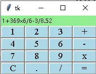
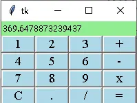
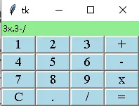
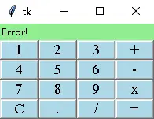

# 实战：极简复杂算式计算器

> 对应信源：F-TGD-30《tkinter 创建可以输入复杂算式的计算器》。作者对比 PyQt5 实现后，用 tkinter 以尽可能少的代码完成同一计算器：**按键全部用 `ttk.Label` 伪装**（`relief='raise'` 凸起 + `<1>` 绑定点击），按键布局由一张二维字符表驱动生成。

## 1 完整实现

设计要点：

- **数据驱动按键**：`names = ['123+', '456-', '789×', 'C./=']` 四行字符串，每行每个字符是一个键，列表推导批量生成 4×4 按键网格；
- **算式累积**：`self.values` 列表逐键 append 字符，`''.join` 拼成算式实时显示；
- **求值**：按 `=` 时把全角乘号 `×` 替换为 Python 的 `*`，去掉末尾的 `=` 后 `eval`——因此支持任意复杂算式（括号、小数、连算）；异常统一显示 `Error!`；
- **样式**：`ttk.Style` 配置 `BW.TLabel`（浅蓝底、Times 14），结果区浅绿底；
- **自适应**：结果行与按键帧、按键帧内 5 行 5 列全部设 `weight`，窗口缩放时间距等比拉伸。

```python
from tkinter import Tk, StringVar, ttk

class App(Tk):
    def __init__(self):
        super().__init__()
        self.result = StringVar()
        self.result_label = ttk.Label(self, textvariable=self.result,
                                      background='lightgreen', width=15)
        self.cal_frame = ttk.Frame(self, relief='solid')
        self.values = []
        self.names = ['123+', '456-', '789×', 'C./=']
        style = ttk.Style(self)
        style.configure("BW.TLabel", foreground="black",
                        background="lightblue", font='Times 14')
        self.widgets = self.create_widgets(self.names)

    def create_button(self, key):
        widget = ttk.Label(self.cal_frame, text=key, anchor='center',
                          width=5, relief='raise', style="BW.TLabel")
        widget.bind('<1>', lambda event: self.get_value(event, key))
        return widget

    def create_widgets(self, names):
        return [[self.create_button(key) for key in row] for row in names]

    def layout(self):
        self.result_label.grid(row=0, column=0, sticky='nsew')
        self.cal_frame.grid(row=1, column=0, sticky='nsew')
        for m, row in enumerate(self.widgets):
            for n, widget in enumerate(row):
                widget.grid(row=m, column=n, sticky='we')

    def get_value(self, event, key):
        self.values.append(key)
        res = ''.join(self.values)
        self.result.set(res)
        if key == '=':
            res = res.replace('×', '*')[:-1]
            try:
                self.result.set(eval(res))
            except:
                self.result.set('Error!')
            finally:
                self.values = []
        elif key == 'C':
            self.result.set('')
            self.values = []

root = App()
root.layout()
root.columnconfigure(0, weight=1)
root.rowconfigure(0, weight=2)
root.rowconfigure(1, weight=2)
for k in range(5):
    root.cal_frame.rowconfigure(k, weight=2)
    root.cal_frame.columnconfigure(k, weight=1)
root.mainloop()
```

## 2 运行效果

输入算式过程中结果区实时回显完整算式：



图1 输入算式

点击 `=` 输出计算结果：



图2 点击 = 输出计算结果

算式有误（如运算符连写、括号不匹配）时 eval 抛异常：



图3 错误的算式

统一兜底显示 `Error!`，并重置按键缓存等待下一次输入：



图4 输出 Error

## 3 要点回顾

- **Label 伪装按钮**：无命令状态需求时，`ttk.Label(relief='raise') + bind('<1>', cb)` 比 Button 更轻量，样式也更统一。
- **字符表驱动 UI**：二维字符串同时编码了按键的位置、文案与数量，循环生成控件，增删键只改字符串。
- **eval 的边界**：`eval` 直接求值让"复杂算式"零成本支持，但生产环境应替换为受限表达式解析器（如 `ast` 白名单求值），避免任意代码执行；异常兜底是必备防线。
- **符号映射**：UI 显示全角/数学符号（`×`），求值前统一映射为 Python 运算符（`*`）。

> 相关概念：[基础 widgets（Label/Button）](../concepts/02-basic-widgets.md)、[事件绑定与变量联动](../concepts/07-events-and-variables.md)、[几何管理器 Grid](../concepts/03-geometry-managers.md)。