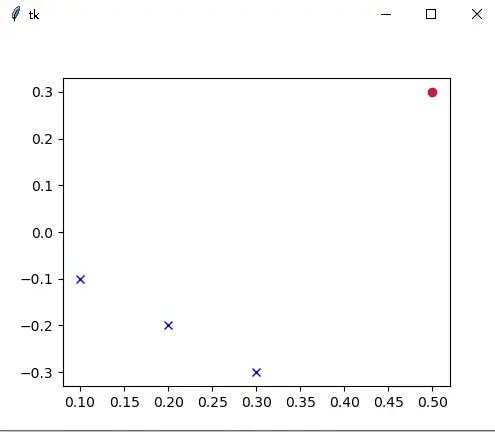
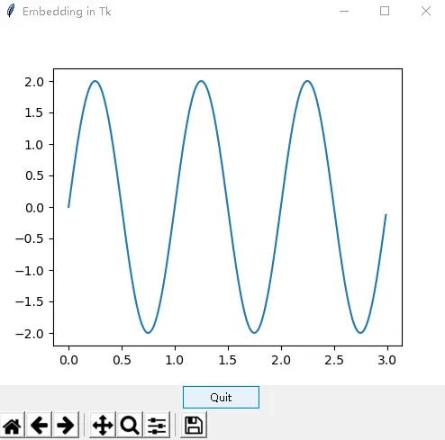
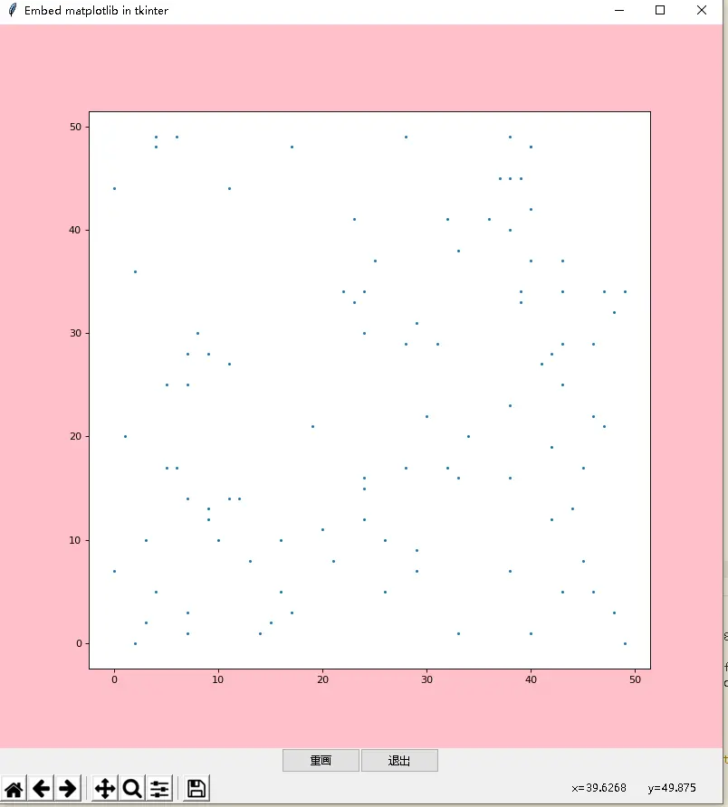

# 实战：tkinter 嵌入 Matplotlib 绘图

> 对应信源：F-TGD-33《tkinter 嵌入到 Matplotlib》。把 Matplotlib 图表作为 tkinter 控件嵌入窗口，可与普通 ttk 控件混用、叠加原生 Canvas 图元、按钮触发重绘。颜色与标记样式表单见 `matplotlib.colors`、`matplotlib.markers`。

## 1 最小嵌入

四步：① `matplotlib.use("TkAgg")` 指定 Tk 后端；② 用 Matplotlib 的 `Figure` 建画布并 `add_subplot` 绘图；③ `FigureCanvasTkAgg(figure, root)` 包装成 tk 控件；④ `get_tk_widget()` 取出底层控件用 grid/pack 布局：

```python
from tkinter import *
from tkinter.ttk import *
import matplotlib
matplotlib.use("TkAgg")
from matplotlib.figure import Figure
from matplotlib.backends.backend_tkagg import FigureCanvasTkAgg

figure = Figure(figsize=(5, 4), dpi=100)
plot = figure.add_subplot(1, 1, 1)
plot.plot(0.5, 0.3, color="#C41E3A", marker="o", linestyle="")
x = [0.1, 0.2, 0.3]
y = [-0.1, -0.2, -0.3]
plot.plot(x, y, color="blue", marker="x", linestyle="")

root = Tk()
canvas = FigureCanvasTkAgg(figure, root)
canvas.get_tk_widget().grid(row=0, column=0)
root.mainloop()
```



图1 最小嵌入：两类散点

## 2 完整嵌入：工具栏 + 快捷键 + 退出

`NavigationToolbar2Tk(canvas, root)` 生成 Matplotlib 自带工具条（缩放/保存/平移），`toolbar.update()` 刷新布局；`canvas.mpl_connect("key_press_event", on_key_press)` 把按键事件交给 `key_press_handler`，复用 Matplotlib 默认快捷键（如 q 退出、s 保存）。退出必须先 `quit()` 停 mainloop 再 `destroy()`（Windows 上顺序反了会触发 `PyEval_RestoreThread: NULL tstate` 致命错误）：

```python
from tkinter import Tk, ttk
from matplotlib.backends.backend_tkagg import (
    FigureCanvasTkAgg, NavigationToolbar2Tk)
from matplotlib.backend_bases import key_press_handler
from matplotlib.figure import Figure
import numpy as np

def create_figure():
    fig = Figure(figsize=(5, 4), dpi=100)
    t = np.arange(0, 3, .01)
    fig.add_subplot(111).plot(t, 2 * np.sin(2 * np.pi * t))
    return fig

def on_key_press(event):
    print("you pressed {}".format(event.key))
    key_press_handler(event, canvas, toolbar)

def _quit():
    root.quit()      # stops mainloop
    root.destroy()   # Windows 上必不可少

root = Tk()
root.wm_title("Embedding in Tk")
fig = create_figure()
canvas = FigureCanvasTkAgg(fig, master=root)
canvas.draw()
toolbar = NavigationToolbar2Tk(canvas, root)
toolbar.update()
canvas.get_tk_widget().pack(side='top', fill='both', expand=1)
canvas.mpl_connect("key_press_event", on_key_press)
ttk.Button(master=root, text="Quit", command=_quit).pack(side='bottom')
root.mainloop()
```



图2 带工具栏与正弦曲线的完整嵌入

## 3 类封装：重绘按钮 + tk 图元叠加

界面与逻辑分离的 `Application(Tk)`：建图时 `Figure(figsize, dpi, facecolor, edgecolor, frameon)` 可设画布底色；**重绘范式**是 `ax.clear()` 清空坐标轴 → 重新绘图 → `canvas.draw()` 刷新。关键技巧：`get_tk_widget()` 返回的就是一个原生 `tk.Canvas`，可直接对它调 `create_rectangle` 等 tk 图元方法，Matplotlib 图层与 tk 图元图层同屏叠加：

```python
import matplotlib
matplotlib.use("TkAgg")
import numpy as np
from matplotlib.backends.backend_tkagg import (
    FigureCanvasTkAgg, NavigationToolbar2Tk)
from matplotlib.figure import Figure
from tkinter import Tk, ttk

class Application(Tk):
    '''界面与逻辑分离的 Matplotlib 嵌入程序'''

    def __init__(self):
        super().__init__()
        self.wm_title("Embed matplotlib in tkinter")
        self.createWidgets()

    def create_figure_canvas(self, figure):
        self.canvas = FigureCanvasTkAgg(figure, master=self)
        tkcanvas = self.canvas.get_tk_widget()
        # 底层就是 tk.Canvas，可直接叠加 tk 图元
        tkcanvas.create_rectangle([20, 20, 200, 200], fill='red')
        toolbar = NavigationToolbar2Tk(self.canvas, self)
        toolbar.update()
        footframe = ttk.Frame(master=self)
        footframe.pack(side='bottom')
        tkcanvas.pack(side='top', fill='both', expand=1)
        ttk.Button(master=footframe, text='重画', command=self.draw).pack(side='left')
        ttk.Button(master=footframe, text='退出', command=self._quit).pack(side='left')
        self.draw()

    def createWidgets(self):
        fig = Figure(figsize=(10, 10), dpi=80, facecolor="pink",
                     edgecolor='green', frameon=True)
        self.ax = fig.add_subplot(111)
        self.create_figure_canvas(fig)

    def draw(self):
        '''重绘：清坐标轴 -> 重新画 -> 刷新画布'''
        x = np.random.randint(0, 50, size=100)
        y = np.random.randint(0, 50, size=100)
        self.ax.clear()
        self.ax.scatter(x, y, s=3)
        self.canvas.draw()

    def _quit(self):
        self.quit()
        self.destroy()

if __name__ == '__main__':
    Application().mainloop()
```



图3 类封装：散点重绘 + 红色矩形 tk 图元 + 底部按钮

## 4 要点回顾

- **四步嵌入**：选 TkAgg 后端 → `Figure` 建图 → `FigureCanvasTkAgg` 包装 → `get_tk_widget()` 布局。
- **首帧要 draw**：包装后调一次 `canvas.draw()` 才会渲染；数据更新后重绘走 `ax.clear() → 重画 → canvas.draw()`。
- **工具栏与快捷键**：`NavigationToolbar2Tk` 零代码获得缩放/保存工具条；`key_press_handler` 复用默认按键绑定。
- **图层混用**：`get_tk_widget()` 是原生 `tk.Canvas`，tk 图元（矩形/文字/线条）可与 Matplotlib 图表同屏叠加。
- **退出顺序**：`quit()` 后 `destroy()`，Windows 上不可省略 destroy。

> 相关概念：[Canvas 画布](../concepts/09-canvas.md)、[样式、MVC 与资源](../concepts/10-styles-mvc-resources.md)。