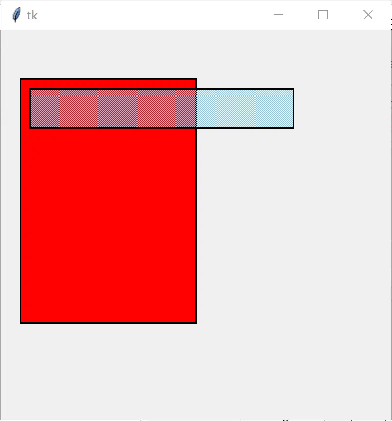
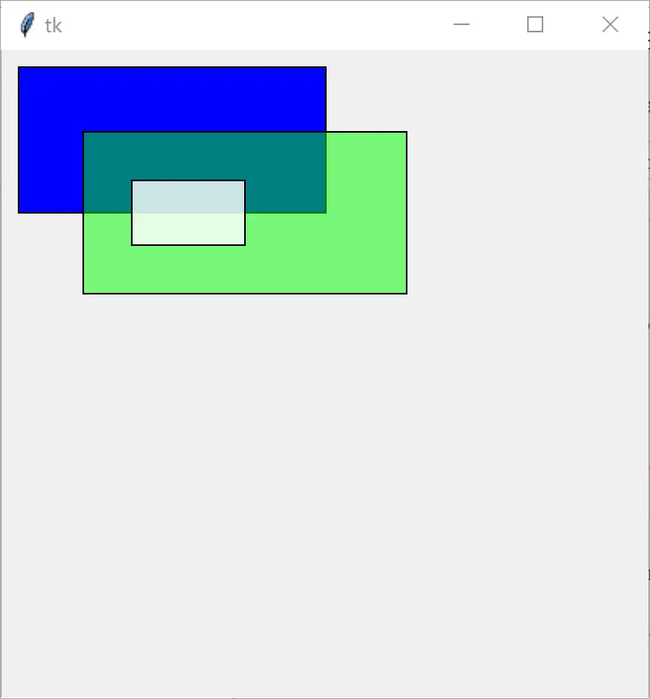

# 实战：Canvas 图形透明度（stipple 与 PIL 两种方案）

> 对应信源：F-TGD-34《设置 tkinter canvas 的图形的透明度》（参考 StackOverflow "How to make a tkinter canvas rectangle transparent?"）。**tkinter Canvas 图元原生不支持 alpha 通道**，本文给出两种应对：位图填充（伪透明）与 PIL 透明位图叠加（真透明）。

## 1 方法 1：stipple 位图填充

`stipple`/`activestipple` 指定点阵位图（如 `gray50`、`gray25`、`gray12`、`gray75`），用像素疏密模拟半透明效果；`active*` 系列选项只在鼠标悬停/按压时生效：

```python
from tkinter import Tk, Canvas

root = Tk()
root.geometry("400x400+100+100")   # WIDTHxHEIGHT+X+Y
canvas = Canvas(root)
canvas.create_rectangle(20, 50, 200, 300, outline="black",
                        width=2, fill='red')
canvas.create_rectangle(30, 60, 300, 100, outline="black",
                        width=2, activefill='skyblue',
                        activestipple="gray50")
canvas.pack(fill='both', expand=1)
root.mainloop()
```



图1 位图填充模拟透明（交互态）

缺点明显：只有固定几档点阵、只能表达"灰度网纹"而非真正的颜色混合，且 active 版本仅在交互态出现。

## 2 方法 2：PIL 透明位图叠加（真透明）

思路：tkinter 虽不能给矩形设 alpha，但可以显示一张带 alpha 通道的图片——用 PIL 造一张 RGBA 半透明位图，`create_image` 贴到矩形区域。关键细节：

- `winfo_rgb(fill)` 把颜色名/`#rrggbb` 转成 16 位/通道的 RGB 元组，再拼上 alpha 字节；
- alpha 参数取 `0~1`，乘 255 转成 `0~255`；
- `Image.new('RGBA', (w, h), fill)` 建纯色透明位图，`ImageTk.PhotoImage` 转 tk 可用图片；
- **图片引用必须常驻**（存进 `images` 列表），否则函数返回后被垃圾回收，画布上只剩空白；
- `create_image(x1, y1, image=..., anchor='nw')` 让图片左上角对齐矩形左上角；矩形边框仍用 `create_rectangle` 画（透明位图只负责填充）。

```python
from tkinter import Tk, Canvas
from PIL import Image, ImageTk

images = []   # 常驻引用，防止 PhotoImage 被垃圾回收

def create_rectangle(x1, y1, x2, y2, **kwargs):
    if 'alpha' in kwargs:
        alpha = int(kwargs.pop('alpha') * 255)
        fill = kwargs.pop('fill')
        fill = root.winfo_rgb(fill) + (alpha,)
        image = Image.new('RGBA', (x2-x1, y2-y1), fill)
        images.append(ImageTk.PhotoImage(image))
        canvas.create_image(x1, y1, image=images[-1], anchor='nw')
    canvas.create_rectangle(x1, y1, x2, y2, **kwargs)

root = Tk()
root.geometry("400x400+100+100")
canvas = Canvas(root)

create_rectangle(10, 10, 200, 100, fill='blue')
create_rectangle(50, 50, 250, 150, fill='green', alpha=.5)
create_rectangle(80, 80, 150, 120, fill='skyblue', alpha=.8)
canvas.pack(fill='both', expand=1)
root.mainloop()
```



图2 PIL 方案实现真正的颜色叠加透明

## 3 类封装：透明矩形 + 画布拖拽平移

`Graph(Canvas)` 把透明逻辑收进 `draw_rectangle`（`alpha` 走 PIL 蒙版、`tags` 等其余参数透传给原生 `create_rectangle`）；蒙版图存 `self.rectangle_selector` 保引用。另示范 `scan_mark`/`scan_dragto`：左键按下记录扫描原点、拖动时快速平移画布（类似抓手工具）：

```python
from tkinter import Tk, Canvas
from PIL import Image, ImageTk

class Graph(Canvas):
    '''Graphic elements are composed of line(segment), rectangle, ellipse, and arc.'''

    def __init__(self, master=None, cnf={}, **kw):
        super().__init__(master, cnf, **kw)
        self.rectangle_selector = []
        self.tag_bind('current', "<ButtonPress-1>", self.scroll_start)
        self.tag_bind('current', "<B1-Motion>", self.scroll_move)

    def scroll_start(self, event):
        self.scan_mark(event.x, event.y)

    def scroll_move(self, event):
        self.scan_dragto(event.x, event.y, gain=1)

    def create_mask(self, size, alpha, fill):
        '''设置透明蒙版'''
        fill = self.master.winfo_rgb(fill) + (alpha,)
        return Image.new('RGBA', size, fill)

    def draw_rectangle(self, x1, y1, x2, y2, **kw):
        if 'alpha' in kw:
            size = x2-x1, y2-y1
            alpha = int(kw.pop('alpha') * 255)
            fill = kw.pop('fill')
            image = self.create_mask(size, alpha, fill)
            self.rectangle_selector.append(ImageTk.PhotoImage(image))
            self.create_image(x1, y1, image=self.rectangle_selector[-1],
                              anchor='nw', tags='mask')
        return self.create_rectangle(x1, y1, x2, y2, **kw)

root = Tk()
root.geometry("400x400+100+100")
self = Graph(root)
self.draw_rectangle(10, 10, 200, 100, fill='blue')
self.draw_rectangle(50, 50, 250, 150, fill='green', alpha=.5, tags='selected')
self.draw_rectangle(80, 80, 150, 120, fill='yellow', alpha=.8)
self.pack(fill='both', expand=1)
root.mainloop()
```

## 4 要点回顾

- **tkinter 无原生 alpha**：`stipple` 是点阵伪透明（档位固定、仅灰度网纹）；真透明须绕道图片。
- **PIL 四步**：`winfo_rgb` 转色 → 拼 alpha → `Image.new('RGBA')` → `create_image` 叠加；边框另画。
- **防 GC**：所有 `PhotoImage` 必须挂到长生命周期对象（实例属性/全局列表），否则图像静默消失。
- **alpha 量纲**：API 入参用 0~1 浮点，内部 `*255` 转字节。
- **抓手平移**：`scan_mark(x,y)` + `scan_dragto(x,y,gain=1)` 是 Canvas 内置的快速平移能力，无需自己算 scrollregion。

> 相关概念：[Canvas 画布](../concepts/09-canvas.md)。嵌入复杂图表可改用 Matplotlib 后端，见 [tkinter 嵌入 Matplotlib](11-embed-matplotlib.md)。