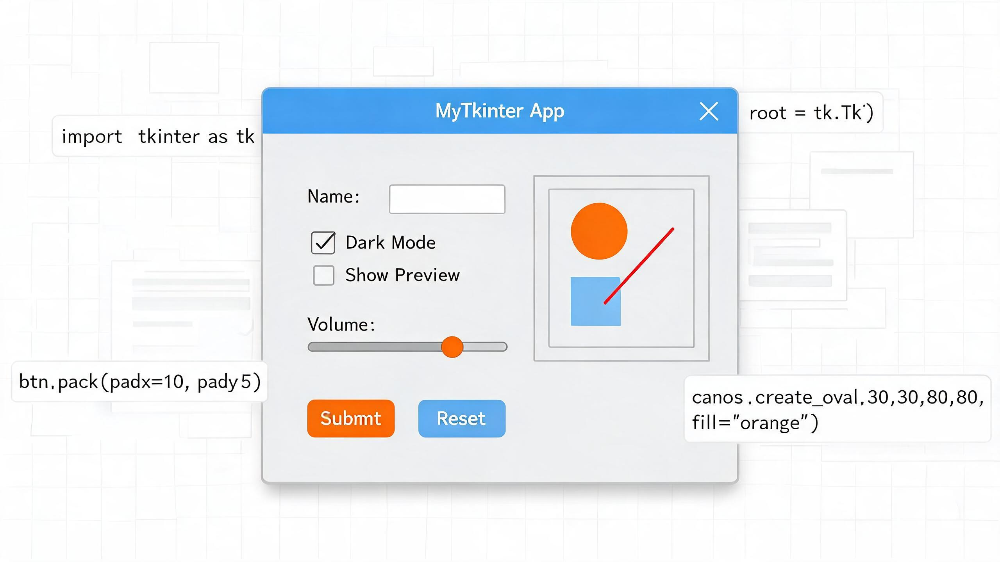
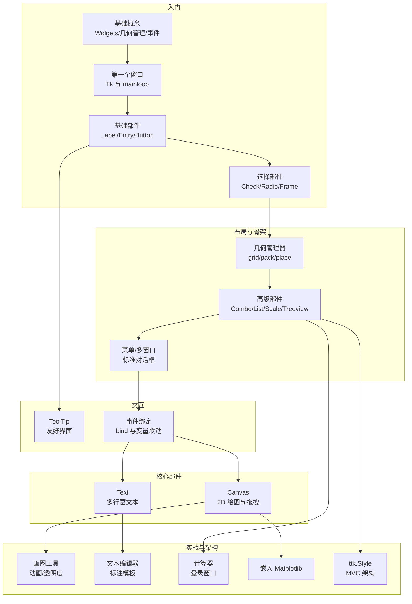

# tkinter GUI 设计知识包



本知识包整理自简书作者 **水之心**（xinetzone，GitHub 同名）的公开文集 **《tkinter GUI 设计》**（34 篇，2019-12 ~ 2020-06），为 Python 标准库 tkinter（Tcl/Tk 图形界面）的系统化学习笔记，覆盖从基础概念、主题化部件、几何布局、菜单窗口、事件机制，到 Text 富文本、Canvas 绘图、样式与 MVC 架构的完整桌面开发链路，并附登录窗口、画图工具、计算器、文本编辑器、Matplotlib 嵌入等实战项目。

- **信源登记**：F-TGD-01 ~ F-TGD-34，全部 34 篇原文可溯源（见 [信源登记](references/sources.md)）
- **内容组织**：10 篇概念文档（按学习路径递进）+ 12 篇实战/示例文档
- **视觉资产**：142 张原文截图完整本地化，Markdown 引用零缺失；50 张数学公式图转写为行内文本
- **时效性**：tkinter 为 Python 标准库，API 长期稳定；Python 3.x（含 3.14）下全部机制适用

## 知识地图



## 目录

- **concepts/**：10 篇概念文档，按"入门 → 部件 → 布局 → 骨架 → 交互 → 核心部件 → 架构"递进，见 [概念体系](concepts/index.md)
- **examples/**：12 篇实战/示例文档（登录窗口、画图工具、图形操作、标注模板、小例子集、Canvas 例子、文本编辑器、颜色形状选择器、计算器、动画拖拽、Matplotlib 嵌入、透明度），见 [实战示例](examples/index.md)
- **references/**：[信源登记](references/sources.md)（F-TGD-01 ~ F-TGD-34）与官方文档入口，见 [参考资料](references/index.md)
- **[log.md](log.md)**：变更日志

## 推荐学习路径

1. 零基础上手：概念 1 → 2 → 3（理解三大概念、能写出表单窗口），配合实战 1（登录窗口）与 5（小例子 18 则）；
2. 完整应用：概念 4 → 5 → 7（高级部件、菜单窗口、事件联动），配合实战 9（计算器）、8（颜色形状选择器）；
3. 核心部件深入：概念 8（Text 富文本）→ 9（Canvas 绘图），配合实战 7（文本编辑器）、2（画图工具）、6/10（Canvas 例子与动画拖拽）；
4. 架构与拓展：概念 10（样式与 MVC）收口，配合实战 11（嵌入 Matplotlib）、12（透明度方案）、3/4（图形操作与标注模板）。

```{toctree}
:maxdepth: 1

concepts/index
examples/index
references/index
log
```