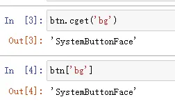
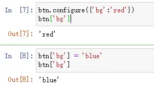
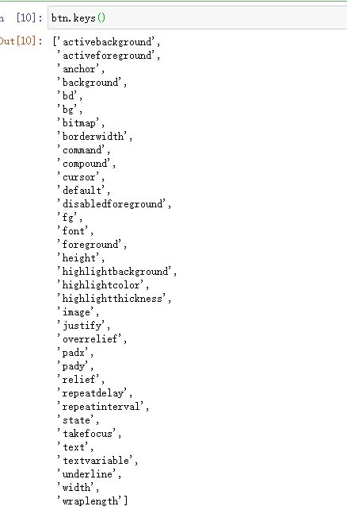
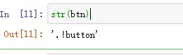

# 微件体系、Mixins 委派与配置管理

## 常用微件

tkinter 模块提供与 Tk 各窗口小部件类型对应的类。常用微件如下：[^F-THB-01]

| 组件 | 描述 |
| --- | --- |
| **Button** | 简单按钮，用于执行命令或其他操作 |
| **Canvas** | 结构化图形微件，可绘制图形、创建图形编辑器以及实现自定义微件 |
| **Checkbutton** | 表示具有两个不同值的变量，单击在值之间切换 |
| **Entry** | 文本输入字段（单行） |
| **Frame** | 容器微件，可有边框和背景，用于对其他微件分组 |
| **Label** | 显示文本或图像 |
| **Listbox** | 显示候选列表，可配置为单选或多选行为 |
| **Menu** | 菜单窗格，用于下拉菜单和弹出菜单 |
| **Menubutton** | 菜单按钮，用于实现下拉菜单 |
| **Message** | 显示文字，类似 Label，但可自动将文本换行到给定宽度或纵横比 |
| **Radiobutton** | 表示多值变量的一个值，单击将变量设为该值并清除同组其他单选按钮 |
| **Scale** | 通过拖动"滑块"设置数值 |
| **Scrollbar** | 供 Canvas、Entry、Listbox、Text 使用的标准滚动条 |
| **Text** | 格式化文本显示，可编辑多样式文本，支持嵌入图像和窗口 |
| **Toplevel** | 显示为独立顶级窗口的容器微件 |
| **LabelFrame** | Frame 变体，可绘制边框和标题 |
| **PanedWindow** | 在可调整大小的窗格中组织子微件的容器 |
| **Spinbox** | Entry 变体，用于从范围或有序集合中选择值 |

所有微件都提供 `Misc` 服务、几何管理方法、配置管理方法以及微件自身定义的方法；`Toplevel` 类还提供窗口管理器界面（window manager interface）。[^F-THB-01]

## Mixins 与委派（delegation）

tkinter 提供许多 Mix-In 类（mixin 是为多重继承组合而设计的类）。**使用 tkinter 时切勿直接访问 mixin 类**：[^F-THB-01]

- **Misc**：由根窗口和所有微件类用作 mixin，提供大量与 Tk 和窗口相关的服务，适用于所有 tkinter 核心微件。服务通过**委派**（delegation）完成——微件仅把请求转发给适当的内部对象。
- **Wm**：由根窗口和 `Toplevel` 用作 mixin，同样通过委派提供窗口管理器服务。
- **Grid / Pack / Place**：被微件类用作 mixin，通过委派访问三种几何管理器（`grid()` / `pack()` / `place()` 方法）。

委派简化了应用代码：一旦拿到微件实例，就可以通过它访问 tkinter 的所有部分。

继承关系上，`Misc` 派生所有组件的基类 `BaseWidget`，`BaseWidget` 派生通用 GUI 组件 `Widget`；tkinter 所有 GUI 组件都是 `Widget` 的子类。`Widget` 除 `BaseWidget` 外还有三个父类 `Pack`、`Place`、`Grid`，即三个布局管理器，负责管理所包含组件的大小和位置。[^F-THB-01]

## 配置管理：cget / config / keys

`Misc` 提供设置和查询组件配置项的方法，源码骨架如下：[^F-THB-01]

```python
class Misc:
    def configure(self, cnf=None, **kw):
        """Configure resources of a widget."""
        return self._configure('configure', cnf, kw)

    config = configure

    def cget(self, key):
        """Return the resource value for a KEY given as string."""
        return self.tk.call(self._w, 'cget', '-' + key)

    __getitem__ = cget

    def __setitem__(self, key, value):
        self.configure({key: value})
```

用法要点：

1. **`cget("option")`**：返回给定 option 的当前值（选项名和返回值都是字符串），也可用索引方式 `widget["option"]` 获取（`__getitem__` 即 cget）。

```python
import tkinter as tk

root = tk.Tk()
btn = tk.Button(root)
```



2. **`config({key: value})`**（等同 `configure`，由 `__setitem__` 重载）：设定选项值，也可用 `widget["key"] = value` 赋值。



一次设定多个配置项：

```python
btn.configure({'bg': 'red', 'fg': 'blue'})
```

不带参数调用 `btn.configure()` 返回全部配置项及其当前值。

3. **`keys()`**：仅返回全部配置项的名称。



4. **name 选项例外**：要获取 `name` 选项不能用 cget/config，请改用 `str(widget)`。



## name 标识与微件路径名树

tkinter 使用 `name` 选项标识小部件，且**只能在创建小部件时设置**：[^F-THB-20]

```python
root = tk.Tk()
t = tk.Toplevel(root, name='a')
f = tk.Frame(t, name='child')
t, f
# 输出：
# (<tkinter.Toplevel object .a>, <tkinter.Frame object .a.child>)
```

小部件以 `.` 标识组件之间的继承关系。不显式命名时，Tk 自动生成 `!类名` 形式的路径段：

```python
root = tk.Tk()
t = tk.Toplevel(root)
f = tk.Frame(t)
f2 = tk.Frame(t)
b = tk.Button(f2)
for name in str(b).split('.'):
    print(name, name.isidentifier())
# 输出：
#  False
# !toplevel False
# !frame2 False
# !button False
```

微件的继承关系可看作一棵树，`widget._w` 即其 Tk 路径名，与 `str(widget)` 相等：

```python
print(str(b) == b._w)   # True
b._w, repr(b)
# ('.!toplevel.!frame2.!button',
#  '<tkinter.Button object .!toplevel.!frame2.!button>')
```

[^F-THB-01]: 简书《tkinter 基本概念梳理》，见[信源登记](../references/sources.md)。
[^F-THB-20]: 简书《tkinter 深度解析》，见[信源登记](../references/sources.md)。
