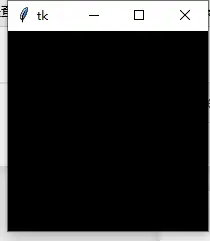
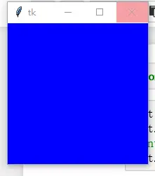

# 微件样式：颜色、字体、文本格式、边框与焦点高亮

所有 tkinter 标准微件都提供一组基本的 "styling" 选项，用于修改颜色、字体和其他视觉效果。[^F-THB-01]

## 颜色

大多数微件用 `background`（可简写 `bg`）和 `foreground`（可简写 `fg`）选项指定微件底色与文本颜色。指定颜色有两种方式：颜色名称，或显式给出红/绿/蓝（RGB）分量。[^F-THB-01]

**颜色名称**：tkinter 内置颜色数据库，把颜色名映射到 RGB 值，既包括 Red、Green、Blue、Yellow、LightBlue 等通用名，也包括 Moccasin、PeachPuff 等"奇特"名称。X 窗口系统上颜色名由 X 服务器定义（通常有 `xrgb.txt` 文件）；Windows 和 Mac 上颜色名表内置在 Tk 中。Windows 下还可使用系统颜色（用户可在控制面板更改）：SystemActiveBorder、SystemActiveCaption、SystemAppWorkspace、SystemBackground、SystemButtonFace、SystemButtonHighlight、SystemButtonShadow、SystemButtonText、SystemCaptionText、SystemDisabledText、SystemHighlight、SystemHighlightText、SystemInactiveBorder、SystemInactiveCaption、SystemInactiveCaptionText、SystemMenu、SystemMenuText、SystemScrollbar、SystemWindow、SystemWindowFrame、SystemWindowText。[^F-THB-01]

颜色名不区分大小写，单词间可有可无空格：`"lightblue"`、`"light blue"`、`"Light Blue"` 表示同一颜色。

**RGB 规范**：使用 `#RRGGBB` 格式字符串，RR/GG/BB 为红/绿/蓝的十六进制值：

```python
tk_rgb = "#%02x%02x%02x" % (128, 192, 200)
```

Tk 还支持 `#RGB`（每通道 16 级）和 `#RRRRGGGGBBBB`（每通道 65536 级）格式。用 `winfo_rgb` 可把颜色字符串转为 RGB 三元组——注意返回的是 **16 位** RGB 值（0–65535），映射到常见的 0–255 范围需除以 256：[^F-THB-01]

```python
rgb = widget.winfo_rgb("red")
red, green, blue = rgb[0]/256, rgb[1]/256, rgb[2]/256
```

## 字体

显示文本的微件可用 `font` 选项指定字体。从 Tk 8.0 起支持平台无关的字体描述符：一个元组，包含 family（字体族）、以磅为单位的高度，以及一个或多个样式字符串：[^F-THB-01]

```python
("Times", 10, "bold")
("Helvetica", 10, "bold italic")
("Symbol", 8)
# 也可用字符串形式：
"Times 10 bold"
"Helvetica 10 bold italic"
"Symbol 8"
```

Windows 平台支持的字体包括 Arial（对应 Helvetica）、Courier New（Courier）、Comic Sans MS、Fixedsys、MS Sans Serif、MS Serif、Symbol、System、Times New Roman（Times）、Verdana 等；样式有 `normal`、`bold`、`roman`、`italic`、`underline`、`overstrike`。

`tkinter.font` 模块提供 `Font` 类，可创建字体实例在任何接受字体说明符的地方使用，还可获取字体指标（给定字符串占用的大小）：

```python
font.Font(family="Times", size=10, weight=tkFont.BOLD)
font.Font(family="Helvetica", size=10, weight=tkFont.BOLD, slant=tkFont.ITALIC)
font.Font(family="Symbol", size=8)
```

`tkinter.font.Font` 常用参数：[^F-THB-01]

| 参数 | 介绍 |
| --- | --- |
| family | 字体族（Font family） |
| size | 字号（磅）；用负值表示以像素为单位 |
| weight | 字重：`'normal'`（默认）或 `'bold'` |
| slant | 倾斜：`'normal'`（默认）、`'italic'` 或 `'roman'` |
| underline | 下划线：1 为加下划线，默认 0 |
| overstrike | 删除线：1 为在文字上画线，默认 0 |

修改微件字体用 `config(font=...)`。

## 文本格式

Label/Button 通常只有一行文本，tkinter 也支持多行：在文本中插入换行符 `\n` 即可；默认行居中，可用 `justify`（对齐）选项设为 `left` 或 `right`（默认 `center`）。`wraplength` 选项设置最大宽度，微件会自动把文本折成多行——tkinter 尽量在空白处换行，微件太窄时可能拆开单个单词。[^F-THB-01]

## 边框：Relief 与焦点高亮

所有 tkinter 微件都有边框（部分默认不显示），边框由可选的 3D 浮雕和焦点突出区域组成。[^F-THB-01]

**浮雕（Relief）**：

- `borderwidth`（可简写 `bd`）：边框宽度（像素），多数微件默认 1–2 像素；
- `relief`：3D 边框绘制方式，可选 `'sunken'`、`'raised'`、`'groove'`、`'ridge'`、`'flat'`。

**焦点高亮（Focus Highlights）**——指示微件（或其子级）拥有键盘焦点的额外边框，通常在浮雕外侧：

- `highlightcolor`：微件拥有键盘焦点时高亮区域的颜色（通常黑色或其他鲜明对比色）；
- `highlightbackground`：无焦点时高亮区域的颜色（通常与微件背景相同）；
- `highlightthickness`：高亮区域宽度（像素），可获取焦点的微件通常为 1–2 像素。

> **Canvas 实践注意**：Canvas 默认带高亮边框，若把一个尺寸为 width×height 的 Canvas 以 `pack(expand=1, fill='both')` 放入同尺寸容器，实际画图区域要减去边框，容器背景色不同时会看到 Canvas 四周有白边。改进方法：`canvas.config(highlightthickness=0)`。[^F-THB-05]

## tk_setPalette：全局配色方案

`Misc` 提供的 `tk_setPalette` 可为所有小部件元素设置新的配色方案：传入单一颜色时，Tk 微件元素的所有颜色都从该颜色派生；也可给出若干关键字参数。有效关键字包括：activeBackground、foreground、selectColor、activeForeground、highlightBackground、selectBackground、background、highlightColor、selectForeground、disabledForeground、insertBackground、troughColor。[^F-THB-20]

```python
root = tk.Tk()
root.tk_setPalette('white')
print(root['background'])   # white
root.tk_setPalette('black')
print(root['background'])   # black
root.mainloop()
```



也可按关键字逐项指定：

```python
root = tk.Tk()
root.tk_setPalette(background='blue', highlightColor='yellow')
print(root['background'], root['highlightcolor'])   # blue yellow
root.mainloop()
```



[^F-THB-01]: 简书《tkinter 基本概念梳理》，见[信源登记](../references/sources.md)。
[^F-THB-05]: 简书《Canvas 相关参数简介》，见[信源登记](../references/sources.md)。
[^F-THB-20]: 简书《tkinter 深度解析》，见[信源登记](../references/sources.md)。
