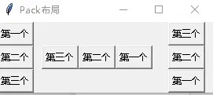

# 布局管理：Pack、Grid 与 Place

布局管理器负责管理各组件的大小和位置；用户调整窗口大小后，布局管理器还会自动调整窗口中各组件的大小和位置。tkinter 提供 Pack、Grid、Place 三种几何管理器，分别通过微件的 `pack()`、`grid()`、`place()` 方法调用（三者由同名 Mixin 类通过委派提供，见[微件体系与配置管理](02-widgets-and-configuration.md)）。[^F-THB-03]

## Pack 布局管理器

使用 Pack 时，向容器添加的组件依次向后排列，排列方向可以水平或垂直。`pack()` 支持的选项：[^F-THB-03]

1. **anchor**：可用空间大于组件需求时，组件放在容器何处。支持 N（上）、E（右）、S（下）、W（左）、NW（左上）、NE（右上）、SW（左下）、SE（右下）、CENTER（中，默认）。
2. **expand**：bool 值，父容器增大时是否拉伸组件。
3. **fill**：组件是否沿水平或垂直方向填充：NONE（不填充）、X、Y、BOTH。
4. **ipadx / ipady**：组件在 x/y 方向上的**内部**留白（padding）。
5. **padx / pady**：组件在 x/y 方向上与其他组件的**外部间距**。
6. **side**：组件添加位置，TOP、BOTTOM、LEFT、RIGHT 四者之一。

界面复杂时，需要用多个容器（Frame）分开布局，再把 Frame 添加到窗口。下面示例用三个 Frame 演示 side/fill/expand 的组合：fm1 三个按钮从顶部排列、水平填充；fm2 三个按钮从右边排列；fm3 三个按钮从底部排列、垂直填充：

```python
from tkinter import *
class App:
    def __init__(self, master):
        self.master = master
        self.initWidgets()

    def initWidgets(self):
        # 创建第一个容器
        fm1 = Frame(self.master)
        # 该容器放在左边
        fm1.pack(side=LEFT, fill=BOTH, expand=YES)
        # 向 fm1 中添加三个按钮
        # 设置按钮从顶部开始排列，且按钮只能在水平（X）方向上填充
        Button(fm1, text='第一个').pack(side=TOP, fill=X, expand=YES)
        Button(fm1, text='第二个').pack(side=TOP, fill=X, expand=YES)
        Button(fm1, text='第三个').pack(side=TOP, fill=X, expand=YES)
        # 创造第二个容器
        fm2 = Frame(self.master)
        # 该容器放在左边排列，就会挨着 fm1
        fm2.pack(side=LEFT, padx=10, expand=YES)
        # 向 fm2 中添加三个按钮
        # 设置按钮从右边开始排列
        Button(fm2, text='第一个').pack(side=RIGHT, fill=Y, expand=YES)
        Button(fm2, text='第二个').pack(side=RIGHT, fill=Y, expand=YES)
        Button(fm2, text='第三个').pack(side=RIGHT, fill=Y, expand=YES)
        # 创建第三个容器
        fm3 = Frame(self.master)
        # 该容器放在右边排列，就会挨着 fm1
        fm3.pack(side=RIGHT, padx=10, fill=BOTH, expand=YES)
        # 向 fm3 中添加三个按钮
        # 设置按钮从底部开始排列，且按钮只能在垂直（Y）方向上填充
        Button(fm3, text='第一个').pack(side=BOTTOM, fill=Y, expand=YES)
        Button(fm3, text='第二个').pack(side=BOTTOM, fill=Y, expand=YES)
        Button(fm3, text='第三个').pack(side=BOTTOM, fill=Y, expand=YES)

root = Tk()     # 创建顶层窗口
root.title('Pack布局')
display = App(root)
root.mainloop()
```



**关键坑**：fm2 的按钮虽然设置了 `fill=Y, expand=YES`，却不能垂直填充——因为 fm2 自身的 pack 是 `fm2.pack(side=LEFT, padx=10, expand=YES)`，**fm2 本身不在任何方向上填充**，子组件的 fill 无从谈起。改为 `fm2.pack(side=LEFT, padx=10, fill=BOTH, expand=YES)` 即可。完整运行效果见[布局管理器综合示例](../examples/02-layout-managers.md)。

## Grid 布局管理器

Grid 是后来引入的布局方式，简单易用：它把组件空间分解为二维网格，按行、列排列，组件位置由行号列号决定；行号相同列号不同的组件上下排列，列号相同行号不同的左右排列。多数场景下 Grid 最好用——布局过程就是为各组件指定行号列号，网格大小由 Grid 自动计算。[^F-THB-03]

`grid()` 的 ipadx/ipady/padx/pady 与 pack 相同，额外选项：

1. **column**：组件放入哪列，第一列索引为 0；
2. **columnspan**：组件横跨多少列；
3. **row**：组件放入哪行，第一行索引为 0；
4. **rowspan**：组件横跨多少行；
5. **sticky**：类似 pack 的 anchor，支持 N/E/S/W/NW/NE/SW/SE/CENTER。

计算器按键布局示例（Entry 用 pack 放顶部，16 个按键用 `row=i//4, column=i%4` 排入 Frame）：

```python
from tkinter import *
class App:
    def __init__(self, master):
        self.master = master
        self.initWidgets()

    def initWidgets(self):
        # 创建一个输入组件
        e = Entry(relief=SUNKEN, font=('Courier New', 24), width=25)
        # 对该输入组件使用 pack 布局，放在容器（或者窗口）顶部
        e.pack(side=TOP, pady=10)
        p = Frame(self.master)
        p.pack(side=TOP)
        # 定义字符串元组
        names = ('0', '1', '2', '3', '4', '5', '6', '7', '8', '9',
                 '+', '-', '*', '/', '.', '=')
        # 遍历字符串元组
        for i in range(len(names)):
            # 创建 Button，将 Button 组件放入 p 容器中
            b = Button(p, text=names[i], font=('Verdana', 20), width=6)
            b.grid(row=i // 4, column=i % 4)

root = Tk()
root.title("Grid布局")
App(root)
root.mainloop()
```

## Place 布局管理器

Place 也叫"绝对布局"，要求显式指定每个组件的绝对位置或相对其他组件的位置。`place()` 选项：[^F-THB-03]

1. **x / y**：组件的 X/Y 坐标（像素），x=0 最左、y=0 最上；
2. **relx / rely**：以父容器总宽/高为单位 1 的相对坐标，0.0–1.0，0.5 为中间；
3. **width / height**：组件宽/高（像素）；
4. **relwidth / relheight**：以父容器总宽/高为单位 1 的相对宽/高，1.0 为整个窗口，0.5 为一半；
5. **bordermode**：`"inside"` 或 `"outside"`，指定设置宽高时是否计算组件的边框宽度。

容器坐标系原点 (0, 0) 在左上角，X 轴向右、Y 轴向下。下例动态计算各 Label 的颜色与位置，用 place 摆放：

```python
from tkinter import *
import random
class App:
    def __init__(self, master):
        self.master = master
        self.initWidgets()

    def initWidgets(self):
        # 定义字符串元组
        books = ('Python 入门', 'Python 初级', 'Python 进阶', 'Python 高级', 'Python 核心')
        for i in range(len(books)):
            # 生成三个随机数
            ct = [random.randrange(256) for _ in range(3)]
            grayness = int(round(0.299*ct[0] + 0.587*ct[1] + 0.114*ct[2]))
            # 将元组中的三个随机数格式化成十六进制数，转换成颜色格式
            bg_color = "#%02x%02x%02x" % tuple(ct)
            # 创建 Label，设置背景色和前景色
            lb = Label(root, text=books[i], fg='White' if grayness < 125 else 'Black',
                       bg=bg_color)
            # 使用 place() 设置该 Label 的大小和位置
            lb.place(x=20, y=36 + i*36, width=180, height=30)
root = Tk()
root.title('Place 布局')
# 设置窗口的大小和位置：width x height + x_offset + y_offset
root.geometry("250x250+30+30")
App(root)
root.mainloop()
```

> 灰度公式 `0.299*R + 0.587*G + 0.114*B` 用于根据背景亮度自动选择白/黑前景色，是可读性处理的常用手法。

[^F-THB-03]: 简书《tkinter 布局管理》，见[信源登记](../references/sources.md)。
