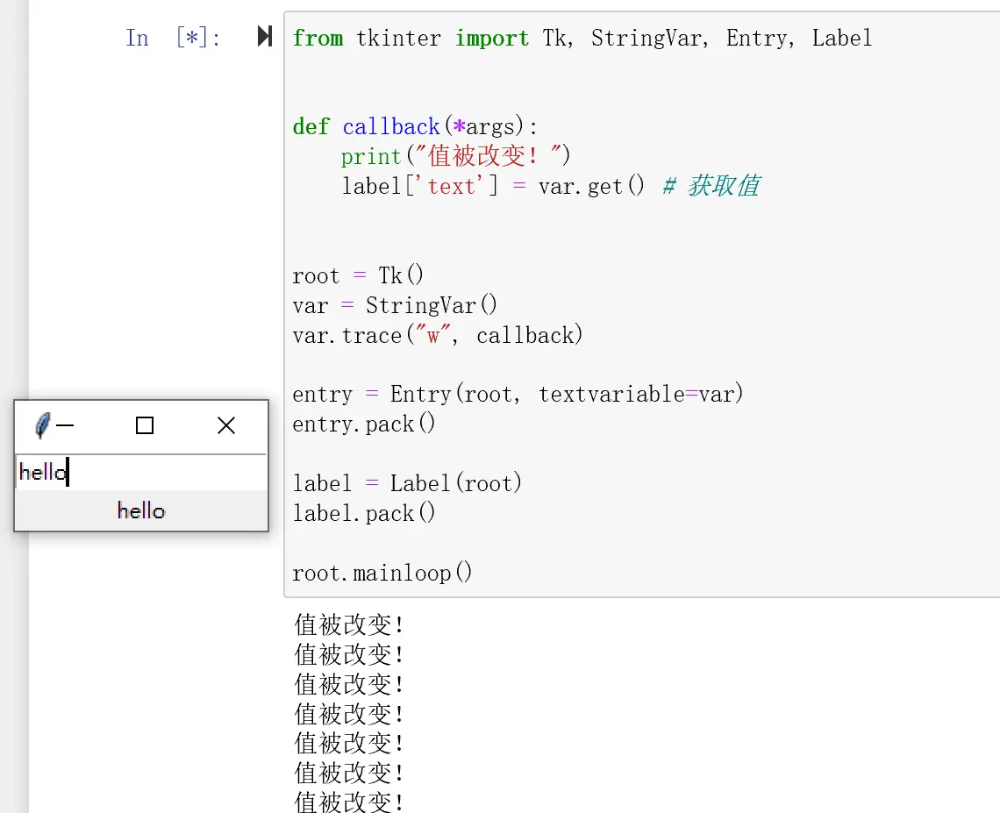
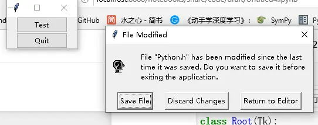

# 变量追踪（trace）、对话框与事件循环调度

## trace 追踪变量改变

`trace` 方法可以追踪变量的改变。下例中只要改动 Entry 的值便会调用 callback：[^F-THB-13]

```python
from tkinter import Tk, StringVar, Entry

def callback(*args):
    print("值被改变！")

root = Tk()
var = StringVar()
var.trace("w", callback)
entry = Entry(root, textvariable=var)
entry.pack()
root.mainloop()
```

模式 `"w"` 表示追踪写入（write）；变量与 Entry 通过 `textvariable=var` 双向绑定。更进一步，可以把改动的值传递给其他小部件（例如另一个 Label/Entry 绑定同一 StringVar），实现跨部件联动传值：



StringVar 也是跨窗口传值的载体（见[多窗口管理与跨窗口传值](10-windows.md)）；`StringVar(name=key)` 可在创建时指定 Tcl 变量名。

## tkinter.dialog 模态对话框

tkinter 提供了基于 tk_dialog 的对话框实现 `tkinter.dialog.Dialog`。构造后即模态弹出，返回对象的 `num` 属性为被点击按钮的序号（从 0 开始）：[^F-THB-04]

```python
from tkinter.dialog import Dialog
from tkinter import ttk, Tk

class Root(Tk):
    def __init__(self):
        super().__init__()
        t = ttk.Button(self, **{'text': 'Test', 'command': self._test})
        q = ttk.Button(self, **{'text': 'Quit', 'command': t.quit})
        t.pack()
        q.pack()

    def _test(self):
        d = Dialog(self, {'title': 'File Modified',
                          'text':
                          'File "Python.h" has been modified'
                          ' since the last time it was saved.'
                          ' Do you want to save it before'
                          ' exiting the application.',
                          'bitmap': 'questhead',
                          'default': 0,
                          'strings': ('Save File',
                                      'Discard Changes',
                                      'Return to Editor')})
        print(d.num)

if __name__ == '__main__':
    root = Root()
    root.mainloop()
```

参数要点：`title` 标题、`text` 消息正文、`bitmap` 图标（如 `questhead`/`info`/`warning`/`error`）、`default` 默认按钮序号（回车触发）、`strings` 按钮文案元组（决定按钮数量与顺序）。



> 日常提示框（确认/警告/文件选择等）更常用 `tkinter.messagebox`、`tkinter.filedialog`、`tkinter.simpledialog`（见[事件绑定](05-events-and-bindings.md)中 `messagebox.askokcancel` 用法）；`tkinter.dialog.Dialog` 适合需要自定义按钮组的场景。

## 事件循环调度：update 与 after

`Misc` 提供在事件循环中插入任务的方法：[^F-THB-20]

- **`update()`**：进入事件循环，直到 Tcl 处理完所有未决（pending）事件。
- **`update_idletasks()`**：进入事件循环直到所有 idle 回调被调用完——会刷新窗口显示，但不处理用户引起的事件。源码即 `self.tk.call('update', 'idletasks')`。在需要强制重绘（例如进度条刷新）时使用，参见[画布交互综合示例](../examples/03-canvas-interactions.md)中进度条对 `update()` 的调用。
- **`after(ms, func=None, *args)`**：`ms` 以毫秒指定延迟，`func` 为到时应调用的函数，附加参数作为 func 的调用参数；返回标识符，可用 `after_cancel` 取消调度。
- **`after_idle(func, *args)`**：当 Tcl 主循环没有事件要处理时（空闲时）调用 func 一次。
- **`after_cancel(id)`**：取消以 id 标识的函数调度计划。

## 剪贴板操作

- **`clipboard_clear()`**：清除 Tk 剪贴板中的数据（可指定 `displayof` 关键字选择目标显示）。
- **`clipboard_append(string)`**：把 STRING 追加到 Tk 剪贴板（追加而非覆盖）。
- **`clipboard_get()`**：从剪贴板检索数据（等价于 `selection_get(CLIPBOARD)`）；`type` 关键字指定返回数据形式（原子名如 STRING 或 FILE_NAME），非 X11 平台默认 STRING，X11 默认尝试 UTF8_STRING 回退 STRING。[^F-THB-20]

```python
root.clipboard_clear()
root.clipboard_append('Ùñî')
print(root.clipboard_get())      # Ùñî
root.clipboard_append('çōđě')
print(root.clipboard_get())      # Ùñîçōđě（追加效果）
root.clipboard_clear()
```

[^F-THB-04]: 简书《tkinter 之对话框》，见[信源登记](../references/sources.md)。
[^F-THB-13]: 简书《tkinter 之 StringVar 追踪》，见[信源登记](../references/sources.md)。
[^F-THB-20]: 简书《tkinter 深度解析》，见[信源登记](../references/sources.md)。
