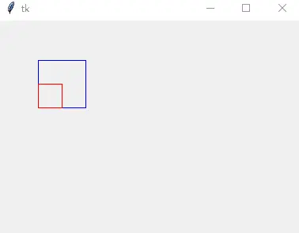

# Canvas 核心机制：item handles、tags、选项与方法全集

Canvas 是结构化图形微件，可绘制图形、创建图形编辑器以及实现自定义微件（完整微件清单见[微件体系与配置管理](02-widgets-and-configuration.md)）。

## 两种画布对象标识：item handles 与 tags

Canvas 提供两种方法指定或获取画布对象：[^F-THB-05]

- **Item handles**：事实上是一个整型数字（也称画布对象的 ID）。在 Canvas 上创建画布对象时，tkinter 自动为其指定一个在该 Canvas 中独一无二的整型值；各种 Canvas 方法通过该值操纵对象。
- **tags**：附在画布对象上的标签，由普通的非空白字符串组成。一个画布对象可关联多个 tag，一个 tag 也可描述多个画布对象。与 Text 组件不同：没有指定画布对象的 tags 不能进行事件绑定和样式配置——Canvas 的 tags 仅为画布对象所拥有。
- **预定义 tags**：`'all'` 表示 Canvas 中的所有画布对象；`'current'` 表示鼠标指针下存在的画布对象。

## Canvas 组件选项

调用形式 `Canvas(master=None, cnf={}, **kw)`，`master` 为父组件，`**kw` 为组件选项：[^F-THB-05]

| 选项 | 含义 |
| --- | --- |
| background（bg） | 指定 Canvas 的背景颜色 |
| borderwidth（bd） | 指定 Canvas 的边框宽度 |
| closeenough | 浮点距离：鼠标与画布对象的距离小于该值时认为鼠标在对象上 |
| confine | 是否允许滚动超出 `scrollregion` 指定范围；默认 `True` |
| cursor | 鼠标飘过 Canvas 时的鼠标样式 |
| height / width | Canvas 的高度/宽度（像素） |
| highlightbackground | 未获得焦点时高亮边框的颜色 |
| highlightcolor | 获得焦点时高亮边框的颜色 |
| highlightthickness | 高亮边框的宽度 |
| relief | 边框样式，默认 `'flat'`，可选 `'sunken'`/`'raised'`/`'groove'`/`'ridge'` |
| scrollregion | Canvas 可被滚动的矩形范围 `(x0, y0, x1, y1)` |
| selectbackground | 画布对象被选中时的背景色 |
| selectborderwidth | 被选中时的选中边框宽度 |
| selectforeground | 被选中时的前景色 |
| state | Canvas 状态：`'normal'`（默认）或 `'disabled'`；**不影响画布对象自身的状态** |
| takefocus | Tab 键是否可将焦点移入；默认开启，设为 `False` 可避免 |
| xscrollcommand / yscrollcommand | 与水平/垂直 Scrollbar 组件关联 |
| xscrollincrement / yscrollincrement | 水平/垂直滚动"步长"；默认 `0`（可滚到任意位置）。如 `'3c'` 表示 3 厘米，单位有 `'i'`（英寸）、`'m'`（毫米）、`'p'`（DPI，约 `'1i'` = `'72p'`） |

## 方法全集速查

**tag 增删与查找**（item 参数均可传单个 ID 或某个 tag）：[^F-THB-05]

| 方法 | 作用 |
| --- | --- |
| `addtag(tag, method, *args)` | 按 method（"above"/"all"/"below"/"closest"/"enclosed"/"overlapping"/"withtag"）为一批对象添加 tag |
| `addtag_above(tag, item)` / `addtag_below(tag, item)` | 为显示列表中 item 上方/下方的对象添加 tag |
| `addtag_all(tag)` | 为所有画布对象添加 tag（等同 `addtag(tag, "all")`） |
| `addtag_closest(tag, x, y, halo=None, start=None)` | 为与画布坐标 `(x, y)` 相近的对象添加 tag；halo 指定辐射距离；多个对象等距时取显示列表上方者 |
| `addtag_enclosed(tag, x0, y0, x1, y1)` | 为完全处于矩形 `(x0, y0, x1, y1)` 中的对象添加 tag |
| `addtag_overlapped(tag, x0, y0, x1, y1)` | 同上但范围更广：对象只要有一部分在矩形中即算 |
| `addtag_withtag(tag, item)` | 为 item（ID 或 tag）指定的对象添加新 tag |
| `dtag(item, tag=None)` | 删除对象的指定 tag；tag 省略则删除其全部 tags；对象不存在不报错 |
| `gettags(item)` | 返回与 item 关联的所有 tags |
| `find_above(item)` / `find_below(item)` | 返回 item 之上/之下的 ID（多个时取最顶/最底端者；item 已在最顶/底则返回空元组） |
| `find_all()` | 返回所有画布对象 ID 元组（按显示列表顺序），等同 `find_withtag('all')` |
| `find_closest(x, y, halo=None, start=None)` | 返回靠近点 `(x, y)` 的所有对象 ID 元组，无则空元组 |
| `find_enclosed(x1, y1, x2, y2)` | 返回完全包含在限定矩形内的对象 ID |
| `find_overlapping(x1, y1, x2, y2)` | 返回与限定矩形有重叠的对象 ID（含完全在内的） |
| `find_withtag(item)` | 返回 item 指定的所有对象 ID |

**坐标与几何操作**：

| 方法 | 作用 |
| --- | --- |
| `bbox(*args)` | 返回描述 args 指定对象所在矩形范围的四元组 `(x0, y0, x1, y1)`；省略 args 返回所有对象的范围 |
| `canvasx(screenx, gridspacing=None)` / `canvasy(screeny, gridspacing=None)` | 窗口坐标系坐标转画布坐标系；提供 gridspacing 时结果对齐为其整数倍 |
| `coords(*args)` | 仅给一个参数返回该对象坐标 `(x0, y0, x1, y1)`；`coords(item, x1, y1, x2, y2)` 可移动/重塑对象（进度条动画即用它，见[画布交互综合示例](../examples/03-canvas-interactions.md)） |
| `move(item, dx, dy)` | 将 item 移动 `(dx, dy)` 偏移 |
| `scale(item, xOrigin, yOrigin, xScale, yScale)` | 以 `(xOrigin, yOrigin)` 为基准按 xScale/yScale 缩放对象；**注意：无法缩放 Text 画布对象**。滚轮缩放画布即用 `scale("all", x, y, factor, factor)` |

**文本/选择/焦点**（item 均可为 ID 或 tag）：

| 方法 | 作用 |
| --- | --- |
| `dchars(item, from, to=None)` | 删除 item 中从 from 到 to（含）的字符串 |
| `focus(item=None)` | 把焦点移到指定 item；多个匹配时取显示列表中第一个可接受光标输入的对象 |
| `icursor(item, index)` | 把光标移到指定对象（要求支持文本输入） |
| `index(item, index)` | 返回 index 在 item 中的位置（0 起）。index 可为 INSERT/END/SEL_FIRST/SEL_LAST 或 `"@x,y"`（画布坐标最近位置） |
| `insert(item, index, text)` | 在可编辑文本对象的指定位置插入文本 |
| `select_adjust(item, index)` / `select_from(item, index)` / `select_to(item, index)` | 调整选中范围/设定选中起点/设定选中终点 |
| `select_clear()` | 取消所有选中范围 |
| `select_item()` | 返回当前文本选中范围，无则 None |

**对象配置与层级**：

| 方法 | 作用 |
| --- | --- |
| `itemcget(item, option)` | 获得指定 item 的选项当前值 |
| `itemconfig(item, **options)` / `itemconfigure(...)` | 修改指定 item 的选项值 |
| `lift(item)` / `tkraise(item)` / `tag_raise(item)` | 将对象移到显示列表顶部（多个时保留原序）；对窗口组件用 `lift` |
| `lower(item)` / `tag_lower(item)` | 将对象移到显示列表底部；对窗口组件用 `lower` |
| `type(item)` | 返回对象类型："arc"/"bitmap"/"image"/"line"/"oval"/"polygon"/"rectangle"/"text"/"window" |

**事件绑定与输出**：

| 方法 | 作用 |
| --- | --- |
| `tag_bind(item, event=None, callback, add=None)` | 为画布对象绑定事件；**与事件关联的是画布对象而非 Tag** |
| `tag_unbind(item, event, callback=None)` | 解除 item 上绑定的事件 |
| `postscript(**options)` | 将 Canvas 当前内容封装为 PostScript。选项：`colormode`（'color'/'gray'/'mono'）、`file`（写入文件，省略则以字符串返回）、`rotate`（False 纵向/True 横向）、`x`/`y`（打印起始位置，画布坐标）、`width`/`height`（打印区域宽高，默认整体） |

**滚动视图**（一般通过 Scrollbar 的 command 选项驱动）：

| 方法 | 作用 |
| --- | --- |
| `xview(*args)` / `yview(*args)` | 水平/垂直滚动内容。首参 MOVETO 时二参为位置（0.0 最左/顶端，1.0 最右/底端）；首参 SCROLL 时二参为数量、三参为单位（UNITS/PAGES），如 `yview(SCROLL, 3, PAGES)` 向下滚三页 |
| `xview_moveto(fraction)` / `yview_moveto(fraction)` | 等同 `xview(MOVETO, fraction)` |
| `xview_scroll(number, what)` / `yview_scroll(number, what)` | 等同 `xview(SCROLL, number, what)` |

**鼠标拖曳**：`scan_mark(x, y)` 记住锚点，`scan_dragto(x, y, gain=10)` 把画布视图拖到锚点与当前点之间（gain 为拖曳增益）；绑定方式与完整缩放示例见[画布拖曳与缩放](11-canvas-interactions.md)。

## scale 缩放示例

```python
from tkinter import Tk, Canvas
root = Tk()
self = Canvas(root)
rt1 = self.create_rectangle(50, 50, 110, 110, outline='blue', tags='rt')
rt = self.create_rectangle(50, 50, 110, 110, outline='red', tags='rt')
self.scale(rt, 50, 110, 1/2, 1/2)
self.pack()
root.mainloop()
```

两个同位置矩形中，红色矩形以 `(50, 110)` 为基准缩放一半（蓝框保持原尺寸作对照）：



## 边框坑：highlightthickness

创建 Canvas 时设置的宽高并不等于真正的画图区域——Canvas 还有边框（含高亮边框），实际画图区域要减去边框。若容器尺寸为 width×height，放入同尺寸且 `pack(expand=1, fill='both')` 的 Canvas，给 Canvas 与容器设置不同背景色，就会看到 Canvas 四周有一条白边。改进方法：[^F-THB-05]

```python
canvas.config(highlightthickness=0)
```

[^F-THB-05]: 简书《Canvas 相关参数简介》，见[信源登记](../references/sources.md)。
