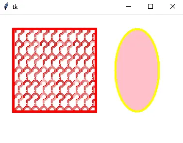
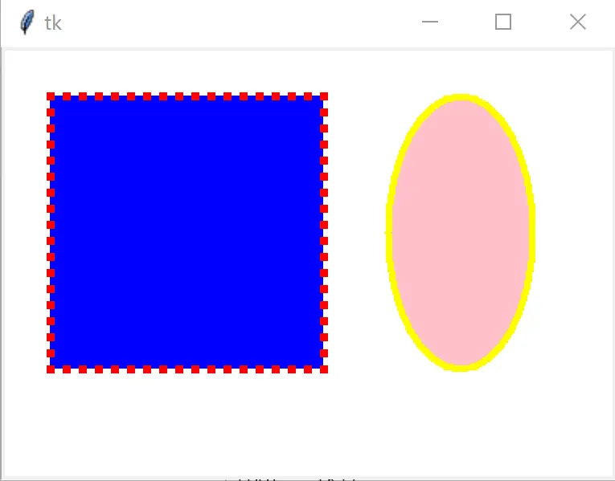
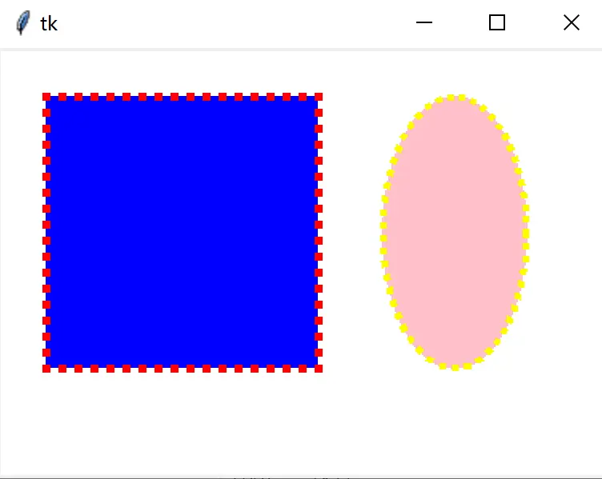

# Canvas 画图函数分组：graph / image / text / window

Canvas 有十分强大的作图功能，画图函数可分为四组：[^F-THB-06]

```python
graph  = {'create_arc', 'create_line', 'create_oval', 'create_rectangle', 'create_polygon'}
image  = {'create_bitmap', 'create_image'}
text   = {'create_text'}
window = {'create_window'}
```

所有函数都在给定位置/坐标 `(x, y)` 或包围盒 `(x0, y0, x1, y1)` 处创建对象，新建对象位于显示列表顶端，成功后返回该画布对象的 ID。

## 通用参数

**graph + image + text + window 共有**：[^F-THB-06]

| 选项 | 含义 |
| --- | --- |
| `state` | 画布对象状态：`'normal'`（默认）、`'disabled'`（不可用，不响应事件）、`'hidden'`（隐藏） |
| `tags` | 为创建的画布对象添加标签 |

**width**（graph + text + window 共有，但含义不同）：graph 中指定边框宽度；text 中指定文本在该宽度处自动断行（不指定则文本对象宽度等于最长行）；window 中指定嵌入窗口组件的宽度。

**graph + text 共有**：`activefill`/`activestipple`（状态为 'active' 时的填充颜色/填充位图）、`disabledfill`/`disabledstipple`（状态为 'disabled' 时）、`offset`（点画模式填充位图的偏移：`"x,y"`、`"#x,y"`、`'n'/'ne'/'e'/'se'/'s'/'sw'/'w'/'nw'/'center'`）、`stipple`（指定位图用于填充，默认空字符串表示实心；可与 `fill` 结合，`fill` 指定位图颜色）。

**image + text + window 共有**：`anchor`——对象在 position 参数的相对位置，取 `'n'/'ne'/'e'/'se'/'s'/'sw'/'w'/'nw'`（上北下南左西右东）或 `'center'`（默认）。

**graph 通用**：`activedash`/`activewidth`/`activeoutline`/`activeoutlinestipple`（active 状态的虚线/边框宽/轮廓线/轮廓位图）与 `disableddash`/`disabledwidth`/`disabledoutline`/`disabledoutlinestipple`（disabled 状态同理）；`dash`（虚线轮廓，整数元组，元素依次代表短线长度与间隔，如 `(3, 5)` 为 3 像素短线 + 5 像素间隔）、`dashoffset`（虚线起始偏移，如 `dash=(5,1,2,1)`、`dashoffset=3` 则从 2 开始画）、`fill`（填充颜色，空字符串透明）。

**graph 去掉 create_line**：`outline` 指定轮廓颜色。

**create_polygon 与 create_line 共有**：

| 选项 | 含义 |
| --- | --- |
| joinstyle | 相邻线段接口样式：`'round'`（以连接点为圆心、width/2 为半径圆角，默认）、`'bevel'`（夹角平切）、`'miter'`（沿夹角延伸至一点） |
| smooth | `True` 时绘制贝塞尔样条曲线代替线段，默认 `False` |
| splinesteps | 贝塞尔曲线由多少条折线构成，默认 12；仅 smooth=True 时生效 |

位图填充与状态前缀参数的实例：

```python
from tkinter import Tk, Canvas
root = Tk()
cv = Canvas(root, background='white')
cv.pack(fill='both', expand='yes')
cv.create_rectangle(30, 30, 200, 200,
                    outline='red',      # 边框颜色
                    stipple='question',  # 填充的位图
                    fill="red",          # 填充颜色
                    width=5)             # 边框宽度
cv.create_oval(240, 30, 330, 200,
               outline='yellow',
               fill='pink',
               width=4)
root.mainloop()
```



带 `active`/`disabled` 前缀的参数与不带前缀的用法一致，只是绑定了状态。下例矩形的 `dash=(2,1)` 不论什么状态都有间隔，而椭圆的 `activedash=(2,1)` 只在激活（鼠标悬停）状态出现间隔：

```python
cv.create_rectangle(30, 30, 200, 200,
                    outline='red', stipple='question', fill="red", width=5,
                    dash=(2, 1))          # 不论什么状态均有间隔
cv.create_oval(240, 30, 330, 200,
               outline='yellow', fill='pink', width=4,
               activedash=(2, 1))         # 只有在激活状态有间隔
```





## image 组：create_image 与 create_bitmap

**`create_image(position, **kw)`**：在 `(x, y)` 创建图片对象。选项：`image`（要显示的图片）、`activeimage`（active 状态显示的图片）、`disabledimage`（disabled 状态显示的图片）。图片载入与引用持有坑见[画布图片与背景图](09-canvas-images.md)。

**`create_bitmap(position, **kw)`**：在 `(x, y)` 创建位图对象。除状态前缀（`activebackground`/`activebitmap`/`activeforeground` 与 `disabled*` 三件套）外：

| 选项 | 含义 |
| --- | --- |
| background | 背景颜色，即位图中值为 0 的点的颜色；空字符串透明 |
| foreground | 前景颜色，即位图中值为 1 的点的颜色 |
| bitmap | 指定显示的位图 |

## text：create_text

**`create_text(position, **kw)`**：在 `(x, y)` 创建文本对象，`anchor` 语义同 create_bitmap。选项：`fill`（文本颜色）、`font`（字体/尺寸）、`justify`（多行文本对齐：LEFT 默认、CENTER、RIGHT）、`text`（显示内容）。

## window：create_window

**`create_window(position, **kw)`**：在 `(x, y)` 创建一个嵌入的窗口组件。选项：`height`（组件高度）、`width`（组件宽度）、`window`（指定一个窗口组件）。这是把普通微件嵌入画布的入口。

## graph 组：四种图形

**`create_rectangle(bbox, **kw)`** 与 **`create_oval(bbox, **kw)`**：分别按包围盒创建矩形和椭圆（椭圆在矩形包围盒内相切）。

**`create_arc(bbox, **kw)`**：根据包围盒创建扇形（'pieslice'）、弓形（'chord'）或弧形（'arc'）：

| 选项 | 含义 |
| --- | --- |
| start | 绘制弧的起始角度 |
| extent | 从 start 开始到结束的角度跨度，默认 90.0 |
| style | 'pieslice'（扇形，默认）、'chord'（弓形）或 'arc'（弧形） |
| outlinestipple | outline 设置后，用指定位图填充边框；默认空字符串表示黑色 |
| outlineoffset | 点画模式绘制轮廓时位图的偏移，取值同 offset |

**`create_line(coords, **kw)`**：按 coords 给定坐标创建一条或多条线段；坐标多于两个点则首尾相连成折线。

| 选项 | 含义 |
| --- | --- |
| arrow | 线段默认不带箭头：`'first'` 起点加箭头、`'last'` 终点加箭头、`'both'` 两端都加 |
| arrowshape | 三元组 `(a, b, c)` 指定箭头形状，依次为填充长度、箭头长度、箭头宽度，默认 `(8, 10, 3)` |
| capstyle | 线段两端样式：`'buff'`（默认，平切于起止点）、`'projecting'`（两端延长一半 width）、`'round'`（延长一半 width 并以圆角绘制） |

[^F-THB-06]: 简书《分组 Canvas 的画图函数》，见[信源登记](../references/sources.md)。
