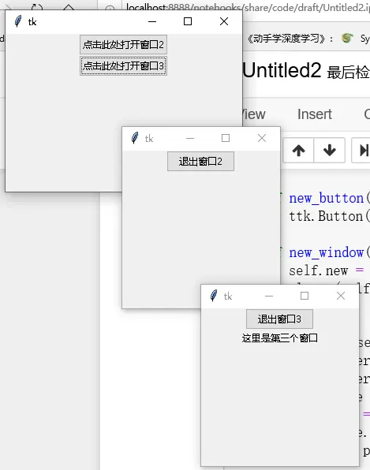
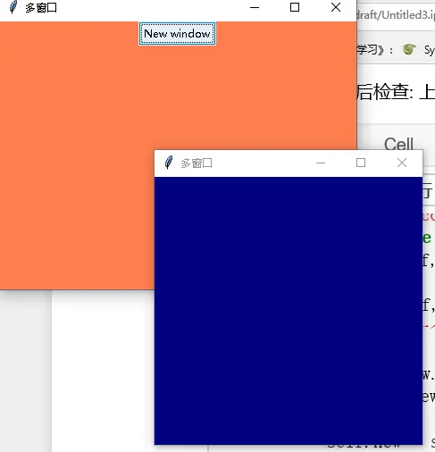
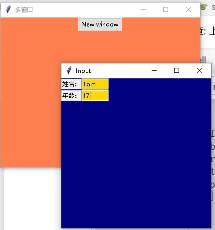

# 多窗口管理：Toplevel、单子窗口与跨窗口传值

## 窗口尺寸与定位：geometry 语法

`Toplevel` 是显示为独立顶级窗口的容器微件（Wm mixin 提供窗口管理器服务，见[微件体系与配置管理](02-widgets-and-configuration.md)）。根窗口或 Toplevel 用 `geometry` 设定大小与相对屏幕左上角的位置，参数形式为 `f"{width}x{height}{x}{y}"`：width、height 为正整数（像素）；x、y 为有符号整数，`+` 表示相对屏幕左上角偏移，`-` 表示相对右下角偏移，如 `"+100+100"`、`"-100"`。[^F-THB-11]

```python
root.geometry("300x400+100+100")   # 300x400，距屏幕左、上各 100px
```

## Toplevel 创建多个窗口

下例主窗口两个按钮分别创建 Win2 / Win3 两个 Toplevel 子窗口，子窗口用 `geometry` 定位、`destroy` 关闭：[^F-THB-10]

```python
from tkinter import Tk, ttk, Toplevel

class RootWindow:
    def __init__(self, master):
        self.master = master
        self.frame = ttk.Frame(self.master)
        self.new_button('点击此处打开窗口2', '2', Win2)
        self.new_button('点击此处打开窗口3', '3', Win3)
        self.frame.pack()

    def new_button(self, text, number, _class):
        ttk.Button(self.frame, text=text,
                   command=lambda: self.new_window(number, _class)).pack()

    def new_window(self, number, class_):
        self.new = Toplevel(self.master)
        class_(self.new, number)

class Win2:
    def __init__(self, master, number):
        self.master = master
        self.master.geometry("400x400+200+200")
        self.frame = ttk.Frame(self.master)
        self.quit = ttk.Button(self.frame, text=f"退出窗口{number}",
                               command=self.close_window)
        self.frame.pack()
        self.quit.pack()

    def close_window(self):
        self.master.destroy()

class Win3(Win2):
    def __init__(self, master, number):
        super().__init__(master, number)
        self.master.geometry("400x400+200+200")
        self.label = ttk.Label(self.frame, text="这里是第三个窗口")
        self.label.pack()

root = Tk()
root.geometry("300x200")
self = RootWindow(root)
root.mainloop()
```



## 只出现一次的 Toplevel

上面的写法每点一次按钮就新建一个窗口。要让按钮在子窗口存活期间不再新建，用 `state()` 探测子窗口状态：存活（`"normal"`）则 `focus()` 提到前台；探测抛异常（窗口已销毁）才新建：[^F-THB-14]

```python
class Window:
    def new_window(self, _class):
        try:
            if self.new.state() == "normal":
                self.new.focus()
        except:
            self.new = Toplevel(self)
            _class(self.new)
```

## 跨窗口传递值

**模式一：主窗口持有参数窗口实例，关闭后取值。** 主窗口 `Window` 同样用 state/focus 保证一次只开一个参数窗口；参数窗口 `ParamWindow` 用 `StringVar(name=key)` 按字段名收集输入，`todict()` 在主循环结束后返回字典。下例还用 `ttk.Style` 定制了绿色背景/蓝色文字/金色输入域的 "EntryStyle.TEntry" 样式：[^F-THB-15]

```python
class ParamWindow(Toplevel):
    def __init__(self, master=None, cnf={}, **kw):
        super().__init__(master, cnf, **kw)
        self.geometry("300x300+200+200")
        self["background"] = "navy"
        self.title('Input')
        self.bunch = {}
        self.widgets = []
        self.create_row('姓名：', 'name')
        self.create_row('年龄：', 'age')
        self.layout()
        estyle = ttk.Style()
        estyle.element_create("plain.field", "from", "clam")
        estyle.layout("EntryStyle.TEntry",
                      [('Entry.plain.field',
                        {'children':
                         [('Entry.background', {'children':
                                                [('Entry.padding',
                                                  {'children':
                                                   [('Entry.textarea',
                                                     {'sticky': 'nswe'})],
                                                   'sticky': 'nswe'})],
                                                'sticky': 'nswe'})],
                         'border': '4',
                         'sticky': 'nswe'})])
        estyle.configure("EntryStyle.TEntry",
                         background="green",
                         foreground="blue",
                         fieldbackground="gold")

    def create_row(self, text, key):
        label = ttk.Label(self, text=text)
        var = StringVar(name=key)
        entry = ttk.Entry(self, textvariable=var, width=7,
                          style="EntryStyle.TEntry")
        self.widgets.append([label, entry])
        self.bunch[key] = var

    def layout(self):
        for row, (widgets) in enumerate(self.widgets):
            for column, widget in enumerate(widgets):
                widget.grid(row=row, column=column, sticky='we')

    def todict(self):
        return {key: var.get() for key, var in self.bunch.items()}


def get_params():
    app = Window(ParamWindow)
    app.title("多窗口")
    app.mainloop()
    return app.new.todict()      # 主窗口关闭后从参数窗口实例取值
```





该模式必须关闭主窗口才能取到值。

**模式二：`transient()` + `wait_window()` 模态阻塞，无需关闭主窗口直接回传。** `transient(tk_root)` 把参数窗口设为主窗口的临时窗口（总是置顶、随主窗最小化）；`wait_window(window)` 阻塞直到该窗口销毁。点 OK 时把结果写入 `self.output`，窗口流程结束后主窗口直接读取：[^F-THB-15]

```python
class AskValueWindow(Toplevel):
    def __init__(self, master=None, cnf={}, **kw):
        super().__init__(master, cnf, **kw)
        self.table = Table(self)
        self.ok_button = ttk.Button(self, text='OK', command=self.run)
        self.bunch = {
            'name': {'car': '汽车', 'bus': '公交车', 'truck': '卡车'},
            'color': {'red': '红色', 'blue': '蓝色', 'green': '绿色'}
        }
        self.layout()
        self.output = {}

    def layout(self):
        widgets = self.table.create_widgets(self.bunch)
        self.table.grid(row=0, column=0, sticky='we')
        self.table.layout(widgets)
        self.ok_button.grid(row=1, column=0, sticky='we')

    def run(self):
        self.output.update(self.table.todict())


def ask_window(tk_root, window_type):
    '''Pass information through a window
    :param tk_root: An instance of a Tk or an instance of its subclass
    :param window_type: WindowMeta or its subclasses
    '''
    window = window_type(tk_root)
    window.transient(tk_root)
    tk_root.wait_window(window)
    return window.table
```

主窗口侧调用：`window = AskValueWindow(self); window.transient(self); self.wait_window(window); print(window.output)`。StringVar 的 trace 追踪机制见[变量追踪、对话框与事件循环调度](06-variables-dialogs-and-scheduling.md)。

[^F-THB-10]: 简书《Toplevel 创建多个窗口》，见[信源登记](../references/sources.md)。
[^F-THB-11]: 简书《tkinter 简单教程》，见[信源登记](../references/sources.md)。
[^F-THB-14]: 简书《tkinter 创建只能出现一次的 Toplevel》，见[信源登记](../references/sources.md)。
[^F-THB-15]: 简书《tkinter 跨窗口传递值》，见[信源登记](../references/sources.md)。
