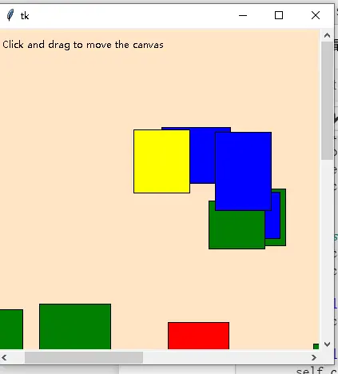

# 画布拖曳与缩放：scan、canvasx/canvasy、滚轮缩放与 dnd 拖放协议

## 拖曳（pan）：scan_mark / scan_dragto

tkinter 内建画布拖曳：`scan_mark(x0, y0)` 记住锚点 `(x0, y0)`；`scan_dragto(x1, y1, gain=10)` 将画布视图拖曳到 `(x0 + gain*(x1-x0), y0 + gain*(y1-y0))` 位置。绑定方式：鼠标按钮按下事件绑定 `scan_mark`，`<B1-Motion>` 绑定 `scan_dragto`。[^F-THB-16][^F-THB-05]

下例（参考 StackOverflow "Move a tkinter canvas with Mouse"）在 1000x1000 的 scrollregion 上随机画 50 个矩形，配水平/垂直 Scrollbar，左键拖曳移动画布：

```python
from tkinter import Tk, Canvas, ttk
import random

class Drag(ttk.Frame):
    def __init__(self, master, **kw):
        super().__init__(master, **kw)
        self.canvas = Canvas(self, width=400, height=400, background="bisque")
        self.xsb = ttk.Scrollbar(self, orient="horizontal", command=self.canvas.xview)
        self.ysb = ttk.Scrollbar(self, orient="vertical", command=self.canvas.yview)
        self.canvas.configure(yscrollcommand=self.ysb.set, xscrollcommand=self.xsb.set)
        self.canvas.configure(scrollregion=(0, 0, 1000, 1000))
        self.draw_rectangle()
        self.canvas.create_text(50, 10, anchor="nw",
                                text="Click and drag to move the canvas")
        self.layout()
        # 启用鼠标滚动：
        self.canvas.bind("<ButtonPress-1>", self.scroll_start)
        self.canvas.bind("<B1-Motion>", self.scroll_move)

    def draw_rectangle(self):
        for n in range(50):
            x0 = random.randint(0, 900)
            y0 = random.randint(50, 900)
            x1 = x0 + random.randint(50, 100)
            y1 = y0 + random.randint(50, 100)
            color = ("red", "orange", "yellow", "green", "blue")[random.randint(0, 4)]
            self.canvas.create_rectangle(x0, y0, x1, y1, outline="black", fill=color)

    def layout(self):
        self.xsb.grid(row=1, column=0, sticky="ew")
        self.ysb.grid(row=0, column=1, sticky="ns")
        self.canvas.grid(row=0, column=0, sticky="nsew")
        self.grid_rowconfigure(0, weight=1)
        self.grid_columnconfigure(0, weight=1)

    def scroll_start(self, event):
        self.canvas.scan_mark(event.x, event.y)

    def scroll_move(self, event):
        self.canvas.scan_dragto(event.x, event.y, gain=1)

if __name__ == "__main__":
    root = Tk()
    self = Drag(root)
    self.pack(fill="both", expand=True)
    root.mainloop()
```



## 缩放（zoom）：canvasx/canvasy + canvas.scale

鼠标事件报告的是**屏幕坐标**；滚动画布后需要用 `canvasx(event.x)` / `canvasy(event.y)` 转换为**画布（滚动区域）坐标**。滚轮缩放：Windows/macOS 用 `<MouseWheel>`（`event.delta` 正负区分方向，Windows 上为 ±120），Linux 用 `<Button-4>`（上滚）/`<Button-5>`（下滚）。缩放后必须用 `bbox("all")` 重设 scrollregion，否则滚动范围不更新：[^F-THB-16]

```python
class DragZoom(Drag):
    def __init__(self, master, **kw):
        super().__init__(master, **kw)
        self.canvas.create_text(50, 10, anchor="nw", text="\nScroll to zoom.")
        # linux scroll
        self.canvas.bind("<Button-4>", self.zoomerP)
        self.canvas.bind("<Button-5>", self.zoomerM)
        # windows scroll
        self.canvas.bind("<MouseWheel>", self.zoomer)

    def tocanvasxy(self, event):
        return int(self.canvas.canvasx(event.x)), int(self.canvas.canvasx(event.x))

    def scroll_start(self, event):
        x, y = self.tocanvasxy(event)
        self.canvas.scan_mark(x, y)

    def scroll_move(self, event):
        x, y = self.tocanvasxy(event)
        self.canvas.scan_dragto(x, y, gain=1)

    # windows zoom
    def zoomer(self, event):
        x, y = self.tocanvasxy(event)
        if event.delta > 0:
            self.canvas.scale("all", x, y, 1.1, 1.1)
        elif event.delta < 0:
            self.canvas.scale("all", x, y, 0.9, 0.9)
        self.canvas.configure(scrollregion=self.canvas.bbox("all"))

    # linux zoom
    def zoomerP(self, event):
        x, y = self.tocanvasxy(event)
        self.canvas.scale("all", x, y, 1.1, 1.1)
        self.canvas.configure(scrollregion=self.canvas.bbox("all"))

    def zoomerM(self, event):
        x, y = self.tocanvasxy(event)
        self.canvas.scale("all", x, y, 0.9, 0.9)
        self.canvas.configure(scrollregion=self.canvas.bbox("all"))
```

> 原文 `tocanvasxy` 中 y 误用 `canvasx`（应为 `canvasy`），实际使用时第二个返回值应为 `int(self.canvas.canvasy(event.y))`。

最小内置机制（参考 StackOverflow "Tkinter canvas zoom + move/pan"）：

```python
from tkinter import EventType

canvas.bind("<MouseWheel>", do_zoom)
canvas.bind('<ButtonPress-1>', lambda event: canvas.scan_mark(event.x, event.y))
canvas.bind("<B1-Motion>", lambda event: canvas.scan_dragto(event.x, event.y, gain=1))

def do_zoom(event):
    factor = 1.001 ** event.delta
    canvas.scale('all', event.x, event.y, factor, factor)
```

扩展：按 Ctrl/Shift 状态实现单轴缩放（Shift 锁 Y 轴、Ctrl 锁 X 轴）：

```python
def do_zoom(event):
    factor = 1.001 ** event.delta
    is_shift = event.state & (1 << 0) != 0
    is_ctrl = event.state & (1 << 2) != 0
    canvas.scale('all', event.x, event.y,
                 factor if not is_shift else 1.0,
                 factor if not is_ctrl else 1.0)
```

## 图片缩放与拖曳的三档方案

图片（PhotoImage）不能被 `canvas.scale` 缩放（scale 无法作用于 image 对象），需要用 PIL 重采样后重绘。博文给出三档实现：[^F-THB-17]

1. **基础版**：滚轮时 `image.resize((imscale*w, imscale*h))` 整图重采样，`create_image(anchor='nw')` 重绘并 `canvas.lower()` 置底；旧 imageid 删除、`canvas.imagetk` 持有引用防回收。**警告：大缩放倍数下重采样图会撑爆内存**，仅适合小图。
2. **进阶版（类 Google Maps）**：每次只对**可视区域 tile** 裁剪重绘——用容器矩形 `create_rectangle(0,0,w,h,width=0)` 标定图片范围，`bbox(container)` 与可视区 `(canvasx(0), canvasy(0), canvasx(winfo_width()), canvasy(winfo_height()))` 求交，只 `image.crop` 可见部分并 resize 到 tile 尺寸，缩放/滚动后重算 scrollregion。占用内存恒定。配套 `AutoScrollbar`（不需要时 `grid_remove()` 自隐藏，且禁用 pack/place 防误用）。
3. **图像金字塔版**：适配数 GB 级 TIFF：预建 2 倍递减的图像金字塔（顶层约 512px），按当前缩放级别选层裁剪；超大图（边 > 14000 且 raw tile）按 1024px band 分条读取，`Image.MAX_IMAGE_PIXELS = 1000000000` 抑制 DecompressionBomb 限制；键盘 WASD/方向键滚动（`<Key>` 事件经 `after_idle` 排队避免弱机卡顿）。

## 标准库 tkinter.dnd 拖放协议

标准库 `tkinter/dnd.py` 提供**同一应用内**（跨窗口或同窗口）的拖放支持。源文章即该模块源码转载，其 docstring 定义的协议如下：[^F-THB-09]

- **启动**：为可拖对象绑定 `<ButtonPress>` 回调，回调中调用 `dnd_start(source, event)`——source 是被拖对象（不必是微件，可为任意应用对象），event 是触发事件。返回实例**不要保存**，拖放期间自动保活；拖放进行中再次调用会被忽略（避免并发拖放）。
- **目标发现**：鼠标移动及拖放起止时，检查指针正下方的 Tk 微件（目标微件）；若它有 `dnd_accept` 属性（可调用对象），则以 `dnd_accept(source, event)` 调用，返回非 None 即为新目标对象；返回 None 或无此属性则向父微件继续查找，直到根微件。
- **移动回调**（新旧目标对象对比）：两者皆 None 无事；相同则调目标的 `dnd_motion(source, event)`；旧 None 新非 None 调新目标 `dnd_enter(source, event)`；新 None 旧非 None 调旧目标 `dnd_leave(source, event)`；两者不同且皆非 None 先 `dnd_leave` 再 `dnd_enter`。
- **结束**：有最终目标时调其 `dnd_commit(source, event)` 完成放置；无目标但有旧目标则调 `dnd_leave` 收尾；最后总是调 source 的 `dnd_end(target, event)`（target 为 None 表示无目标）——提交动作也可放在 source.dnd_end 中实现，此时目标的 dnd_commit 可直接别名到 dnd_leave。
- **取消**：拖放过程中可调 dnd_start 返回对象的 `cancel()` 方法；若有活动目标会调 dnd_leave，绝不调用 dnd_commit。

> 注意区分：这是标准库 `tkinter.dnd`（应用内拖放）；操作系统级原生拖放（拖文件进窗口等）需第三方 Tk 扩展 **tkDND**（tkdnd.sourceforge.net，见[信源登记](../references/sources.md) F-THB-18 资源表）。

[^F-THB-05]: 简书《Canvas 相关参数简介》，见[信源登记](../references/sources.md)。
[^F-THB-09]: 简书《tkinter.dnd.py 使用》（标准库 tkinter/dnd.py 源码转载），见[信源登记](../references/sources.md)。
[^F-THB-16]: 简书《tkinter Canvas 实现拖曳与缩放功能》，见[信源登记](../references/sources.md)。
[^F-THB-17]: 简书《tkinter 实现图片的缩放与拖曳》（参考 StackOverflow "Tkinter canvas zoom + move/pan"），见[信源登记](../references/sources.md)。
