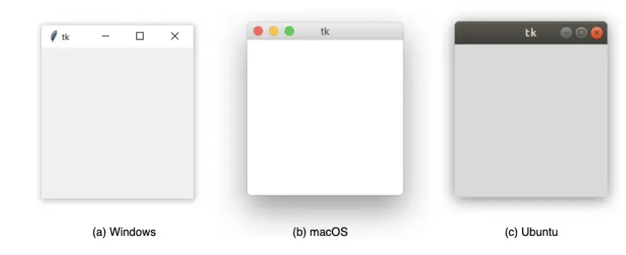
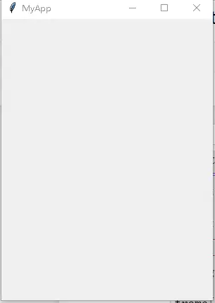
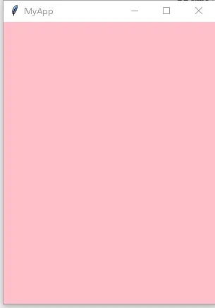
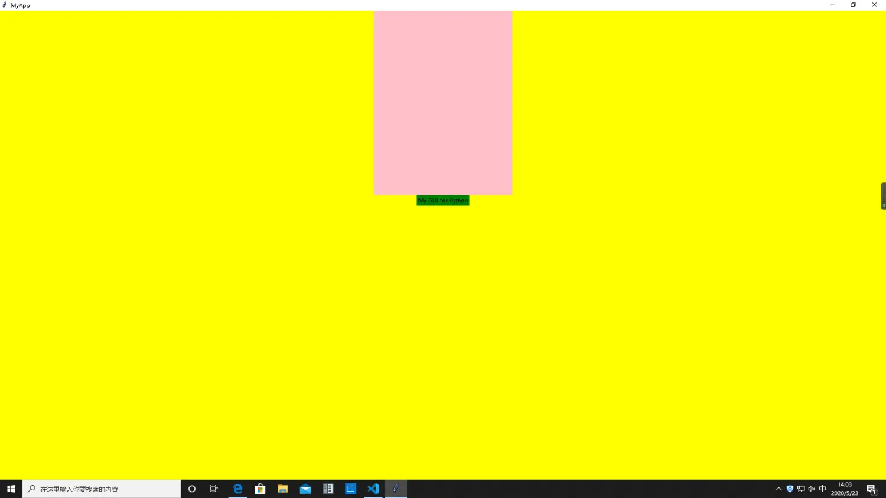
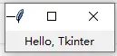
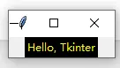
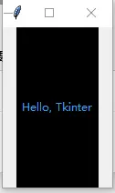
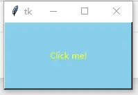
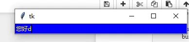
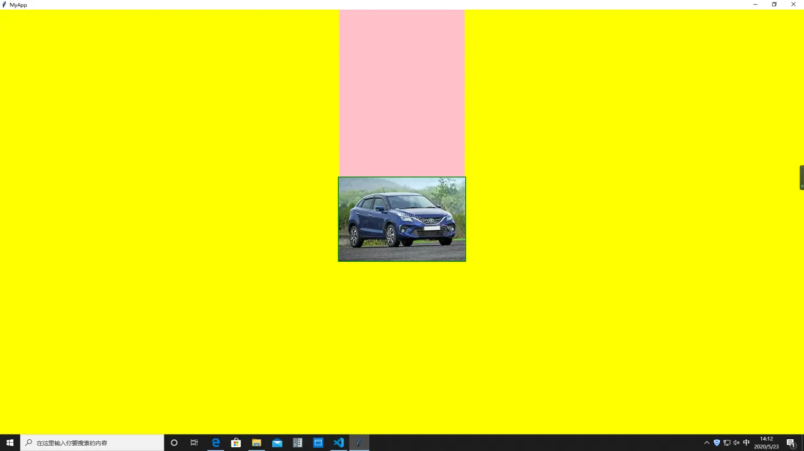

# 快速上手：第一个窗口、Frame 容器与 Label/Button/Entry

本示例把手册的两篇入门教程（F-THB-19《tkinter 基础教程》与 F-THB-11《tkinter 简单教程》）串成一条可逐步运行的学习路径：根窗口 → 容器 → 标签 → 按钮与输入框 → 图片显示。概念背景见[tkinter 入门](../concepts/01-introduction.md)与[微件体系与配置管理](../concepts/02-widgets-and-configuration.md)。[^F-THB-11][^F-THB-19]

## 环境要求

- Python 3（本知识包仅讨论 Python 3 版本的 tkinter），tkinter 为标准库自带，Windows/macOS 官方安装包默认包含；部分 Linux 发行版需安装系统包 `python3-tk`。
- 显示图片一节需要一张图片文件（示例用 `images/car.png`）；如需 JPG 格式请先 `pip install pillow`。

## 第 1 步：创建根窗口并进入事件循环

tkinter GUI 的基本元素是**窗口**（window），它是所有其他 GUI 元素所在的容器；窗口是 `Tk` 类的一个实例。`window.mainloop()` 告诉 Python 运行 tkinter 事件循环——侦听按钮单击、按键等事件，并阻塞其后的所有代码，直到窗口被关闭：[^F-THB-19]

```python
from tkinter import Tk

window = Tk()
window.mainloop()
```

执行后屏幕上弹出一个空窗口，外观取决于操作系统（视觉元素使用本机 OS 元素渲染，这也是 tkinter 跨平台且"长得像平台原生应用"的原因）：



用 `title` 设定标题、`geometry` 设定窗口大小与位置。参数形式为 `f"{width}x{height}{x}{y}"`：width、height 为正整数（像素）；x、y 为有符号整数，`+` 表示相对屏幕左上角偏移，`-` 表示相对右下角偏移，如 `"+100+100"`、`"-100-100"`：[^F-THB-11]

```python
from tkinter import Tk
root = Tk()
root.title("MyApp")
root.geometry("300x400+100+100")
root.mainloop()
```



## 第 2 步：用 Frame 划分容器区域

需求场景：窗口中需要为某块区域创建不同于窗口的主题、并容纳不同的小部件。`Frame` 就是这样的矩形容器，支持构造参数设定尺寸，也支持索引赋值方式修改属性（如背景色）。微件创建后必须调用几何管理器实例方法（`pack()`/`grid()`/`place()`）才会真正摆放：[^F-THB-11]

```python
from tkinter import Tk, Frame
root = Tk()
root.title("MyApp")
width, height = 300, 400
root.geometry(f"{width}x{height}+100-100")
frame = Frame(root, height=height, width=width)
frame['background'] = 'pink'   # 索引赋值修改背景颜色
frame.pack()                   # 放置组件
root.mainloop()
```



## 第 3 步：用 Label 显示文本与颜色

`Label` 用于在屏幕上显示文本或图像，用户不能编辑，仅用于显示。第一个参数指定父容器（根窗口或 Frame 等），`text` 是显示内容。用 `foreground`（文字色）与 `background`（背景色）控制颜色：颜色可用名称（"red"/"orange"/"yellow"/"green"/"blue"/"purple" 及大量 HTML color names）或十六进制 RGB 值（如 `"#34A2FE"`）：[^F-THB-19]

```python
from tkinter import Tk, Frame, Label
root = Tk()
root.title("MyApp")
root['background'] = 'yellow'           # 修改根窗口背景
width, height = 300, 400
root.geometry(f"{width}x{height}+100-100")
frame = Frame(root, height=height, width=width)
frame['background'] = 'pink'
frame.pack()
label = Label(root, text="My GUI for Python")
label['background'] = 'green'
label.pack()
root.mainloop()
```



先从最简单的 `Label(text="Hello, Tkinter")` 开始——创建标签小部件后同样要调用 `.pack()` 才会加入窗口：

```python
from tkinter import Tk, Label
window = Tk()
greeting = Label(text="Hello, Tkinter")
greeting.pack()
window.mainloop()
```



黄字黑底：

```python
label = Label(
    text="Hello, Tkinter",
    foreground="yellow",   # 文字颜色
    background="black",    # 背景颜色
)
```



`width` 和 `height` 控制标签宽高：

```python
label = Label(
    text="Hello, Tkinter",
    foreground="#34A2FE",
    background="black",
    width=12,
    height=10,
)
```



> **为什么宽高都设 10 却不是正方形？** 宽高以**文本单位**度量：水平单位是默认系统字体中字符 "0" 的宽度，垂直单位是字符 "0" 的高度。用文本单位而非英寸/像素，是为了保证跨平台行为一致——微件大小相对用户机器上的默认字体缩放，文本总能正确容纳。

## 第 4 步：Button 与 Entry

常用输入类微件：`Button`（可含文本、单击时执行动作）、`Entry`（单行文本输入）；多行输入用 `Text`，分组/留白用 `Frame`。[^F-THB-19]

```python
from tkinter import Button
button = Button(
    text="Click me!",
    width=25,
    height=5,
    background="skyblue",
    foreground="yellow",
)
button.pack()
```



```python
from tkinter import Tk, Entry
root = Tk()
entry = Entry(foreground="yellow", background="blue", width=50)
entry.pack()
root.mainloop()
```



## 第 5 步：在 Label 中显示图片

Label 也支持载入图片。**关键坑**：`PhotoImage` 仅支持 PGM/PPM/GIF/PNG，JPG 需 `PIL.ImageTk.PhotoImage`；且图片对象在 mainloop 期间必须被引用持有（局部变量会被垃圾回收导致图片不显示，详见[画布图片](../concepts/09-canvas-images.md)）：[^F-THB-11]

```python
from tkinter import Tk, Label, PhotoImage
root = Tk()
image = PhotoImage(file='images/car.png')   # PNG/GIF；JPG 改用 PIL.ImageTk
label = Label(root, image=image)
label.image = image                          # 持有引用，防止被回收
label.pack()
root.mainloop()
```



## 小结与下一步

- 窗口 = `Tk()` 实例 + `mainloop()` 事件循环；`geometry("WxH±x±y")` 控制尺寸位置。
- 微件创建后必须经几何管理器（pack/grid/place）摆放——三种管理器的系统讲解见[布局管理](../concepts/04-geometry-management.md)与[布局管理器综合示例](02-layout-managers.md)。
- 颜色、字体、边框的完整选项见[样式](../concepts/03-styling.md)；按钮点击动作（command 回调）与事件绑定见[事件与绑定](../concepts/05-events-and-bindings.md)。

[^F-THB-11]: 简书《tkinter 简单教程》，见[信源登记](../references/sources.md)。
[^F-THB-19]: 简书《tkinter 基础教程》（编译自 Real Python 等英文教程），见[信源登记](../references/sources.md)。
