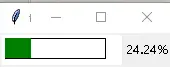

# 画布交互综合示例：Canvas 进度条、拖曳与滚轮缩放

本示例聚焦 Canvas 的动态交互：用 `coords` 重塑矩形实现进度条（F-THB-08），用 scan/scale 实现画布拖曳缩放（F-THB-16）。相关 API 全集见 [Canvas 核心机制](../concepts/07-canvas-core.md)，图片缩放与 dnd 拖放见[画布拖曳与缩放](../concepts/11-canvas-interactions.md)。[^F-THB-08][^F-THB-16]

## 示例 1：Canvas 手绘进度条

原理：画两个矩形——外框 `out_rec` 与填充条 `fill_rec`；每次更新用 `coords(item, x0, y0, x1, y1)` 重塑填充条右边界，配合 `StringVar` 显示百分比。原文代码如下（注：原文在进入 `mainloop()` 前用 `time.sleep` 循环推进度，窗口要等循环结束才显示，实际使用建议改用 `after` 调度，见后文改进版）：[^F-THB-08]

```python
import time
from tkinter import Tk, ttk, StringVar, Canvas


class Frame(ttk.Frame):
    def __init__(self, master=None, **kw):
        super().__init__(master, **kw)
        self.canvas = Canvas(self, width=120, height=30, bg="white")
        self.canvas.grid(row=0, column=0)
        # 进度条外框以及完成程度填充条
        self.out_rec = self.canvas.create_rectangle(5, 5, 105, 25)
        self.fill_rec = self.canvas.create_rectangle(5, 5, 5, 25,
                                                     width=0, fill="green")
        self.x = StringVar()
        ttk.Label(self, textvariable=self.x, width=5).grid(row=0, column=1)

    # 更新进度条
    def change_schedule(self, now_schedule, all_schedule):
        rate = now_schedule / all_schedule
        self.canvas.coords(self.fill_rec, (5, 5, 6 + rate * 100, 25))
        self.update()
        self.x.set(f"{rate * 100:.3g}%")
        if rate >= 1:
            self.x.set("完成")


def run():
    root = Tk()
    frame = Frame(root)
    frame.grid(row=0, column=0)   # 使用时按情况选择新的位置
    for i in range(100):
        time.sleep(0.1)
        frame.change_schedule(i, 99)
    root.mainloop()


if __name__ == "__main__":
    run()
```



**改进版（非阻塞，推荐）**：用 `after(ms, callback)` 把推进逻辑挂到事件循环上，窗口立即显示、进度平滑推进，也不阻塞按钮等其他交互（after 机制见[变量追踪、对话框与事件循环调度](../concepts/06-variables-dialogs-and-scheduling.md)）：

```python
from tkinter import Tk, ttk, StringVar, Canvas


class ProgressFrame(ttk.Frame):
    def __init__(self, master=None, **kw):
        super().__init__(master, **kw)
        self.canvas = Canvas(self, width=240, height=30, bg="white",
                             highlightthickness=0)
        self.canvas.grid(row=0, column=0, padx=5, pady=5)
        self.out_rec = self.canvas.create_rectangle(5, 5, 225, 25)
        self.fill_rec = self.canvas.create_rectangle(5, 5, 5, 25,
                                                     width=0, fill="green")
        self.percent = StringVar(value="0%")
        ttk.Label(self, textvariable=self.percent, width=6).grid(row=0, column=1)
        self.step = 0
        self.after(100, self.tick)          # 启动调度链

    def tick(self):
        self.step += 1
        rate = min(self.step / 100, 1.0)
        self.canvas.coords(self.fill_rec, 5, 5, 5 + rate * 220, 25)
        self.percent.set("完成" if rate >= 1 else f"{rate * 100:.0f}%")
        if rate < 1:
            self.after(100, self.tick)     # 未完成则继续调度


if __name__ == "__main__":
    root = Tk()
    ProgressFrame(root).grid(row=0, column=0)
    root.mainloop()
```

> 也可以直接用 ttk 新增的 `Progressbar` 部件（见 [ttk 主题部件](../concepts/12-ttk-themed-widgets.md)）；Canvas 手绘版的价值在于可完全定制形状、颜色与动画。

## 示例 2：可拖曳、可滚轮缩放的画布

完整可运行程序：1000×1000 的滚动区域上随机画 50 个彩色矩形，配两条 Scrollbar；左键拖动用 `scan_mark`/`scan_dragto` 平移视图，滚轮以鼠标位置为锚点缩放。要点：[^F-THB-16]

- 鼠标事件坐标是**屏幕坐标**，滚动后必须经 `canvasx`/`canvasy` 转换为画布坐标；
- 缩放后用 `bbox("all")` 重设 `scrollregion`，否则滚动范围不更新；
- Windows/macOS 是 `<MouseWheel>`（`event.delta` 正负表方向），Linux 是 `<Button-4>`/`<Button-5>`。

```python
from tkinter import Tk, Canvas, ttk
import random


class DragZoom(ttk.Frame):
    def __init__(self, master, **kw):
        super().__init__(master, **kw)
        self.canvas = Canvas(self, width=400, height=400, background="bisque")
        self.xsb = ttk.Scrollbar(self, orient="horizontal",
                                 command=self.canvas.xview)
        self.ysb = ttk.Scrollbar(self, orient="vertical",
                                 command=self.canvas.yview)
        self.canvas.configure(yscrollcommand=self.ysb.set,
                              xscrollcommand=self.xsb.set)
        self.canvas.configure(scrollregion=(0, 0, 1000, 1000))
        self.draw_rectangles()
        self.canvas.create_text(
            50, 10, anchor="nw",
            text="Click and drag to move; scroll to zoom.")
        self.layout()
        # 拖曳
        self.canvas.bind("<ButtonPress-1>", self.scroll_start)
        self.canvas.bind("<B1-Motion>", self.scroll_move)
        # 缩放：Linux 用 Button-4/5，Windows/macOS 用 MouseWheel
        self.canvas.bind("<Button-4>", self.zoom_in)
        self.canvas.bind("<Button-5>", self.zoom_out)
        self.canvas.bind("<MouseWheel>", self.zoom_wheel)

    def draw_rectangles(self):
        for _ in range(50):
            x0 = random.randint(0, 900)
            y0 = random.randint(50, 900)
            x1 = x0 + random.randint(50, 100)
            y1 = y0 + random.randint(50, 100)
            color = ("red", "orange", "yellow", "green", "blue")[
                random.randint(0, 4)]
            self.canvas.create_rectangle(x0, y0, x1, y1,
                                         outline="black", fill=color)

    def layout(self):
        self.xsb.grid(row=1, column=0, sticky="ew")
        self.ysb.grid(row=0, column=1, sticky="ns")
        self.canvas.grid(row=0, column=0, sticky="nsew")
        self.grid_rowconfigure(0, weight=1)
        self.grid_columnconfigure(0, weight=1)

    def to_canvas_xy(self, event):
        return (int(self.canvas.canvasx(event.x)),
                int(self.canvas.canvasy(event.y)))

    def scroll_start(self, event):
        x, y = self.to_canvas_xy(event)
        self.canvas.scan_mark(x, y)

    def scroll_move(self, event):
        x, y = self.to_canvas_xy(event)
        self.canvas.scan_dragto(x, y, gain=1)

    def _zoom(self, event, factor):
        x, y = self.to_canvas_xy(event)
        self.canvas.scale("all", x, y, factor, factor)
        self.canvas.configure(scrollregion=self.canvas.bbox("all"))

    def zoom_wheel(self, event):
        self._zoom(event, 1.1 if event.delta > 0 else 0.9)

    def zoom_in(self, event):
        self._zoom(event, 1.1)

    def zoom_out(self, event):
        self._zoom(event, 0.9)


if __name__ == "__main__":
    root = Tk()
    app = DragZoom(root)
    app.pack(fill="both", expand=True)
    root.mainloop()
```

运行截图（拖曳状态，Scrollbar 与视图联动）见[画布拖曳与缩放](../concepts/11-canvas-interactions.md)。

**延伸**：若缩放对象是图片（PhotoImage 不响应 `canvas.scale`），需用 PIL 按缩放倍数重采样后重绘；大图应采用"只裁剪可视区域 tile 重绘"或图像金字塔方案，避免整图重采样撑爆内存——三档方案与最小内置代码见[画布拖曳与缩放](../concepts/11-canvas-interactions.md)。

[^F-THB-08]: 简书《tkinter 使用 Canvas 实现进度条》（作者标注待更，正文仅含代码与效果图），见[信源登记](../references/sources.md)。
[^F-THB-16]: 简书《tkinter Canvas 实现拖曳与缩放功能》（参考 StackOverflow "Move a tkinter canvas with Mouse"），见[信源登记](../references/sources.md)。
