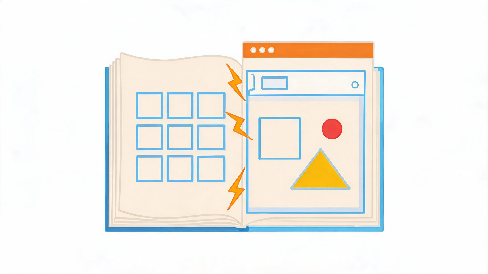
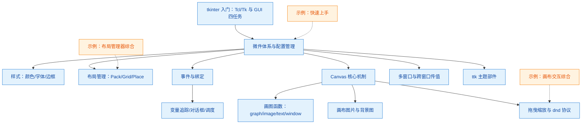

# tkinter 手册知识库



本知识包基于简书博客集《tkinter 手册》（作者 xinetzone，简书 uid 1114626，共 21 篇，2020 年 4 月至 2021 年 2 月发布；文集 /nb/ 链接未随抓取获得，21 篇文章各自的 /p/ 永久链接见[信源登记](references/sources.md)）整理而成，系统讲解 Python 标准库 GUI 框架 **tkinter**：Tcl/Tk 关系与微件体系、样式与三种布局管理器、事件绑定、变量追踪与对话框调度、Canvas 画布（参数全集、画图函数、图片坑、拖曳缩放）、Toplevel 多窗口与跨窗口传值、ttk 主题部件。所有事实均以脚注（如 F-THB-01）溯源至[信源登记](references/sources.md)，遵循 OKF v0.2 规范。

## 知识地图



## 概念文档（concepts/）

* [tkinter 入门：Tcl/Tk 关系、GUI 四任务与学习资源](concepts/01-introduction.md) — tkinter 是什么、Tcl/Tk 之上的薄面向对象层、GUI 四个基本编程任务、官方与社区资源。
* [微件体系与配置管理](concepts/02-widgets-and-configuration.md) — 完整微件清单、Misc/mixin 架构、cget/config/keys 配置三件套、name 路径标识。
* [样式：颜色、字体、边框与 tk_setPalette](concepts/03-styling.md) — 颜色名与 RGB 值、字体与文本格式化、relief 边框、全局配色方案。
* [布局管理：Pack、Grid 与 Place](concepts/04-geometry-management.md) — 三种几何管理器选项、多 Frame 嵌套坑、计算器 Grid 布局、Place 绝对/相对坐标。
* [事件与绑定](concepts/05-events-and-bindings.md) — 事件序列语法、Event 对象属性、四级绑定、WM_DELETE_WINDOW 协议。
* [变量追踪、对话框与事件循环调度](concepts/06-variables-dialogs-and-scheduling.md) — StringVar.trace 双向联动、Dialog 模态对话框、after/after_idle/update 调度、剪贴板。
* [Canvas 核心机制：item handles、tags、选项与方法全集](concepts/07-canvas-core.md) — ID/tags 双标识、预定义 all/current、组件选项表、40+ 方法速查、highlightthickness 边框坑。
* [Canvas 画图函数分组：graph / image / text / window](concepts/08-canvas-shapes.md) — create_arc/line/oval/rectangle/polygon/bitmap/image/text/window、通用参数、stipple/dash/joinstyle。
* [画布图片：PhotoImage 格式限制、引用持有坑与背景图铺底](concepts/09-canvas-images.md) — PNG/GIF 与 PIL 补 JPG、mainloop 期间引用持有、anchor='nw' 铺底、付费试读边界声明。
* [多窗口管理：Toplevel、单子窗口与跨窗口传值](concepts/10-windows.md) — geometry 语法、Toplevel 多窗口、state() 探测单例、transient/wait_window 模态回传。
* [画布拖曳与缩放：scan、canvasx/canvasy、滚轮缩放与 dnd 拖放协议](concepts/11-canvas-interactions.md) — scan_mark/scan_dragto、MouseWheel/Button-4/5 事件、图片缩放三档方案、tkinter.dnd 七回调协议。
* [ttk 主题部件：18 种部件、标准选项与状态机制](concepts/12-ttk-themed-widgets.md) — 行为/外观分离、ttk.Style、6 种新增部件、9 种状态标志与 identify/instate/state。

## 实战示例（examples/）

* [快速上手：第一个窗口、Frame 容器与 Label/Button/Entry](examples/01-getting-started.md) — 根窗口与 mainloop、geometry、Frame、Label 文本/颜色/图片、文本单位、Button/Entry；含 10 张逐步截图。
* [布局管理器综合示例：Pack 三容器、Grid 计算器、Place 随机标签](examples/02-layout-managers.md) — 三个可直接运行的完整布局程序与坑位对照实验。
* [画布交互综合示例：Canvas 进度条、拖曳与滚轮缩放](examples/03-canvas-interactions.md) — coords 进度条（sleep 版与 after 改进版）、scan 拖曳、滚轮锚点缩放联动 Scrollbar。

## 信源登记簿（references/）

* [《tkinter 手册》信源登记](references/sources.md) — F-THB-01 至 F-THB-21 逐篇登记（标题、原文链接、抓取日期、字数/截图数/待更备注）、外部参考资源、30 张截图本地化说明。

## 信任与生命周期说明

* **status 判定依据**：全部 16 个内容文档（12 个概念 + 3 个示例 + 1 个信源登记）均 `status: stable`。内容逐篇来自公开博文（20 篇免费、1 篇付费仅免费试读），tkinter API 为 Python 标准库稳定接口；F-THB-08（进度条）、F-THB-04（对话框）等"作者待更"短文虽正文极简，但均含可运行代码或截图，已在对应文档显式标注残缺边界；F-THB-12 为付费文章，仅获免费试读，图片随窗口缩放的重绘代码不在试读范围，已在 [09-画布图片](concepts/09-canvas-images.md) 声明未臆造。
* **stale_after 解释**：统一设置为 `2027-09-02`。tkinter/Tk 接口长期稳定（本知识包对应 Tk 8.5+ 主题部件时代），一年为保守复核周期，届时应对照 Python 官方文档（docs.python.org/3/library/tkinter.html）与 TkDocs 重新核验。
* **核验链路**：`generated.at` 记录生成时刻（2026-09-02）；`verified.at` 记录博客转化七阶段流程（敏感度预检→骨架判定→F 编号事实采集→P0 权威核验→三层知识拆分→信源先行生成→对抗审查）的核验事件（2026-09-02）。

本知识包共收录 16 个内容文档（12 个概念 + 3 个示例 + 1 个信源登记），另含 3 个子目录 index.md 与根 index.md、log.md；30 张运行截图本地化于 `images/` 目录，21 个数学公式图片已转写为行内文本/代码。

```{toctree}
:hidden:
:maxdepth: 7

concepts/index
examples/index
references/index
log
```
