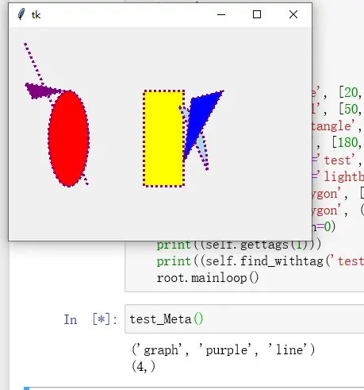

# CanvasMeta：统一的 2D 画图接口

tkinterx 提供了 `CanvasMeta` 来代替 tkinter 的 `Canvas` 进行画图，它位于 `tkinterx.graph.canvas` 模块。`CanvasMeta` 在标准 Canvas 之上封装了一个统一的 2D 画图接口，使直线、椭圆、矩形、弧、多边形等图形可以用同一个方法创建。[^F-TXH-01]

## 快速示例

下面是手册给出的第一个完整示例，在一个画布上画出直线、椭圆、矩形、弧和两个多边形，并演示标签（tags）的用法：[^F-TXH-01]

```python
def test_Meta():
    from tkinter import Tk
    from tkinterx.graph.canvas import CanvasMeta
    root = Tk()
    root.columnconfigure(0, weight=1)
    root.rowconfigure(0, weight=1)
    self = CanvasMeta(root)
    kw = {
        'color': 'purple',
        'dash': 2,
        'width': 3,
    }
    self.create_graph('line', [20, 20, 100, 200], **kw)
    self.create_graph('oval', [50, 80, 100, 200], fill='red', **kw)
    self.create_graph('rectangle', [170, 80, 220, 200], fill='yellow', **kw)
    self.create_graph('arc', [180, 100, 250, 260],
                      tags='test',
                      fill='lightblue', style='chord', **kw)
    self.create_graph('polygon', [(270, 80), (220, 170), (230, 90)], fill='blue', **kw)
    self.create_graph('polygon', ((70, 80), (20, 70), (30, 90)), fill='purple', **kw)
    self.grid(row=0, column=0)
    print((self.gettags(1)))
    print((self.find_withtag('test')))
    root.mainloop()
```

运行后画出的图形效果如图 1 所示：



图 1：画出几个不同的图形 [^F-TXH-01]

## create_graph 接口签名

`CanvasMeta` 提供的统一画图接口为：[^F-TXH-01]

```python
create_graph(graph_type, directions, color='blue', width=1, tags=None, **kwargs)
```

各参数含义：

- **graph_type**：指定画图的类型，取值为 `'rectangle'`（矩形）、`'oval'`（椭圆）、`'line'`（直线）、`'arc'`（弧）、`'polygon'`（多边形）。
- **directions**：指定要画图形的对角线的方向向量 `d = (x0, y0, x1, y1)`，其中 `(x0, y0)` 与 `(x1, y1)` 分别表示图形的左上角与右下角坐标。当 graph_type 为 `'polygon'` 时，则以 `*points` 的形式指定 directions 的值（即一组坐标点序列，如 `[(270, 80), (220, 170), (230, 90)]`）。
- **color**：表示图形的颜色（轮廓颜色）。
- **width**：表示图形（轮廓线）的宽度。
- **tags**：表示图对象的标识 id 绑定的标签信息。
- **fill**：表示图形的填充颜色；由于 `'line'`（直线）无法填充，此参数对 graph_type 为 `'line'` 的图形无效。
- 其余 `**kwargs` 透传给底层 Canvas 图元选项，例如示例中的 `dash`（虚线）、`style='chord'`（弧的样式为弦形）等。

## 标签（tags）规则

`tags` 参数可以接受多种形式：[^F-TXH-01]

- 列表形式，如 `['line', 'graph']`；
- 元组形式，如 `('test', 'graph')`；
- 单个字符串，如 `'line'`；
- 空格分隔的多标签字符串，如 `'line graph'`。

需要注意：像 `'1'`、`'1 2 2'` 这种纯数字的标签是无效的（Canvas 内部用数字 id 标识图元，纯数字标签会与 id 冲突）。如果 `tags` 为 `None`，则默认添加标签 `[graph_type, 'graph']`，例如画直线时自动带上 `['line', 'graph']`。

示例中的两行打印演示了标签查询：`self.gettags(1)` 返回 id 为 1 的图元的全部标签；`self.find_withtag('test')` 返回绑定了 `'test'` 标签的图元 id（即那个弧）。

## 使用要点

1. `CanvasMeta` 本身是一个 tkinter 控件，创建后需用 `grid()` / `pack()` 等几何管理器放置到父容器上（示例中 `self.grid(row=0, column=0)`）。
2. 通过 `root.columnconfigure(0, weight=1)` 与 `root.rowconfigure(0, weight=1)` 配合 grid 布局，可以让画布随窗口缩放。
3. `create_graph` 返回底层 Canvas 图元 id，可配合 `gettags` / `find_withtag` 等标准 Canvas 方法做图元管理。

## 相关概念

- [tkinterx 概览：安装与模块地图](01-overview.md) — 了解 tkinterx 的安装与模块划分
- [规则图形与批量阵列](03-graph-shapes.md) — create_point / create_circle / create_square 与按行/列批量绘图
- [几何画板](05-geometry-painter.md) — 基于 CanvasMeta 的交互式绘图应用
- [模拟电子限速标志](../examples/03-speed-limit-sign.md) — create_graph 家族方法的综合实战
- [《tkinterx 手册》信源登记](../references/sources.md)

[^F-TXH-01]: 简书《tkinter 的拓展包：tkinterx》，见[信源登记](../references/sources.md)。