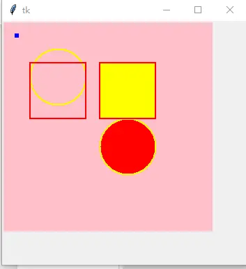
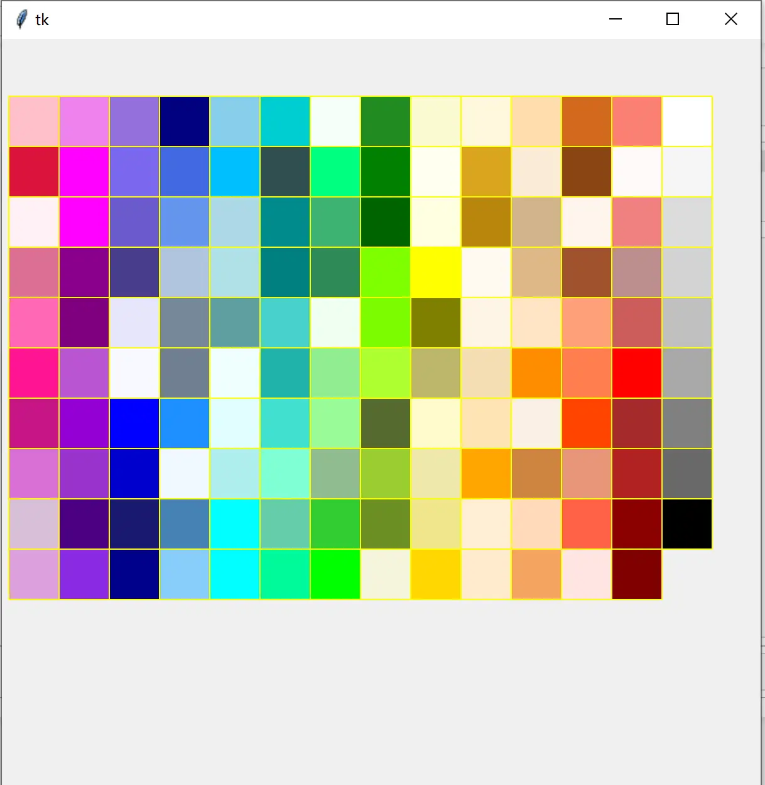
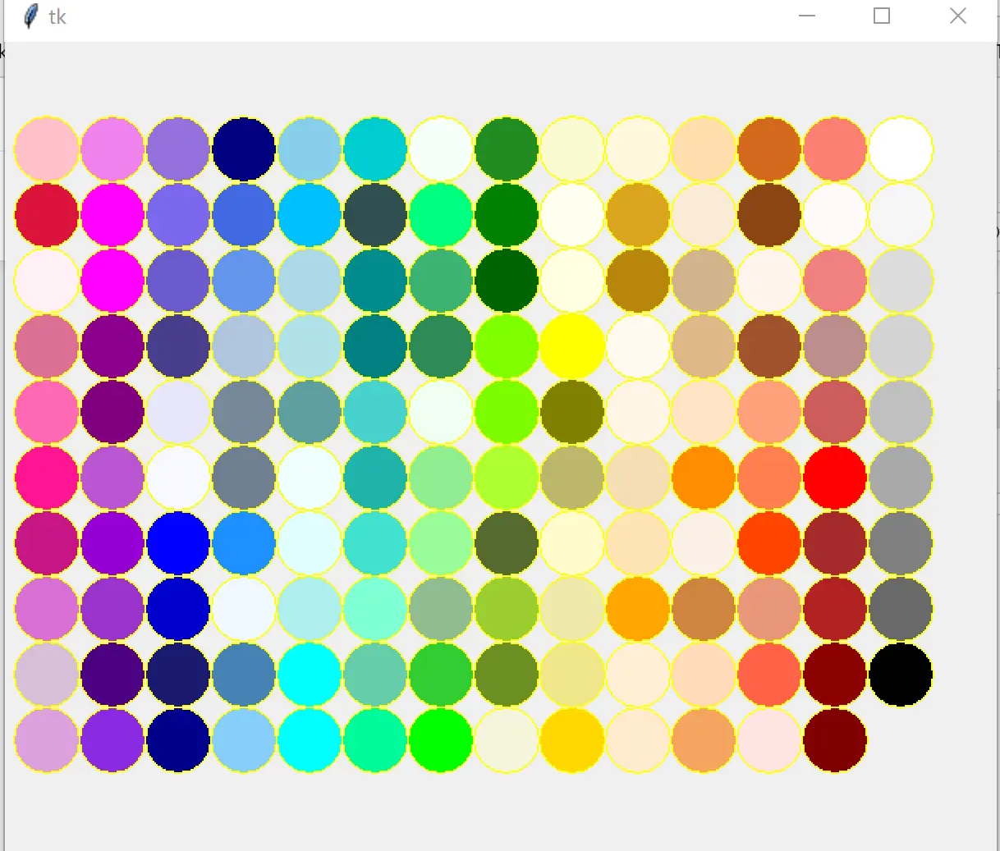
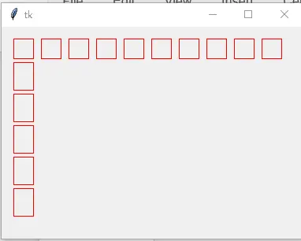
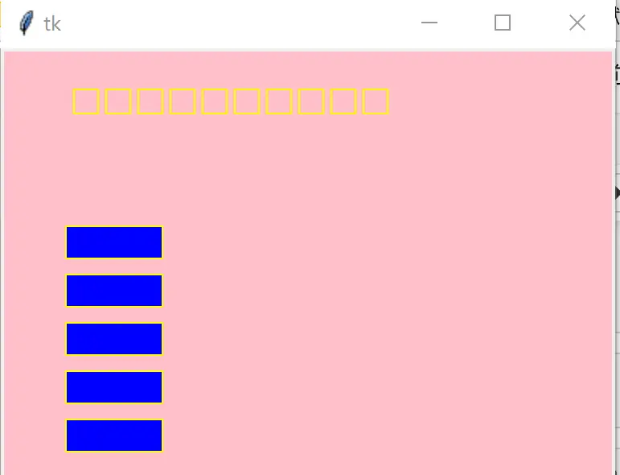
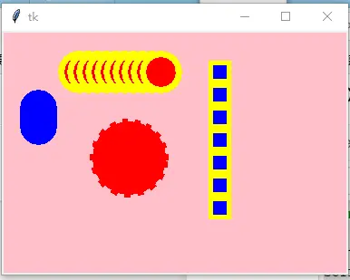
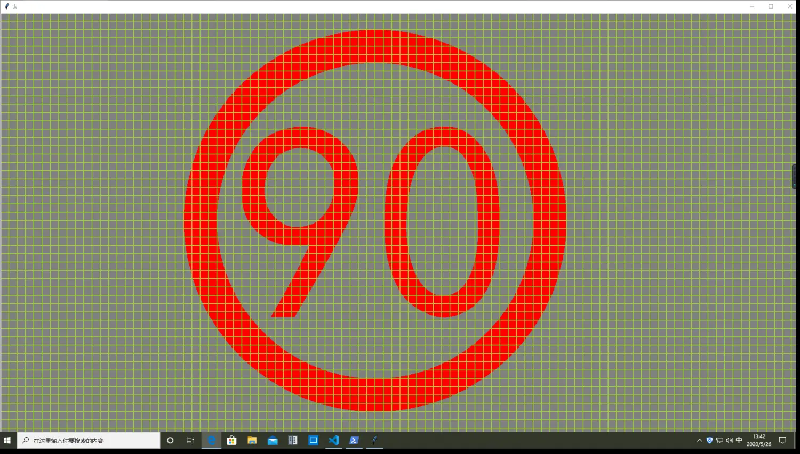

# 规则图形、批量阵列与图形设计工具

本篇汇总 tkinterx 在 `create_graph` 之上提供的三类画图能力：语义化图元（点、圆、正方形）、按行/列批量创建图形的阵列工具，以及可在运行时修改形状、颜色、填充、轮廓宽度的图形设计工具（`tkinterx.graph.canvas_design`）。[^F-TXH-01][^F-TXH-03]

## 1 创建点、圆与正方形：create_point / create_circle / create_square

《tkinterx 之画图》一篇讨论了一些"有趣的画图技巧"，核心是 `CanvasMeta` 上三个更友好的图元方法：[^F-TXH-03]

```python
def test_CanvasSquare():
    from tkinter import Tk
    from tkinterx.graph.canvas import CanvasMeta
    root = Tk()
    root.geometry('350x350')
    self = CanvasMeta(root, background='pink', width=300, height=300)
    self.create_point((20, 20), color='red', width=5)  # 设置点的大小为 5
    self.create_circle((80, 80), radius=40, color='yellow', width=2)
    self.create_circle((180, 180), radius=40,
                       color='yellow', width=2, fill='red')
    self.create_square((80, 100), radius=40, color='red', width=2)
    self.create_square((180, 100), radius=40, color='red',
                       width=2, fill='yellow')
    self.grid(row=0, column=0)
    root.mainloop()
```

接口要点：[^F-TXH-03]

1. `self.create_point` 创建**点**。参数与其他图元一致：第一个参数表示点的坐标，可以使用 `width` 设定点的大小（示例中为 5）。
2. `self.create_circle` 与 `self.create_square` 分别用于创建**圆**与**正方形**。参数设定一致：第一个参数是图形的中心坐标，第二个参数是圆的"半径"，或者正方形对角线的一半。

效果图见图 1：



图 1：创建圆与正方形及点 [^F-TXH-03]

## 2 用 color_dict 画堆叠的彩色方块矩阵

结合颜色字典 `tkinterx.tools.colors.color_dict`（详见[颜色工具与抠图工具](06-tools-colors-matting.md)），可以用 `create_square` 画出不同颜色的正方形块，组成 10 列的彩色矩阵：[^F-TXH-03]

```python
from tkinter import Tk
from tkinterx.graph.canvas import CanvasMeta
from tkinterx.tools.colors import color_dict

root = Tk()
self = CanvasMeta(root, width=600, height=600)
row = -1
column = -1
x, y = 25, 25
for k, color in enumerate(color_dict):
    if k % 10 == 0:
        row += 1
        column = 0
    column += 1
    self.create_square((x+row*40, y+column*40), 20,
                       color='yellow', tags=color, fill=color)
self.grid()
root.mainloop()
```

每个方块以颜色名作为 tag（`tags=color`），填充色即该颜色本身，轮廓统一为黄色。效果如图 2：



图 2：堆叠的正方形 [^F-TXH-03]

把图元从正方形切换为圆（同样以颜色填充），即可得到堆叠的彩色圆矩阵，效果如图 3：



图 3：堆叠的圆 [^F-TXH-03]

## 3 按行或者列创建图形对象

《tkinter 的拓展包：tkinterx》一篇给出了通过继承 `CanvasMeta` 批量创建图形的方式：用 `tkinterx.param.ParamDict` 声明颜色与形状两个属性参数，在子类中实现 `draw` / `add_row` / `add_column` 方法：[^F-TXH-01]

```python
from tkinterx.param import ParamDict
from tkinterx.graph.canvas import CanvasMeta
from tkinter import Tk

class SimpleGraph(CanvasMeta):
    color = ParamDict()
    shape = ParamDict()

    def __init__(self, master, shape, color, cnf={}, **kw):
        '''The base class of all graphics frames.

        :param master: a widget of tkinter or tkinter.ttk.
        '''
        super().__init__(master, cnf, **kw)
        self.color = color
        self.shape = shape

    def draw(self, direction, width=1, tags=None, **kw):
        kw.update({'color': self.color, 'width': width, 'tags': tags})
        return self.create_graph(self.shape, direction, **kw)

    def add_row(self, direction, num, stride=10, width=1, tags=None, **kw):
        x0, y0, x1, y1 = direction
        stride = x1 - x0 + stride
        for k in range(num):
            direction = [x0+stride*k, y0, x1+stride*k, y1]
            self.draw(direction, width=width, tags=tags, **kw)

    def add_column(self, direction, num, stride=5, width=1, tags=None, **kw):
        x0, y0, x1, y1 = direction
        stride = y1 - y0 + stride
        for k in range(num):
            direction = [x0, y0+stride*k, x1, y1+stride*k]
            self.draw(direction, width=width, tags=tags, **kw)

if __name__ == "__main__":
    root = Tk()
    self = SimpleGraph(root, 'rectangle', 'red')
    self.add_row([15, 15, 40, 40], 10)
    self.add_column([15, 45, 40, 80], 5)
    self.grid()
    root.mainloop()
```

效果图如图 4：



图 4：按行或者列创建图形对象 [^F-TXH-01]

`add_row` 与 `add_column` 的参数均为 `direction, num, stride=10, width=1, tags=None, **kw`。其中 `num` 表示行数或者列数，`stride` 表示图形间隔的像素个数，其余参数与 `CanvasMeta` 的画图接口参数一致（原文此处写作"draw_graph 函数"，实际接口名为 `create_graph`）。[^F-TXH-01]
## 4 可修改形状、颜色、填充、轮廓宽度的工具：canvas_design.SimpleGraph

在 tkinterx 中定制了一个可以修改形状、颜色、填充、轮廓宽度的工具，位于 `tkinterx.graph.canvas_design` 模块，同名 `SimpleGraph` 类：[^F-TXH-01]

```python
from tkinter import Tk
from tkinterx.graph.canvas_design import SimpleGraph

root = Tk()
self = SimpleGraph(root, 'rectangle', 'yellow', width=1, fill=None, background='pink')
self.add_row([25, 25, 40, 40], 10, 20)
self.fill = 'blue' # 修改填充颜色
self.add_column([40, 80, 100, 100], 5, 30, tags='TY') # 自定义标签
self.grid(row=0, column=0)
root.mainloop()
```

构造时传入形状（`'rectangle'`）、轮廓颜色（`'yellow'`）、线宽 `width`、初始填充 `fill=None` 与画布背景 `background='pink'`；创建后可通过实例属性 `self.fill = 'blue'` 动态修改填充颜色，再画的列即采用新填充，还可以为整列图形指定自定义标签 `tags='TY'`。输出界面如图 5：



图 5：可以修改图形属性的工具 [^F-TXH-01]

## 5 规则图形：RegularGraph（圆与正方形）

`tkinterx.graph.canvas_design.RegularGraph` 用于画出规则的图形（圆 `'circle'` 与正方形 `'square'`），支持在运行时切换形状、填充、线宽，并可为图元配置激活态（active）选项：[^F-TXH-01]

```python
from tkinter import Tk
from tkinterx.graph.canvas_design import RegularGraph
root = Tk()
self = RegularGraph(root, 'circle', 'yellow', width=7, fill=None, background='pink')
self.fill = 'red'
self.draw([140, 140], 40, tags='DF', activedash=7,
          activeoutlinestipple='error', activeoutline='red')
self.add_row([75, 45], 20, 10)
self.width = 0
self.fill = 'blue'
self.add_column([40, 80], 20, 5)
self.shape = 'square'
self.width = 5
self.add_column([240, 20], radius=10, num=7, stride=25)
self.grid(row=0, column=0)
root.mainloop()
```

要点：

- 构造时形状为 `'circle'`；先 `self.fill = 'red'` 再 `draw([140, 140], 40, ...)` 画一个半径 40、红填充的圆，并通过 `activedash=7`、`activeoutlinestipple='error'`、`activeoutline='red'` 设置鼠标激活态样式。
- `add_row([75, 45], 20, 10)` 横向画 20 个圆；随后 `self.width = 0`（去掉轮廓）、`self.fill = 'blue'`（改蓝填充），`add_column([40, 80], 20, 5)` 纵向画 20 个蓝填充圆。
- `self.shape = 'square'` 切换形状为正方形、`self.width = 5` 恢复轮廓，`add_column([240, 20], radius=10, num=7, stride=25)` 以关键字参数方式纵向画 7 个、半径 10、间距 25 的正方形。

效果如图 6：



图 6：画出正方形与圆形 [^F-TXH-01]

## 6 综合应用：模拟电子限速标志

《tkinterx 模拟电子限速》一篇给出一个完整可运行示例：在灰色画布上铺满黄绿色小正方形网格作为背景，中间用红色圆环 + 楷体"90"文字模拟电子限速牌，综合使用了 `create_text`、`create_circle` 与 `create_square`：[^F-TXH-05]

```python
from tkinter import Tk, Label, ttk
from tkinterx.graph.canvas import CanvasMeta

W, H = 1920, 1080
x, y = [900, 500]
fill = 'red'  # 限速标志的颜色
text = '90'  # 限速标志
spacing = 20 # 正方形边界
r = 420  # 圆环半径
root = Tk()
root.geometry(f'{W}x{H}')
self = CanvasMeta(root, bg='gray')
self.create_text([x, y], text=text, font='楷体 500', fill=fill)
self.create_circle([x, y], r, width=80, color='red')
row = int(W/spacing)
column = int(H/spacing)
for i in range(row):
    for j in range(column):
        self.create_square([i*spacing, j*spacing], spacing, width=2, color='yellowgreen')
self.grid(sticky='nesw')
root.columnconfigure(0, weight=1)
root.rowconfigure(0, weight=1)
root.mainloop()
```

- `create_text([x, y], text=text, font='楷体 500', fill=fill)` 在画布中心写入限速数字；
- `create_circle([x, y], r, width=80, color='red')` 以 80 像素的粗线宽画红色圆环；
- 双重循环按 `spacing=20` 像素步长铺满 `yellowgreen`（黄绿）小正方形，模拟电子屏点阵；
- `grid(sticky='nesw')` 配合行列 `weight=1` 让画布随窗口拉伸。

运行效果如图 7：



图 7：模拟电子限速效果 [^F-TXH-05]

完整运行步骤见[示例：模拟电子限速标志](../examples/03-speed-limit-sign.md)。

## 相关概念

- [CanvasMeta：统一的 2D 画图接口](02-canvas-meta.md) — create_graph 是本篇所有图元方法的基础
- [tkinterx 概览：安装与模块地图](01-overview.md) — 模块划分与安装方式
- [颜色工具与抠图工具](06-tools-colors-matting.md) — 本篇用到的 color_dict 颜色字典
- [几何画板](05-geometry-painter.md) — Selector 与 GraphPainter 同样构建在 canvas_design 之上
- [模拟电子限速标志](../examples/03-speed-limit-sign.md) — 本篇第 6 节示例的运行说明
- [《tkinterx 手册》信源登记](../references/sources.md)

[^F-TXH-01]: 简书《tkinter 的拓展包：tkinterx》，见[信源登记](../references/sources.md)。
[^F-TXH-03]: 简书《tkinterx 之画图》，见[信源登记](../references/sources.md)。
[^F-TXH-05]: 简书《tkinterx 模拟电子限速》，见[信源登记](../references/sources.md)。