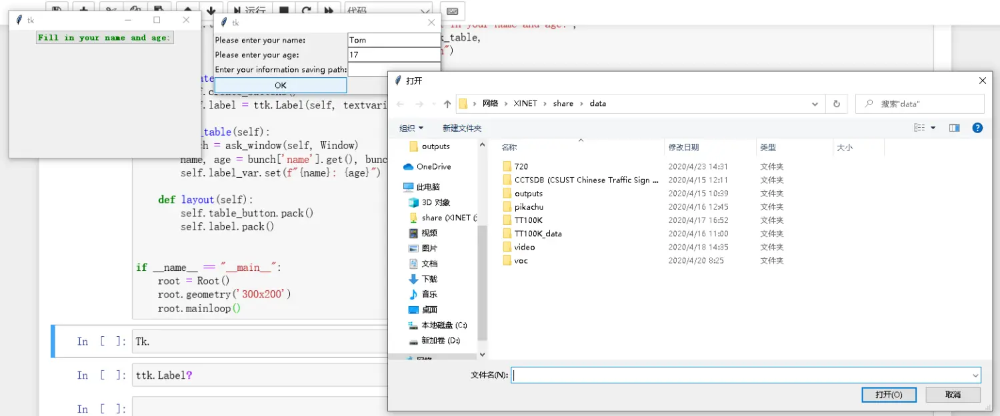

# WindowMeta：可传递值的窗体

`tkinterx.meta.WindowMeta` 是一个可定制的对话框基类，用于在不同窗体之间传递用户输入的值。手册以"个人信息登记"为例：主窗体上有一个按钮，点击后弹出登记对话框，用户填写姓名、年龄与保存路径，确认后主窗体拿到这些值并显示出来。[^F-TXH-01]

## 完整示例

```python
import json
from tkinter import Tk, StringVar, ttk
from tkinterx.meta import WindowMeta, ask_window, askokcancel, showwarning

class Window(WindowMeta):
    def __init__(self, master=None, cnf={}, **kw):
        super().__init__(master, cnf, **kw)

    def create_widget(self):
        self.add_row('Please enter your name:', 'name')
        self.add_row('Please enter your age:', 'age')
        self.add_row('Enter your information saving path:', 'save_path')

    def save(self, path):
        table = self.table.todict()
        with open(path, 'w') as fp:
            json.dump(table, fp)

    def run(self):
        self.withdraw()
        name = self.table['name']
        age = self.table['age']
        save_path = str(self.table['save_path'])
        if '' in [name, age, save_path]:
            showwarning(self)
        else:
            self.save(save_path)
            askokcancel(self)

class Root(Tk):
    def __init__(self):
        super().__init__()
        self.label_var = StringVar()
        self.create_widgets()
        self.layout()

    def create_buttons(self):
        style = ttk.Style()
        style.configure("C.TButton",
                        foreground="green",
                        background="white",
                        relief='raise',
                        justify='center',
                        font=('YaHei', '10', 'bold'))
        self.table_button = ttk.Button(self, text='Fill in your name and age:',
                                       command=self.ask_table,
                                       style="C.TButton")

    def create_widgets(self):
        self.create_buttons()
        self.label = ttk.Label(self, textvariable=self.label_var)

    def ask_table(self):
        bunch = ask_window(self, Window)
        name, age = bunch['name'], bunch['age']
        self.label_var.set(f"{name}: {age}")

    def layout(self):
        self.table_button.pack()
        self.label.pack()

if __name__ == "__main__":
    root = Root()
    root.geometry('300x200')
    root.mainloop()
```

输出的界面为：



图 1：可传递值的窗体 [^F-TXH-01]

## add_row：创建"行数据"

`WindowMeta` 提供实例方法 `add_row(text, key)` 创建一行"行数据"，即 `text: key` 形式的 ttk 小部件：[^F-TXH-01]

- `text` 使用 `ttk.Label` 小部件显示提示文字；
- `key` 使用 `ttk.Entry` 小部件接收用户输入。

对于 `key`，如果设定为以 `*path`、`*dir` 结尾（即字段名包含路径/目录语义），则在用鼠标点击其对应的 `text` 标签时会分别打开**文件选择器**与**文件夹选择器**。示例中 `save_path` 字段即用于让用户选择信息保存路径。

## table 属性：收集用户输入

`WindowMeta` 中用户传入的值均被记录在其 `table` 属性字典之中，可以被其他窗体获取。示例中：[^F-TXH-01]

- `self.table['name']`、`self.table['age']`、`self.table['save_path']` 读取三个字段的值；
- `self.table.todict()` 把表格内容转为普通字典，配合 `json.dump` 保存到用户指定的 JSON 文件。

## create_widget 与 run：需要使用者重载的两个方法

`WindowMeta` 有两个关键的实例方法需要使用者自行重载：[^F-TXH-01]

- **`create_widget`**：用于创建小部件，在其中调用 `add_row` 逐行布置表单字段；
- **`run`**：与对话框的 OK 按钮绑定，点击 OK 时执行——示例中先 `self.withdraw()` 隐藏对话框，校验三个字段非空（任一为空则 `showwarning(self)` 弹出警告），校验通过则调用 `self.save(save_path)` 保存 JSON，最后 `askokcancel(self)` 弹出完成确认。

## ask_window：跨窗体传值

为了在不同窗体之间传递用户输入的信息，还需要借助 `tkinterx.meta.ask_window` 函数。主窗体 `Root` 的实例方法 `ask_table` 中：[^F-TXH-01]

```python
bunch = ask_window(self, Window)
name, age = bunch['name'], bunch['age']
self.label_var.set(f"{name}: {age}")
```

`ask_window(self, Window)` 以主窗体为父容器弹出 `Window` 对话框，对话框关闭后返回包含用户输入的 `bunch` 字典；主窗体从中取出 `name`、`age` 并通过 `StringVar` 刷新标签显示。`askokcancel` 与 `showwarning` 则分别是"操作成功确认"与"字段为空警告"的标准提示框辅助函数。

## 相关概念

- [tkinterx 概览：安装与模块地图](01-overview.md) — tkinterx.meta 模块在整体结构中的位置
- [CanvasMeta：统一的 2D 画图接口](02-canvas-meta.md) — 画布类与窗体类同属 tkinterx 的基础封装
- [几何画板](05-geometry-painter.md) — 主窗体组合 Selector 与 GraphPainter 的更大示例
- [快速上手：安装与第一个程序](../examples/01-getting-started.md) — 从零安装并运行 tkinterx 程序
- [《tkinterx 手册》信源登记](../references/sources.md)

[^F-TXH-01]: 简书《tkinter 的拓展包：tkinterx》，见[信源登记](../references/sources.md)。