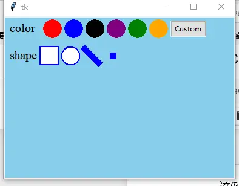
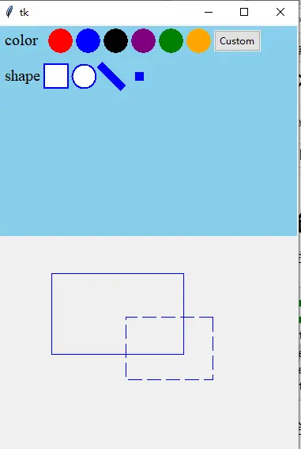
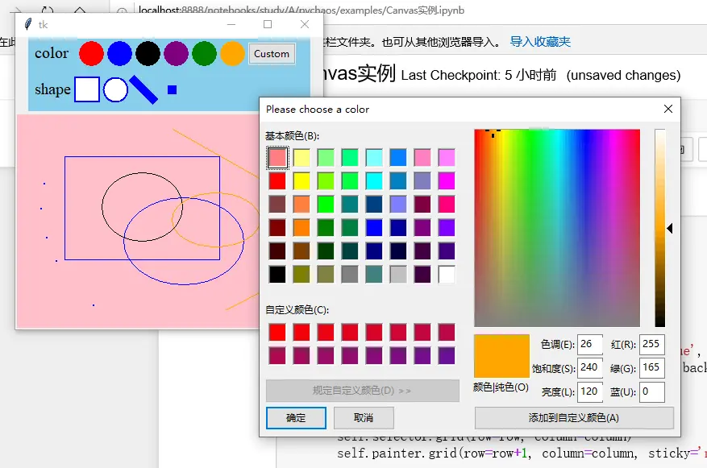

# 几何画板：Selector 选择器与 GraphPainter 画板

tkinterx 在 `tkinterx.graph.canvas_design.Selector`（图形选择面板）与 `tkinterx.graph.painter`（`GraphMeta` / `GraphPainter` 画板）之上，组合出一个可以用鼠标绘图、选择、移动、删除图形的几何画板应用。本篇按"选择面板 → 画图面板 → 完整窗体"三步展开。[^F-TXH-01]

## 1 Selector：选择图形形状和颜色的面板

首先创建一个用于选择图形的形状和颜色的面板：[^F-TXH-01]

```python
from tkinter import Tk
from tkinterx.graph.canvas_design import Selector
root = Tk()
select = Selector(root, background='skyblue')
select.grid()
root.mainloop()
```

界面如图 1：



图 1：选择图形的形状和颜色的面板 [^F-TXH-01]

## 2 GraphMeta：创建画图面板

把 Selector 与画板组合起来：`GraphMeta` 接收一个 Selector 实例作为图形/颜色来源，调用 `bind_drawing()` 绑定绘图事件后即可用鼠标作图：[^F-TXH-01]

```python
from tkinterx.graph.painter import GraphMeta
from tkinter import Tk

root = Tk()
selector = Selector(root, background='skyblue')
self = GraphMeta(root, selector)
self.bind_drawing()
selector.grid()
self.grid()
root.mainloop()
```

效果图如图 2：



图 2：几何画板 [^F-TXH-01]

## 3 GraphPainter 与 DrawingWindow：完整的几何画板窗体

进一步用 `tkinterx.graph.painter.GraphPainter` 封装完整交互（`bind_drawing` 绑定绘图、`bind_master` 绑定主窗体事件），并在自定义 `DrawingWindow` 中把选择器与画板上下布局：[^F-TXH-01]

```python
from tkinter import Tk
from tkinterx.graph.canvas_design import Selector
from tkinterx.graph.painter import GraphPainter

class DrawingWindow(Tk):
    def __init__(self, **win_kw):
        super().__init__(**win_kw)
        self.selector = Selector(self, background='skyblue', width=350, height=90)
        self.painter = GraphPainter(self, self.selector, background='pink')
        self.painter.bind_drawing()
        self.painter.bind_master()

    def layout(self, row=0, column=0):
        self.selector.grid(row=row, column=column)
        self.painter.grid(row=row+1, column=column, sticky='nesw')

self = DrawingWindow()
self.layout(row=0, column=0)
self.mainloop()
```

`DrawingWindow` 设定了一系列鼠标与键盘的事件绑定：[^F-TXH-01]

- 使用实例变量 `record_bbox=[x0, y0, x1, y1]` 追踪画布上的鼠标位置：`(x0, y0)` 记录点击鼠标左键触发的位置，`(x1, y1)` 记录鼠标移动的实时位置；当鼠标左键释放后，`(x0, y0)` 设定为 `['none']*2`。
- 支持使用 **F1** 清空画布。
- 支持 **Ctrl+a** 选中画布全部图形，然后使用鼠标进行整体移动。
- 支持使用鼠标左键选中图形并拖动到其他位置。
- 支持将鼠标移动到图形内，使用 **Del** 按键进行删除。

使用鼠标作图的过程中，图形的边框是加粗的虚线，离开图形之后变成实线。可以通过下方的选择器切换不同颜色（可自定义）的画笔以及所画图形的形状，也支持使用键盘的方向键移动鼠标指针位置所选中的图形。效果如图 3：



图 3：可修改图形的几何画板 [^F-TXH-01]

完整运行步骤见[示例：几何画板应用](../examples/02-geometry-painter-app.md)。

## 相关概念

- [tkinterx 概览：安装与模块地图](01-overview.md) — Selector 与 GraphPainter 所在模块
- [CanvasMeta：统一的 2D 画图接口](02-canvas-meta.md) — 画板底层仍调用 create_graph 系列接口
- [规则图形与批量阵列](03-graph-shapes.md) — RegularGraph/SimpleGraph 与 Selector 同属 canvas_design 模块
- [可传递值的窗体](04-window-meta.md) — WindowMeta 对话框与 DrawingWindow 都是 Tk 窗体的封装范式
- [几何画板应用（示例）](../examples/02-geometry-painter-app.md) — 本篇完整代码的运行说明
- [《tkinterx 手册》信源登记](../references/sources.md)

[^F-TXH-01]: 简书《tkinter 的拓展包：tkinterx》，见[信源登记](../references/sources.md)。