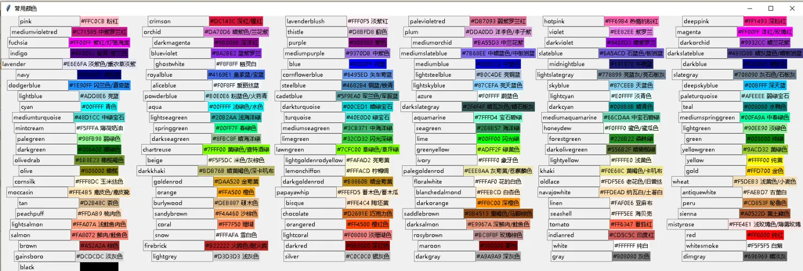
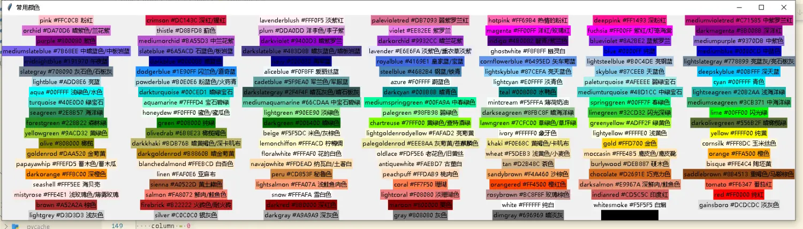
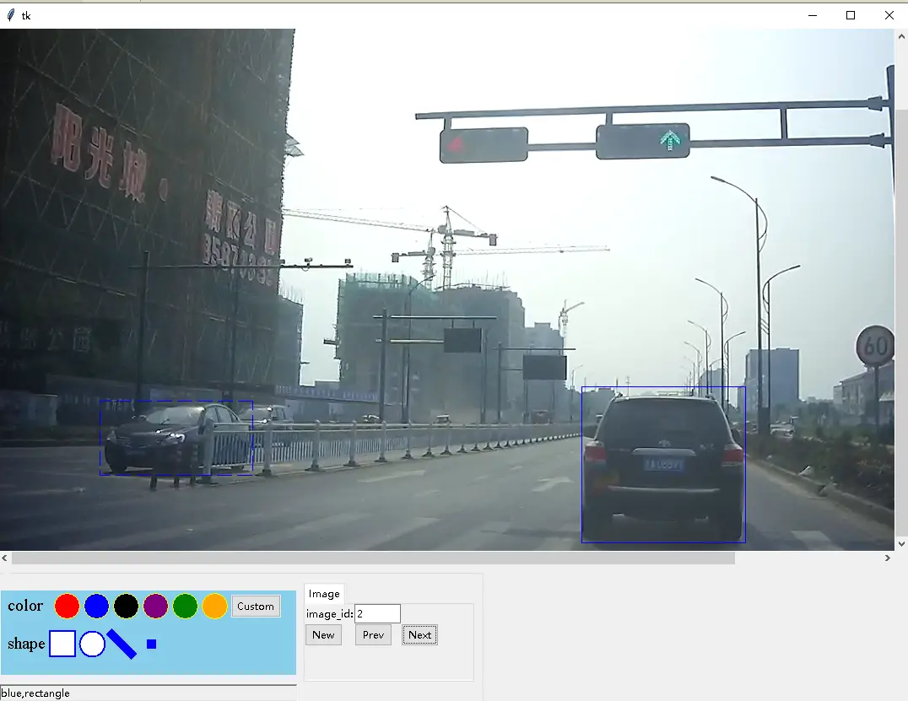

# 颜色工具与抠图工具

## 1 一键弹出常用颜色表：show_colors

tkinter 界面开发时常需要挑选颜色。tkinterx 在 `tkinterx.tools.colors` 模块中提供了 `show_colors()`，直接调用即可弹出一个常用颜色表单窗口：[^F-TXH-02]

```python
from tkinterx.tools.colors import show_colors
show_colors()
```

运行后弹出的颜色表窗口如图 1：



图 1：常用颜色表单 [^F-TXH-02]

## 2 自制颜色表单：color_dict 颜色字典

`tkinterx.tools.colors` 还提供了 `color_dict`——一个包含 140 余条记录的颜色字典，键为颜色英文名，值为"十六进制颜色码 + 中文译名"字符串。原文给出了该字典的完整数据与一个用 ttk.Label 网格自制颜色表的简单程序：[^F-TXH-02]

```python
color_dict = {'pink': '#FFC0CB 粉红',
              'crimson': '#DC143C 深红/猩红',
              'lavenderblush': '#FFF0F5 淡紫红',
              'palevioletred': '#DB7093 弱紫罗兰红',
              'hotpink': '#FF69B4 热情的粉红',
              'deeppink': '#FF1493 深粉红',
              'mediumvioletred': '#C71585 中紫罗兰红',
              'orchid': '#DA70D6 暗紫色/兰花紫',
              'thistle': '#D8BFD8 蓟色',
              'plum': '#DDA0DD 洋李色/李子紫',
              'violet': '#EE82EE 紫罗兰',
              'magenta': '#FF00FF 洋红/玫瑰红',
              'fuchsia': '#FF00FF 紫红/灯笼海棠',
              'darkmagenta': '#8B008B 深洋红',
              'purple': '#800080 紫色',
              'mediumorchid': '#BA55D3 中兰花紫',
              'darkviolet': '#9400D3 暗紫罗兰',
              'darkorchid': '#9932CC 暗兰花紫',
              'indigo': '#4B0082 靛青/紫兰色',
              'blueviolet': '#8A2BE2 蓝紫罗兰',
              'mediumpurple': '#9370DB 中紫色',
              'mediumslateblue': '#7B68EE 中暗蓝色/中板岩蓝',
              'slateblue': '#6A5ACD 石蓝色/板岩蓝',
              'darkslateblue': '#483D8B 暗灰蓝色/暗板岩蓝',
              'lavender': '#E6E6FA 淡紫色/熏衣草淡紫',
              'ghostwhite': '#F8F8FF 幽灵白',
              'blue': '#0000FF 纯蓝',
              'mediumblue': '#0000CD 中蓝色',
              'midnightblue': '#191970 午夜蓝',
              'darkblue': '#00008B 暗蓝色',
              'navy': '#000080 海军蓝',
              'royalblue': '#4169E1 皇家蓝/宝蓝',
              'cornflowerblue': '#6495ED 矢车菊蓝',
              'lightsteelblue': '#B0C4DE 亮钢蓝',
              'lightslategray': '#778899 亮蓝灰/亮石板灰',
              'slategray': '#708090 灰石色/石板灰',
              'dodgerblue': '#1E90FF 闪兰色/道奇蓝',
              'aliceblue': '#F0F8FF 爱丽丝蓝',
              'steelblue': '#4682B4 钢蓝/铁青',
              'lightskyblue': '#87CEFA 亮天蓝色',
              'skyblue': '#87CEEB 天蓝色',
              'deepskyblue': '#00BFFF 深天蓝',
              'lightblue': '#ADD8E6 亮蓝',
              'powderblue': '#B0E0E6 粉蓝色/火药青',
              'cadetblue': '#5F9EA0 军兰色/军服蓝',
              'azure': '#F0FFFF 蔚蓝色',
              'lightcyan': '#E0FFFF 淡青色',
              'paleturquoise': '#AFEEEE 弱绿宝石',
              'cyan': '#00FFFF 青色',
              'aqua': '#00FFFF 浅绿色/水色',
              'darkturquoise': '#00CED1 暗绿宝石',
              'darkslategray': '#2F4F4F 暗瓦灰色/暗石板灰',
              'darkcyan': '#008B8B 暗青色',
              'teal': '#008080 水鸭色',
              'mediumturquoise': '#48D1CC 中绿宝石',
              'lightseagreen': '#20B2AA 浅海洋绿',
              'turquoise': '#40E0D0 绿宝石',
              'aquamarine': '#7FFFD4 宝石碧绿',
              'mediumaquamarine': '#66CDAA 中宝石碧绿',
              'mediumspringgreen': '#00FA9A 中春绿色',
              'mintcream': '#F5FFFA 薄荷奶油',
              'springgreen': '#00FF7F 春绿色',
              'mediumseagreen': '#3CB371 中海洋绿',
              'seagreen': '#2E8B57 海洋绿',
              'honeydew': '#F0FFF0 蜜色/蜜瓜色',
              'lightgreen': '#90EE90 淡绿色',
              'palegreen': '#98FB98 弱绿色',
              'darkseagreen': '#8FBC8F 暗海洋绿',
              'limegreen': '#32CD32 闪光深绿',
              'lime': '#00FF00 闪光绿',
              'forestgreen': '#228B22 森林绿',
              'green': '#008000 纯绿',
              'darkgreen': '#006400 暗绿色',
              'chartreuse': '#7FFF00 黄绿色/查特酒绿',
              'lawngreen': '#7CFC00 草绿色/草坪绿',
              'greenyellow': '#ADFF2F 绿黄色',
              'darkolivegreen': '#556B2F 暗橄榄绿',
              'yellowgreen': '#9ACD32 黄绿色',
              'olivedrab': '#6B8E23 橄榄褐色',
              'beige': '#F5F5DC 米色/灰棕色',
              'lightgoldenrodyellow': '#FAFAD2 亮菊黄',
              'ivory': '#FFFFF0 象牙色',
              'lightyellow': '#FFFFE0 浅黄色',
              'yellow': '#FFFF00 纯黄',
              'olive': '#808000 橄榄',
              'darkkhaki': '#BDB76B 暗黄褐色/深卡叽布',
              'lemonchiffon': '#FFFACD 柠檬绸',
              'palegoldenrod': '#EEE8AA 灰菊黄/苍麒麟色',
              'khaki': '#F0E68C 黄褐色/卡叽布',
              'gold': '#FFD700 金色',
              'cornsilk': '#FFF8DC 玉米丝色',
              'goldenrod': '#DAA520 金菊黄',
              'darkgoldenrod': '#B8860B 暗金菊黄',
              'floralwhite': '#FFFAF0 花的白色',
              'oldlace': '#FDF5E6 老花色/旧蕾丝',
              'wheat': '#F5DEB3 浅黄色/小麦色',
              'moccasin': '#FFE4B5 鹿皮色/鹿皮靴',
              'orange': '#FFA500 橙色',
              'papayawhip': '#FFEFD5 番木色/番木瓜',
              'blanchedalmond': '#FFEBCD 白杏色',
              'navajowhite': '#FFDEAD 纳瓦白/土著白',
              'antiquewhite': '#FAEBD7 古董白',
              'tan': '#D2B48C 茶色',
              'burlywood': '#DEB887 硬木色',
              'bisque': '#FFE4C4 陶坯黄',
              'darkorange': '#FF8C00 深橙色',
              'linen': '#FAF0E6 亚麻布',
              'peru': '#CD853F 秘鲁色',
              'peachpuff': '#FFDAB9 桃肉色',
              'sandybrown': '#F4A460 沙棕色',
              'chocolate': '#D2691E 巧克力色',
              'saddlebrown': '#8B4513 重褐色/马鞍棕色',
              'seashell': '#FFF5EE 海贝壳',
              'sienna': '#A0522D 黄土赭色',
              'lightsalmon': '#FFA07A 浅鲑鱼肉色',
              'coral': '#FF7F50 珊瑚',
              'orangered': '#FF4500 橙红色',
              'darksalmon': '#E9967A 深鲜肉/鲑鱼色',
              'tomato': '#FF6347 番茄红',
              'mistyrose': '#FFE4E1 浅玫瑰色/薄雾玫瑰',
              'salmon': '#FA8072 鲜肉/鲑鱼色',
              'snow': '#FFFAFA 雪白色',
              'lightcoral': '#F08080 淡珊瑚色',
              'rosybrown': '#BC8F8F 玫瑰棕色',
              'indianred': '#CD5C5C 印度红',
              'red': '#FF0000 纯红',
              'brown': '#A52A2A 棕色',
              'firebrick': '#B22222 火砖色/耐火砖',
              'darkred': '#8B0000 深红色',
              'maroon': '#800000 栗色',
              'white': '#FFFFFF 纯白',
              'whitesmoke': '#F5F5F5 白烟',
              'gainsboro': '#DCDCDC 淡灰色',
              'lightgrey': '#D3D3D3 浅灰色',
              'silver': '#C0C0C0 银灰色',
              'darkgray': '#A9A9A9 深灰色',
              'gray': '#808080 灰色',
              'dimgray': '#696969 暗淡灰',
              'black': '#000000 纯黑'}

if __name__ == "__main__":
    from tkinter import Tk, ttk
    root = Tk()
    root.title('常用颜色')
    widgets = [ttk.Label(root, text=f"{color} {name}", background=color)
               for color, name in color_dict.items()]
    row = 0
    column = 0
    for k, label in enumerate(widgets):
        if k % 7 == 0:
            row += 1
            column = 0
        label.grid(row=row, column=column)
        column += 1
    root.mainloop()
```

程序要点：[^F-TXH-02]

- 为 `color_dict` 中的每一项创建一个 `ttk.Label`，标签文字为"颜色英文名 + 中文译名"，背景色（`background`）直接使用颜色英文名（tkinter 支持这些 CSS 风格的颜色名）。
- 每 7 个标签换一行，用 `grid(row=row, column=column)` 布局。
- 注意 `color_dict` 的值形如 `'#FFC0CB 粉红'`（颜色码与中文名以空格相连），若要把十六进制码传给画布类，需自行 split 取值；把它直接作为标签文字展示则很方便。

运行效果如图 2：



图 2：自制颜色表单效果图 [^F-TXH-02]

## 3 抠图工具（作者待更）

手册第 4 篇《tkinterx 之抠图工具》为**作者待更**状态。原文全部内容如下：[^F-TXH-04]

> tkinterx 实现了抠图的相关操作。可以运行 `python draw_graph.py` 查看效果。效果图：



图 3：抠图工具效果图 [^F-TXH-04]

**状态说明**：截至抓取日（2026-09-02），该篇未随文提供 `draw_graph.py` 源码、模块路径或 API 说明，内容不完整。本知识包不臆造未发布的接口；如需抠图功能的实际用法，应以 GitHub 仓库 xinetzone/pychaos 中的源码与后续更新的博文为准（仓库地址见[信源登记](../references/sources.md)）。该事实在[信源登记](../references/sources.md)的 F-TXH-04 条目中同步标注。

## 相关概念

- [规则图形与批量阵列](03-graph-shapes.md) — color_dict 的实战用法：彩色方块/圆矩阵
- [tkinterx 概览：安装与模块地图](01-overview.md) — tkinterx.tools 模块位置
- [快速上手：安装与第一个程序](../examples/01-getting-started.md)
- [《tkinterx 手册》信源登记](../references/sources.md)

[^F-TXH-02]: 简书《tkinter 界面常用颜色表单》，见[信源登记](../references/sources.md)。
[^F-TXH-04]: 简书《tkinterx 之抠图工具》（作者待更），见[信源登记](../references/sources.md)。