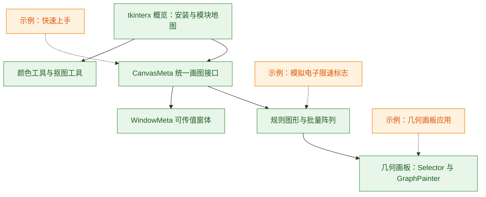

# tkinterx 手册知识库


本知识包基于简书博客集《tkinterx 手册》（简书文集 nb/45403586，作者 xinetzone，简书笔名"水之心"，共 5 篇，2020 年 4-5 月发布）整理而成，系统介绍作者自研的 tkinter 扩展库 **tkinterx** 的安装与使用：统一画图接口 CanvasMeta、可传值对话框 WindowMeta、图形设计工具 canvas_design、交互式几何画板 painter，以及颜色工具与电子限速实战示例。所有事实均以脚注（如 F-TXH-01）溯源至[信源登记](references/sources.md)，遵循 OKF v0.2 规范。

## 知识地图



## 概念文档（concepts/）

* [tkinterx 概览：安装与模块地图](concepts/01-overview.md) — 项目背景、pip 安装、PyPI 核验（0.0.9 / MPL 2.0 / Pre-Alpha）、模块地图与设计理念。
* [CanvasMeta：统一的 2D 画图接口](concepts/02-canvas-meta.md) — create_graph 统一绘制直线/椭圆/矩形/弧/多边形，含完整示例、参数说明与 tags 规则。
* [规则图形、批量阵列与图形设计工具](concepts/03-graph-shapes.md) — create_point/create_circle/create_square、ParamDict、add_row/add_column、SimpleGraph/RegularGraph、彩色矩阵与电子限速综合应用。
* [WindowMeta：可传递值的窗体](concepts/04-window-meta.md) — add_row 行数据、table 字典、create_widget/run 重载、ask_window 跨窗体传值。
* [几何画板：Selector 选择器与 GraphPainter 画板](concepts/05-geometry-painter.md) — Selector 选择面板、GraphMeta/GraphPainter 交互画板、DrawingWindow 完整窗体与鼠标键盘操作。
* [颜色工具与抠图工具](concepts/06-tools-colors-matting.md) — show_colors 颜色表、140 余条 color_dict 完整字典；F-TXH-04 抠图工具作者待更说明。

## 实战示例（examples/）

* [快速上手：安装 tkinterx 与第一个画图程序](examples/01-getting-started.md) — 环境要求、pip 安装、create_graph 第一程序、show_colors 与常见问题。
* [几何画板应用：Selector + GraphPainter](examples/02-geometry-painter-app.md) — 三步构建几何画板，含鼠标/键盘交互操作速查表。
* [示例：用 CanvasMeta 模拟电子限速标志](examples/03-speed-limit-sign.md) — F-TXH-05 完整可运行代码、参数解读与可调实验。

## 信源登记簿（references/）

* [《tkinterx 手册》信源登记](references/sources.md) — F-TXH-01 至 F-TXH-05 逐篇登记、PyPI/GitHub 外部核验信源、抓取时效与 15 张截图本地化说明。

## 信任与生命周期说明

* **status 判定依据**：全部 11 个内容文档（6 个概念 + 3 个示例 + 1 个信源登记 + 根索引）均 `status: stable`。内容逐篇来自公开博文（paywall: False），关键事实（安装方式、版本号、维护者、仓库地址）经 PyPI 项目页与 GitHub 仓库外部核验；F-TXH-04 为作者待更残缺内容，已在正文与信源登记中显式标注，未臆造未发布接口。
* **stale_after 解释**：统一设置为 `2027-09-02`。tkinterx 为作者个人维护的 Pre-Alpha 项目（PyPI 最后发布 2020-05-30），本知识包对应博文写作时（2020 年 4-5 月）的接口形态；一年为保守复核周期，届时应对照 PyPI 与 GitHub 仓库 xinetzone/pychaos 重新核验（地址见[信源登记](references/sources.md)）。
* **核验链路**：`generated.at` 记录生成时刻（2026-09-02）；`verified.at` 记录博客转化七阶段流程（敏感度预检→骨架判定→F 编号事实采集→P0 外部核验→知识拆分→信源先行生成→对抗审查）的核验事件（2026-09-02）。

本知识包共收录 10 个内容文档（6 个概念 + 3 个示例 + 1 个信源登记），另含 3 个子目录 index.md 与根 index.md、log.md；15 张运行截图本地化于 `images/` 目录，3 个数学公式已转写为行内文本。

```{toctree}
:hidden:
:maxdepth: 7

concepts/index
examples/index
references/index
log
```