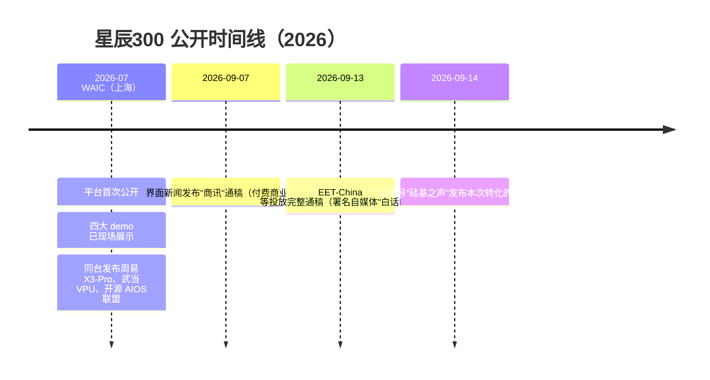

# 星辰300平台与四大实测用例

> 本篇为**事件事实层**：平台是什么、由什么构成、何时公开、演示了什么。机制原理（Helium 数字、NPU 分工、Vela 分区）见 [01 CPU+NPU 异构设计](01-cpu-npu-heterogeneous-design.md)，模型档案与可信边界见 [02 模型生态与可信边界](02-model-zoo-and-trust-boundaries.md)。

## 1. 平台是什么

"星辰300"是安谋科技（Arm China，公司身份见 F-016）的**第一代 AIoT 原型平台**，用于在 FPGA 阶段验证"MCU + AI"的 CPU+NPU 异构路线（F-003、F-029）。平台硬件构成为：

| 组成 | 器件 | 角色 |
|------|------|------|
| CPU | "星辰"STAR-MC2（中国市场品牌名，全球型号即 Arm Cortex-M52；Armv8.1-M + Helium） | 控制、通用计算、向量计算 |
| NPU | Arm Ethos-U55 microNPU（2020-02-10 发布） | 神经网络算子加速 |
| 载体 | Arm MPS3 FPGA Prototyping Board（烧录安谋自家镜像，非 Arm 出厂参考镜像） | FPGA 原型验证 |

> ⚠️ **名称口径**：博文称"安谋科技**自研** STAR-MC2（即 Arm Cortex-M52）"。权威口径为：该 IP **由 Arm 与安谋科技合作开发**，STAR-MC2 是其在中国市场的品牌名，全球型号命名为 Cortex-M52（F-017）；STAR-MC2 发布于 2022-07-06，反而比 Cortex-M52 的全球命名（2023-11-22）早约 16 个月（F-018）。安谋科技将其归入"自研业务产品"矩阵（与周易 NPU、山海安全、玲珑 VPU 并列）。

## 2. 时间线：WAIC 首发 → 9 月实测视频

博文以"近日"表述用例跑通（F-006），核验后实际时间线如下（F-029）：

> 即博文"近日跑通"比四个 demo 的首次公开展示晚约 1.5–2 个月；2026 年 9 月是《"星辰300"用例实测演示》系列视频（安谋 CPU 系统软件工程师刘固主讲）与通稿的密集投放期（F-029）。

## 3. 演示板卡：MPS3 与 32MHz 的正确含义

- **MPS3** 是 Arm 官方 FPGA 原型板（TRM 100765，板载 Xilinx Kintex UltraScale XCKU115 FPGA，容量为 MPS2+ 的 5 倍，带以太网、LCD、音频编解码器与 CMSIS-DAP 调试），演示形态为网线连接 PC GUI、结果输出板载 LCD（F-022、F-026）。
- **32MHz 是 FPGA 软核的默认综合时钟**：Keil 设备页 SSE-300-MPS3 标注 32MHz Maximum Clock，Arm 专家博客注明可通过修改 OSC1 配置调整；**它不是任何量产芯片的频率**（F-022）。
- Arm 出厂参考镜像 SSE-300/Corstone-300 是 **Cortex-M55 + Ethos-U55**；星辰300 在同一块板卡上烧录的是安谋自家 **STAR-MC2(M52) + U55** 镜像——**M52+U55 组合没有 Arm 官方 Corstone 参考设计先例**（F-022），其系统级实证此前仅见商用芯片 Synaptics SYN765x/SRW1500（见 [01 异构设计](01-cpu-npu-heterogeneous-design.md#5-商用旁证synaptics-syn765x) §5）。

## 4. 四大实测用例

平台在 FPGA 上跑通四类用例（F-004、F-005），覆盖目标检测、语音识别、关键字检测与图像增强：

| # | 用例 | 模型 | 演示形态 | 博文列举的应用领域（厂商目标场景） |
|---|------|------|---------|--------------------------------|
| 1 | 人脸探测 | YOLO-Fastest | 预录制视频、摄像头实时双模 | 门禁系统、监控系统的目标探测（F-011） |
| 2 | 语音识别 | wav2letter（CNN 路线）+ Conformer（卷积增强 Transformer 路线） | 语音识别成文字并显示 | 手机、眼镜等智能设备的信息录入（F-012） |
| 3 | 关键字检测（KWS） | kws-micronet | 特定关键字识别（演示词表为英文 No/Right/Stop/Up/Yes） | 穿戴设备与手机唤醒/语音控制、行车记录仪及车载语音控制（F-013） |
| 4 | 图像超分辨率 | **SESR**（博文写作"ESR"，名称勘误见 F-024 与 [02 模型生态](02-model-zoo-and-trust-boundaries.md#42-sesr-超分博文-esr-名称勘误)） | 128×128 → 512×512（4×，厂商演示规格） | 监控设备对模糊图像的清晰化处理（F-014） |

> ⚠️ **"从 CNN 到 Transformer"的表述需校正**：U55 硬件本身只支持 CNN 与 RNN/LSTM，**不原生支持 Transformer**；Conformer 能跑通是 Vela 编译器图分区后、注意力等不支持算子回退 CPU 经 Helium 执行的结果（F-021，机制详解见 [01 异构设计](01-cpu-npu-heterogeneous-design.md#4-vela-图分区conformer-为何能跑)）。

## 5. 事实边界（读者须知）

1. **全部为厂商自述**：四用例"跑通"来自安谋科技自导演示与官方通稿，无第三方实验室复测、无公开精度/时延/功耗数据（仅超分有 128→512 规格）（F-002、F-004）。
2. **演示语料为英文**：ASR 例句与 KWS 词表均为英文，无中文语音演示证据（F-026）。
3. **应用领域是目标市场宣称**：门禁、眼镜、穿戴、车载、监控均无已量产客户名称与四个 demo 直接绑定（V6 核验）。
4. **32MHz FPGA ≠ 芯片表现**：界面商讯稿据此线性外推"500MHz/1GHz 芯片推理快 20-30 倍"，无实测且忽略带宽等非线性因素，引用时须标注为厂商外推（F-027）。
5. **平台性质是原型验证**：星辰300 是 FPGA 原型平台而非量产芯片；M52+U55 组合的量产形态可参考 Synaptics SYN765x/SRW1500（200MHz、整机约 50 GOPS，F-025）。
