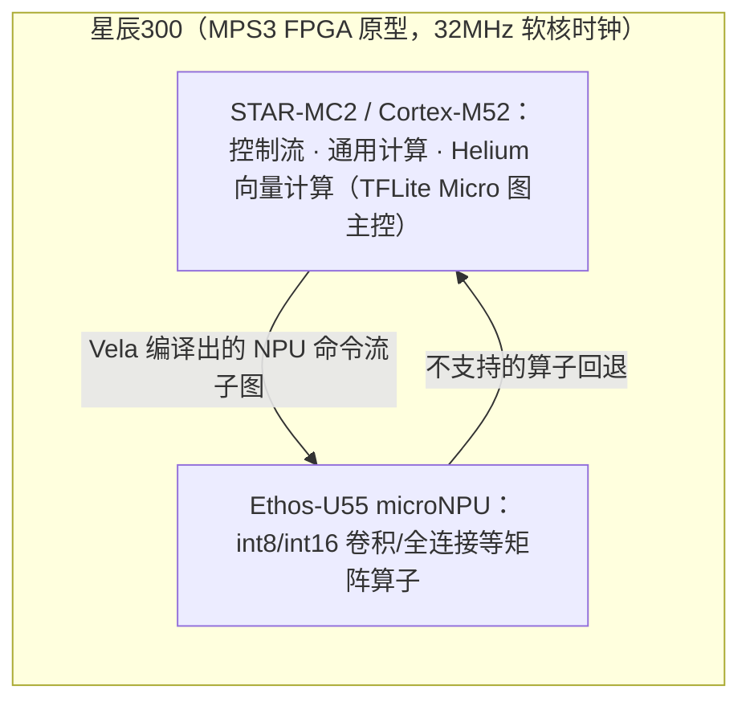
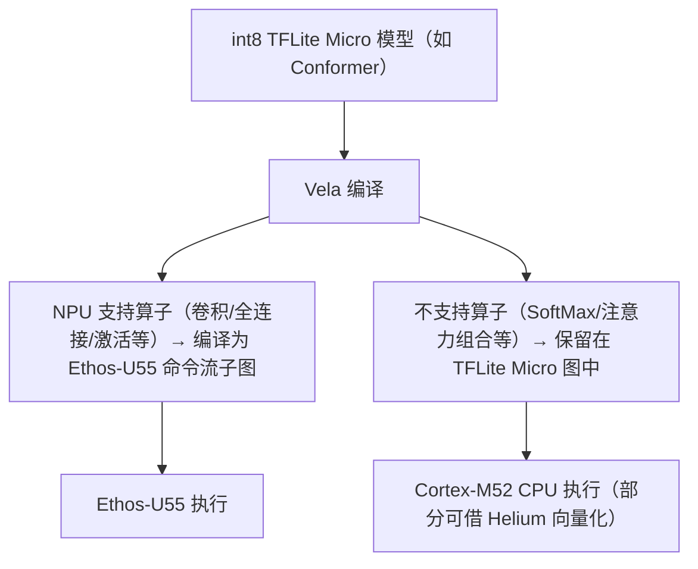

# CPU+NPU 异构设计——分工、Helium 数字勘误与 Vela 分区

> 本篇为**机制原理层**：解释星辰300"各司其职"叙事背后的真实硬件分工，并校正博文中两处最容易被直接引用的技术口径——Helium 倍数（F-019）与"U55 跑 Transformer"（F-021）。平台事实与用例清单见 [00 平台与四大用例](00-platform-and-demos.md)。

## 1. 分工模型：谁做什么

| 计算角色 | 承担者 | 典型负载 |
|---------|--------|---------|
| 控制与通用计算 | Cortex-M52（STAR-MC2） | 程序流、数据前后处理、TFLite Micro 推理引擎主控、未被 NPU 卸载的算子 |
| DSP/向量计算（CPU 侧） | Cortex-M52 的 **Helium（M-Profile Vector Extension, MVE）** | 滤波、FFT、部分 int8 矩阵/向量算子 |
| 神经网络加速（NPU 侧） | Ethos-U55 | 卷积、全连接、池化等固定算子集合内的 int8/int16 推理 |

博文"CPU 不擅长的神经网络矩阵运算卸载给 NPU"的方向性描述成立（F-007、F-009），但"各司其职"不等于"NPU 包跑全部模型"——实际分工由编译器的**算子支持清单**决定（见 §4）。

## 2. Helium "5× / 15×" 数字勘误（F-019，重点）

博文称"Helium 在常见 DSP 场景最高 5 倍提升、ML 任务最高 15 倍"（F-008），并放在 STAR-MC2/M52 平台叙事中。核验 Arm 官方原文后需做**两处校正**：

1. **数字主体是 Cortex-M55，不是 M52**。Arm 2020-02-10 新闻稿原文：
   > "Cortex-**M55** delivers up to a **15x** uplift in ML performance and a **5x** uplift in DSP performance … compared to **previous Cortex-M generations**."

   M55 是首款搭载 Helium 的 Cortex-M CPU（与 Ethos-U55 同日发布）；M52 是 2023-11-22 才发布的更小面积实现。
2. **对比基线是"前几代 Cortex-M"泛称，不是任一具体型号**；Arm 的 Helium 技术页重复 5×/15× 说法时甚至未标注基线，博文从未标基线的营销页取数，读者容易误读为"比上一代强 15 倍"。

平台实际所用 **Cortex-M52 的官方数字小得多**：

| CPU | 发布 | DSP 提升（官方口径） | ML 提升（官方口径） | 基线 |
|-----|------|--------------------|--------------------|------|
| Cortex-M55（首款 Helium） | 2020-02-10 | 最高 5× | 最高 15× | previous Cortex-M generations |
| **Cortex-M52（= STAR-MC2）** | 2023-11-22 | 最高 **2.7×** | 最高 **5.6×** | 前几代 Cortex-M（产品页另注 vs Cortex-M33） |

> 安谋科技对 STAR-MC2 的自家口径是"相比第一代 STAR-MC1 标量 +45%、矢量 +200%、AI +900%（9 倍）"（F-028）——基线是 STAR-MC1，同样是厂商自述、无第三方 benchmark，与 Arm 的 5.6×/2.7× 不可互换引用。
>
> 另外 Arm 在 M55+U55 发布时给过**系统级**数字：两者组合 ML 性能较既有 Cortex-M 系统最高 480×——主体仍是 M55 系统而非 M52，引用时同样不能嫁接到星辰300。

## 3. Ethos-U55 的真实规格区间（F-020）

Ethos-U55 是 Arm 2020-02-10 发布的**业界首款 microNPU**，为 Cortex-M 级系统设计。其算力是**配置区间**而非单一数字：

| 规格 | 官方值 |
|------|--------|
| MAC（8×8）配置 | **32 / 64 / 128 / 256 四档可配置** |
| 峰值算力 | **64 – 512 GOPS @1GHz**（仅顶配 256 MAC 达 0.5 TOPS；Int-16 减半） |
| 数据类型 | Int-8 / Int-16 |
| 支持网络 | **CNN，以及 RNN/LSTM**（不支持 Winograd；支持权重稀疏化） |
| 片上 SRAM | 18–50 KB |
| 软件栈 | TensorFlow Lite for Microcontrollers + CMSIS-NN + **Vela** 编译器（RTOS 或裸机） |
| 可配主机 | Cortex-M55 / M33 / M7 / M4 |

因此"0.5 TOPS"只有在注明"256 MAC 顶配 @1GHz 峰值"时才准确。两个实证锚点可帮助校准量级：商用芯片 Synaptics SYN765x/SRW1500（M52+U55）200MHz 整机标称约 **50 GOPS**；星辰300 FPGA 演示的软核时钟仅 **32MHz**（F-022、F-025）。

## 4. Vela 图分区：Conformer 为何能跑（F-021，重点勘误）

博文"从 CNN 到 Transformer 都在平台跑通"的说法（F-005）容易被理解为 U55 能原生加速 Transformer。实际不是：

- U55 产品简报的网络支持范围是 **CNN 与 RNN/LSTM**；**原生 Transformer 支持是第三代 Ethos-U85**（128–2048 MAC、0.256–4 TOPS @1GHz）的官方卖点。
- 星辰300 跑通 Conformer 的机制是 **Vela 编译器的图分区（graph partitioning）**：

所以准确表述是：**"Conformer 经 Vela 算子分区在 M52+U55 异构系统上端到端跑通，其中注意力等 U55 不支持的算子回退 CPU 执行"**——这是功能打通，而非 NPU 原生 Transformer 加速；在 32MHz FPGA 上其性能/能效不可外推。

## 5. 商用旁证：Synaptics SYN765x（F-025）

M52（STAR-MC2）+ U55 组合没有 Arm 官方 Corstone 参考设计（官方 Corstone-300/310 是 M55/M85 + U55，Corstone-320 才跳到 M85 + **U85**）：

| 参考子系统 | CPU | NPU |
|-----------|-----|-----|
| Corstone-300（2020） | Cortex-M55 | Ethos-U55 |
| Corstone-310 | Cortex-M85 | Ethos-U55 |
| Corstone-315 | Cortex-M85 | Ethos-U65 |
| Corstone-320 | Cortex-M85 | Ethos-U85 |

该组合的真实量产旁证是 **Synaptics SYN765x / SRW1500**（Wi-Fi 7 边缘 AI MCU，2026 年初发布，2026-05-28 安谋科技×Synaptics 联合直播背书）：集成 Cortex-M52（即 STAR-MC2）+ Ethos-U55，200MHz 下整机标称约 50 GOPS。这说明 M52+U55 是有出货芯片绑定的成熟组合，但 FPGA 原型演示与商用芯片的频率、算力必须分开理解（F-022、F-027）。

## 6. 小结：哪些结论可以放心引用

- ✅ 可直接引用：U55 是 2020 年发布的首款 Cortex-M microNPU；M52（STAR-MC2）带 Helium；异构分工为 CPU 控制+向量、NPU 跑固定算子集合；Vela 图分区决定卸载边界。
- ⚠️ 引用须带条件：5×/15× 属 **M55 对前几代 Cortex-M**；0.5 TOPS 属**顶配峰值**；"支持 Transformer"应表述为"分区回退、端到端跑通"。
- 🔴 不应引用为事实：500MHz/1GHz 下"快 20-30 倍"（厂商线性外推，F-027）；安谋 +900% AI（基线 STAR-MC1 的厂商口径，F-028）。
