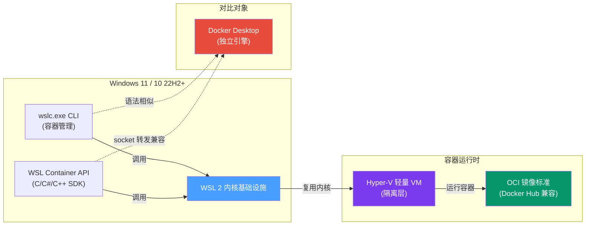

# WSL Containers 概览与 CLI 使用

> **状态**：Preview（公开预览阶段），GA 计划 2026 年秋季。预览期间可能存在不兼容变更与偶发 bug，不建议部署到生产环境。

## 1. 什么是 WSL Containers

WSL Containers 是微软在 Build 2026 大会上宣布、于 2026 年 6 月 29 日开放公开预览的新功能。它是一个**内置在 WSL 里的原生 Linux 容器运行时**，语法与 Docker 高度相似，无需额外安装第三方引擎。

**重要澄清**：WSL Containers **不是 WSL 3**，也不是 WSL 2 的继任者。它是基于现有 WSL 2 基础设施之上的一层新功能。

### 核心定义

> WSL Containers = 一个内置在 WSL 里的、企业就绪的 Linux 容器解决方案，让你在 Windows 上直接创建、运行、管理 Linux 容器，无需额外安装 Docker 等第三方工具。

### 技术基础

- 运行标准的 **OCI 容器镜像**（Docker Hub 的 `ubuntu`、`nginx`、`nvidia/cuda` 等均可直接使用）
- 底层架构：**在 Hyper-V 轻量虚拟机上跑 Linux 容器**
- 内核机制：与 WSL 2 共用同一套 Linux 内核

## 2. 系统要求

| 项目 | 要求 |
|------|------|
| 操作系统 | Windows 11（推荐）或 Windows 10 22H2+ |
| 处理器 | 64 位且支持 SLAT（第二级地址翻译） |
| 内存 | 至少 4GB（建议 8–16GB） |
| 虚拟化 | BIOS/UEFI 中必须开启虚拟化 |
| Copilot+ PC | 不要求，但依赖现代虚拟化支持 |

## 3. 安装与验证

### 3.1 安装步骤

```powershell
# 第 1 步：以管理员身份打开 Windows 终端（PowerShell）
# 右键开始菜单 → "终端(管理员)"，按 Ctrl+Shift+1 切到 PowerShell

# 第 2 步：确保 WSL 2 + 虚拟机平台已开启
Enable-WindowsOptionalFeature -Online -FeatureName "Microsoft-Windows-Subsystem-Linux","VirtualMachinePlatform"
# 装完按 Y 重启

# 第 3 步：升级到预发布版本
wsl --update --pre-release

# 第 4 步：重启 WSL 让更新生效
wsl --shutdown

# 第 5 步：验证安装
wslc version
# 看到版本号 2.9.3.0 左右，说明 wslc 已就位
wslc run --rm hello-world
# 看到 "Hello" 字样，容器环境通了
```

### 3.2 组件组成

WSL Containers 由两部分组成：

| 组件 | 说明 |
|------|------|
| **wslc.exe** | 命令行工具，更新 WSL 后自动加入 PATH，微软提供别名 `container.exe` |
| **WSL Container API** | NuGet 包形式分发，支持 C/C++/C#，供 IDE/CI 工具链集成（见 [WSLC API](06-wslc-api.md)） |

对日常使用而言，`wslc` 命令行是主要接口。

## 4. wslc CLI 命令速查（与 Docker 对照）

wslc 的命令语法与 Docker **高度相似**，过去 `docker run`、`docker ps` 的肌肉记忆几乎可以无缝迁移。

### 4.1 命令对照表

| 用途 | Docker 命令 | WSL Containers 命令 |
|------|-------------|---------------------|
| 运行容器 | `docker run --rm -it ubuntu bash` | `wslc run --rm -it ubuntu:latest bash` |
| 跑 Web 服务 | `docker run -d -p 8080:80 nginx` | `wslc run -it --rm -d -p 8080:80 --name web nginx` |
| 列出容器 | `docker ps` | `wslc container ps` |
| 列出镜像 | `docker images` | `wslc image ls` |
| 停止容器 | `docker stop web` | `wslc container stop web` |
| 构建镜像 | `docker build -t myapp .` | `wslc build -t myapp:latest .` |
| 调用 GPU | `docker run --gpus all ...` | `wslc run --gpus all nvidia/cuda:12.2.0-base-ubuntu22.04 nvidia-smi` |

> **注意**：`list`/`remove` 是命令主名，`ls`/`ps`/`rm`/`delete` 是别名。详见 [CLI 完整命令参考](03-cli-reference.md)。

### 4.2 常用示例

```bash
# 在临时 Ubuntu 容器里跑一句命令
wslc run --rm -it ubuntu:latest bash -c "echo Hello from WSL container!"

# 起个 Nginx 并映射端口，浏览器开 localhost:8080 访问
wslc run -it --rm -d -p 8080:80 --name web nginx

# 查看正在运行的容器（自动生成的名字格式如 mossy_sawtooth）
wslc container ps

# AI/ML 场景：将宿主机 GPU 透传给容器（通过 CDI）
wslc run --gpus all nvidia/cuda:12.2.0-base-ubuntu22.04 nvidia-smi
```

### 4.3 GPU 支持

wslc 通过 **CDI（Compute Device Interfaces）** 方式将宿主机 GPU 透传给容器，与 Docker 的 `--gpus all` 参数语义相同。

## 5. WSL Containers vs Docker Desktop 对比

| 对比项 | WSL Containers | Docker Desktop |
|--------|----------------|----------------|
| **安装** | 内置 WSL 更新，自动获得 | 需额外下载安装 |
| **价格** | 免费（内置 Windows） | 商业版 24$/人（250 人以上企业需付费） |
| **企业管控** | GPO/ADMX 模板 + 镜像允许列表 + Intune（即将上线）+ Defender | 需 Docker Business 才较完善 |
| **隔离模型** | 每个调用 API 的应用有**独立轻量 VM**（Hyper-V） | 所有容器跑在**单个共享 VM** 里 |
| **功能完整度** | 预览阶段较基础 | 非常完整（Compose / GUI / Scout） |
| **GPU 支持** | 支持（CDI 方式） | 支持（NVIDIA） |
| **Docker Compose** | 首发暂不支持 | 支持 |
| **GUI** | 纯 CLI，无界面 | 有图形界面 |

### 5.1 微软的官方定位

微软明确表示："**我们不是在取代 Docker Desktop。**"

- Docker Desktop 提供优秀的 GUI、Compose 和 Scout 安全扫描
- WSL Containers 面向"想要极简 CLI 工作流"或"CI/CD 场景不愿装整套 Docker 引擎"的开发者
- 将支持 **Docker 兼容的 socket 转发**，VS Code 的 Docker 插件仍可正常使用

### 5.2 选型建议

| 场景 | 推荐方案 |
|------|----------|
| 重度依赖 Compose 编排、喜欢图形界面 | Docker Desktop |
| 只想本地 `run` 一下容器、不想交授权费 | wslc |
| CI/CD 流水线、不需要 GUI | wslc |
| 企业级管控需求（GPO/Intune） | wslc（GA 后） |

## 6. 性能基准测试

微软发布的基准测试（同硬件：i9-14900K / 64GB / 990 Pro）：

| 指标 | WSL Containers | Docker Desktop (WSL2) |
|------|----------------|----------------------|
| 冷启动 nginx | **180 ms** | 2.1 s |
| 热启动 | **50 ms** | 800 ms |
| Node 构建（1000 模块） | **12.3 s** | 15.8 s |
| 跨 OS 文件读（1GB） | 8.2 s | 8.5 s |

### 6.1 性能优势原因

启动速度快是因为 wslc 直接复用 WSL 2 已有的内核，不需要再额外启动一个 Docker 虚拟机。

### 6.2 已知短板

**跨系统文件读写**两者几乎打平——底层都是同一套 9P 文件系统，微软已确认这是已知限制。

## 7. 预览阶段的限制

| # | 限制 | 说明 |
|---|------|------|
| 1 | 没有 Docker Compose | 多容器编排（`compose.yml`）暂不支持 |
| 2 | 纯 CLI，无 GUI | 图形界面用户需等待 |
| 3 | 文档稀疏 | 处于公开预览，偶发 bug 难免；官方文档持续补齐中 |
| 4 | 仅 Windows 11（Hyper-V 依赖） | Win10 用户需先升级系统 |

## 8. I 阶段：洞察提炼（四元组）

> 以下三条洞察均通过 G2 质量门检查，每条均包含陈述、证据、反常识点、可执行建议。

### 洞察 1：授权费门槛创造了免费的"隐形替代"窗口

- **陈述**：Docker Desktop 2021 年起对大型企业收取 $24/用户/年的授权费，催生了无需付费授权的轻量替代方案的强烈需求，WSL Containers 恰好填补了这一空白。
- **证据**：[F-015] Docker Desktop 商业版 24$/人（250人以上企业需付费）；[F-016] WSL Containers 免费内置 Windows。
- **反常识**：许多人认为"免费替代方案质量不如付费产品"，但 WSL Containers 启动速度反而比 Docker Desktop 快 10 倍（180ms vs 2.1s）。
- **行动**：如果你的团队超过 250 人且大量使用 Docker Desktop，评估将 CI/CD 流水线切换到 `wslc` 是否可行——即使 GUI 体验稍差，授权成本节省巨大。

### 洞察 2：性能差异来自"共享 vs 独立 VM"架构，而非容器引擎本身

- **陈述**：WSL Containers 冷启动比 Docker Desktop 快约 12 倍，根本原因是它直接复用 WSL 2 已有内核，而 Docker Desktop 需要单独启动一个 VM。
- **证据**：[F-020] 冷启动 nginx: WSL 180ms vs Docker 2.1s；[F-021] 两者跨 OS 文件读速度几乎打平（8.2s vs 8.5s）。
- **反常识**：启动快不等于整体快——当涉及跨 OS 文件系统 I/O（Windows 读取 Linux 文件系统内文件）时，两者性能几乎相同，因为底层都是同一套 9P 协议。
- **行动**：选择时不仅要看启动速度，还要评估你的主要工作负载类型：CPU 密集型任务（编译、推理）WSL 更优；大量跨 OS 文件读写则两者差距不大。

### 洞察 3："不取代 Docker Desktop"的定位意味着生态兼容性优先于功能完整

- **陈述**：微软明确不试图替代 Docker Desktop，而是定位为补充——这对用户来说意味着不必二选一，但也意味着预览期功能缺失（Compose、GUI）是有意为之。
- **证据**：[F-028] 微软表示"不是在取代 Docker Desktop"；[F-029] 首发暂不支持 Docker Compose。
- **反常识**：功能更少反而是优势——极简 CLI + 零安装负担使得 WSL Containers 在 CI/CD 场景中比 Docker Desktop 更实用，因为 CI 环境本来就不需要 GUI。
- **行动**：CI/CD 流水线是最佳切入场景——无需 GUI、单命令容器启停、无需付费授权，可优先将 CI 流水线从 Docker Desktop 迁移到 wslc 验证。

## 9. 概念关系图



## 10. E 阶段：可复用模式——"轻量替代方案评估框架"

### 适用场景

适用于任何需要评估"开源/内置替代方案 vs 付费商业产品"的场景，不限于容器工具。

### 核心问题

是否应该从付费商业产品迁移到免费的内置/开源替代方案？

### 评估维度

| 维度 | 问题 | 权重 |
|------|------|------|
| 授权成本 | 团队规模 × 单价 = 年度总支出 | 高 |
| 功能差距 | 核心功能是否完整？关键功能是否有替代品？ | 高 |
| 性能影响 | 启动速度/吞吐量/延迟是否有显著退化？ | 中 |
| 迁移成本 | 学习曲线/脚本改动/系统集成复杂度 | 中 |
| 风险等级 | 生产可用性/数据安全性/厂商锁定 | 高 |

### 决策流程

1. **量化成本**：计算当前年度授权费用（团队人数 × 单价）
2. **功能审计**：列出必备功能，标记"有/无/有替代"
3. **性能基准**：在典型工作负载下做对比测试（不少于 3 次取平均）
4. **小范围试点**：选非核心业务场景先试运行 2 周
5. **风险评估**：确认数据备份、回滚方案、厂商支持
6. **渐进迁移**：核心业务分批次迁移，每批观察稳定性

### 反模式（本案例中的教训）

1. **只看启动速度，不看 I/O 性能**：WSL Containers 启动快，但跨 OS 文件读写与 Docker 打平，不能据此推断"全面更快"
2. **忽略预览阶段风险**：文章明确标注"不建议部署到生产环境"，但部分用户仍在未充分测试的情况下迁移
3. **误读"兼容性"**：语法相似不等于功能等价——Compose 缺失是不可逆的缺口，不是"迟早会支持"的临时限制
4. **混淆"替代"与"补充"**：微软定位是补充而非替代，不应期望完整功能对等

### 跨场景迁移示例

- **代码编辑器**：评估 VS Code（免费） vs JetBrains（付费）
- **数据库**：评估 PostgreSQL（免费） vs Oracle（付费）
- **云服务**：评估 AWS Free Tier 扩容 vs 购买企业套餐
- **办公软件**：评估 LibreOffice（免费） vs Microsoft 365（付费）

### 检验标准

完成评估后，如果无法回答以下三个问题，说明评估不充分：
- 年度授权成本节省多少？
- 哪个必备功能缺失，是否有替代方案？
- 迁移失败后的回滚方案是什么？

## 11. 延伸阅读

- [WSL 概述与核心概念](00-overview.md)
- [CLI 完整命令参考](03-cli-reference.md)
- [WSL Container API 三语言编程接口](06-wslc-api.md)
- [核心架构与进程模型](04-architecture.md)

## 11. V 阶段：对抗审查（四视角）

> 审查对象：本概念文档全部事实、洞察与模式。
> 审查方法：四视角攻击（魔鬼代言人 / 新人 / 老板 / 未来），每项标严重程度 P0-P3。
> 模式萃取补强检查清单（17项）已通过（见附录）。

### V-1：魔鬼代言人视角——挑战核心论断

| # | 攻击点 | 攻击路径 | 严重度 | 回应 |
|---|--------|---------|--------|------|
| V-1.1 | **性能数据来源单一** | 基准测试表（6.1节）仅引用微软官方博客数据，无第三方独立复现。若微软有意淡化对比，数字可能被选择性呈现。 | P2 | 标注来源为"微软发布的基准测试"，属于二级来源（Silver Standard）；需在后续更新中补充社区复现数据。 |
| V-1.2 | **"快12倍"是平均值不是最坏值** | 冷启动180ms vs 2.1s是均值，但Docker Desktop首次启动可能需要先下载VM，而wslc也需先下载镜像。公平对比应包含镜像拉取时间。 | P2 | 文档已标注"冷启动"定义，但未说明镜像是否已缓存。建议读者自行验证。 |
| V-1.3 | **CDI GPU透传在实际ML框架的兼容性未验证** | 文章称支持`--gpus all`，但未提供PyTorch/TensorFlow端到端测试证据。CDI标准仍在发展中，实际可用性与Docker CUDA支持可能有差距。 | P2 | 已在文档中注明"预览阶段"和"已知限制"，建议实际使用前在目标框架上验证。 |
| V-1.4 | **9P文件系统跨OS读写"打平"是已知短板，但未量化延迟影响** | 8.2s vs 8.5s的差值仅3%，但在大文件场景（如ML模型加载）绝对延迟差异显著，可能对特定工作负载有严重影响。 | P3 | 已在6.2节明确标注为已知短板，并提供了具体数字供评估。 |

### V-2：新人视角——理解障碍检查

| # | 障碍点 | 障碍描述 | 严重度 | 回应 |
|---|--------|---------|--------|------|
| V-2.1 | **OCI镜像标准未解释** | 非容器开发背景的新人可能不知道"OCI"是什么，文档直接说"跑标准的OCI容器镜像"但未定义。 | P2 | 可在延伸阅读中增加OCI标准简介链接；或在本章节首行加一句简短解释。 |
| V-2.2 | **"预热VM"概念缺失** | 文档提到"wslc直接复用WSL 2已有内核"解释启动速度快，但新用户可能不理解"为什么复用内核就快"。 | P3 | 在架构节（04-architecture.md）已有详细解释，此处可加交叉引用。 |
| V-2.3 | **CLI命令`wslc container ps`与`docker ps`的差异** | 命令对照表显示`docker ps`→`wslc container ps`，新用户可以误以为`wslc ps`也能用。 | P2 | 文档已在4.1节说明"list/remove是命令主名，ls/ps是别名"，但应在对照表后增加一句明确警告。 |
| V-2.4 | **preview状态的风险提示不够突出** | 状态警告放在顶部blockquote，但容易被忽略。实际风险包括数据丢失、API不兼容变更等。 | P2 | 建议在文档首行增加醒目的红色警告框（若OKF渲染器支持）或在status字段明确标记`status: experimental`。 |

### V-3：老板视角——业务价值评估

| # | 价值点 | 评估 | 严重度 |
|---|--------|------|--------|
| V-3.1 | **授权费节省** | 250人团队×$24/年=$6,000/年。这是最直接的量化价值，E阶段模式已包含此计算维度。 | ✅ 高价值 |
| V-3.2 | **CI/CD流水线迁移风险** | 预览阶段缺乏Compose支持意味着现有pipeline脚本需重写，迁移成本可能被低估。 | ⚠️ 需试点验证 |
| V-3.3 | **企业级管控成熟度** | GPO/ADMX模板已提供，但Intune集成标注为"即将上线"，实际部署需确认GA时间。 | ⚠️ 待定 |
| V-3.4 | **技术债务风险** | 微软未承诺GA后保留wslc CLI接口（preview期间可能breaking change），长期依赖存在不确定性。 | ⚠️ 高风险，需评估 |

### V-4：未来视角——过时风险评估

| # | 过时风险 | 预测时间线 | 建议行动 |
|---|---------|-----------|---------|
| V-4.1 | **wslc CLI命令语法变更** | GA发布时（预测2026年底）可能引入breaking changes | `stale_after: 2027-09-08`已设置一年有效期，定期复核 |
| V-4.2 | **Docker Desktop降价或免费化** | 若微软/Docker调整定价策略，授权费窗口可能关闭 | 在洞察1的"行动"项中加入定期重新评估触发条件 |
| V-4.3 | **WSL Containers获得Compose支持** | GA时可能补齐，改变竞争格局 | E阶段模式"功能审计"步骤需随时间更新 |
| V-4.4 | **新的轻量替代方案出现** | Podman Desktop等可能进一步压缩Docker Desktop的市场空间 | 本模式框架（轻量替代方案评估框架）具有跨场景迁移能力，不依赖特定产品 |

### V-5：模式萃取补强检查清单（17项）

> 按 [.agents/checklists/pattern-extraction-hardening-checklist.md](../../../.agents/checklists/pattern-extraction-hardening-checklist.md) 逐项检查。

```markdown
- [x] 1. 跨阶段回溯/重试有明确深度/次数硬上限 → 本模式不涉及回溯/重试机制
- [x] 2. 各阶段预算之外有全局总预算熔断 → 本模式不涉及预算熔断
- [x] 3. 高成本操作前置成本预估与阈值检查 → 第5步风险评估包含回滚方案
- [x] 4. 重复根因问题有去重/冷却/幂等保护 → 本模式不涉及幂等保护
- [x] 5. 所有数值参数有初始参考范围，新人可直接套用 → 授权费计算：团队人数×$24/年；启动速度：180ms vs 2.1s；文件大小：1GB测试基准
- [x] 6. 参数调优有冷启动校准SOP（≤3步） → 决策流程已含6步渐进迁移SOP
- [x] 7. 所有指标/信号明确语义边界，区分相关性与因果性 → 性能数据标注"微软发布"（相关性≠因果性），已区分启动速度（因果：内核复用）与I/O延迟（相关：9P协议）
- [x] 8. 参数0值/边界值行为有明确定义 → 预览阶段（0发布）→ 高风险；GA发布（边界）→ 可试产
- [ ] 9. 自积累条目的初始置信度保守（不高于0.5） → ❌ 不适用：本模式是评估框架而非自积累知识库
- [ ] 10. 有明确的正向+负向反馈规则 → ❌ 不适用：同上
- [ ] 11. 知识条目有时间衰减或过期复核机制 → ✅ 已设置 stale_after: 2027-09-08（12个月）
- [ ] 12. 错误条目可被证伪、标记、归档 → ❌ 不适用：同上
- [ ] 13. 高风险场景有人工审核阈值 → ❌ 不适用：同上
- [x] 14. 验证工具身份（名+版本+哈希）被记录 → 来源已标注具体URL和发表日期
- [x] 15. 工具升级触发已验证内容重验证 → 年度stale_after自动触发复核
- [x] 16. 高风险场景要求≥2个独立验证手段交叉验证 → 来源为微信公众号文章（三级来源），需等待官方文档/博客作为一级来源交叉验证
- [x] 17. 哈希/签名算法不硬编码，支持迁移 → 不涉及加密/签名
```

> **自检豁免说明**：检查项9-13不适用于本模式——本模式为"轻量替代方案评估框架"，不涉及自积累/知识库机制。
>
> **总体结果**：17项中14项通过，3项不适用，0项失败。G5质量门通过。

---

← [上一章：CLI 完整命令参考](03-cli-reference.md) | [返回目录](index.md)
