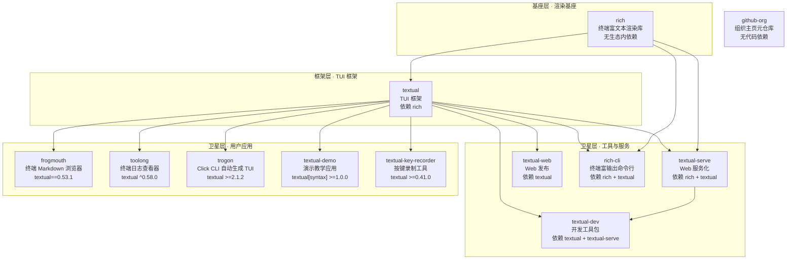

# Textualize 生态总览：12 仓库依赖图谱与深度分层

## 概述

Textualize 是英国威尔士科技公司主导的开源组织，其 12 个仓库以「终端即平台」为理念，围绕 Python 终端渲染与 TUI（Text User Interface）构建完整生态。整个生态呈清晰的三层依赖结构：**基座层** `rich`（终端富文本渲染）→ **框架层** `textual`（TUI 框架）→ **卫星层**（应用/工具/服务仓库，绝大多数以 `textual` 为依赖）。另有 `.github` 组织元仓库不产生代码依赖，仅承载组织主页。本文依据各仓库 `pyproject.toml` 登记事实绘制依赖 DAG，并逐一说明每个仓库的定位与版本约束。

## 依赖分层总览

用依赖 DAG 呈现，三层结构明确：`rich` 为生态唯一的渲染基座，`textual` 在其上构筑 TUI 框架，其后 9 个卫星应用/工具各自声明对 `textual`（部分含 `rich`）的版本约束。

> 实线箭头表示「依赖被依赖方」，`textual-serve → textual-dev` 的例外边源于 textual-dev 的 `textual_serve >=1.0.3` 声明（见下文 F-SD-01）。

## 基座层：rich（渲染基石）

`rich` 是生态的渲染基座，承担终端富文本与彩色 API 输出，是除 `textual` 外唯一被多个卫星仓库直接或间接依赖的组件。卫星层对其的依赖方式分两种：作为渲染包直接声明（如 `rich-cli` 声明 `rich (>=12.4.0,<13.0.0)`，`textual-serve` 直接声明 `rich`），或经 `textual` 传递引入。渲染协议与 `Console` 的进阶拆解见 /concepts/01-rich-console-and-protocol.md。

## 框架层：textual（TUI 框架）

`textual` 是 12 仓库中承上启下的核心框架，全部 5 个用户应用与 4 个工具/服务仓库均把 `textual` 声明为直接依赖；唯一例外是 `.github` 元仓库（不含代码）。卫星仓库对 `textual` 的版本约束跨度极大，反映了各仓库发布节奏差异：

| 卫星仓库 | 事实编号 | 最低依赖约束 |
|---|---|---|
| frogmouth | F-FM-01 | `textual ==0.53.1`（精确锁定） |
| toolong | F-TL-01 | `textual ^0.58.0` |
| trogon | F-TG-01 | `textual >=2.1.2` |
| rich-cli | F-RC-01 | `textual >=0.1.18,<0.2.0`（紧贴早期版本） |
| textual-dev | F-SD-01 | `textual >=0.86.2` |
| textual-serve | F-SV-01 | `textual >=0.66.0` |
| textual-web | F-SW-01 | `textual ^0.43.0` |
| textual-demo | F-ECO-01 | `textual[syntax] >=1.0.0` |
| textual-key-recorder | F-ECO-06 | `textual >=0.41.0` |

## 卫星层：工具与服务

四个仓库属于开发/部署工具，均以 `textual` 为基座并向生态外延：

- **rich-cli**（F-RC-01）：v1.8.1，`rich >=12.4.0,<13.0.0`、`click <9.0.0`、`rich-rst <2.0.0`，提供 `rich` 命令框（`rich_cli.__main__:run`），面向终端富输出。
- **textual-dev**（F-SD-01，v1.8.0）：依赖 `textual >=0.86.2` 与 `textual_serve >=1.0.3`，提供 `textual` 开发命令（`textual_dev.cli:run`），是唯一直接依赖 `textual-serve` 的仓库。
- **textual-serve**（F-SV-01，v1.1.3）：依赖 `rich` 与 `textual >=0.66.0`，把 TUI 应用服务化并跑进浏览器；其 README 强调 "Every Textual application is now a web application."，自述 3 行代码即可让任意 Textual 应用在浏览器运行（F-SV-20）。
- **textual-web**（F-SW-01，v0.8.0）：依赖 `textual ^0.43.0`，提供托管式 `textual-web` 命令，与 `textual-serve` 构成自成托管/官方托管两种发布路线；其免责声明明示 "not suitable for production use"（F-SW-03），并在 `ENVIRONMENTS` 中登记 `prod`/`local`/`dev` 三套后端端点（F-SW-05）。

## 卫星层：用户应用

五个仓库是面向终端的终端用户应用，均可视为 `textual` 的示范与落地用例：

- **frogmouth**（F-FM-01）：终端 Markdown 浏览器，v0.9.2，精确锁定 `textual ==0.53.1`，入口 `frogmouth.app.app:run`。
- **toolong**（F-TL-01）：终端日志查看/跟踪/分析工具，v1.5.0，`textual ^0.58.0`，入口 `toolong.cli:run`（命令为 `tl`）。
- **trogon**（F-TG-01）：为 Click CLI 自动生成 Textual TUI，v0.6.0，`textual >=2.1.2`，作者 Darren Burns。
- **textual-demo**（F-ECO-01/02）：演示与教学应用，v1.1.0，`textual[syntax] >=1.0.0`，命令行脚本 `textual-demo = "textual_demo.run:main"`（F-ECO-02）；其 `run.py` 仅三行：导入 `DemoApp`、构造 `DemoApp()`、调用 `app.run()`（F-ECO-03）。
- **textual-key-recorder**（F-ECO-06）：Textual 按键录制工具，v0.1.4，依赖 `textual >=0.41.0` 与 `textual-fspicker ^0.0.10`，命令 `tkrec`；其 `recordings/` 目录收录多平台 `.tkrec` 键位录制（F-ECO-11）。

## 组织元仓库：.github

`.github`（F-ECO-13/14/15）不参与三层依赖：仓库仅含 `README.md`（全文一行 `# .github`）与 `profile/README.md`（指向 textualize.io 的 `picture`/`img` 营销图，配文 "Move at terminal velocity." 与 "Because the terminal is a platform."），承载组织主页展示而无代码依赖。

## 相关概念

- /concepts/01-rich-console-and-protocol.md —— rich 渲染协议与 Console，生态渲染基座的实现细节
- /references/rich.md —— Rich 仓库信源登记（commit `9d8f9a3`）
- /references/textual.md —— Textual 仓库信源登记（commit `06dbeef`）
- /references/textual-demo.md —— textual-demo 演示应用信源登记
- /references/textual-key-recorder.md —— 按键录制工具信源登记