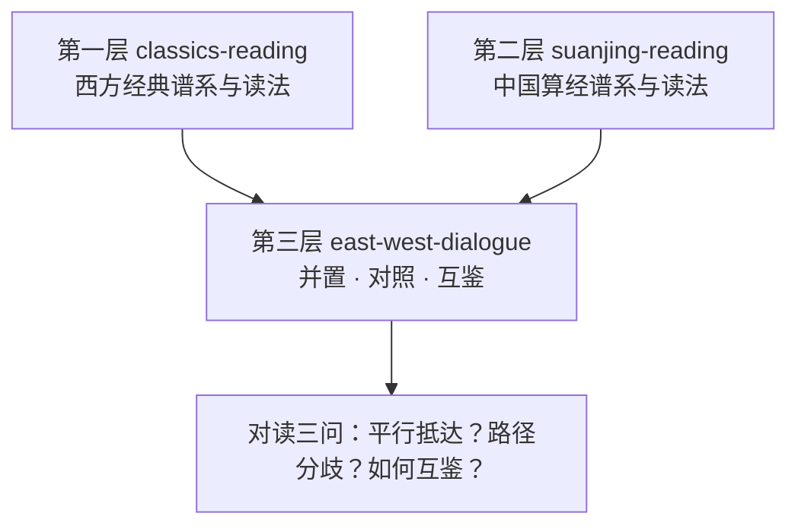

# 为什么做中西数学对读

单独读一部数学经典，看到的是一个传统的内部逻辑；把中西两部经典并排对读，看到的是数学作为人类活动的多种可能形态。本篇回答一个起点问题：在 [国外数学经典阅读教程](../../classics-reading/index.md) 与 [中国算经阅读教程](../../../../guoxue/suanxue/suanjing-reading/index.md) 两束之上，为什么还要加一层比较视角？结论先行：比较不是为了分高下，而是为了看见单传统阅读看不见的东西——多样性、分岔与互鉴。

## 一、比较视角的价值：理解数学的多样性

### 数学不止一种形态

《几何原本》约前 300 年成书，全书 13 卷；卷一以 23 个定义、5 个公设、5 条公理铺出演绎框架，再推出 48 个命题（F-001）。《九章算术》收 246 个应用问题，每题由问、答、术三部分构成，九章名目全部来自实际场景（F-002）。MacTutor 的表述是：《九章》在中国数学发展中的基础角色与《原本》在希腊传统中的角色相似，但两者的证明概念存在重大差异（F-033）。同一门数学，一种以“定义—公理—命题”组织，一种以“问题—程序”组织——这不是先进与落后之分，而是两种同样成熟的知识组织技术。

两部奠基文本的体例对照：

| 维度 | 《几何原本》（约前 300 年） | 《九章算术》（主体定型于西汉，F-003） |
|------|------------------------------|----------------------------------------|
| 基本单元 | 定义、公设、公理、命题 | 问、答、术 |
| 推进方式 | 从公理演绎出命题 | 从具体问题归纳出程序 |
| 论证形态 | 演绎证明 | 算法与注疏论证（详见第三节） |
| 动机来源 | 演绎体系的自足展开 | 历法、贸易、测量、税收等实务（F-032） |

### 打破单线进化史观

单线史观把数学史讲成“一个源头加一条正路”，其余都是支流或等待被启发的对象。对读直接给出反例：

- 《九章·方程》的“遍乘直除”消元程序与现代高斯消元法等价，学界通说为独立起源（F-013、F-023）；
- 祖冲之求得圆周率于 3.1415926 与 3.1415927 之间、给出密率 355/113，欧洲得到同等精度的年代通说为 16 世纪——这是精度的时间先后比较，不构成传承关系证据（F-019）；
- 刘徽割圆术与阿基米德穷竭法相隔约四百五十年，方法独立、无传播证据，属平行发展（F-021）。

三个案例的共同点：两传统各自抵达了同类结果，而传播链条缺失。承认这一点，数学史就从“接力赛”变成“多起源的生态系统”。

### 组织方式本身也是变量

中国古代数学家与天文学家同称“畴人”，数学与历法计算职业一体（F-037）；中国数学问题导向，动机来自历法、贸易、土地测量、建筑与政府记录税收（F-032）。职业结构、需求结构、文本体例互相咬合——比较视角让“数学长什么样”从必然变成选项。

## 二、Needham 问题：比较史观的经典起点

李约瑟《Science and Civilisation in China》第三卷（数学与天、地学卷）1959 年由剑桥大学出版社出版，与王铃合作（F-038），是中西数学比较研究的奠基性文献；著名的“Needham 问题”（为何近代科学未在中国发生）正是在这类系统比较的语境中提出（背景登记见本束 [比较研究信源](../references/comparative-studies.md)）。

本包对 Needham 问题的态度需要说清楚：它不是本包要回答的问题。那是科学社会学层面的宏大问题；本包做的是文献层面的对读——先看清两传统各自有什么、如何组织、何时接触，再谈更大的解释。直接拿宏大问题裁判具体文本，容易滑向文化优越论（无论哪个方向）。

## 三、Chemla 的修正：警惕用单一证明观作标尺

MacTutor 刘徽传记有一条常被误读的表述：刘徽的方法“按我们今天对数学证明的理解并非严格意义上的证明”，但其为计算提供了原理依据（F-034）。这句话常被简化成“中国数学没有证明”。Chemla 基于刘徽注、李淳风注等传世注疏的研究显示：中国古代数学家对算法正确性给出过令人信服的论证——此结论修正了“中国数学只有公式无论证”的旧说（F-035）。

误读与修正的对照：

| 误读 | 文本实况 | 修正后的读法 |
|------|----------|--------------|
| 中国数学只有算法没有论证 | 注疏传统保存了大量算法正确性论证（F-035） | 论证形态不同，不是论证缺席 |
| 刘徽注“不是证明”＝不合格 | 原文说其为计算提供原理依据（F-034） | “证明”是历史变量，不是单一标尺 |
| 两者必有一个更高级 | MacTutor 强调两者证明概念根本不同（F-032、F-033） | 并置理解，各有体系 |

对读的启示：证明概念本身是个历史变量。希腊侧的演绎证明、中国侧的算法论证，各自在自己的文本传统中成体系。对读时若只用其中一把尺子量另一方，量出来的必然是“缺失”；正确姿势是把两套论证形态都当作需要理解的对象——具体操作见 [比较阅读策略](01-comparative-reading-strategy.md)。

## 四、三层分工：本包与两束的关系

本库围绕“数学经典怎么读”已有两束，本包是第三层整合：

| 层 | 知识包 | 核心问题 | 组织方式 |
|----|--------|----------|----------|
| 第一层 | [classics-reading](../../classics-reading/index.md) | 西方经典怎么读 | 五时段经典谱系（概念 00–13） |
| 第二层 | [suanjing-reading](../../../../guoxue/suanxue/suanjing-reading/index.md) | 中国算经怎么读 | 三阶段算经体系（概念 00–13） |
| 第三层 | 本包 | 两者如何对读、分歧何在、如何互鉴 | 六大对读主题 + 比较方法论 |

分工原则：本包不重复单传统解读。对读主题以“链接 + 概括 + 差异聚焦”呈现——西方侧细节链入 classics-reading 对应文档，中国侧细节链入 suanjing-reading 对应文档；本包只承担单独哪一束都做不了的事：并置、对照、辨析优先权争议、呈现接触事件。

由此推出三条阅读流约定：

1. 遇到西方侧名词（如公设、穷竭法）未读过，先进入 classics-reading 对应概念再回来；
2. 遇到中国侧名词（如遍乘直除、天元一）未读过，先进入 suanjing-reading 对应概念再回来；
3. 本包各主题文档的“比较分析”节只做对照判断，细节证据一律回两束核对。

## 五、对读三问：全包的问题主线

本包全部主题文档围绕三个问题展开，读任何一篇时建议带着三问。

**第一问：平行抵达？**——同一数学结果或方法，是否在两个传统中各自独立出现？

- 案例：消元程序——遍乘直除与高斯消元等价且独立起源（F-013、F-023）；
- 案例：勾股关系——商高答周公问“句广三，股修四，径隅五”为特例记载（F-011），陈子给出一般表述（F-012），古巴比伦泥版与毕达哥拉斯传统中亦有同定理记录（F-011）；
- 纪律：有传播证据才谈传播；无证据就记“平行独立发展”。

**第二问：路径分歧？**——抵达相同或相近结果之后，两传统以何种不同方式组织与推进？

- 案例：公理化演绎与算法化问题导向的分野（F-032、F-033）；
- 案例：论证文体与证明观差异——刘徽注“非严格意义证明但给出原理依据”（F-034），Chemla 证明观修正（F-035）；
- 纪律：分歧不是缺陷清单，而是理解各自传统的入口。

**第三问：如何互鉴？**——历史上两传统何时真实接触、接触产生了什么？

- 案例：1607 年利玛窦口译、徐光启笔受《几何原本》前六卷，底本为克拉维乌斯拉丁文本，“界说”“求作”“公论”“题”译名沿用至今（F-024、F-025）；
- 案例：1857 年伟烈亚力与李善兰续译后九卷，1865 年金陵书局合刻十五卷全本（F-027、F-028）；
- 纪律：接触事件要落到具体年份、人物与底本；今天读者把两束对读，本身也是这一互鉴的延续。

## 延伸阅读

- 下一站：[比较阅读策略](01-comparative-reading-strategy.md) · [跨传统阅读路径](02-reading-path.md)
- 两束导论：[为什么读数学原文](../../classics-reading/concepts/00-why-read-originals.md) · [为什么读算经](../../../../guoxue/suanxue/suanjing-reading/concepts/00-why-read-suanjing.md)
- 两束信源入口：[原典信源总表](../../classics-reading/references/original-sources.md) · [在线原典信源](../../../../guoxue/suanxue/suanjing-reading/references/online-sources.md)
- 本包事实底座：[事实清单](../facts.md)——43 条零推测事实，争议事项并列诸说

相关概念：[比较阅读策略](01-comparative-reading-strategy.md) · [跨传统阅读路径](02-reading-path.md)